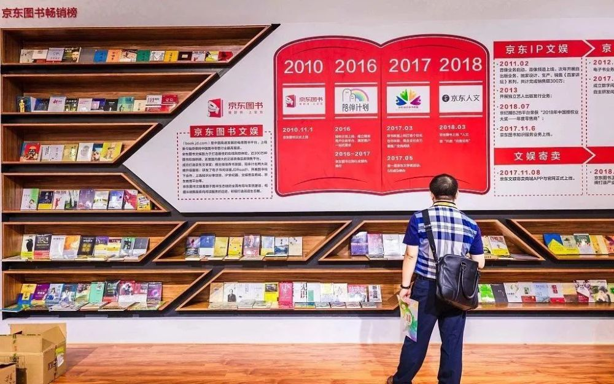
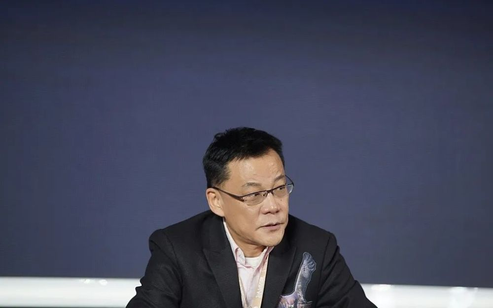

# 李国庆俞渝决裂三年 当当向京东投诚

_李国庆与俞渝。来源：视觉中国_

作者丨叶蓁

编辑丨康晓

出品丨深网·腾讯新闻小满工作室

2023年1月10日，京东图书与当当网在京签订战略合作协议，当当官方旗舰店在京东全面上线运营。在李国庆俞渝决裂三年后，当当向京东“投诚”。当当作为中国互联网电商领域最早的拓荒者，现在已经降格成为京东上的一个卖家。

“在图书电商里，我觉得自己是非常成功的。我改变了中国出版业。刘强东和马云改变了哪个行业？当当份额占了中国出版业的35%，人总得需要点社会符号来证明自己。”2010年当当网上市，李国庆曾公开表示。1993年，李国庆北大毕业后创立了科文公司，1996年在美国认识了俞渝，3个月后闪婚。1999年11月，李国庆和俞渝创立了当当网。成立于1999年的当当网是中国最早的线上平台之一，更是第一个在美上市的中国网上B2C商城。

据Analysys易观报告显示，2014年第1季度，中国B2C市场交易规模为42.3亿元，当当网当时的市场份额虽已大幅落后于天猫、京东，但仍有2.2%；到了2022年第1季度，中国网络零售B2C市场交易规模达16988.5亿元，当当网的市场份额却已滑坡至0.5%。

时至今日，市场已经发生了巨大的变化。李国庆已离开了当当网，而当当和京东，这对曾经的竞争激烈的对手，也在2023年年初牵手变成了盟友。

当当网早早赴美上市，起个大早，赶个晚集，背后的原因是什么？如果说与京东的价格战和全品类扩张在一段时间拖累了当当的图书业务，那李国庆和俞渝这对夫妻档之间的内耗，是当当业务数据下滑的根本原因。

**与京东缠斗的那几年**

2010年12月8日，当当网上市之后，刘强东就宣布，京东图书以同比便宜20%的低价进行促销。其实自2010年11月，京东图书商品上线，有意要和卓越、当当在图书在线零售市场三分天下之后，就已经给依靠图书品类起家的卓越和当当带来了巨大压力。

业界人士指出：京东从3C起家，但3C用户重复购买率低、毛利率低，消费类电子产品为3%，大家电为7%。但这些用户可能每隔两三周就会买一次零食或者一本新书。相比起来，百货和图书业务的平均毛利率可以超过10%。因此，刘强东向综合业务类扩张并不意外。

2010年的当当号称已占有国内网上图书零售市场一半以上的份额，在李国庆看来，图书是当当制霸的领域，刘强东涉足图书行业，是不知死活。因此，李国庆在各种场合喊话刘强东，呼吁对方知难而退，把图书业务外包给当当。

当京东从3C数码杀向图书类目时，李国庆认为“烧钱”不可取，无法赢利的销售额毫无意义。不过他只看到了财务上的数字，却没看到“烧钱”背后的巨大价值，京东通过价格战争夺到更多的用户和订单。

_来源：视觉中国_

2011年9月，当当启动了名为“斩首行动”的攻势，针对京东，对数百款数码家电产品进行降价。他再度喊话刘强东：“我为什么卖3C啊？很简单，为了解气。京东卖图书我就卖3C，我有钱！”

京东和当当互攻老巢的战争使得李国庆相当愤怒，他在公开场合表示，自己曾3次拒绝刘强东的主动约见。这些价格战让当当站到了风口浪尖，李国庆也一时间内成为了行业领袖。

对于李国庆的频繁挑衅，刘强东很少回应，唯一一次是在2012年4月，刘强东发微博，说李国庆在一场2000人的大会上骂自己“傻大黑粗“，而后主持人问李国庆，3年后，京东和当当哪个发展更好，李国庆眉毛一挑：“3年以后？他过得了今年这个坎儿么！”

当时的会场场上响起一片掌声，李国庆当时颇为得意地描述理由：价格战最烧钱，当当早早实现盈利，京东的钱来自投资人，资本寒冬一到，京东就要出问题。“时间不用长，就到2012年8月，京东的钱就要烧完！”

对京东现金流的质疑，也使得刘强东不堪其扰，他在微博上发起了一个公开赌局：可以让造谣者查看京东账户，如果低于60亿现金，东哥个人向“爱心衣橱”捐出1000万，否则造谣者捐出500万。此后，这场赌局不了了之。

1.6亿购买人次，3800万GMV。这是当当扩充全品类时的核心数据，看起来很美，但李国庆却在数年之后形容扩充品类为“头脑膨胀”，因为随之而来的是一连6个季度，每季度高达1亿人民币的巨额亏损。

这些刺眼的数字体现在财报中，让投资人的信心重挫。彼时俞渝曾说道：”2011年后，电商行业竞争厉害，当当网也在产品定价上面临激烈竞争，从盈利走向亏损。”

当当和京东价格战和品类扩充，拖累了高速发展的当当。但李国庆却认为，祸在俞渝。

**合伙人之间的内耗**

其实当当一路走来，李国庆和俞渝作为合伙人，他们之间的内耗也使得当当在过往错失了很多机会。

在一次采访中，李国庆表示，从当当网融资开始，俞渝便渗透当当经营，上市时，俞渝又与公司的CFO直接负责，但上市是一次“失败的上市”，定价被严重低估，导致当当网融资减少，最终错失了后来电商补贴大战的机会。

根据《深网》获得资料显示，2010年12月8日当当上市，李国庆持股38.9%，俞渝为4.9%。这对夫妻档在创业时，面临的问题要复杂的多。当当打仗的时候，李国庆上，不用应对战争的时候，俞渝就愿意发挥更多的作用，希望李国庆听她的。

_李国庆。来源：视觉中国_

两个船长，谁说了算，还是谁说了都不算，背后更多的是权利的更迭。不是东风压倒西风，就是西方压倒东风。

李国庆和俞渝两个人在当当业务存在着比较多的分歧。比如当当卖还是不卖。在当当的历史上，第一次是2004年被亚马逊看上，第二次是2013年百度提出收购；第三次是2014年腾讯提出战略入股；第四次则是卖给海航。

“每次我都想扩张，她每次都想卖。”李国庆诠释二人的不同，当当的两任董事会，都建议李国庆——让俞渝回家，不当联合总裁或CFO，只当个挂名的董事长。两次李国庆都没有执行这个决议，“我1996年把人家从美国娶回来了，我觉得得对不起人家，给人家一个施展才华的舞台。”

“我每五年都想过，把俞渝拉回家，宁可舍得一身剐，也要把这个皇后拉下马。但真到时候，董事会都做了决议了，我觉得这不行，我不能这么干。结果结局是被一脚踢开。”

他认为，2014年10月6日，自己开创新当当，禅让当当总裁，导致一年内5个副总有4个辞职。这种夫妻店的弊端，不仅仅是高层的流失，也导致了当当错失了很多扩张的机会。

2015年，李国庆和俞渝将公司的管理权一分为二：俞渝管“老当当”，即原来的当当网；李国庆管“新当当”，即自出版、实体书店、电子书、百货自有品牌、文创等新业务。

2016年9月，当当网以约37亿元完成私有化，私有化背后则是当当的没落。据易观数据，2017年第四季度当当网占中国网络零售B2C市场份额的比例为0.7%。

2017年，易观《中国B2C市场季度监测报告2017年第3季度》显示：京东以市场份额占36.2%，超越当当的35.1%，位居中国线上图书销售市场份额第一名。2008年京东的销售额还只是当当网的75%，而到2018年当当的市场份额早就被京东远远超过。

李国庆接受《深网》采访时曾表示，当当网私有化的时候，李国庆同意和俞渝的占股比例变成五比五，后来俞渝提议双方各拿一半股权给儿子，但海航收购的时候不能有外国股东，俞渝又代持了儿子手上的所有股权，从而获得了多数股权，导致自己失去了公司控制权。

2018年1月，俞渝令李国庆交出新业务的管理权。当当网方面则在采访中表示，私有化之后工商登记的股权比例为：俞渝持有64.2%、李国庆持有27.51%、管理层合计持有8.29%。实际上俞渝与李国庆的孩子持有18.65%股权，按比例在现有登记人当中代持，当当科文实际股权比例是：俞渝持有52.23%、李国庆持有22.38%、孩子持有18.65%、管理层合计持有6.74%。

2019年1月开始，李国庆不再担任当当网的任何职务，仍是公司股东；董事长俞渝兼任公司CEO，当当网的日常管理决策由俞渝带领公司高管完成。

这一年，二人公开决裂，李国庆在腾讯新闻的节目中怒摔水杯引爆舆论，2019年11月，李国庆和俞渝的离婚案开庭。几个月后，李国庆上演了抢公章的闹剧。

**小而美的奢望**

夫妻档内耗是当当丢失市场份额的重要原因，但不是所有原因。业内认为当当没有看到图书销售的局限性，其实当当很早就进行服装类和百货品类扩充。当当因为京东进入图书领域，反制京东也进入了3C领域。

2011年
8月李国庆在2011互联网大会上公开表示，“当当网做3C产品只是权宜之计，若对手放弃当当也会放弃。”业内人士指出，李国庆的这种态度也注定了当当的3C业务很难做大。

2005年，当当开通C2C平台，要与淘宝一较高下，但其C2C平台“当当宝”上线没几天就被彻底抛弃。2011年入驻天猫，业界指出，当当更把自己降格为一个电商卖家。从此之后，当当在中国电商市场的占比便逐年下降，2015年降至1.3%。与京东和天猫差距拉开数十倍。

当当在战略执行上的虎头蛇尾是其衰落的部分原因，当然也有来自京东物流的降维打击。俞渝治理下的当当网，成为一个小而美的平台。到了2022年第1季度，中国网络零售B2C市场交易规模达16988.5亿元，当当网的市场份额却已滑坡至0.5%。

当当网把线下书店搬到了线上，李国庆瞄准了图书音像类物品便于运输和包装的特点，凭低价图书快速切入市场，实时更新图书、标准化运输，实现“快递上门”，建立了在当时非常有效的配送的体系。

李国庆把配送系统分成了三段：自行车—地铁—自行车。第一个送货员只负责送到地铁站，第二个送货员在地铁中穿行，第三个送货员负责配送到家，如此便能实现急件准时送达的效率。为了节省成本，第二个送货员需要在地铁站待一整天。

刘强东对物流的看法与李国庆截然不同。在他眼里，物流布局深度和用户体验程度几乎可以画等号。他曾在读沃尔玛创始人自传时发现，流程业务的公司做到后都是物流公司，沃尔玛就是球更大的物流公司。

京东上市前总共融资23亿美元，其中很大一部分资金用在了智能仓储和物流的建设上，现在物流配送已经成为京东最具竞争力的服务之一。

当当两个创始人因不想让外包的物流稀释其股份，一直没有建立物流供应链。虽然后来当当在全国多地建立仓储中心，但配送使用的是社会化物流服务，这导致配送速度和效率低于京东等竞争对手，从而造成用户流失。

公开数据显示：在京东杀入图书行业以后，当当毛利率持续下降，大约掉了十个百分点。股价也在一年间应声而落。2017年，易观《中国B2C市场季度监测报告2017年第3季度》显示：京东以市场份额占36.2%，超越当当的35.1%。

公开数据显示，2017年和2018年当当网分别实现营收103亿元、118亿元，净利润分别为3.62亿元、4.25亿元，相较此前已经有较大幅度改善。当当网还预计，2019年经营利润将达6.1亿元，源于良好的资金情况，理财收益还会再贡献一亿。

在 2019 年的当当出版人盛典上，当当副总裁陈立均也曾表示：“持续 5 年盈利，没有任何负债，无论是销售额还是利润增速都在加速度增长。”

2018
年的中国企业领袖年会上，俞渝表示，当当网正在利用价格低点进行技术和产业的更新换代。投入的方向主要是三个方面，一是人才，扩大招募关键岗位人才；二是做听书、微视程序；三是在华北和西南建立新的物流中心。

_俞渝。来源：视觉中国_

对于当当网未来的选择，俞渝当时在接受财新采访时给出了三个方向：一是香港上市，但并无时间表；二是学习华为不上市，成为一家小而强的私有公司；三是遇到合适买家，再次考虑出售或接受投资。

李国庆和俞渝决裂三年，对于小而美的当当来说，俞渝没能护住基本盘。到了2022年第1季度，中国网络零售B2C市场交易规模达16988.5亿元，当当网的市场份额却已滑坡至0.5%。对于昔日的电商巨头来说，起了个大早，赶了个晚集。

**腾讯新闻出品内容，未经授权，不得复制和转载，否则将追究法律责任。**

