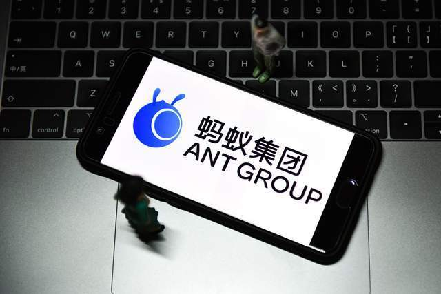

# 杭州市委书记调研蚂蚁集团，传递了什么信息？

据《杭州日报》消息，1月10日，杭州市委书记刘捷到蚂蚁集团调研。他希望蚂蚁集团“把牢正确方向，加大创新力度，持续增强企业核心竞争力”。

平台经济企业近期迎来了更多关注。12月18日，2022年中央经济工作会议结束2天后，履新浙江省委书记不久的易炼红调研了阿里巴巴集团。

_图/视觉中国_

作为平台经济重要风向标，蚂蚁集团的最新动向得到市场高度关注。

“蚂蚁消金”几经波折的增资扩股方案，在2022年最后一个工作日获得监管点头。2022年12月30日，重庆银保监局发布《关于同意重庆蚂蚁消费金融有限公司增加注册资本及调整股权结构的批复》（以下简称《批复》）。同意重庆蚂蚁消费金融有限公司（下称“蚂蚁消金”）将注册资本由80亿元人民币增加至185亿元人民币。高达105亿元资金注入意味着，蚂蚁消金将超过招联消费金融有限公司100亿元的注册资本，成为行业第一。

一周之后，1月7日，蚂蚁集团发布了一则关于持续完善公司治理的公告。公告显示，马云及其一致行动人的投票权由此前的53.46%，调整为包括马云、蚂蚁高管、员工代表等在内的10名自然人分别独立行使股份表决权。通过这一调整，马云的表决权下降到了6.208%。这意味着，调整之后，马云不再拥有蚂蚁集团的实际控制权，蚂蚁集团也不再有实际控制人。

蚂蚁消金增资落地和实际控制人的变化，意味着蚂蚁集团整改迎来新进展。

**新方案“更有利于服务实体经济”**

根据《批复》，本轮增资认购包括蚂蚁科技集团股份有限公司（以下简称“蚂蚁集团”）、杭金数科、舜宇光学、传化智联、广州博冠信息科技有限公司（下称“博冠科技”）、江苏鱼跃医疗设备股份有限公司（以下简称“鱼跃医疗”）、重庆市农信投资集团有限公司（下称“农信集团”）在内的7家公司参与，以现金方式，共认购蚂蚁消金新增注册资本105亿元。

至此，蚂蚁消金股东增至12家。增资后，蚂蚁集团仍是大股东，出资金额92.5亿元，出资比例50%，持股比例保持不变。新加入的杭金数科出资18.5亿元成为第二大股东，出资比例10%。其余10家股东的出资比例均在10%以下。包括南洋商业银行有限公司、舜宇光学、鱼跃医疗等，出资金额共达到74亿元。

蚂蚁消金于2020年9月获批筹建，2021年6月3日获批开业，注册资本金为80亿元。用于有序承接蚂蚁集团旗下两家小贷公司中符合监管规定的消费信贷业务。

值得注意的是，2021年12月，在蚂蚁消金开业半年后，曾短暂有过一版增资扩股方案。

彼时，根据中国信达、鱼跃医疗公告，蚂蚁消金拟新增注册资本220亿元。但是仅20天后，上述增资扩股方案生变。2022年1月13日，中国信达宣布放弃认购。

经过近一年时间酝酿，蚂蚁消金增资事宜迎来新曙光。2022年11月，鱼跃医疗在公告中透露了蚂蚁消金新的增资扩股方案。同时，被披露的还有蚂蚁消金的经营情况。根据公告，2022年前三季度，蚂蚁消金营收32.09亿元，在扣除非经常性损益后，前三季度的净利润为3.86亿元，较2021年实现扭亏为盈。

此外，《中国新闻周刊》记者发现，相比较2021年方案，此次认购的股东发生了重大变化。本次增资的七家认购方中，除了中国信达退出外，2021年方案中的渝富资本也不见身影。两家国资背景企业退出，取而代之的是杭金数科、传化智联、农信集团三家企业。

据了解，蚂蚁消金此次增资后的第二大股东——杭金数科实控人为杭州市人民政府。而农信集团的实际控制人为重庆市供销合作总社。

“股东结构的调整，显然也是与蚂蚁集团整改方向相一致的，更有利于取得政府和金融监管部门的认可，更有利于服务实体经济、地方经济和从金融科技的角度做好技术赋能。”中南财经政法大学数字经济研究院高级研究员金天说。

资深分析人士杨天向《中国新闻周刊》表示，调整后的股东结构体现了包括产业、科技、金融等各方面的代表。“这也是蚂蚁和监管层长期沟通取得的重要成果。”

**增资规模“缩水”，但仍被视为积极信号**

自2020年底暂缓上市后，蚂蚁集团启动了整改工作。期间，金融管理部门监管对其进行三轮约谈。

2021年4月12日，人民银行表示，金融管理部门就整改措施与蚂蚁集团进行深入沟通，并督促蚂蚁集团形成了全面可行的整改方案。整改内容共包括5个方面：纠正支付业务不正当竞争行为；打破信息垄断；蚂蚁集团整体申设为金融控股公司；严格落实审慎监管要求；管控重要基金产品流动性风险。

同日，蚂蚁集团发文称，将整体申设金融控股公司；申设个人征信公司；将“借呗”“花呗”全部纳入消费金融公司，依法合规开展消费金融业务等。也因此，市场普遍认为金控牌照获取、征信牌照获取，以及消费金融整改是蚂蚁集团整改的三大核心方向。

2021年11月，蚂蚁集团启动了品牌隔离，原本所属蚂蚁旗下的“花呗”和“借呗”成为蚂蚁消费金融旗下信贷产品，银行等其他金融机构发放的消费信贷品牌隔离为“信用贷”和“信用购”。加上此次增股扩股方案落地，目前来看，与前两者相比，蚂蚁集团在消费金融方面的整改更快一些。

值得注意的是，与2021年的300亿元方案相比，此次蚂蚁消金的增资规模大幅度缩水115亿元。相应地，增资后的注册资本从原增资方案的300亿元缩减至185亿元。

杨天表示，不能因为与更早期版本的方案相比有所“缩水”就认为蚂蚁消金不再受到市场青睐。因为有潜在意向成为股东的公司未必都能获批，不同股东之间的股权比例等也都需要复杂的协调过程。

“消费金融公司增资的核心，主要就是解决杠杆率的问题。如果杠杆率太小，蚂蚁消金无法承接原本两家小贷公司庞大的信贷业务规模。此外，也是为了达到一定资本金的要求。”中国社会科学院金融研究所金融科技研究室主任尹振涛说。

尹振涛告诉《中国新闻周刊》，从监管的角度来讲，目前的核心目的是要控制规模，稳健发展。“这也意味着，增资的步伐不能迈特别大，也不能特别快，所以这也是增资规模下降的原因之一。后续可能还会有增资方案，这是个持续的过程，如果一开始增资过大，其实并不利于行业健康发展。”

此外，也有一些市场人士担忧：185亿元的资本金能否支撑蚂蚁消金庞大的信贷规模？

蚂蚁集团此前披露的招股书显示，2020年上半年，蚂蚁集团的微贷科技平台促成的信贷余额达2.15万亿元。其中，1.73万亿为消费贷款，通过旗下两家小贷公司：重庆市蚂蚁小微小额贷款有限公司（“花呗”的运营主体）、重庆市蚂蚁商诚小额贷款有限公司（“借呗”的运营主体）与金融机构合作发放。

有分析人士指出，若按照13倍的杠杆倍数计算，增资完成后，蚂蚁消金最多能承接近2400亿元的自营信贷业务，或者8000亿元左右的联合贷款业务——这与1.73万亿还有不小差距。

即便如此，仍有不少市场人士将此次增资扩股方案获批视为一种积极信号。“方案落地是整个数字经济快速发展中很重要的一步。此外，也意味着蚂蚁集团信贷业务整改取得阶段性成果。随着整改进入新阶段，后续更多的就是常态化监管，把相关的一些业务和产品都放置在长效监管的机制框架下。”尹振涛说。

**平台经济进入常态化监管阶段**

从更宏观的行业视角看，从此前“防止资本无序扩张、野蛮生长”到2022年中央经济工作会议提出“要大力发展数字经济，提升常态化监管水平，支持平台企业在引领发展、创造就业、国际竞争中大显身手。”两年间，随着平台企业整改工作有序推进，政策重心也相应动态调整，数字经济也拥有了更多发展可能。

杨天认为，近期政策表述没有再继续突出反垄断、反资本无序扩张等内容，显示平台经济集中专项整改已基本完成，进入常态化监管阶段，对包括蚂蚁在内的大型平台企业而言将在政策环境上具有更多确定性、可预见性。

对于两年前未能如愿的蚂蚁集团，随着宏观环境发生变化，是否会重启上市？

对此，杨天称，从目前各方表述看依然较为慎重，不排除仍在与监管层深度沟通过程中。

“蚂蚁集团上市最大的障碍并不完全是消费金融的问题，而是整改是否结束，能否消除风险。所以，蚂蚁消金增资扩股后有助于推动蚂蚁集团上市计划，但是并没有直接关系。后续可能还会出现很多变化。”尹振涛说。

目前，对照前期整改要求，蚂蚁集团在支付(支付宝)、消费金融(借呗和花呗)、基金(余额宝)、保险(相互宝)等产品线上已有明确落地动作。对于其他整改进展，金天表示还有一些方面仍待观察。“比如是否需要以及如何成立和运作覆盖全部业务的金控集团，以及在征信牌照申领过程中的进一步进展等。”

征信方面，2021年底，人民银行公布受理了钱塘征信的个人征信业务申请，但截至目前，也未传出审理结果的消息，蚂蚁集团尚未获得征信牌照。

“最重要的还是蚂蚁集团金融控股公司成立，这才是真正预示蚂蚁集团整改的彻底结束，以及可能会重启上市，或者走入更健康发展、合规发展的道路。”尹振涛说。

然而，杨天表示，金控和征信还涉及政府、平台、平台股东、金融机构、其他服务机构之间方方面面比较复杂的关系，可能从政府和监管层面还要做更通盘的考量。

“金融控股公司前两批都是大央企和地方国资，之后有民企。但是其体量、复杂性和蚂蚁集团还不能同日而语。蚂蚁集团未来的金融布局、金融架构是什么样还有一定不确定性，在此情况下金控牌照的问题可能还要再等等。”杨天说。

不过，尹振涛仍然期待这个庞大的平台企业会出现一些新变化。“如果以蚂蚁集团为主的金融控股公司成立，那代表着互联网金控的一个崭新的模式。”

（应受访对象要求，杨天为化名）

记者：哈力克

