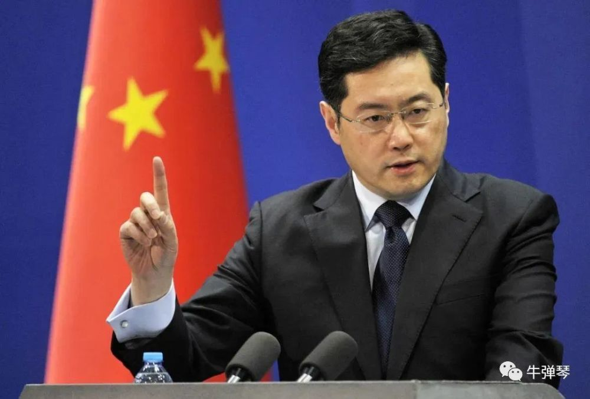
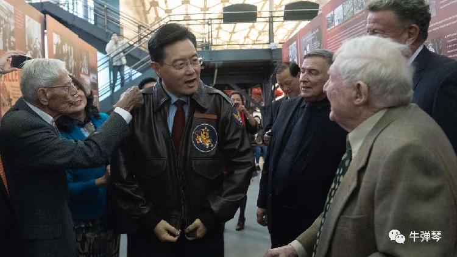
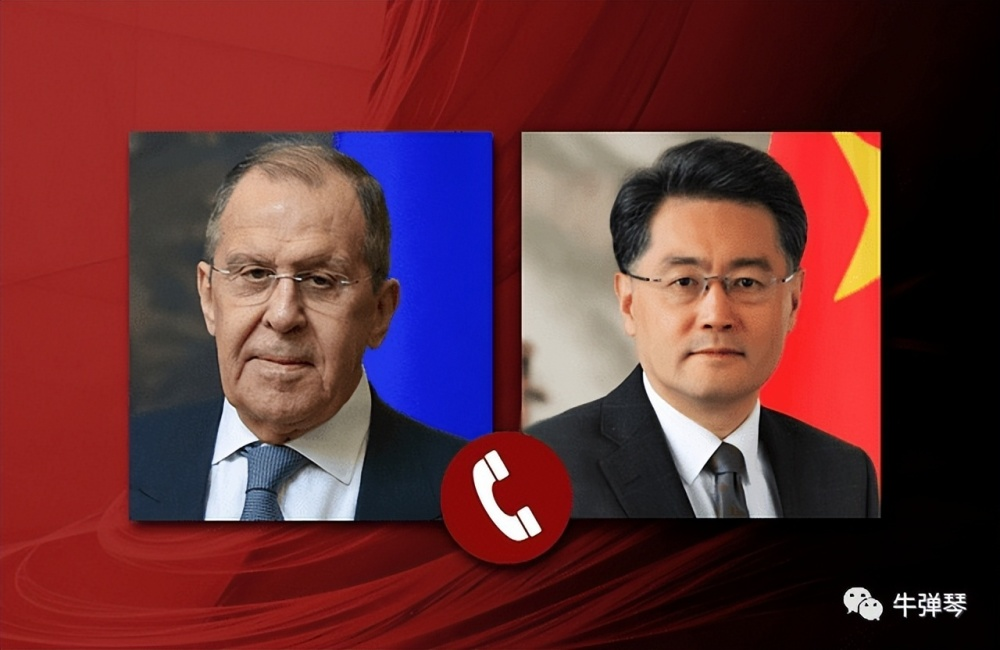

# 秦刚上任外交部长后，已和四国外长打了电话，有这些意味深长的细节

_资料图_

中国新外交部长秦刚，现在已经出发去了非洲。 **很有意思的是，他去非洲前，打了4个电话，对象是4个国家的外长。**

可能也不止4个电话，但看外交部网站，有公开报道的电话，就4个。

第一个在1月1日，对象是美国国务卿布林肯。

其他三个都在1月9日，分别是

第二个，1月9日，俄罗斯外长拉夫罗夫。

第三个，1月9日，巴基斯坦外长比拉瓦尔。

第四个，1月9日，韩国外长朴振通。

外交无小事，细节很重要。通稿很简短，信息量很大。完全个人观点，五个很意味深长的细节吧。

**细节一，第一个电话，打给了布林肯。**

这或许也很正常，看新闻， **当时秦刚应该还在美国，身份非常特殊，外交部通稿中的表述，是“外交部长秦刚大使”。**

先当驻美大使，后当中国外长，以前也有先例。但同时既是外长，还是驻美大使，这种身份，如果我没弄错的话，新中国外交历史上前所未有。

对于这次通话，外交部通稿就简单一段话：

当地时间2023年1月1日，外交部长秦刚大使在美国与美国务卿布林肯通电话。秦刚向布林肯道别，忆及在担任驻美大使期间与布进行了数次坦诚、深入、富有建设性的会见。期待与布继续保持密切工作关系，推动中美关系改善发展。双方并在通话中互致新年问候。

秦刚就任外长后，第一个电话是中美外长之间，有特殊的背景，但多少也说明了中美关系的特别重要性。

电话总体很积极，两人还互致新年问候。但 **公开的报道，就这么简单一段话，也是秦刚四个电话中最短的通稿，既可见新外长的风格，也可见中美关系的微妙。**

**细节二，有两次外长电话，是“应约”。**

一个是和俄罗斯外长拉夫罗夫，另一个是和巴基斯坦外长比拉瓦尔。

“应约”，我的理解，应该是这两位邻国外长主动打电话来的。

当然，主动打过来的，也肯定不止这两个国家，但反正，中国外交部公开的电话外交，俄罗斯在前，巴基斯坦在后。

**或多或少，也说明这两个国家在中国外交格局中的重要性。**

有没有微妙的外交考量呢？

我不知道，但中美外长通过话后，拉夫罗夫马上打电话过来，成为第二个和秦刚通电话的外长（至少公开是这样），有意思吧。

第三个是巴基斯坦，那就不需多解释了。

这个世界，只有一个巴铁。所以，电话很快就打了过来。

**细节三，三名外长，向秦刚表达了“祝贺”。**

看了外交部通稿，通电话的四名外长中，三人表达了对秦刚出任外长的祝贺。

哪三个？

都在1月9日，即俄罗斯外长拉夫罗夫、巴基斯坦外长比拉瓦尔、韩国外长朴振通。

按照常理，布林肯估计也表达了祝贺，不然也不符合外交礼仪啊。但外交部稿件没有提，真相我也不知道，大家自己揣摩吧。

**拉夫罗夫除了祝贺，还表示期待与秦刚建立良好工作关系。**

巴基斯坦朋友显然最热情，根据外交部通稿， **比拉瓦尔“再次祝贺秦刚就任中国外长”，**
表示巴中“铁杆”兄弟情谊是指引巴对华外交政策的“北极星”，期待共同推动巴中全天候战略合作伙伴关系再上新台阶。

**请注意“再次”，也就是说，这不止第一次祝贺了。**

那可能之前就有电话，或者有相关的贺信与贺电。

巴铁果然是巴铁，就是不一样。

**细节四，四通电话，各有外交玄机。**

中美外长电话，这句话最有意思， **“秦刚向布林肯道别，忆及在担任驻美大使期间与布进行了数次坦诚、深入、富有建设性的会见。”**

我的理解，这句话多少也算辟谣。一些美国人此前宣称，因为中美关系糟糕，美国国务卿布林肯不待见中国驻美大使。但看到这句话，有些真相只是大家不了解而已，两人其实有很多次会见，而且气氛还不错。

中俄外长电话，这句话也颇有深意，“（秦刚表示）中俄关系建立在不结盟、不对抗、不针对第三方基础上，我们愿同俄方携手落实好两国元首重要共识，不断将中俄关系推向前进。”

**三不：不结盟、不对抗、不针对第三方。** 中俄关系非常好，但不是结盟关系。在这个基础上，中俄关系会不断推向前进。

中巴外长电话，秦刚强调， **“中国农历春节将至，中方高度关注在巴中国公民的安全，希望巴方继续采取有力的安保措施。”**

中国新外长，对这一点很关注，多少也有些担忧。

我看到巴基斯坦外长也明确承诺： **“祝愿中国人民兔年新春快乐。巴方将竭尽全力保护中方在巴人员、机构和项目的安全。”**

**细节五，与韩国外长的电话，最是内涵丰富。**

两人间的第一次通话，没有“应约”。

除讨论了两国关系、朝鲜半岛局势，并互致新春问候外（大家都过春节），这句话很有内涵，
**“秦刚对韩方近期对自华入境人员采取临时限制措施表达了关切，希望韩方秉持客观、科学的态度。”**

这显然是针对性的。中国调整政策放开后，一些国家马上变脸，其中就包括韩国，也包括日本，甚至不顾科学事实和疫情实际，对中国来客歧视性对待，让人心生反感。

甚至在韩国机场，有爆料称中国旅客被单拎出来，必须脖子上悬挂黄牌，然后各种检查手续。

**友好归友好，问题要解决。对疫情的一些担忧可以理解，但这种歧视性做法让人难以接受。**
所以，秦刚也没客气，第一次和韩国外长通电话，就明确表达了关切。不快之情，字里行间。

韩国怎么回应？

反正，我们没看到有切实的改善。

于是，第二天，我们就看到了中国驻韩国大使馆的公告：

根据国内指示，自即日起，中国驻韩国使领馆暂停签发韩国公民赴华访问、商务、旅游、就医、过境以及一般私人事务类短期签证。上述措施将视韩国对华歧视性入境限制措施取消情况再作调整。

来而不往非礼也，既然韩国执意这样做，那对不起，我们也不客气，对等反制，而且特意标明 **“根据国内指示”。**

哦，忘了加一句，稍晚，中国驻日使馆也宣布： **自即日起，中国驻日本使领馆暂停审发日本公民赴华普通签证。何时恢复，请候通知。**

好歹之前中韩外长还通了个电话，中日连通话都没有。 **外交讲究对等，既然你搞歧视性，那我们也只能奉陪。**

不得不说，新外长秦刚，这一点够刚。

