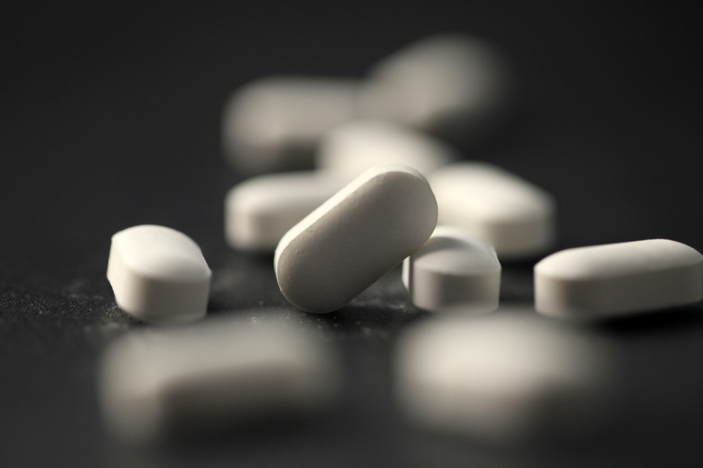

# 辉瑞新冠药无缘医保，CEO称中国开价过低，国内药企争相布局仿制药

本文来源：时代财经 作者：李傲华

_图片来源：图虫创意_

辉瑞新冠口服药Paxlovid（奈玛特韦片/利托那韦片）虽然已经正式宣告无缘国家医保目录，但围绕Paxlovid的价格和生产的争议仍在持续。

1月8日晚间，国家医保局披露新冠治疗药品参与2022年医保药品目录谈判有关情况，国家医保局医药管理司负责人介绍，阿兹夫定片、奈玛特韦片/利托那韦片组合包装、清肺排毒颗粒3种新冠治疗药品参与了国谈。其中，阿兹夫定片、清肺排毒颗粒谈判成功，Paxlovid因生产企业辉瑞投资有限公司报价高未能成功。

一石激起千层浪。随后便有消息传出，国家药品监督管理局（NMPA）作为中方牵头部门正与辉瑞就Paxlovid的仿制药合作进行谈判，并特别提到华海药业（600521.SH）、石药集团（01093.HK）。上述两家企业均具备Paxlovid主要成分奈玛特韦的研究生产能力。

其中，华海药业为辉瑞在中国的生产合作方，2022年8月，华海药业与辉瑞签订《生产与供应主协议》，将在协议期内（5
年）为辉瑞公司在中国大陆市场销售的新冠病毒治疗药物
Paxlovid提供制剂委托生产服务。1月9日，华海药业回复时代财经表示，目前公司正配合辉瑞加速推进Paxlovid本地化生产项目的各项工作，以保障Paxlovid在中国市场的充足供应，持续满足中国患者的新冠治疗需求。

对于中国仿制药的问题，辉瑞的态度似乎也非常坚定。辉瑞公司首席执行官艾伯乐（Albert
Bourla）在1月9日表示，正与中国合作伙伴携手，预备从上半年开始在中国提供Paxlovid。艾伯乐说，该合作伙伴尚未开始生产，但很快就会启动，他并未透露该公司名称，同时还否认关于有些公司努力在华生产及销售Paxlovid的仿制药的传闻。

据路透社报道，艾伯乐表示，中国提出的价格低于辉瑞对大多数中低收入国家收取的价格，因此辉瑞与中国关于新冠药的价格谈判已经中断。“中国是世界第二大的经济体，我认为他们支付的价格不应该低于萨尔瓦多。”

就Paxlovid本地化生产问题，1月10日，时代财经以消费者身份致电辉瑞，相关人士回复称，目前中国市场供应的Paxlovid均为进口，在国内还未有生产厂家。

**国内药企争Paxlovid首仿？**

根据国家医保局会同有关部门联合印发的《关于实施“乙类乙管”后优化新型冠状病毒感染患者治疗费用医疗保障相关政策的通知》，目前，Paxlovid仍在国家医保局此前划归的临时性医保支付范围中，直至2023年3月31日。

没有人知道3月31日之后的Paxlovid在中国市场的命运会如何，但国内药企已经纷纷对Paxlovid的首仿跃跃欲试。

近日，网上流传的一张照片显示，南京海辰药业股份有限公司（下称“海辰药业”，300584.SZ）生产了一款奈玛特韦片/利托那韦片组合包装，药品外包装上标注了“非卖品”，疑似为Paxlovid的仿制药。

时代财经以投资者身份致电海辰药业，海辰药业相关人士确认了上述网传图片的真实性，并表示海辰药业确有生产一批奈玛特韦片/利托那韦片，但仅用于内部研究，目前没有在市面上流通，该研究于2021年年底启动，目前不方便对外透露具体研究进度。

“我们目前还在研发当中，如果有获得阶段性进展的话我们会披露的，现在不方便说太多。”该人士称。

2022年2月20日，海辰药业发布公告称，控股子公司安庆汇辰取得了“100吨抗新冠药奈玛特韦原料药及其关键中间体建设项目”项目备案。该消息不仅引发海辰药业连续3个交易日涨停，还引来了深交所的关注函。海辰药业在给深交所的回复中坦言，公司研究的奈玛特韦原料药和制剂未受到辉瑞授权。辉瑞相关原料药和制剂受到专利权保护，公司可能存在无法继续研发及申报原料药、无法继续进行制剂研发、无法形成销售、上市销售被追溯侵权责任等由专利侵权导致的法律风险。

石药集团的Paxlovid仿制药项目则已经进入临床。中国临床试验注册中心网站显示，2022年9月26日，石药集团注册了奈玛特韦片的相关临床试验，该试验类型为生物等效性试验，其目的在于比较同一种药物的相同或者不同剂型的制剂，在相同的试验条件下，其活性成分吸收程度和速度有无统计学差异，是一致性评价和化药仿制药申报注册中的重要一环。

**“专利强制许可”是否可行？**

从一开始，辉瑞便为Paxlovid的仿制留下了“口子”。

2021年11月，辉瑞与药品专利池组织（Medicines Patent
Pool，MPP）签署了Paxlovid自愿许可协议，允许其他仿制药企生产新冠口服药Paxlovid。根据协议条款，全球获得授权许可的合格仿制药企业将能够向95个国家/地区提供Paxlovid，覆盖全球约53%的人口，其中包括所有的低收入和中低收入国家、撒哈拉以南非洲的一些中高收入国家。

正是基于这一协议，印度得以大量仿制Paxlovid，在正版Paxlovid供应紧缺的当下，印度仿版的新冠口服药在中国市场大行其道。

目前，市面上可以买到的Paxlovid仿制药有两种，分别是绿色包装的Primovir和蓝色包装的Paxista，前者由印度Astrica公司生产，后者的生产厂家则为印度大药企Hetero子公司Azista。

不过，印度仿制药的质量也引发担忧。近日有大量报道显示，“绿盒”Primovir中很可能并不含有有效成分奈玛特韦，有药品检测人士对时代财经表示，在目前收到的检测样本中，不含有效成分的样本比例超过80%。

印度仿制药遭遇信任危机，于是推动国产仿制药上市也再次成为公众议题。

2022年年初，MPP授予了5家中国药企豁免专利费生产Paxlovid的权利，其中包括迪赛诺、华海药业、普洛药业（000739.SZ）、复星医药（600196.SH，02196.HK）和九洲药业（603456.SH），除了九洲药业仅获准生产原料药以外，其余4家获授权药企均可同时生产原料药和制剂。

需要指出的是，中国并不在MPP授权涵盖的95个国家名单之内。这意味着，上述5家中国企业所生产的Paxlovid不能在中国市场销售。

近日有消息称，刘书庆、陈金华等4名律师公开呼吁，请求国家卫健委扩大Paxlovid的进口量，加快仿制药的生产，并要求辉瑞允许国内仿制药用于国内疫情，否则应当实施专利的强制许可。

所谓“专利强制许可”，指的是政府强制给予除专利权人之外的第三人实施某项专利的权利。《中华人民共和国专利法（2020修正）》第54条指出，在国家出现紧急状态或者非常情况时，或者为了公共利益的目的，国务院专利行政部门可以给予实施发明专利或者实用新型专利的强制许可。

上海大邦律师事务所合伙人、专利律师袁洋在接受媒体采访时表示，Paxlovid是新药，2021年申请专利。在新冠疫情的非常情况下，是为了公共利益的目的，若实施“强制许可”，应当适用上述规定。“专利强制许可”是协商不成的最后手段。目前就Paxlovid的谈判卡在价格，而非不让用，仍有协商空间。需要注意的是，“专利强制许可”主要为满足国内市场，相关药品可在国内销售。若出口，专利受当地法律规制。

