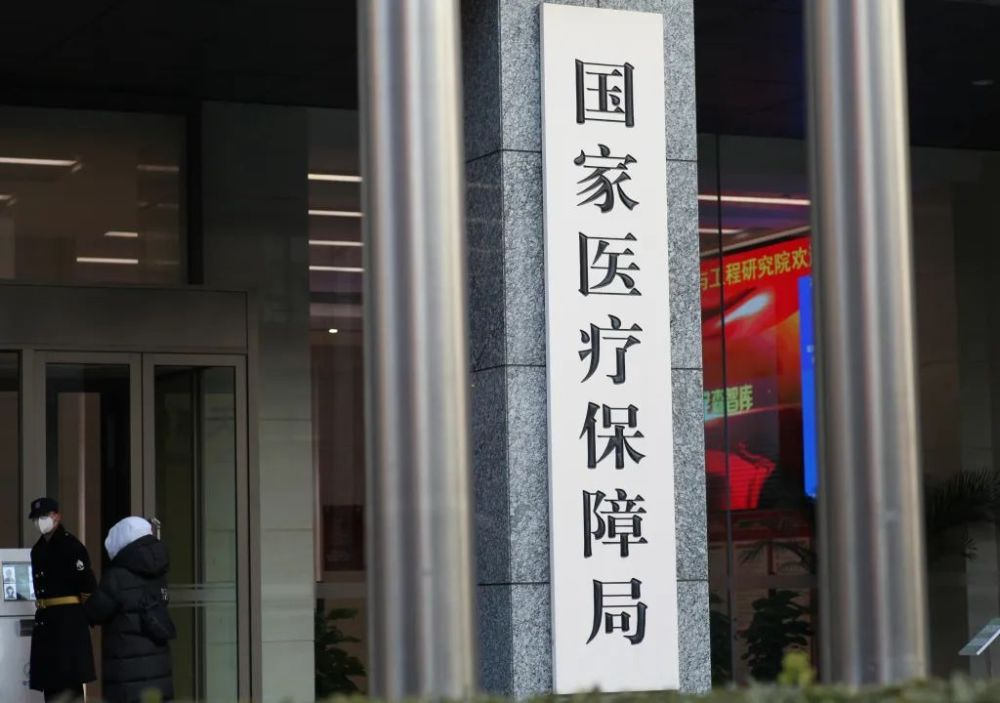
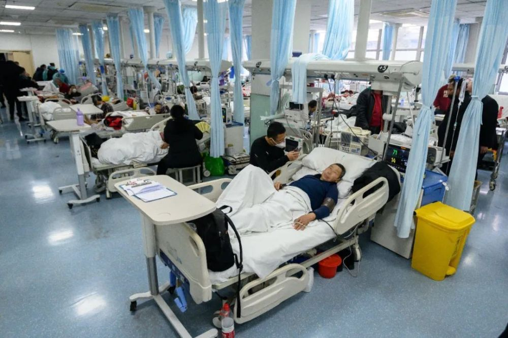

# 辉瑞新冠药谈崩是必然？患者：期盼保障重症患者用药难题

此次谈判失败，是双方都不愿意看到的结果。

_德国辉瑞工厂，实验室工作人员检查Paxlovid药片。_

1月8日，因新冠疫情延迟好几次的国家医保谈判终于结束，万众瞩目的辉瑞新冠口服药Paxlovid最终谈崩，未能进入医保。

这意外着，对于这款救命药，未来消费者可能要自掏腰包。

“谈崩”是必然？

据统计，本轮医药谈判中，涉及目录外西药和中成药共有198个，目录内西药和中成药共145个。截至发稿，官方仅公布新冠治疗药品谈判结果，其他结果尚未公开。

国家医保谈判是中国医药市场近年来医保药品目录准入方面的一个重大创新。早在2005年，福建省就在全国较先探索了昂贵药品谈判机制，对于一些没有进入医保目录名单的昂贵药药品生产商单独进行谈判，让药品生产商对福建患者做一些妥协和让步。经过谈判后，福建的患者在购买相关药品时可以享受到价格优惠，从而缓解患者负担。当年，价格昂贵的恶性肿瘤治疗药“格列卫”进入2005年版福建省医保药品目录，降价幅度接近一半。

2009年，国家层面出台的《改革药品和医疗服务价格形成机制的意见》，明确要求积极探索建立医药费用供需双方谈判机制。

直到2018年5月31日，国家医保局正式挂牌，在医药价格市场上，被看成是代表需方来讲话的部门，4年来，累计纳入507个新药好药，调出391个疗效不确切药品，现行版医保目录药品总数增至2860种，通过谈判纳入医保的药品价格平均降幅接受60%，有效减轻患者负担。

在疫情的影响下，原定于2022年12月初开展的医保谈判，延期至2023年1月5日才得以进行，为期4天。值得关注的是，新冠口服药被纳入本轮谈判，其中包括辉瑞的新冠口服药Paxlovid。

按照惯例，每种药物谈判时间约为半小时。不少现场蹲守记者注意到，1月7日上午八点半，辉瑞全球生物制药商业集团中国区副总裁、市场准入负责人钱云进入谈判内场后，一直到下午1点20才从谈判内场出来，足见Paxlovid谈判的艰难。

实际上，2022年3月15日，Paxlovid就被纳入《新型冠状病毒肺炎诊疗方案（试行第九版）》，被执行临时医保报销。2022年12月底，辉瑞主动将价格由每盒2300元下调至1890元。

而根据媒体的公开报道，辉瑞Paxlovid在澳大利亚市场售价为1159澳币，约合人民币5473元。美国政府采购价为每盒529美元，约合人民币3688元；欧洲多个国家政府采购价为每盒600美元-700美元，约合人民币4183元-4880元不等。

据天眼查的数据显示，辉瑞早在1989年10月就进入中国市场，曾在北京、上海、杭州等地设有多家办事处，1998年6月，辉瑞公司在上海成立辉瑞投资有限公司，对外投资辉瑞（中国）研究开发有限公司、辉瑞制药（无锡）有限公司等5家企业。

**从辉瑞公司在中国的布局，可以看出该公司对中国市场的重视程度。此次谈判失败，是双方都不愿意看到的结果。**

**“主要是价格原因。”一位消息人士告诉《中国慈善家》，医保局根据医保专家和卫生经济学专家的测算，划出一个价格底线，“如果超出这个范围，谈崩将是必然的。根据Paxlovid在全球其他国家的售价，不可能给中国一个超低的价格。”**

_北京，国家医疗保障局。为期4天的2022年国家医保药品目录谈判于2023年1月8日正式结束，Paxlovid因报价高未能进入医保。_

辉瑞报价多少？

1月6日晚间，国家医保局办公室印发《新冠治疗药品价格形成指引(试行)》的通知》指出，2023年1月1日之前获批的Paxlovid和其他新冠治疗药物要主动做好再评估并动态调整价格。与此同时，Paxlovid有关定价的传言愈演愈烈，“Paxlovid本次医保谈判后的价格将下调至700元/盒”。

然后，一天之后，医保局公布了谈判失败的消息，原因是药企“报价高”。随后，有消息传出：“辉瑞实际的报价是600多元，但应当距离国家医保局的底线还比较远。”

不过，也有财经媒体从“权威人士”处了解到：“600元绝对是假消息，没有这回事。”“辉瑞报价实际上要比600元高很多，1890元的价格基本上没降。”

复旦大学公共卫生学院卫生经济学教授胡善联接受《中国慈善家》采访时表示，医药谈判一方面是提高药物的可及性，让更多患者用得上创新治疗产品，另一方面也要让企业通过“以价换市”的方式获得更多销售收入。

胡善联是2019年医保准入药物经济学测算专家组成员、曾参与医保目录药品评审，在他看来，民众对相关新冠药物比较关心，所以医药局在谈判结束后第一时间公布了相关结果，这也是对舆论的及时回应。

Paxlovid出局的原因是“价格”，那么在谈判的过程中，“价格”是如何产生的？

胡善联介绍，在医保谈判中，药物经济学测算专家组会根据适合中国药物经济学评审的成本效果阈值，广泛运用药物经济学模型进行底价测算。同时，医保组、基金组也会测算医保能承受的价格，最后形成综合价格放至信封后进行密封，谓之“信封价”。

为保证公平公正，药物经济学测算专家组成员需遵守测算专家守则、签署《保密和廉洁承诺书》《无利益冲突声明》，坚持严格的专家回避制度，建立健全内控机制，严格保密管理。专家独立评估、形成建议价格和提交评估测算报告。

“信封价是医保能承受的支付价格，测算前，有很多准备工作，包括资料整理、国际价格的收集参考等。在谈判过程中，药企报价如果没有超出信封价的115%，可以继续争取，也就进入所谓的‘灵魂砍价’环节。如果超过115%，就会出局。”胡善联介绍，如某种药物的信封价为100元，药企报价在100元以下当然最好，如在100元至115元之间，存在谈判的空间，如超过115元，谈判将失败。

也就是说，在谈判过程中，相关药企有两次机会报价并确认，第二次确认后的报价高出信封价的115%，才会出局。

一位曾参与过医保谈判的医药代表告诉《中国慈善家》，有些企业怕媒体炒作，对自己形成不利的舆论影响，所以会要求医保局对其报价进行保密。医保局也会根据相关约定，尊重企业意愿。
**“所以企业的具体报价不会被外界知晓，网传的具体报价十有八九不准确。”该代表说。**

记者多次致电辉瑞公司，但截止发稿，未得到对方回复。

谈判的筹码

按照制度设定，在医保谈判过程中，医保部门代表广大参保者的利益，意图减少药品和耗材的虚高定价，特别是减少产品出厂后在中间环节的层层销售中的加价。按照国际惯例，一般在流通环节的销售加价率在3%-8%左右。但是曾经国内药品销售市场加价的倍数惊人，是造成价格虚高的主要因素。

国家医保局成立时就提出了“以价值为导向的战略性购买”这一理念，即医保作为最大的支付方，要通过购买实现全民健康，实现社会保障的公平，提升基金的抗风险能力，对产业创新进行支持与鼓励，也撬动医药体制改革。

在胡善联看来，国内医保谈判经过几年的发展，在评审组织体系、申报的公开透明、药企参与的积极性方面都有了很大的进步，最大的成绩之一是让国际上创新药进入中国市场的速度越来越快，让更多患者受益。

_2023年1月9日，山西省太原市，白求恩医院重症医学科的医护人员在抢救重症患者。_

谈判本身意味着矛盾冲突。一方面，作为患者，自费支付的药物价格自然是越低越好。另一方面，作为药企，创新药物价格太低，会影响其持续发展。

胡善联认为，对于一些药企而言，考虑到国际价格的平稳，不愿意在中国降价可以理解，按照市场化原则，越是疗效显著的创新药越不愿降价，所谓“好药不愁卖”，反而是那些临床疗效不太显著的药物，进不了医保对企业损失较大。

“一些进口创新药的谈判还要看国内在同领域是否有替代药，假如国内有竞争产品，医保部门就有底气，这是谈判的筹码。”胡善联说。

Paxlovid谈判失败后，国家医保局医药管理司负责人就表示，阿兹夫定片、清肺排毒颗粒经过本次谈判纳入国家医保药品目录后，国家医保药品目录内治疗发热、咳嗽等新冠症状的药品已达600余种。同时，为满足各地新冠病毒感染患者治疗的需要，近期各地医保部门结合当地医保基金运行情况，又将一批新冠对症治疗药物临时纳入本地区医保支付范围。

“单纯靠谈判来定价从理论上来说不是可靠的，要充分发挥市场的作用，才能为我国的药品价格体系建设打下基础。”胡善联告诉《中国慈善家》。

据了解，目前，国家层面已在积极探索创立有中国特色的创新药定价体系，将成立相关课题组进行研究。胡善联认为，长远来看，只有体系建立了，相关创新药、罕见病药、肿瘤药、仿制药才会有良性的发展。

一药难求

医保谈判失败，对企业而言，并不意味着不能进入中国市场，只是主要的支付方变为消费者。对患者而言，疗效好的药物进不了医保，影响药物可及性。

1月8日，《中国慈善家》以病患名义咨询北京北京协和医院、和睦家医院等多家医疗机构，大部分医院表示，Paxlovid已经断货好长时间了。

北京和睦家医院客服人员则表示，北京地区有少量库存，如需要可以提前预约，确诊新冠阳性，并符合用药体征即可。至于费用，医生的诊疗费约2200元，加上药品2300元，共4500元左右。

记者又咨询上海市一些社区卫生服务中心，其工作人员也表示“已经断供”，无法预计何时补货。

而国内的仿制药何时上市尚未可知。2022年3月，中国内地5家药企（复星医药、上海迪赛诺、华海药业、普洛药业、九洲药业）取得了辉瑞Paxlovid仿制药授权。但根据相关规定，其不能在中国直接销售所生产的仿制药。

复星医药表示，本次许可下相关产品在生产前，尚需完成相关技术交接且生产设施需经SRA批准或通过WHOPQ认证。许可产品的生产、在区域内的销售等，须待相关主管机构批准后方可实施，能否获得当地药品监管机构上市批准，以及合适上市都存在不确定性。

正是由于对重症的疗效，Paxlovid在中国市场上受到追捧，但供求关系的严重失衡，让该药一直处于一药难求的局面。一盒定价1890元的药物被黄牛炒到数万元不等，而通过平台或个人海外代购辉瑞Paxlovid仿制药，消费者难以对其品质、安全性做出有效甄别，存在一定风险，。

**“在不进医保的情况下，如果患者能按正常市场定价及时买到也行，问题的关键是花钱也买不到。”有患者对《中国慈善家》表示，希望政府和企业共同努力，保障重症患者的用药难题。**

作者：温如军

图片来源：IC、视觉中国

图片编辑：张旭

值班编辑：邱宇

