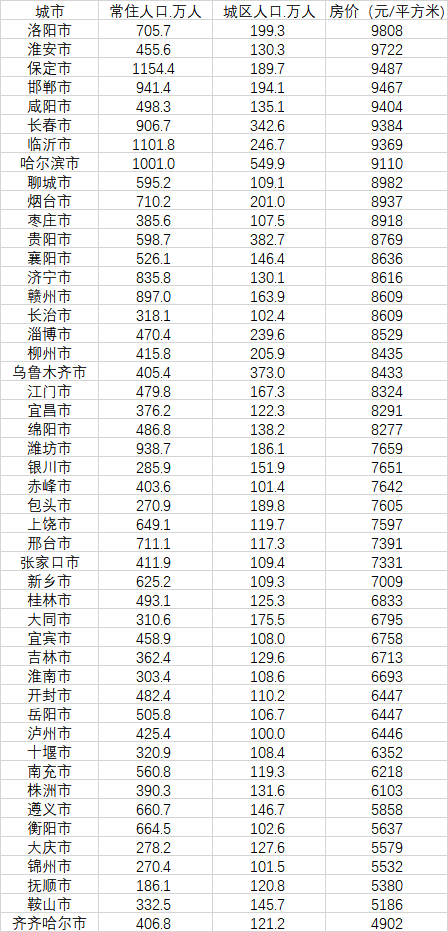

# 48个大城市房价未过万：最低的5个城市均来自东北

城市的本质是人口与产业的集聚，城市规模往往和辐射能力成正比。根据《2020中国人口普查分县资料》和城市规模划分标准，目前我国共有106个大城市，这些城市的房价水平如何？

第一财经记者结合中国房价行情网对106个城区人口超过100万的大城市房价水平进行梳理后发现，共有58个大城市平均单价超过万元大关，有45%（即48个）的大城市房价单价低于万元，其中房价最便宜的大城市单价不足5000元。

**58** **个大城市房价过万**

城区人口是衡量城市规模的标准。根据2014年11月国务院发布的《关于调整城市规模划分标准的通知》，以城区常住人口为统计口径，将城市划分为五类七档。其中，城区常住人口100万以上500万以下的城市为大城市，其中300万以上500万以下的城市为Ⅰ型大城市，100万以上300万以下的城市为Ⅱ型大城市；城区常住人口500万以上1000万以下的城市为特大城市；城区常住人口1000万以上的城市为超大城市。

根据《2020中国人口普查分县资料》数据，至2020年，我国共有106个大城市，其城区人口合计达到3.72亿人，占全国城市城区人口的64.7%。106个大城市包括了7个超大城市、14个特大城市、14个Ⅰ型大城市和71个Ⅱ型大城市。

从房价区间来看，有3个大城市平均单价处于每平方米6万元至8万元之间，分别是上海、北京和深圳。这3个城市全部是一线城市，也是当前几个高收入行业最为集中的城市，收入水平高，流入人口多，房价的整体水平也高。

根据智联招聘最新发布的2022年第四季度《中国企业招聘薪酬报告》，北京以13930元招聘月薪位居榜首，上海（13832元）次之，深圳（13086元）位居第三，这三城稳居第一方阵。

厦门、广州、杭州这三大城市的平均单价处于每平方米4万元以上、6万元以下，这3个副省级城市的平均招聘薪酬均位居前十，其中杭州和广州的平均招聘薪酬位居第四和第五，厦门位居第十。

平均单价处于2万到4万元区间的大城市有南京、义乌、东莞、天津、福州、昆山、珠海、苏州、青岛、宁波、温州和合肥。这些城市绝大多数来自沿海发达地区，只有合肥来自中西部。此外，义乌和昆山这两个县级市的平均单价分别达到了28456元/平方米和25144元/平方米。

值得注意的是，106个大城市包括了4个县级市，分别是江苏昆山、浙江义乌和慈溪、福建晋江，全部来自东南沿海地区，经济发达、人口流入多，这四个县级市的平均单价全部超过了万元大关。

整体来看，东南沿海地区的大城市经济发达，收入水平较高，外来人口流入较多，需求较大，非商品化的住房占比较低，整体的房价水平较高。比如浙江的7个大城市、福建的5个大城市单价超过万元；江苏的11个大城市中，有9个过万；广东的10个大城市中，也仅有江门一市平均单价未过万元。

**48** **个大城市房价不过万元**

在106个大城市中，还有48个城市即45%的大城市平均单价未过万元。从城市规模划分来看，这48个城市中包括特大城市哈尔滨，贵阳、乌鲁木齐和长春这三个I型大城市。此外，临沂、淄博、柳州和烟台的城区人口也都超过了200万。可见，城区人口规模大的城市，房价未必就高。

从区域分布来看，48个房价不过万的大城市主要来自中西部、东北以及东部地区的山东等地。其中，像山东烟台、潍坊等经济大市，房价的总体水平并不高。

目前，共有7个大城市的房价低于每平方米6000元，其中房价最低的5个大城市全部来自东北地区，分别是齐齐哈尔、鞍山、抚顺、锦州和大庆，齐齐哈尔是唯一一个平均单价低于5000元的大城市，为4902元/平方米。同时，齐齐哈尔、抚顺、鞍山这些大城市甚至出现几万元一套的“白菜价”房子。

吉林大学东北亚研究院教授衣保中对第一财经分析，东北的工业化和城镇化比较早，在计划经济时期，东北地区中心城区人口规模大的城市就比较多，包括鞍山、抚顺等地级市的城市规模都很大，当时很多城市城区人口规模在全国都比较靠前。

一直到改革开放后的上世纪80年代、90年代初，东北很多地级市的城区人口规模仍位居全国前列。例如，上个世纪90年代初，抚顺、鞍山、吉林市、齐齐哈尔已是城区人口超过100万的大城市时，南方的厦门、宁波等城市城区人口只有几十万。但如今，厦门、宁波已是城区人口超过300万的I型大城市，并正向特大城市迈进，抚顺、鞍山、齐齐哈尔、吉林等城市的城区人口规模基本没有太多变化。

衣保中分析，东北的地级市近年来经济发展较为缓慢，城区人口规模变化不大，有的城市甚至处于萎缩状态。当前，东北的人口流动主要直接流向东北的几个副省级城市和东南沿海发达地区，很少流向地级市城区，目前东北的住房新增需求主要集中在几个副省级城市，地级市新增需求很少。

另一方面，这些城市在过去计划经济时代，企业办社会，很多国有企业给职工建房，有很多非商品化的房子，后来这些城市的棚改规模很大，棚改房多。总体上，这些城市的存量房规模比较大。存量多，新增需求少，因此整体的房价也比较低。

