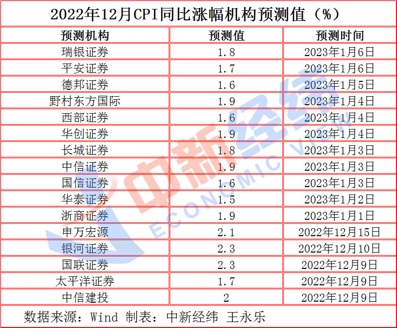

# “猪油”同落VS“菜哥”连涨，CPI或稳在“1时代”

中新经纬1月12日电 (王永乐) 12日上午，国家统计局将公布2022年12月居民消费价格指数(CPI)。多家机构预计，12月CPI同比涨幅1.9%。

**CPI涨幅或连续两月处于“1时代”**

国家统计局数据显示，2022年11月，全国CPI环比下降0.2%，同比上涨1.6%。同比涨幅较10月明显回落，时隔7个月重回“1时代”。

对于即将揭晓的2022年12月CPI数据，Wind数据显示，截至1月11日，16家机构对12月CPI同比涨幅的预测均值为1.9%。

从预测值来看，4家在1.9%以上，4家为1.9%，8家在1.9%以下，预测值最高为银河证券给出的2.3%，最低为华泰证券给出的1.5%。若按照机构预测的均值计算，CPI同比涨幅将连续两月处于“1时代”。

从机构预测来看，“猪油”同落，而蔬菜价格上涨，通胀总体平稳。

农业农村部数据显示，2022年12月，猪肉价格连连降，蔬菜价格步步高。截至今年1月5日当周，猪肉及19种蔬菜批发市场周均价为25.5元/公斤、4.57元/公斤，分别较截至2022年12月1日当周均价下跌21.88%和上涨23.18，同比分别上涨8.6%和下降2.6%。

油价方面，国家发改委2022年12月两次下调成品油价格，汽、柴油价格每吨分别合计下调920元和885元。

德邦证券宏观报告认为，核心CPI改善尚未到来。12月整体食品价格仍在下降，主要是受猪肉价格下跌带动。非食品CPI环比变动预计弱于历史同期，一是油价环比降幅较大，二是在疫情约束下，消费需求整体偏弱。预计12月CPI同比涨1.6%左右，环比降0.2%。

华创宏观张瑜团队预计，12月CPI环比基本持平，同比升至1.9%左右。预计食品价格上涨对冲能源价格下跌，核心通胀走平，回升主要来自于低基数效应。

**未来CPI怎么走？**

短期来看，猪肉价格对通胀压力不大。

农业农村部猪肉全产业链监测预警首席分析师、中国农业科学院北京畜牧兽医研究所研究员朱增勇日前对中新经纬表示，当前，生猪出栏量增加叠加部分地区冻猪肉投放，猪肉供给量比较充裕，消费需求总体缓慢提振，预计春节前后猪价整体仍将以低位震荡为主。“一季度磨底后，猪价可能会逐渐回升。”朱增勇称。

华创证券也在近期研报中指出，短期看节前需求小高峰受疫情因素压制，供给端生猪出栏均重已连续两周下降，大猪集中出栏对猪价的压制作用已见减轻，同时价格受成本支撑作用下降空间较小，预计价格短暂反弹后或维持低位震荡。

展望2023年，平安证券宏观报告预计全年物价将继续平稳运行，CPI同比增速或前高后低，中性情形下全年CPI同比涨幅约为1.6%。

瑞银亚洲经济研究主管、首席中国经济学家汪涛日前表示，预计今年中国经济出现复苏，通胀料将比较温和，CPI预计平均在3%左右。

东方金诚首席宏观分析师王青等发文称，2023年，消费修复有可能带动CPI涨幅阶段性扩大。预计2023年CPI涨幅中枢会有所抬高，全年累计涨幅有望达到2.5%左右，但仍处3.0%以下的温和状态。(中新经纬APP)

**中新经纬版权所有，未经书面授权，任何单位及个人不得转载、摘编以其它方式使用。**

