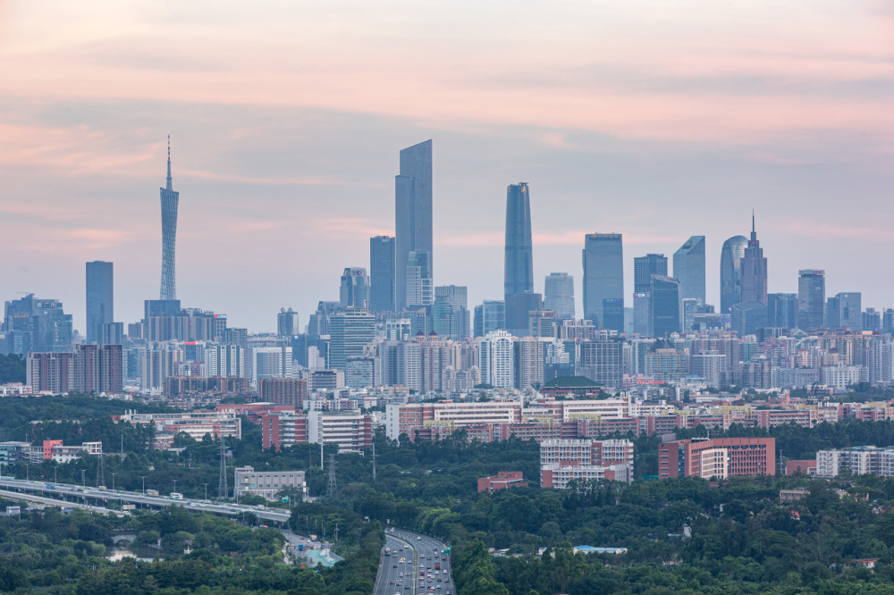

# 传广州限购区买房不认贷，银行经理：政策影响较大，不确定是否执行

本文来源：时代财经 作者：陈泽旋

图片来源：图虫创意

1月9日晚，市场传言广州调整住房按揭贷款的多项认定条件。具体包括：个别银行取消了对豪宅线的界定，所购住宅面积大于144平方米的购房者，在申请房贷时可按普通住宅政策进行；在限购区域无房、有房贷记录但已结清的购房者，只需支付三成首付；在增城、从化等不限购区域拥有住房的购房者，在限购区域买房时可按无房政策申请房贷。

卷入此次传言的为民生银行。时代财经以购房者的身份向民生银行某支行个贷经理核实上述消息的真实性，该个贷经理表示，由于政策影响较大，目前仍处于研讨阶段，尚未向外界正式公布，也不能确定将来是否执行。

此外，包括工商银行、农业银行、中国银行、建设银行、招商银行在内的多家主流银行的个贷经理表示，目前所在行未在广州执行上述政策。

据南方+报道，一家国有大行相关负责人称，该消息传出来后，金融主管部门负责人已向各家银行重申广州的住房信贷政策没有变化，要求各家银行不可自行突破。

按照原本的房贷政策，面积超过144平方米的住宅在广州属于非普通住房，购房家庭只要有房贷记录无论是否结清，购房均需支付七成首付。

值得一提的是，广东全省对普通住房的标准自2005年开始实施至今。根据《广东省建设厅关于确定我省普通住房标准的通知》，小区建筑容积率在1.0以上、单套住房套内建筑面积120平方米以下或单套住房建筑面积144平方米以下、实际成交价格低于同级别土地上住房平均交易价格的1.44倍以下的住房，划为普通住房，不符合该标准的为非普通住房。由于非普通住房往往总价较高，关于普通住房、非普通住房的认定标准在市场间被称为“豪宅线”。

原本的房贷政策还规定，购房家庭在广州全市范围内无房，有贷款记录但已结清时购房普通住房需支付4成首付，未结清者支付7成；拥有1套住房，再次购买普通住房时房贷已结清者支付5成首付，未结清者支付7成首付；而拥有2套住房的购房家庭，在非限购区域买房时需全款支付，在限购区域则无法买房。

广州一共拥有11个行政区，其中，增城、从化属于非限购区域，余下9个行政区均限购，全部行政区在房贷方面均执行“认房又认贷”的政策。

“虽然银行现在说没有执行这个新政，但我个人认为是有可能的，广州目前房地产市场仍然比较低迷，在等待复苏，等待更多的成交”，广州中原项目部总经理黄韬表示，虽然房地产调控整体处于宽松周期，但由于刚需等购房人群的购买力和预期下降，导致市场的回暖仍然需要比较长的时间。

根据广州中原研究发展部的数据，2022年，广州一手住宅网签成交72936宗，同比下跌34%；成交面积786.2万平方米，同比下跌33%。而2015年至2021年期间，广州一手住宅网签成交量仅在2018年和2019年低于8万套。

值得一提的是，2022年全国范围内房地产利好政策的出台次数达到历史峰值，而自2022年11月以来，房地产政策更是在融资端频频发力。就楼市政策而言，主要的政策工具包括对限购、限贷和房贷进行局部或全面的调整，如热门二线城市佛山、东莞在2022年12月全域解除执行了多年的限购政策，但北上广深四大一线城市未有明显动作。

