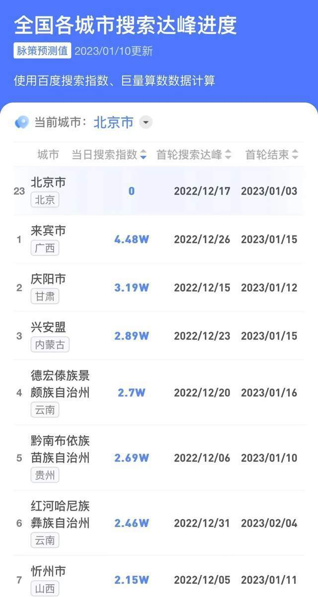

# 多地宣布第一波感染高峰已过，新冠监测体系如何重建？

近日，北京、广东、浙江、四川、河南等多地发布最新研判，称第一波感染高峰已过，发热门诊就诊人数持续下降。截至目前，全国性的疫情数据仍存在缺失。

2022年12月25日，在持续更新了1079 天后，国家卫健委官网宣布停止公布每日疫情信息。

随后，相关数据转由中国疾控中心对外发布，但因信息获取的渠道惯性使然，多数公众并不知道这份疫情日报还在继续。

事实上，自2022年末“二十条”、“新十条”相继出台带来大规模核酸检测取消，我们能看到的疫情数据已缺乏参考价值。

近三年来日日伴随14亿国人的疫情日报数据，其背后是一整套“主动式”的疫情监测体系，也即以社会面核酸筛查、医疗机构核酸检测、出入境监控等多种“主动出击”的手段，第一时间从源头捕捉确诊、疑似、出入院、入境等各种类型、各个阶段的新冠病例。

从民间到官方，社会各界对疫情数据的需求仍在，且较过往尤甚，尤其是在当下各地新冠感染相继达峰或过峰、重症高峰已至或将至的关键时刻。

信息真空需要被填补。面对潮水般涌来的新冠传染，官方、民间和学术团体正努力从各个角度重建参考系，运用流行病学模型、问卷调查、搜索指数预测等多种方法，想方设法研判疫情，以期对疫情走势有更准确的把握。

有疾控人士透露，目前有关部门已发布新版新冠监测方案，要求将既有的传染病直报体系和流感监测系统运用于新冠传染监测。

亦有流行病学专家强调，在利用既有被动式、常态化的监测体系的同时，还需调动一切可行的主动监测手段，包括社区监测、重点人群抽样等。

国家疾控局近期也要求各省积极调查当地疫情数据，并强调“方法不限”。

当传统流行病学模型失灵

去年11月11日“二十条”新政颁布后的整整两周，南开大学公共卫生与健康研究院黄森忠教授和团队一直在苦苦搜寻新的“参照物”，为他们的建模提供依据。

但与中国所有流行病学专家一样，黄森忠也面临同样的难题：防疫政策放开后，学界广泛使用的传染病动力学SEIR模型突然失灵了。

在这个经典模型中，人群被划分为四类：S为易感者，E为暴露者，I为感染者，R为恢复者，个体则在不同类别之间转移。

想要测算出不同群体的人数变化，可以借由衡量病毒传播能力的多项指标计算。其中，随时间变化的有效再生数Rt值至关重要。

Rt值通常被理解为疫情的实时传播指数，也即一个感染者在传染期内，可以将病原传播给其他易感者的数量。

当政策放开、人为干预措施大幅减少时，国内新冠的Rt值大幅波动，“很多人跑来问我现在Rt值等于多少，我和他们开玩笑说等于1000。这个值目前较难估算。”
黄森忠告诉八点健闻。

当基础变量不再确切时，模型会出现巨大偏误。因此，继续单纯沿用SEIR模型的道路被堵住了。花两周时间寻找类似大规模核酸结果的“参照物”未果，黄森忠决定放弃这条经典之路，从零开始。

过去三年，黄森忠团队曾对多个城市进行过疫情研判和趋势预测。去年春夏之交的上海疫情中，为了预测医疗资源是否会出现挤兑，团队曾预测过“住院床位压力值”。

黄森忠认为，发生了新疫情，首先感到压力的就是医疗资源。如果能够预测收治危重症和普通型患者的床位数的峰值，以及出现峰值的时间点，将会更好地帮助公卫部门决策。

这一数值，带给了黄森忠新的灵感。

他重新审视已有的思路，发现当务之急是衡量各地的医疗资源会受到多大冲击、决策者需要做哪些准备。而在估算医疗资源应对能力的过程中，如果能了解发热门诊中新冠患者的就诊人数和新冠就诊率，或者重症人数和重症率等医疗数据，再辅之予SEIR模型预测，便可以反推出一个地区的感染人数的规模估算。

“例如，12月13日左右很多人说北京已有四五百万人感染，甚至60%的北京人已经感染。”黄森忠解释，“但我们根据手头得到的北京市的新冠重症和死亡病例，同时参考上海、吉林和香港疫情期间医院的危重症和死亡率，再除以10%的就诊率，在模型里跑出来，推测出北京当时的感染人数最多只有72万。”

在推算过程中，最困难的是预估就诊率，因为其波动最大，受到的干扰因素繁多。

黄森忠和团队长久以来的工作模式是将数学模型预测与“信息分析”结合起来，后者旨在分析各地居民的生活习惯和行为方式。

在“信息分析”的认知框架下，就诊率是不断波动的。

“最初政策放开后大家很紧张，一窝蜂跑到医院，后来发现在家也能自愈，便不再往医院挤，不少医院的病房都空了一大半，我们将其定义为‘居民自限性行为’。但随后重症患者增加，医院的就诊量再度激增。”黄森忠说。

黄森忠根据观察到的实际情况，作为“信息分析”的框架，并据此动态调整就诊率数值。由于全国数据量体系庞杂，他的目标是尽可能估算准感染病例的数量级。

12月中旬，黄森忠和团队做出预测：全国范围内2022.12.20~2023.1.15这段时间会迎来住院高峰期，这将是放开之后的第一轮冲击。此后，从2023年年初至2023年上半年，全国还会迎来两轮规模较小的冲击。据此，他将这一预测走势形象地比喻为“一波三折”。

“发烧”搜索指数背后，感染者的行为洞察

在官方数据失去参考价值的这段信息真空期内，一些民间的疫情预测模型也纷纷进入公众视野。其中，一款名为“数据团+”的微信小程序在社交媒体上广泛传播，上线短短两周内，阅读量超过千万。

该小程序可预测各大城市的疫情进展指数，具体到首轮达峰的开始与结束日期。例如，它预测北京市第一波疫情于2022年11月26日开始，于2022年12月17日开始达峰，2023年1月12日结束。

_△ ”数据团+“小程序截图_

曾任教于复旦大学经济学院、现任脉策科技首席经济学家的陈沁博士与团队共同开发了这款小程序。他们利用百度搜索、字节跳动巨量搜索引擎上各地区“发烧”关键词搜索指数的变化，来预测每个地区的疫情进展。

陈沁告诉八点健闻，自11月上旬开始，他一直在思考政策转向带来的影响。

“这是不是放开的最佳时间点？中国的医疗资源会受到多大冲击，会造成大量超额死亡吗？目前面对的冲击和以往有什么不同？”这些问题萦绕在陈沁脑海中，他和团队也撰写了多篇探讨文章。

陈沁发现，通过“发烧”搜索指数对地区的疾病状况预测和监控，是一种可行的手段。2008年，谷歌曾使用这套方法提前预测了美国各州的流感情况，灵敏程度高于美国疾控局。

陈沁拟合数据后发现，新冠疫情期间搜索指数与世界各个国家、各地区的病例增长程度仍然高度相关。例如新加坡、日本、香港特别行政区、台湾地区此前的疫情，与该地的“发烧”搜索指数在时间、比例上保持同步。

于是，他决定尝试搜索指数预测法。在疫情期间，“发烧”关键词的搜索指数会高于非疫情期间的基准水平，陈沁将其定义为“超额搜索倍数”。

回溯此前上海与吉林的疫情，陈沁发现两地的“超额搜索倍数”为1.57倍和1.74倍。而2022年9月底以来，乌鲁木齐的发烧指数最先有异动，是基准水平的2.6倍。继乌鲁木齐后，石家庄、保定、北京等地的搜索指数也于11月底迅速上升。

在分析Google指数和各地区疫情变化时，陈沁发现，当“累计超额倍数”达到与当地总人口对数相关的一个数值时，当地的疫情便会达到顶峰；超过另一个阈值后，当地的疫情便趋向结束。

由此，陈沁使用不同城市的疫情搜索阈值作为疫情拐点和结束的模拟阈值，监测每个地区目前的疫情进展情况、未来每天新增病例数、疫情高峰的开始和结束时间。

小程序一经上线便成为爆款，收获的关注远超陈沁和团队成员的预期。当然，一些质疑声也纷至沓来，有学者认为，今年是流感高发的年份，无法区分用户搜索“发烧”的具体原因；也有网友认为，通过搜索引擎获得数据存在天然缺陷，比如将不会使用网络的群体排除在外。

一位流行病学专家向八点健闻评论道，谷歌通过40多个指标预测流感，但最后结果还是跑偏了。使用大数据需要特别小心，因为可能存在“过拟合现象”，参数太多，数据太少，会导致所谓的维度崩塌。

陈沁在后期收集数据过程中还遇到另一个问题。12月19日，他发现百度和巨量引擎两个平台的“发烧”指数均出现大幅下降。陈沁怀疑是人为干扰导致的数据污染，不得不临时更换检索词。

12月27日，陈沁在社交平台上写道：截至目前，小程序预测除了个别人口较少可能搜索指数计算不太准确的地区以外，全国疫情都已经过峰。从12月13日的河北邢台、湖北天门，到12月26日福建的福州、厦门等地过峰，短短两周时间，全国新增感染最多的阶段已经过去。

陈沁预测，在2023年春运之前，大部分地区的疫情新增会大幅回落。

官方正重建新冠监测体系

除学者与民间团体的疫情预测外，海南、浙江、四川等多地疾控部门近日也陆续发布新冠感染调查问卷，并公布调查结果。

有不少公卫专家对网络问卷调查法表示警惕，认为其存在与搜索指数预测法类似的缺陷。

一位流行病学专家告诉八点健闻，绝大部分问卷会询问参与者是否存在发烧、咳嗽、肌肉酸痛等症状，或与流感或其他呼吸道感染症状重合，导致准确率下降。问卷获得的核酸与抗原结果也未必准确。而且，问卷无法覆盖到不会使用互联网的居民，例如老年人群，他们可能是“沉默的大多数”。

八点健闻另悉，在全国范围内，国家疾控部门既有的两套信息监测系统也已启动，用以监测和预判新冠疫情走势。

这两套系统，一个是2003年SARS之后建立起来的全国传染病信息直报系统；一是2004年正式创建的中国流感监测网络，抽样覆盖全国408家网络实验室和554家哨点医院。

部分公卫专家表示，上述两套监测系统亦存在不少缺陷。比如，流感数据上报在落实环节并不严格，这会导致数据质量偏低。何况，当前大部分医院门诊已不再要求患者的核酸或抗原结果，也就无法在终端捕获和上报传染数据。

华中科技大学同济医学院公共卫生学院流行病学教授魏晟告诉八点健闻，流行病的监测，是长期、动态、连续搜集人群中疾病状态数据，从而了解人群疾病流行现状及趋势，判定防控措施效果的一种方法，是现代公共卫生的特征之一。监测可以分为主动监测与被动监测两种。主动监测，是指疾控部门主动去调查搜集人群中疾病状况的数据。而被动监测，比如现行的网络直报系统，由各医疗机构发现病例，确诊后进行报告。

魏晟提示，当被动监测数据不足以判断疫情形势时，可以采用主动监测的形式及时了解疫情状况，比如当前可以参考流感监测的方式，通过搜集医疗机构中就诊病人的样本进行新冠病毒检测，了解新冠疫情的流行趋势。也可以通过抽样调查的方式，在社区抽取部分居民进行核酸检测，了解社区居民新冠病毒感染水平。

浙江舟山市疾控中心就对全市核酸阳性检出率、社区哨点监测和重点人群抽样调查情况进行综合分析，估算出截至去年12月29日，全市感染人数比例达到30%-40%，总感染人数接近40万人。

一位流行病学专家告诉八点健闻，国家疾控局要求各省“方法不限”地调查当地疫情数据，“经费充足的省市可以搞抗体监测和社区抽样，经费不充足的只能做网络问卷调查。”

该专家还透露，12月21日国家卫健委组织的电话会议通报，12月1日至20日，全国人口累计感染率达到17.56%。这一全国性的估算数值，其来源就是各省上报的估算数值之和。

进入新年，多个特大城市已从传染高峰进入重症高峰期，中小城市与农村地区感染人数持续激增。春运在即，全国疫情形势将更加复杂，新冠监测体系仍需完善，公众则期待更高质量的疫情公开信息。

史晨瑾丨撰稿

**本文首发于微信公众号「八点健闻」，未经授权不得转载**

