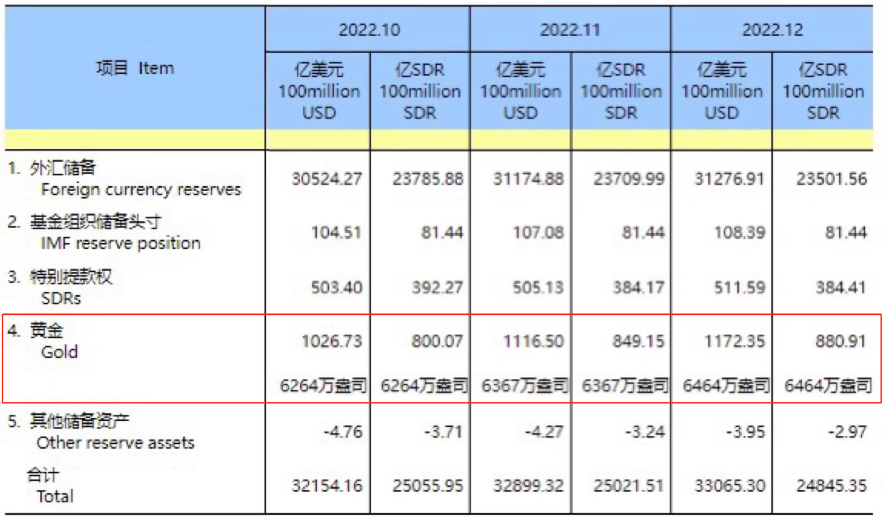
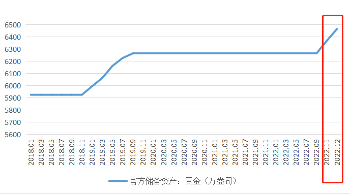
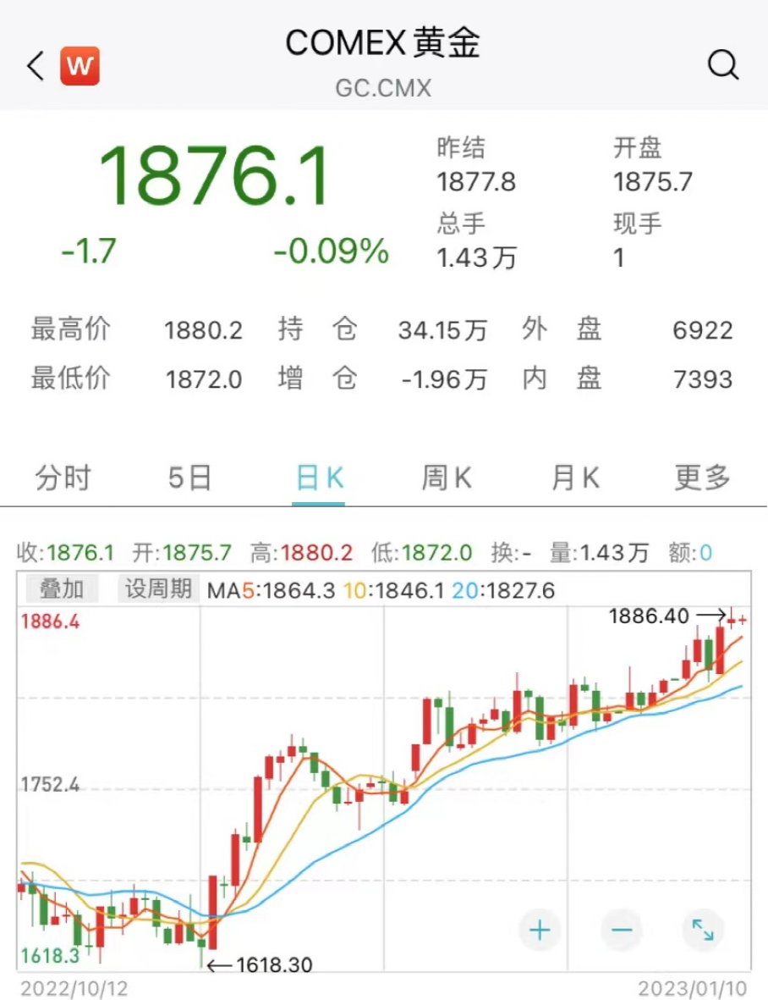

# 央行连续出手！狂买黄金超250亿

中国基金报记者 李智

央行连续两个月出手增储黄金！

最新数据显示，2022年11月中国人民银行增持黄金103万盎司，12月再次增持黄金97万盎司。截至12月末，我国黄金储量为6464万盎司。而在此之前，中国人民银行黄金储备已经连续38个月保持在6264万盎司。

**央行连续两月增加黄金储备**

近日，国家外汇管理局发布最新数据显示，2022年12月，我国增持黄金97万盎司，截至12月末，我国黄金储量为6464万盎司。

值得注意的是，2022年11月，我国央行曾增持黄金103万盎司至6367万盎司。这是央行三年未购黄金之后，两个月连续增持黄金，共增持200万盎司，对应增持黄金购入金额超250亿人民币。

黄金在央行储备管理中占据重要地位，央行是举足轻重的黄金持有方。据世界黄金协会数据显示，2022年11月全球央行净购金量为50吨，月环比上升47%。其中，中国人民银行是11月宣布增储最多黄金的央行，也是11月各国央行报告的最大增储量。此外，土耳其央行购金步伐持续，在11月再度购入19吨。吉尔吉斯央行黄金储备在当月则有3吨的上升。

总体来看，2022年全球央行黄金储备升至1974年以来的最高水平，仅第三季度，全球央行就买入了近400吨黄金，创2000年有季度数据以来的新高。

**黄金价格不断走高**

2023年以来，金价持续看涨，现货黄金突破1870美元/盎司关口。1月10日盘中，现货黄金价格一度涨至1880美元/盎司，创近7个月新高。

与此同时，沪金也突破了410元/克的压力位，现报413.5元/克，今年以来的6个交易日累计上涨1%。

受益于金价上涨，AH黄金股近期纷纷走强，黄金板块相关指数年内累计涨超10%。1月9日，千亿市值的紫金矿业涨停，紫金矿业港股涨超10%。金一文化更是实现两连板，另外招金矿业、中国黄金国际、老凤祥等多股表现活跃。

**机构：金价有望保持上行趋势**

对于黄金价格的未来走势及影响因素，中信证券表示，在全球金融资产大幅波动以及各国外汇储备多元化的背景下，2022年全球央行购金量创出新高。央行增持黄金是金价上涨最有效的风向标之一，叠加美联储加息预期弱化、地缘政治冲突延续和经济衰退等因素支撑，金价有望保持上行趋势，且本轮价格高点有望突破2020年前高。

新世纪期货认为，黄金价格的支撑主要来自两个方面：一是通胀数据连续两个月下降说明紧缩的货币政策正在起效，美联储确认放慢加息步伐。在连续四次加息75个基点之后，12月份加息50个基点，市场情绪受到通胀预期的影响，对今年的紧缩周期和步伐关注度极高；二是市场对美国经济衰退的预期也对黄金形成支撑，美国PMI数据显示出下降趋势，市场预计2023年美国经济可能某个时间衰退。

高盛大宗商品交易员Ryan
Voon在报告中表示，今年有三个原因推动黄金上涨，其一在于当前黄金抛售趋势已经接近尾声；其二在于美联储不管何时转向都利好黄金这类避险资产；其三在于受地缘政治冲突影响，各国央行对黄金这类“中立资产”会更加偏爱。

海通证券表示，央行增持黄金有利于支撑黄金价格。认为金价有望在2023年迎来投资价值和避险价值的双击。美联储加息已进入到后半段,美国10年期国债实际利率已出现下行趋势。此外,美国PMI指数及其新订单分项逐月下滑,经济动能出现减弱,若美国在23年出现衰退,黄金的避险价值也有望得到提升。

编辑：舰长

