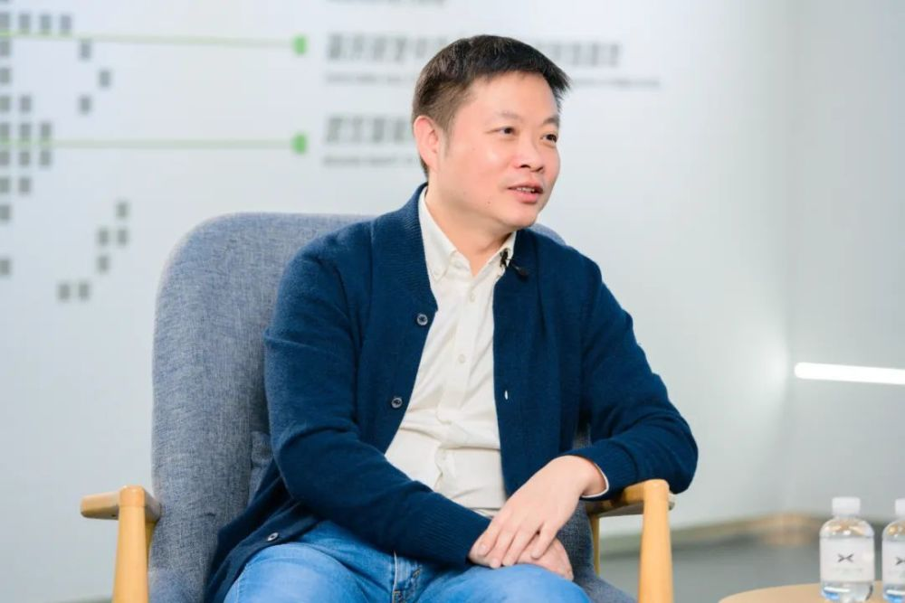
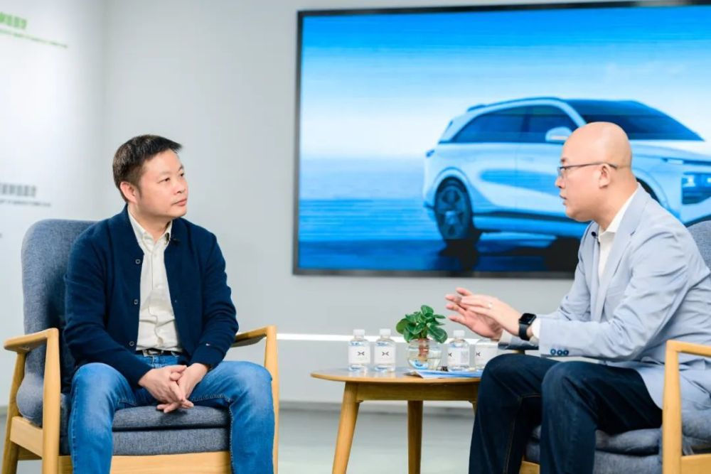
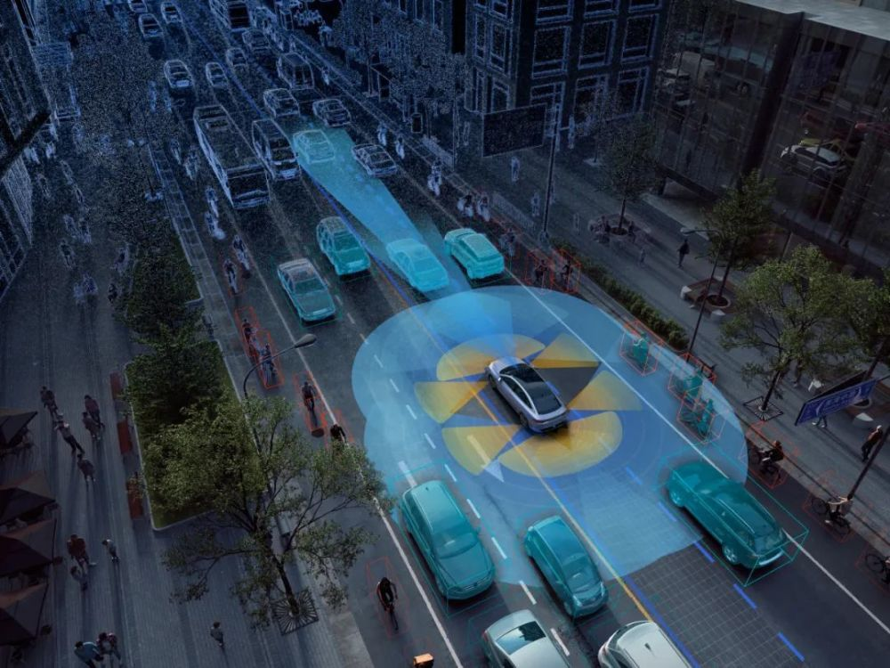
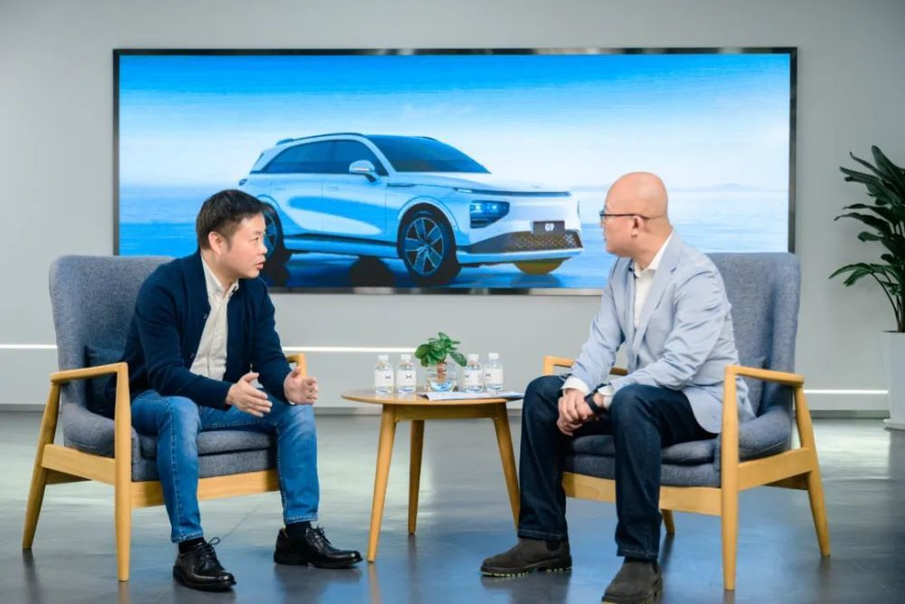
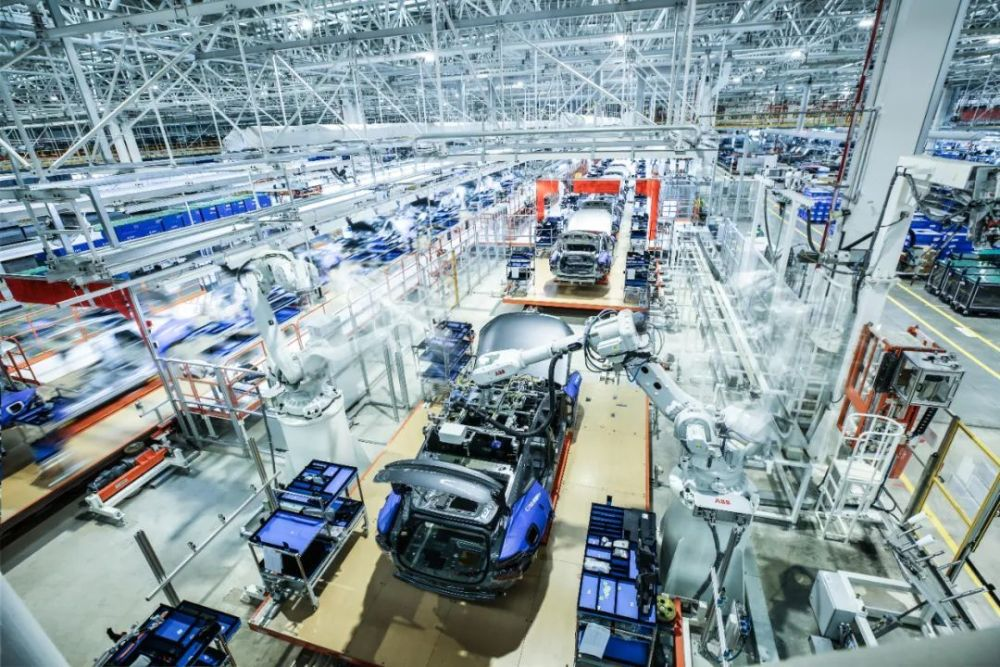
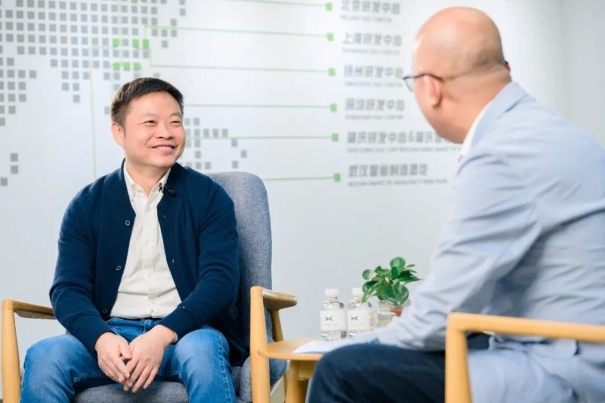
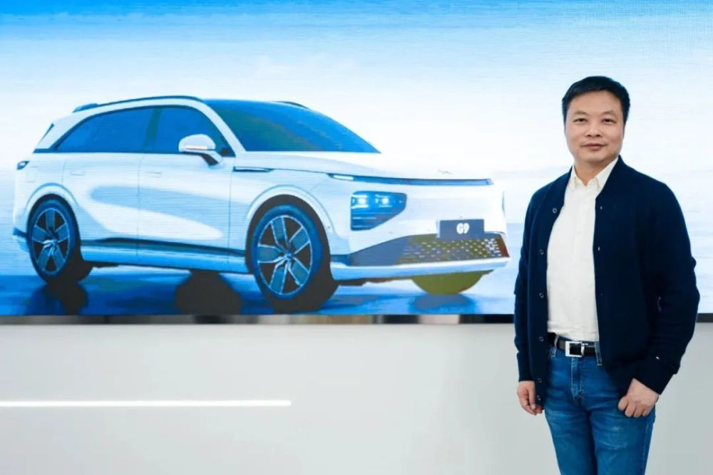

# 对话何小鹏：要么足够精彩，要么轰轰烈烈死掉

**采访｜《中国企业家》记者 何伊凡 任娅斐**

**文｜任娅斐 编辑｜马吉英**

**图片来源｜中企图库**

“很多人跟我讲，造车是一个后悔的哲学。”在广州总部接受《中国企业家》专访时，小鹏汽车董事长、CEO何小鹏表示，造车是一个长周期的事情，如果规划不清晰，会很痛苦。

对他来说，这种“痛苦”是一种全新的体验，也激发了他的斗志和更大的潜能。

2017年何小鹏离开UC加入小鹏汽车，造车5年来，经历过高光，也数次陷入低谷。他曾一度面临诸如融资难、现金流吃紧、芯片荒等现实难题，也在2021年实现过完美逆袭，在2021年成为造车新势力的销量冠军。

但在2022年，新挑战又出现了。新车G9上市的波折让他重新思考组织架构、产品业务、运营管理、宏观环境等话题。“小鹏汽车过去太过于关注技术创新，但技术创新最终服务于客户。在技术创新到客户的过程中，我们做了事情，但是没有做到足够好。”何小鹏说。

硬币总有两面，在何小鹏看来，这是挑战，也是“2022年最好的事情”：“因为出现了错误，所以看到了自身更底层的问题。”

强调底层“逻辑”，是过去多年产品经理的身份在他身上刻下的痕迹。如果回到造车之初，他会跟当时的何小鹏说，“造车好痛苦的，要想清楚。”但进入造车这个最难的行业之一，他也认为是一种幸运，“对我有很多的锻炼，认识了很多朋友，也锻炼了一点点酒量”。

更重要的是，他认为，“在中国的经济环境下，我觉得一定要有人在硬件加软件的组合上进行创新，只有做成这样的事情，将来你才有基础去做一些更有挑战、更酷的事情。”

造车给他带来哪些改变？对产品的认知是如何建立起来的？判断决策的底层逻辑是什么？如何评价雷军、李斌、李想？2023年1月，《中国企业家》深度对话何小鹏，试图找寻这些答案。

**本次对话的内容要点包括：**

  * _1_ 造车是一个后悔的哲学。因为造车是很长周期的事情，可能要花24个月到48个月，这个时候你需要规划当时的环境、变化和想法。如果规划不清晰，你是很痛苦的。
  * _2_ 小鹏汽车过去太过于关注技术创新，但是在技术创新到客户的过程中，没有做到足够好。
  * _3_ 今天绝大多数汽车人内心是不相信智能化的，他们认为智能化只是销售的方法论，或者营销的噱头。但是熟悉互联网的人都知道，这是一个巨大的机会。
  * _4_ 中国有很多企业管理很好，但是如果抄它的话，必死无疑，因为你没有它的天时、地利、人和与成长环境。
  * _5_ 我们高中老师就喜欢问我最近怎么样了？最近说话多不多？
  * _6_ 能者上，不能者下，如果有一个能者超过我了，我还有股份，再给他一些股份，等于他在帮我创造价值，我为什么要去控制它呢？他只要是为企业好，我就会拼命鼓掌。
  * _7_ 我从来没有觉得雷军是我的对手，就是导师、大哥。但是我不想成为他，我觉得他太累了，太努力了。
  * _8_ 要不然做得足够精彩，要不然轰轰烈烈死掉，小而美不是我想做的事情，我的目标就是最上面。

**以下为对话整理（有删改，完整对话视频将于近期播出，请关注中国企业家）：**

我们还有非常多的牌

**《中国企业家》：2022年蔚小理三家都遇到了一些挑战，也有很多反思，你对2022年的感受是什么样的？对2023年有什么展望？**

**何小鹏：** 如果用一个词来形容2022年，我觉得是“仰望”。

什么叫做仰望？仰望在某种角度上是站在一个谷底，是一种深度的反思，是对未来的期望或者要求会更高。比如我们在2021年定的战略规划是期望做成一个有很好利润的公司，但是2023年我们看到市场的变化是，智能汽车会像电脑、智能手机的发展一样，最终只有三家到四家。
**在中国除非你有非常好的差异化定位，否则很难成为一个小而美，或者是中而美的公司。** 所以我觉得2022年是站在挑战之中，仰望下一个五年。

**《中国企业家》：这个词用的非常好，仰望不只是往上看，也包含着往后看和往前看。如果往后看进行复盘，你觉得过去一年有哪几件事做得还不错？哪几件事是需要深度反思和做一些行为上的调整？**

**何小鹏：** 造车的时候，有很多人跟我讲造车是一个后悔的哲学。

**《中国企业家》：怎么理解？**

**何小鹏：**
因为造车是一个很长周期的事情，可能要花24个月到48个月，这个时候你需要规划当时的环境、变化和想法。如果规划不清晰，你是很痛苦的。造车和互联网不一样，互联网没有供应链，没有制造，是数字资产，所以追求迭代，甚至一天一迭代，你不用想得很清楚。

回到2022年，我觉得第一个没有做好的事情， **是没有判断好行业的变化、宏观的变化对汽车行业的影响。**
比如没有判断出来电池涨价会如此之高。2021年最难的是什么？芯片的供给。2022年最难的是什么？电芯的涨价。电芯涨了60%，导致整车成本涨了20%。

第二个没有做好的事情是我们的新车G9。
**小鹏汽车过去太过于关注技术创新，但技术创新最终服务于客户，所以在技术创新到客户的过程中，我们做了事情，但是没有做到足够好。**

2022年最好的事情是什么？因为出现了错误，所以看到了自身更底层的问题。

**《中国企业家》：有没有被这些错误击倒？**

**何小鹏：**
不会击倒。为什么？我们之前是迎风跑，核心是谁跑得最快，如果是10年的规划，核心是谁跑得更远。2022年给了我们很好的反思机会以及很好的时间去调整，
**因为我们还有非常多的“牌”**
，所以现在的调整是不慌的，是稳定有序的。所以2022年对我们来说就是重新考虑了未来5年的规划，调整了整个组织体系，今年也会继续，这是我觉得做的一个非常有价值的事情。

要么足够精彩，要么轰轰烈烈死掉

**《中国企业家》：刚刚你说造车是一个后悔的哲学，当然这个后悔的哲学不是最近几年才出现，可能它是贯穿汽车工业史的一个发展逻辑。**

**回到小鹏汽车，其实有一些压力2022年你是没有办法化解的，比如原材料涨价，有一些可能早一点意识到是能够化解的，比如和用户沟通的问题。在2020年或者2021年，你为什么没有意识到这个问题？**

**何小鹏：**
首先内部在价值观上，一个很重要的问题是没有全力以赴做好这一件事。企业刚创立时，可能所有人都在做一件事情，企业快速成长的时候，会有更多人同时做几件事情，
**这就要求你有更统一的价值观，更强大的组织和管理能力。**
小鹏汽车是一个中型的创业公司，综合管理能力就要提高，比如你有想法但是你的行动没有做到，你原来想做到75~80分，但行动能力却滞后了10~15分。

第二个问题是市场在变化，3年前整个市场关注度不高，从去年开始，市场的火热程度起来了，所有人会期望你做得更好，客户会期望更多，要求也更高。这个时候企业也在往上发展，你本身就应该做得更好，但是你没有做到，就会形成落差。

另外小鹏的产品路径可能跟其他公司不一样。他们可能是先做比较贵的车，往下打，我们是往上走，那用户的期望也会有差别。当然，对我来说，反思就是如何让我们明天的组织能力去适应这种变化。

**《中国企业家》：你自己在这个过程中感觉到往上冲的痛苦吗？**

**何小鹏：**
我觉得这个压力（让我）很兴奋。从前五，前三，逐步走到前二，这是一个过程。首先你要进去，然后不断地改变自己，包括产品、销售能力、客户体验等等，小鹏走出勇敢且扎实的一步，这一步至关重要。

我觉得在过去的实践里面，有很多企业这一步要不然不敢走，要不然走的很弱。我们有一个总结是说，好的时候实际上我们没有那么好，有问题的时候实际上我们也没有那么多问题，只是说我们对自己的期望高了，客户们对我们的期望也高了，我们还没有做到足够好，
**但是我们没有退步，只是没有跑得更快。**

**《中国企业家》：我有一个判断，想跟你验证一下，蔚小理三家是不是都处在一个中间的位置？因为上面有特斯拉、比亚迪，再往下还有一大堆追赶者，卡在中间的位置是最难受的，你自己怎么看这件事？**

**何小鹏：**
不会，如果我在下面的位置，还要往上看两层，如果我在上面的位置，我还要再往上看，我觉得永远都是这样的逻辑，就是仰望，你在不断往前走。我对于内部的逻辑是，
**要不然做得足够精彩，要不然轰轰烈烈死掉，小而美不是我想做的事情，所以我不会有在上下中间的这种压力，我的目标就是最上面。**

下一个五年，智能汽车是行业大赛点

**《中国企业家》：你自己第一次开G9的时候，有感受到兴奋和紧张吗？**

**何小鹏：**
我开了好多次，开了三四十公里的时候，对G9的机敏性、操控性和底盘的感觉是非常好的。一定要说很强烈的（兴奋感），小鹏汽车的第一款车，我开的时候是更兴奋，更激动的。

**《中国企业家》：每一款车你自己都试驾过，是深度的用户，你记忆中开哪一款车的时候，这种紧张感会更强烈，觉得需要改的地方特别多？**

**何小鹏：** G3的上一款。我们内部代号叫David，后来没有推出来。我是2018年年底开的那款车，开到路上几十公里就抛锚了，但是兴奋感、紧张感都有。

2022年让我印象深刻的一次是试驾P5
CNGP（城市NGP智能导航辅助驾驶）的时候，因为我每个月左右会开一次，但这是我开了那么多次智能辅助驾驶，第一次感觉到很轻松，很放心，觉得它安全且不傻。

**《中国企业家》：什么叫不傻？汽车怎么做到不傻？**

**何小鹏：**
我希望我们的智能驾驶开起来像是一个开了几年的司机，而不是一个刚刚会开车的新手，因为他对很多环境的处理不够娴熟，效率不够高。我觉得它能够判断什么时候该切线，知道什么时候开始加速，如果有个车变了一下，我该减一点点速，但是不要刹停，那个时候我会感觉到它比较聪明，更像一个真实环境的人在娴熟地开车。

所以那次开P5的时候，让我比较兴奋的就是，那是我第一次觉得高等级智能驾驶会在之后快速形成拐点。因为以前所有的智能驾驶都是帮忙不添乱，但是真正能够让驾驶习惯产生改变的，一定是高等级且全域的覆盖，不是说你只能在100个场景里面覆盖3个场景，但是有97个场景是你的主场景解决不了的事情。

**《中国企业家》：2023年行业的赛点在哪？你会在哪个地方押注？**

**何小鹏：**
我觉得下一个五年会从上一个五年的新能源化进入到智能化+新能源的组合。上一个五年，“智能”是让你更舒服，但是没有它，你也行，下一个五年，核心是让你慢慢形成依赖，当你换一辆车，你会觉得不习惯。再下一个五年，就是2027年到2032年，我认为无人驾驶会真正走到一二线城市。

**所以我们认为下一个五年，智能汽车会是一个大的赛点。**

**《中国企业家》：对于智能化，你可能比一般人更乐观，因为即使是特斯拉，在国内它的智能驾驶选装包的订阅率也不到2%，你怎么看这个事情？**

**何小鹏：**
第一，我比绝大部分人坚信（智能驾驶）的原因，是一开始我就认同。我相信它不会像智能手机一样，3年就改变了，它需要一个过程，这个过程刚好给了我们机会。第二，在中国，小鹏的智能驾驶是走在最前面的，我们已经碰到了这里面的所有问题。

**《中国企业家》：其实智能驾驶有不同的解决方案和合作模式，但是小鹏还是倾向自己做闭环？**

**何小鹏：** 因为我们觉得 **智能驾驶是真正实现智能汽车的第一步，也是最重要的一步。**
有很多解决方案提供商，在量产、规模上都或多或少碰到了挑战，它需要硬件、软件、客户、安全场景、成本交付的全逻辑，我觉得靠单一公司是做不到的。但是10年以后可能会有公司能提供低成本的解决方案，但那时就会碰到另外一个问题，汽车厂商是变少了还是变多了？如果变得越来越多，这样的解决方案公司是做的非常好的，如果变得越来越少，它是很难的。

何小鹏认为，下一个五年，智能汽车会是一个大的赛点。来源：受访者

**《中国企业家》：2023年你们要推出新的开发平台。对于平台化你的思考是什么？**

**何小鹏：**
2020年小鹏汽车就在开发下一代平台，2023年会全部推出，G9是下一代平台的第一款车。当我们在平台上推出三款车之后，后面供应链能力就会有一个很好的提升。

2017年到2022年，第一个五年是往前狂跑，不知道哪些地方对，哪些地方不对，试完之后在对的情况下做成稳定的一代平台，平台运行一段时间之后再跳跃到下一个平台，这样就会更有章法，而且成本控制得更好。我们跟很多整车厂不太一样，整车厂是五年、十年的规划，但是我们第一期认为是以创新为导向，第二期是在创新的基础上，做成有价值的创新，且把客户体验做好。

**《中国企业家》：在SKU上会做一些调整吗？你之前是不认同爆款逻辑的，但是你们也做了一些SKU的简化。**

**何小鹏：**
随着车型数量的提高，单车型的SKU会越来越少，甚至到了明年，有些车型的SKU只有一款或者两款。我觉得将来智能汽车每一款车型大概在一到两个SKU，就比较合理了。

**《中国企业家》：供应链今年会有一些动作吗？比如电池，你们是不是成立了一个叫广州鹏悦动力的电池公司？**

**何小鹏：**
我们没有成立，这是外界的误读。我们的规划比较清晰，围绕智能化领域，我们实际上做了非常多的事情，比如今年会推出全场景智能辅助驾驶XNGP（的主要功能），在有些领域我们希望做减法。

**《中国企业家》：哪些是需要做减法的地方？**

**何小鹏：**
比如我们现在不考虑在电芯领域做投入。其实做每一个领域都很难，做成功了都很好，但是要看你投了多少钱，你投100块钱跟投100万是两种风险。在（电芯）这个领域，我们现在选择合作。

既要守正出奇，也要思考远方

**《中国企业家》：你们今年应该做了很多的组织复盘和战略复盘，因为对新造车企业来说，组织的复杂程度很高，你既要懂制造，还要懂互联网、懂智能化、懂用户运营，这对组织的拉通性、灵敏性以及稳定性会有很高的要求，你怎么看这个问题？**

**何小鹏：**
我觉得做汽车企业，两个基础能力很重要，第一个是规划能力，第二个是组织能力。就像建楼，如果不挖地基，可以建一两层楼，但是要建80层、200层的房子，你的思考逻辑就会完全不一样。2014年、2015年中国有数百家造车企业，最后只活下来几家，大部分开始碰到的是资本的挑战，很快就是管理的挑战，所以从去年下半年到今年我都会持续调整组织。

**我们现在是从1到2再创业。**
1就是建立了一个基础的品牌，一个基础的团队，推出三款到四款产品，获得一定的市场份额。再下一个门槛，可能是50万辆。当然真正的门槛，我觉得是要达到100万~150万辆这个级别，你才拿到了智能汽车的门票。这个时候组织能不能适应？所以在从1到2的时候，我们考虑的是如何筛选优秀的人才，如何用合理的机制激励他们。

**《中国企业家》：互联网公司一直存在一个万人陷阱，到了一万人的时候，组织的挑战是倍增的，小鹏遇到万人陷阱了吗？**

**何小鹏：**
万人陷阱倒说不上，我觉得是万人管理上的挑战。特别是汽车企业，它是分散式的，全国有数百家门店，你怎么去跟这些一线的员工沟通，用什么样的方式管理、激励，这都是不同的逻辑，不同的体系。

**《中国企业家》：所以你这次架构调整要解决的核心问题是什么？你有学习的标杆吗？**

**何小鹏：**
没有标杆，中国有很多企业管理很好，但是如果抄它的话，你是必死无疑的，因为你没有它的天时、地利、人和与成长环境。其次，组织调整对企业来说是一个相对比较内生的事情，你想大范围学习也很难，因为你已经成长到今天这样的规模了。

**《中国企业家》：调整之后，你的很多角色都在前置，比如对产品的管理，现在是你自己主抓吗？**

**何小鹏：** 对，第一要前置，第二要联通。大方向做好规划，让前台有足够的灵活度，但是他要知道你规划的价值观，什么是你鼓励的，什么是你反对的。

**《中国企业家》：你自己对产品的理解是怎么建立起来的？因为你之前没有真正做过硬件、车，你对智能化倾入了很多情感，但是智能化毕竟要放在一个机械上实现，这两种逻辑之间还是会有一些需要融合的地方。**

**何小鹏：**
硬件产品我是不敢做的，之前做的基本全部失败了。互联网产品会更想做到极致，但实际上最后你都不知道你的平衡在哪里，经营在哪里，因为这是两套体系。

**进入汽车体系后，我觉得最重要的一是守正出奇。**
什么叫守正？出奇出在什么地方？守正就是原来传统的你要遵守，出奇是出一两个奇。说实话我们现在还在踩坑，但是踩的坑越来越少。

**二是思考远方。**
什么是奇的东西，什么是该跨越的东西，你要看远方它会变成什么样，但是它到底是10年到达还是15年到达，它的节奏是直线走的，还是曲线走的，既要有一定的计划判断，也要有学习应变的能力，因为市场环境在变化。

**《中国企业家》：过去5年当中，守正出奇在你身上有没有这种撕裂感？你感受最强烈的一次是什么时候？**

**何小鹏：**
大概2016年底第一台ET（工程试制）车开出来时。我当时还没有入职，他们说开出来的时候两波人都哭了。汽车人哭了，说我们把自己做的一台车开出来了，一群来自互联网的人也哭了，因为这个车没有油漆、没有座椅，只有一个很简陋的方向盘，一堆裸露的电线电池，虽然能开，但他们觉得这不是车。但汽车人觉得这就是生产车的一个过程。

**所以这是一种很不一样的思维逻辑，这种撕裂到今天还是很大的折损。**
今天绝大部分汽车人内心是不相信智能化的，他们认为智能化只是销售的方法论，或者营销的噱头。但是熟悉互联网的人都知道，这是一个巨大的机会，需要你对硬件、制造、客户，有足够的深耕，也许需要10年到15年的学习才能够最终走到彼岸。

**《中国企业家》：这一点非常关键，对一个CEO来说有时候最重要的责任是做判断和选择，往A走还是往B，就像拆炸弹一样，剪红线还是剪蓝线。我看到你做判断选择的时候，跟很多人的思考路径不太一样，你这种底层的判断逻辑是什么？**

**何小鹏：**
对于很多事情，我会判断最终通过科技变革所带来的产品趋势，而且我会看很长很长时间。因为有很多的科技趋势，最后会改变世界，改变我们周边的生活，如果你判断得很清晰，你就没有勇气去做了，当你有了勇气走进去的时候，你才会去不断调整。

在过去中国太多人是在做效率创新，资源创新。在这种情况下，First Move大的变革就需要有人去做。
**我觉得第一次创新的东西，大概要10年到15年才能做出来，所以有很多事情你要花10年到20年去思考、投入、准备，但是最终失败还是成功，都是精彩的人生。**
我可能是一个有点技术情怀的创业者。

**《中国企业家》：你在财报沟通会上说，公司的中长期目标是将整体毛利率提高到25%以上，具体谈谈怎么实现？**

**何小鹏：**
首先这不是一个短期目标，是中长期一定要实现的目标。其次这个目标的实现不应该仅仅来自于硬件，而应该是软件跟服务。所以我认为自动驾驶、无人驾驶是最开始的一步，后面还有第二步、第三步的逻辑。我坚定地认为，如果汽车领域还是汽油车，还是硬件体系，中国汽车没有走向全球前几的机会，你要守正出奇，补充你的短板，发挥你的长板。

实现价值观的统一，就要多打胜仗

**《中国企业家》：你可能也听到过这样的声音，飞行汽车、机器人看起来像是大厂玩的游戏，小鹏现在在创业阶段，进入得是不是早了点？**

**何小鹏：**
很多人都说要把一个事情做到极致，但是也有很多事情需要10年、15年的储备才能够做好，SpaceX到现在大概有19年了，前面10年也没有人看好。你没有前10年的基础，也不会有后面第15年、第16年越做越好的逻辑。大部分人讲的逻辑都对，就是聚焦、聚焦、聚焦，但是我觉得人生就几十年，你能够干几件事？

**《中国企业家》：还要折腾？**

**何小鹏：** 对，他们可以讲他们的，我会干我的。

**《中国企业家》：你之前放在这的精力有多少，比如2021年的时候？**

**何小鹏：** 实际上并不多，我主要是帮他们拉班子、定战略，现在拉班子的时间就更少了，主要帮他们定战略、定规划，不要做错方向，其他事情都由他们负责。

何小鹏认为，达到100万~150万辆这个级别，你才拿到了智能汽车的门票。来源：受访者

**《中国企业家》：这次架构调整之后，你说会减少在生态企业上的投入，指的是在这些地方的投入？**

**何小鹏：** 是的。

**《中国企业家》：是不是你自己也意识到现阶段还是有不同的重点，诗和远方的事情肯定还是要干，但是现在先把眼前的事情做好。**

**何小鹏：** 对，认同。

**《中国企业家》：你对用户运营的观点这两年有变化吗，你在小鹏汽车的APP上开了个人账号，但是好像没有运营？**

**何小鹏：**
我在APP上主要是了解一些事，但是我的同事，我们的很多团队不光是了解，还要深度沟通，并且沟通之后要把它汇拢起来，然后进行下一个阶段的调整或者优化。
**我觉得在用户运营这条线上，我们原来做的不够闭环，以前有断点。但是我相信在2023年、2024年，我们这条线会做的好很多。**
因为一旦它形成闭环，有了一个体系，一组人，一个流程，自然会调整得越来越好。

换一个角度，最开始做技术创新的时候，客户连行业都很难有认知，在“赌”未来方向时，你要有自己的“笃性”。

**《中国企业家》：这是你个人的一个很好的标签：笃性很足。你对你自己笃性的事，投入力度是很大的，而且也不太在乎别人的声音，是吗？**

**何小鹏：** 我会在乎别人的声音，但是我会坚定我的道路。

**《中国企业家》：怎样防止组织扩大之后，文化被稀释的难题？**

**何小鹏：**
这个问题我问过很多人，包括马云，不可避免会被稀释。我觉得第一是控制合适的规模；第二，越大的团队越要做价值观和思想的工作，并且言行要一致。客观、实事求是、言行一致，这个事情没有什么特别，
**就是要不断带大家打仗，尽量多打胜仗，稳定，把细节做好。** 价值观的统一是组织能力提高的一个基础逻辑。

**《中国企业家》：你跟很多人交流过这个问题，可见你自己对这个事也很在意。因为一个组织在变大的过程中，很可怕的一点就是大家都在表演，表演得好像很努力地工作。你刚刚说到要知行合一，其实就是在解决表演的问题。**

**何小鹏：** 对，很多公司变大了，就会表演对上，在表演对上的基础上，调整对下的逻辑，最终出了很多问题。

**《中国企业家》：在公司里什么样的事会让你很生气？**

**何小鹏：** 有很多。因为造车之后让你生气的地方太多了，你经常会觉得这不合理，那不合理，但是你慢慢的见多了，也能够稳定心态了。

创业者既要有自信，又要有自知

**《中国企业家》：你上大学之前不太爱表达，为此还专门练过口才，是真的吗？**

**何小鹏：** 真的，我们高中老师就喜欢问你最近怎么样了？最近说话多不多？

**《中国企业家》：一直到高中你都比较内向？**

**何小鹏：**
小学还好，因为那时没有互联网，就是很简单的上学，下学，上学，不看电视，不看报纸，没有手机，没有电脑，也没有爱好，所以你的知识面很窄，除了课本上的知识，什么都不知道。当你什么都不知道，也没有爱好或者爱好很少的时候，你就不会有太多的交流。

**《中国企业家》：那会不会很乏味，不太受女生喜爱？**

**何小鹏：**
那肯定不太受女生喜爱。所以人生就是要自己改变自己，到了大学我就觉得要变一下，后来参加一些社团，学习演讲与口才，学习怎么卖东西。我最开始去电脑城卖电脑，一天说不出话。因为你看到别人走来走去，你不好意思，你开口他不理你怎么办？我被拒绝怎么办？但实际上最后你迈出那一步什么都无所谓了。

**《中国企业家》：后来卖得成功吗？**

**何小鹏：** 还可以，反正不算差。我也不是那种天生口若悬河的人，就是以真诚待人。

**《中国企业家》：亚信这段经历对你的影响是什么？**

**何小鹏：**
碰到了很多的好同事，试了很多种岗位。我觉得一个人如果有机会在工作初期尝试不同的岗位，对你的人生会是一个非常好的事情。因为你那时不知道喜欢什么，擅长什么和能够坚持什么。我可能尝试过七八种岗位，从客服、售后、支持、售前、项目、研发、测试，还是蛮锻炼人的。

**《中国企业家》：虽然你看起来不是那种侃侃而谈的人，但是你有一个特点，特别擅长和高手相处，比如在UC创业时拉来了俞永福，在小鹏时也请来了很多高手，你和这些高手相处的逻辑是什么？因为有时候和高手相处是很难的。**

**何小鹏：** 我跟一些优秀创业者不一样的是，他们会觉得自己做的很好，能力很强，我一直都认为比我强的人很多，
**所以我的逻辑是要找到比你强的人，才有可能把企业或者把这个事情做好。**

**《中国企业家》：对很多人来说这是个美好的愿望，你得真正做到才行，对吧？**

**何小鹏：** 我的言行是一致的，我真的会去找。我觉得非常非常重要的是， **一个创业者既要有自信，又要有自知。**
很多人足够自信，但是觉得自己是全能的。以前投资圈有句话：凭运气挣的钱，不要凭实力还回去。很多创业成功的人，包括我，都是有很大的运气成分，所以你要知道，你是在天时、地利、人和的情况下（成功的），不是你个人的能力和拼搏实现的。

**《中国企业家》：你在UC时虽然是创始人，但是把自己定位为一个副总经理，这一点蛮难做到的，你的心态是什么？**

**何小鹏：** 我找到一个比我牛的人过来，向他学习不更好吗？共同成长。包括在操小鹏的盘子的时候，也是有人比我懂汽车，比我懂战略，比我懂投资。

第一，小型公司一定要找到特点鲜明的人，很牛的人，但是公司做大时就要关注价值观是否一致。第二，一部分人要有足够的全面心跟责任心，不然他在复杂事情上没办法做出快速判断，这个时候就要筛选。

**很多人说企业是我的，我有权利把钱留给我的小孩，我没有这个逻辑。**
我觉得能者上，不能者下，如果有一个能者超过我了，我还有股份，再给他一些股份，等于他在帮我创造价值，我为什么要去控制它呢？他只要是为企业好，我就会拼命鼓掌，我一直都是这个逻辑。

不想成为雷军，他太累了

**《中国企业家》：你怎么看待命运？当时俞永福以投资人的身份加入UC，你后来也是以投资人的身份入主小鹏。有时命运像一个圆一样，你自己思考过这件事吗？**

**何小鹏：**
没有，你是第一个跟我这样说的。可能有巧合吧，因为我不擅长投资，就像开车一样，有人喜欢坐在副驾驶引路，有人喜欢坐在主驾驶开车，有人喜欢坐在后座鼓掌，我觉得投资人就是坐到后座鼓掌的一个人。我有时候鼓掌都来不及，我说前面右转，他说慢点不慌，那我就上吧，
**我可能是有点想去控制它。**

**《中国企业家》：造车对你的改变是什么？现在的何小鹏和做UC时的何小鹏有什么不一样？**

**何小鹏：** 如果回到那个时候，我会跟何小鹏说造车好痛苦的，要想清楚。

**《中国企业家》：这是个后悔的行业？**

**何小鹏：** 没有，永远没有后悔药。我比较有幸进入到一个我认为是最难的行业之一，这对我有很多的锻炼，认识了很多朋友，也锻炼了一点点酒量。

**在中国的经济环境下，我觉得一定要有人在硬件加软件的组合上进行创新，只有做成这样的事情，将来你才有基础去做一些更有挑战、更酷的事情，**
你才能培养一些这样的人才，在未来10年、20年、30年里面去做不一样的事情。这是一个时代的机会，我们刚好站在这一波机遇里。

**《中国企业家》：怎么看雷军？他可能是很好的朋友，很好的兄长，也提供过很多帮助，当然也可能是一个潜在的对手，他对你的影响是什么？**

**何小鹏：** 我从来没有觉得雷军是我的对手，就是导师、大哥，我们经常一起聊天，但是某种角度我不想成为他， **我觉得他太累了，太努力了。**

**《中国企业家》：他还会比你更累吗？**

**何小鹏：** 他才是劳模，我不愿意做劳模。

**《中国企业家》：你怎么评价李斌和李想？**

**何小鹏：** 我觉得李斌很nice，李想很执着，这都是好的事情。这个太难评价了。

