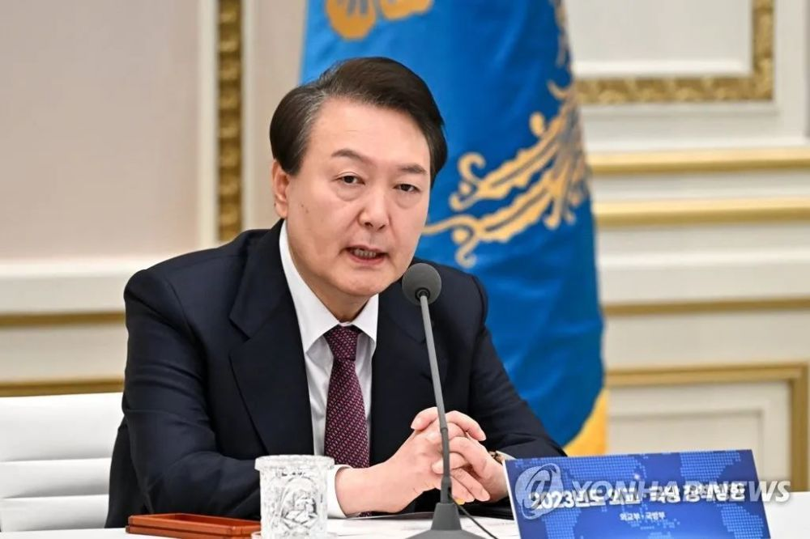
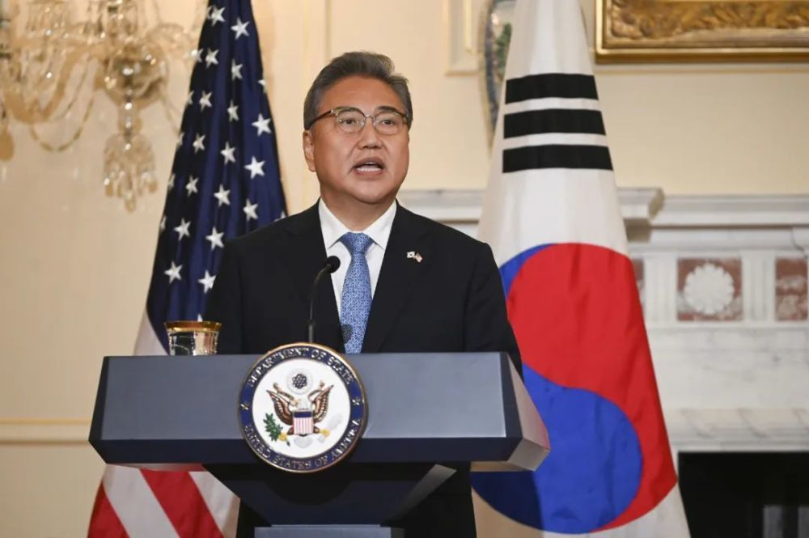

# 尹锡悦要求韩外交部：向中方充分说明立场

10日，中国驻韩国大使馆发布关于暂停签发韩国公民赴华短期签证的通知。据韩联社报道，韩国总统尹锡悦11日对此表示，韩国政府“基于科学依据制定防疫政策，相关措施旨在保护公民”，并要求韩外交部向中方充分说明韩方立场。

_尹锡悦11日听取韩外交部2023年工作汇报。图源：韩联社_

韩国外长朴振介绍，尹锡悦当天在听取韩外交部2023年工作汇报时，作出上述表述。朴振在会上向尹锡悦汇报称，“政府优先考虑国民生命安全而采取了防疫措施，相关措施建立在科学客观依据之上。”

_朴振 资料图_

中国发布新冠病毒感染“乙类乙管”总体方案和中外人员往来暂行措施之后，多国表态予以欢迎，但也有少数国家宣布对来自中国的旅客采取入境限制措施。其中，韩国是针对中国采取歧视性入境限制措施最严苛的国家之一。

1月2日，韩国政府暂停发放自中国公民赴韩短期签证，并且暂停了从中国起飞的航班增班计划，来自中国内地的航班只能从仁川机场入境。

韩国防疫部门5日起要求所有自华入境人员在登机前提供行前48小时内核酸检测阴性证明或行前24小时内医疗机构开具的抗原检测阴性证明。

另据中国网友近日曝光，入境韩国后在机场疑遭遇歧视性对待，下飞机后会收到一个黄色牌子，被要求挂在脖子上，然后被带去单独的区域做核酸。

10日，中国驻韩国大使馆发布关于暂停签发韩国公民赴华短期签证的通知：根据国内指示，自即日起，中国驻韩国使领馆暂停签发韩国公民赴华访问、商务、旅游、就医、过境以及一般私人事务类短期签证。上述措施将视韩国对华歧视性入境限制措施取消情况再作调整。

11日国家移民管理局网站发布公告，针对近期少数国家对中国公民实施歧视性入境限制措施，国家移民管理机构自即日起，对韩国、日本公民暂停签发口岸签证，暂停韩国、日本公民来华实行72/144小时过境免签政策。

外交部发言人汪文斌此前在回应相关问题时指出，我们再次呼吁相关国家从事实出发，科学适度制定防疫措施，不应借机搞政治操弄，不应有歧视性做法，不应影响国家间正常的人员交往和交流合作。

