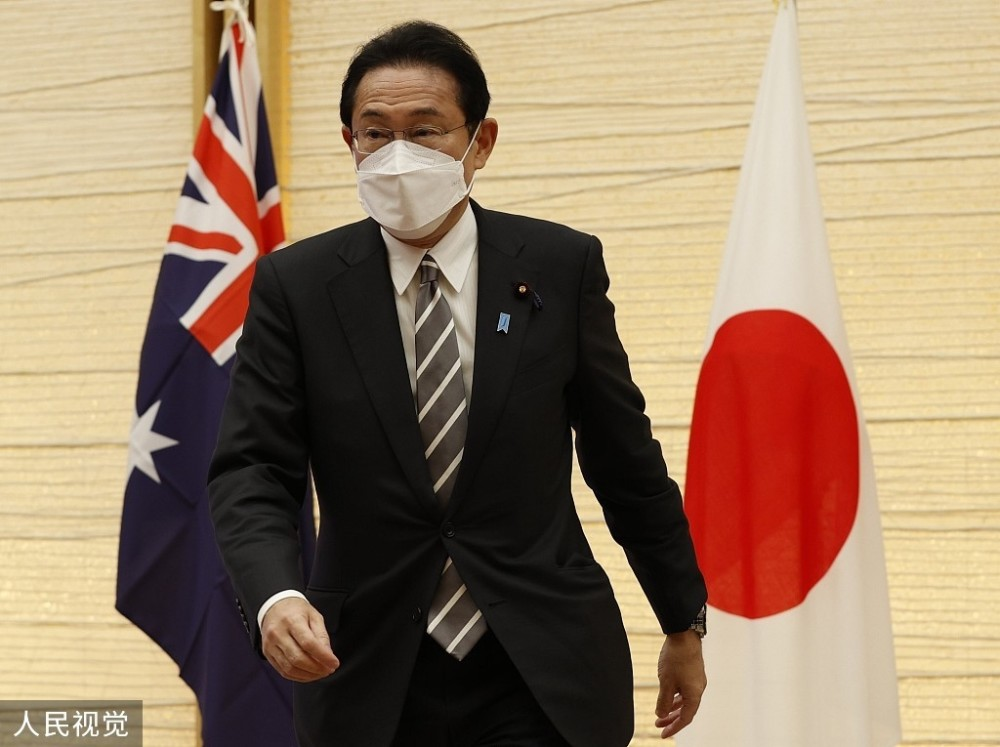

# 日英签新防务协议，瞄着中国？外交部回应

【环球时报驻意大利特派记者 谢亚宏 环球时报报道 记者郭媛丹
宋毅】日本首相岸田文雄与英国首相苏纳克于当地时间11日在伦敦塔举行会谈，期间双方签署一项新的防务协议——《互惠准入协定》（RAA）。11日接受《环球时报》记者采访的专家认为，日英签署RAA让美国最为满意，符合美国的利益。中国外交部发言人则对此回应称，有关国家开展防务合作不应将集团对抗的旧思维引入到亚太地区。

据日本时事通讯社11日报道，岸田文雄当地时间10日晚抵达伦敦，并于11日与苏纳克举行会谈。在会谈期间，两国政府签署RAA。报道称，这是继澳大利亚后，日本与第二个国家签署RAA。法新社援引英国政府的声明称，RAA是“英日之间一个多世纪以来最重要的协议”，将允许两国规划和开展更大规模、更复杂的军事演习，并允许双方相互部署军事力量。英国《金融时报》称，英日签署RAA之际，英国政府正寻求加强在亚太地区的参与，以抗衡中国的影响力。

11日，中国外交部发言人汪文斌在例行记者会上回应相关问题时表示，有关国家开展防务合作应当有利于增进各国间的相互理解、信任与合作，不应制造“假想敌”，更不应将集团对抗的旧思维引入到亚太地区。

此前一天，岸田文雄在罗马与意大利总理梅洛尼举行会谈。日本《朝日新闻》11日报道称，基于日本、意大利和英国正携手推进开发下一代战斗机，在会谈期间，岸田与梅洛尼一致同意将双边关系升级为“战略伙伴关系”。为进一步深化安保防务合作，双方就创设两国外交和防务部门负责人出席的安保政策磋商机制达成共识。意大利“今日网”表示，此次战斗机合作是二战结束后日本在没有美国参与条件下的首次国防工业重大国际合作，但即便如此美国背后的作用依然显著。报道也提到岸田此访意在拉拢反华阵线，但文中只引用了梅洛尼关于印太地区是一个“日益具有战略意义的区域”的说法，除此之外，意大利没有任何其他表态。

同样在10日，欧盟和北约签署俄乌冲突后首份安全合作联合宣言，并老调重弹，炒作“中国威胁论”，声称“中国给欧盟和北约带来需要应对的挑战”。对此，我驻欧盟使团发言人回应称，《欧盟—北约合作联合宣言》首次以官方文件形式表达双方对华共同立场，暴露出对华认知的偏见和傲慢。中方对《联合宣言》中的对华无理指责和冷战思维表示坚决反对。

军事专家宋忠平11日告诉《环球时报》记者，日本和英国作为美国两个重要的盟国，都想跟随美国的全球战略来实现自己的大国梦想。“尤其是日本把英国勾连到印太地区，更符合美国的利益；同时，日本也希望凭借英国的力量打开北约的军火市场，因此双方一拍即合。此外，日本和英国都把中俄视为威胁。此前，美英澳打造奥库斯（AUKUS）联盟，英国就是为了配合美国的‘印太战略’，插手中国周边事务。而日本一直不希望看到中国强大，更希望包括英国在内的北约国家东扩到中国家门口，来帮助自己遏制中国的发展，配合美国的‘印太战略’。”

宋忠平进一步表示：“欧盟和北约发表联合宣言，表示欧盟彻底放弃独立外交政策，把自身安全完全交给北约。这背后是美国的一手策划，‘阉割’了欧盟的独立自主性，让欧盟变成一个‘脑死亡’的国际组织。”

