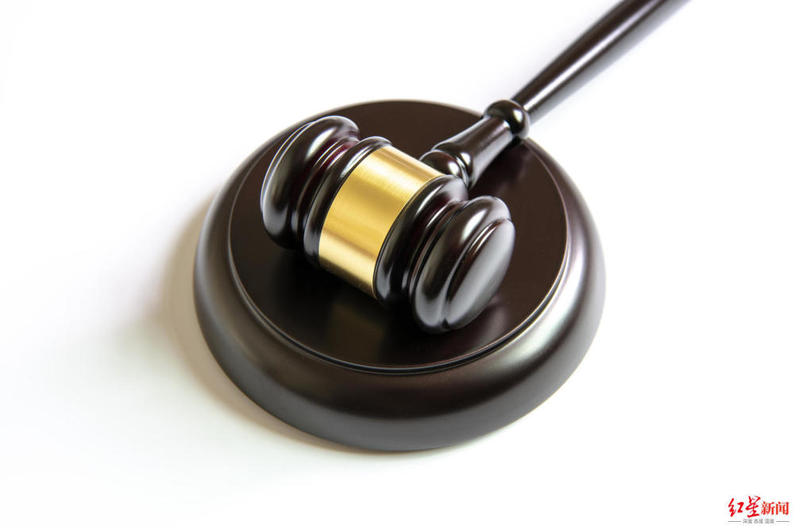
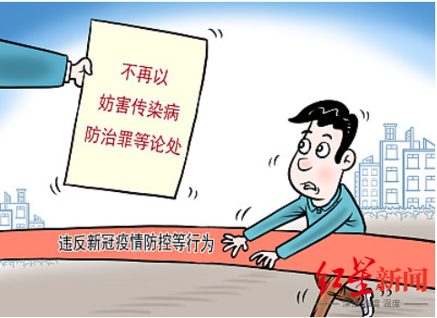

# 瞒报疫区行程被判刑4年，辽宁货车司机递交申诉材料 当地法院：已收到再审申请

辽宁省绥中县的韩成（化名）是一名大货车司机。2022年，他因犯妨害传染病防治罪而被判处有期徒刑四年。

2022年初，韩成从黑龙江绥芬河返回辽宁绥中县的家中后，绥芬河出现疫情，不久绥中县也出现疫情，韩成也感染新冠病毒。由于韩成未向当地有关部门报备行程，当地检察机关认为，韩成及其同伴造成绥中县范围内大量人员被感染，二人被判刑。

国家卫健委宣布自2023年1月8日对新型冠状病毒感染实施“乙类乙管”后，韩成好像看到了希望。2023年的第一个工作日，他就将申诉材料递交给绥中县法院，法院让其等电话。

1月7日，最高人民法院等多部门联合出台《关于适应新阶段疫情防控政策调整依法妥善办理相关刑事案件的通知》（以下简称《通知》）。《通知》明确，自2023年1月8日对新型冠状病毒感染实施“乙类乙管”、不再纳入检疫传染病管理之日起，对违反新型冠状病毒感染疫情预防、控制措施和国境卫生检疫规定的行为，不再以刑法第三百三十条妨害传染病防治罪、第三百三十二条妨害国境卫生检疫罪定罪处罚。目前正在办理的相关案件，依照我国刑法、刑事诉讼法相关规定，及时妥善处理。犯罪嫌疑人、被告人处于被羁押状态的，各办案机关应当依法及时解除羁押强制措施。

但有法律专家认为，如果在此以前法院已经作出了生效裁判，则不予改判。也有法律专家认为，对于判决、裁定已经生效的案件，根据不同案件的具体情况，当事人在申请减刑或假释时，《通知》或可成为法院酌情从宽的考虑因素。

绥中县法院工作人员告诉红星新闻记者，“他（韩成）提交的再审申请，我们已经收到了。”

_资料配图 据视觉中国_

**案情回顾：**

**从疫区返回17天后确诊**

**大货车司机未报备行程被判刑**

据韩成供述，2022年1月22日，他和妹夫贺某驾车从绥中县出发前往黑龙江省绥芬河市送货。卸货后，他们两人于1月25日回到绥中县的家中。到了27、28日，韩成在网上了解到绥芬河市暴发疫情，他认为应该没有什么事，也没有当回事，就没有向绥中县有关部门报备行程。

2022年2月2日，韩成因身体不适进行了核酸检测，结果为阴性。当晚，他前往妻子表弟王某家吃饭。2月8日，王某成为绥中县首例新冠肺炎阳性患者，随后，韩成和妻子也相继确诊。2022年4月，韩成因涉嫌妨害传染病防治罪被警方监视居住。

判决书显示，庭审上，韩成的辩护人称，韩成虽然实施了瞒报疫区行程的行为，但其瞒报是出于对绥中县防控措施不了解，主观故意不强。韩成经传唤到案后如实供述自己的罪行，应认定为自首，且其当庭认罪。韩成于2022年1月25日返回绥中县后，于2月2日曾自行进行核酸检测，结果为阴性，即使后来2月8日因疫情防控被隔离后也多次核酸检测结果为阴性，直到2月10日才检测出为阳性确诊。也就是说，韩成从绥芬河市疫区返回后经过17日才被确诊新冠肺炎，并不能合理排除他从疫区返回绥中县时并未感染新冠肺炎，不排除他返回绥中县后感染的可能，请求法院对他从轻处罚。

判决书还显示，法院审理查明，2022年1月22日，韩成和贺某驾驶大货车前往黑龙江省牡丹江市送货，1月25日返回绥中县。二人得知牡丹江市绥芬河市暴发疫情后，未履行疫情防控相关规定，未对去过牡丹江市绥芬河市的行程进行报备。后韩成和贺某均被确诊新型冠状病毒肺炎，造成绥中县范围内大量人员被感染。经绥中县新冠肺炎疫情防控指挥部统计，该县累计报告感染183人，隔离7865人。全县陆续划定34个风控区、管控区和重点防范区，启用隔离场所61家，使用隔离房间5224间，绥中县财政共支出各项疫情应急处置费用约1.55亿元。

绥中县法院认为，韩成和贺某违反传染病防治法的规定，拒绝执行县级以上人民政府、疾病预防控制机构依照传染病防治法提出的预防、控制措施，引起依法确定采取甲类传染病预防、控制措施的传染病传播，后果特别严重，其行为已构成妨害传染病防治罪，公诉机关指控罪名成立，予以支持。两人当庭认罪，从轻处罚。

2022年10月31日，绥中县法院一审宣判，韩成和贺某犯妨害传染病防治罪，两人均被判处有期徒刑四年。

_该案的判决书 图据受访者_

从2022年4月24日至今，韩成一直被监视居住，即使后面法院宣判，他也没有被收监。虽然没有在监狱，但他也不能再跑货车，失去了收入来源。

国家卫健委宣布自2023年1月8日对新型冠状病毒感染实施“乙类乙管”后，韩成似乎又看到了希望。1月9日，他告诉红星新闻记者，他在2023年的第一个工作日就向法院递交了申请再审材料。“交了材料后，法院就让在家等电话。”韩成说。

绥中县法院工作人员告诉红星新闻记者，“他（韩成）提交的再审申请，我们已经收到了”，但拒绝透露更多信息。

**专家观点：**

**《通知》或可成为法院酌情从宽，给予减刑、假释的考虑因素**

跳脱出个案，《通知》出台后，如何处理违反新型冠状病毒感染疫情预防、控制措施而被定罪或处于审理阶段的当事人成为公众关注的焦点。

对此，中国政法大学刑事司法学院副教授方鹏告诉红星新闻记者，《通知》中“正在处理的”案件，指尚未作出生效判决的案件，即正处于侦查、起诉、审理阶段的案件。根据《刑法》《刑事诉讼法》以及《通知》，这些刑事案件中犯罪嫌疑人、被告人，不再认定构成妨害传染病防治罪、妨害国境卫生检疫罪，应及时释放。

方鹏表示，应当明确：《通知》规定这些情况，不再认定构成妨害传染病防治罪、妨害国境卫生检疫罪，属于因法律变化而无罪。因此，无罪的情况，只能适用于在2023年1月8日之前，尚未作出生效判决的案件。

方鹏告诉记者，根据《刑事诉讼法》，我国刑事案件采用二审终审制，接到一审判决十日内，若被告人没有上诉、检察院没有抗诉，则判决生效；若被告人上诉，或检察院抗诉，则进入二审程序，二审判决、裁定在宣告当日立即生效。

判决、裁定生效之后，可以申请法院再审，进入审判监督程序。如果法院根据审判监督程序，对判决已经生效的案件进行再审，根据我国《刑法》《刑事诉讼法》的规定，应当适用实施该行为当时的法律。已经作出生效判决、正在服刑的人员，不能适用《通知》而认定无罪。

方鹏认为，在程序法上，服刑人员具有申诉权利。同时，对于判决、裁定已经生效的案件，根据不同案件的具体情况，当事人在申请减刑或假释时，《通知》或可成为法院酌情从宽的考虑因素。

_资料配图 据视觉中国_

据红星新闻此前报道，北大法学院教授陈永生指出，按照刑法法理以及立法规定，如果在2023年1月8日以前实施了妨害新冠疫情防控的行为，还未经审判，或审判未定（没有作出生效裁判），按照从旧兼从轻的刑法溯及力原则，不再认为构成犯罪。但是如果在此以前法院已经作出了生效裁判，则不予改判。

中国政法大学刑事司法学院教授、刑法学研究所所长罗翔在公众号《罗翔说刑法》中撰文指出，韩成及贺某涉及的法律问题是既判力和溯及力的关系问题。所谓既判力就是已经发生法律效力的判决。对行为人有利的新法是否可以溯及已经生效的裁判。我国刑法采取既判力的效力高于溯及力，对行为人有利的法律不能溯及已经生效的裁决的立场。《刑法》第十二条规定：“本法施行以前，依照当时的法律已经作出的生效判决，继续有效。”同时，相关司法解释也规定：“按照审判监督程序重新审判的案件，适用行为时的法律。”

红星新闻记者 宋昕泽 蓝婧 实习记者 李雨果

责编 唐欢 编辑 何先锋

