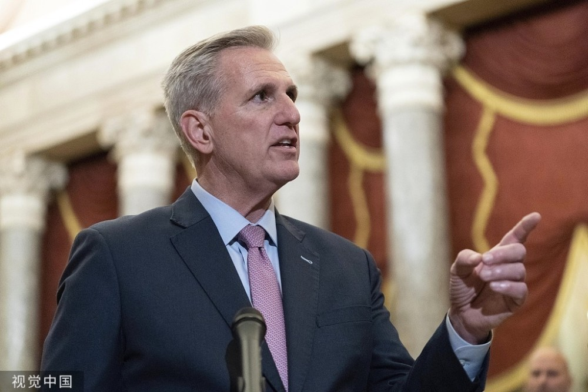

# 美国会成立“中美战略竞争特设委员会”，专家：实质伤害不大但信号负面

当地时间1月10日，美国国会众议院通过法案，成立“中美战略竞争特设委员会”，这是共和党籍新议长麦卡锡上台后实现的第一次两党合作案例，最终计票结果为365票赞成，65票反对，所有共和党议员和146名民主党议员都投了赞成票。

清华大学战略与安全研究中心助理研究员、美欧研究项目负责人孙成昊向澎湃新闻（www.thepaper.cn）表示，“中美战略竞争特设委员会”是调查性的，对中国的实质性伤害不大，但该行为释放的信号不利于全球疫情后复苏。本身新冠疫情就是一个全球性挑战，美方在这种背景下，缺失了和中国在疫情方面的合作。

_麦卡锡。视觉中国 图_

“疫情之后，全球的焦点应该是如何更好地去恢复后疫情时代的全球经济，包括向发展中国家或者其他一些经济不太好的国家提供些帮助，这些帮助可以体现在疫苗、药品和经济层面。但目前美国还是把中美关系定义为竞争关系，会向全球释放出一个非常不好的信号，大国竞争也会让很多第三方国家面临选边站队的问题。”孙成昊说道。

**民主党缘何支持？**

据美国消费者新闻与商业频道（CNBC）报道，“中美战略竞争特设委员会”将由16名成员组成，包括9名共和党人和7名民主党人，来自威斯康星州的共和党籍众议员迈克·加拉格（Mike
Gallagher）将担任委员会主席，而他也是共和党核心小组在中国问题上的主要发言人。

虽然共和党人在美国第118届国会众议院占据多数席位，但两党的委员会分配情况仍不明确，目前尚不清楚哪些民主党人将加入该委员会。

值得注意的是，根据创建“中美战略竞争特设委员会”的决议，该委员会的权力主要是调查性的，而不是立法性的。该委员会还将被赋予就其调查传唤证人和举行公开听证会的管辖权。

加拉格于10日在众议院发表讲话时引用了美国国务卿布林肯的话，暗示了委员会中将实行的两党合作方式，“正如国务卿布林肯去年所说，中国是唯一有意重塑国际秩序的国家，并且越来越多地拥有这样做（重塑国际秩序）所需的经济、外交、军事和技术力量。”

加拉格宣称，该委员会将“揭露”中方正在“以协调一致的全社会战略破坏美国领导地位和主权”，委员会将在两党基础上与司法委员会合作，研究“早就应该采取的常识性方法”来对抗“侵略”。他认为共和党人和民主党人需要共同努力，并强调这是他们取得“长期成功”的唯一途径。

在加拉格的发言后，来自马塞诸塞州的民主党籍众议员吉姆·麦戈文（Jim
McGovern）表示，他将投票支持成立该新委员会，以示民主党的诚意。在10日下午的投票中，另外145名民主党议员也投出赞成票，支持成立该委员会。

对于美国众议院以压倒性的多数票通过了成立一个中国特别委员会的决议，并将制定全面策略来应对“中国不断增长的经济和战略力量”。中国外交部发言人汪文斌1月11日在外交部例行记者会上指出，我们希望美方有关人士客观、理性看待中国和中美关系，从美国自身利益和中美共同利益出发，同中方相向而行，推动发展相互尊重、和平共处、合作共赢的中美关系。

**麦卡锡的承诺**

报道称，在美国国会众议院投票成立新委员会时，最受瞩目的是聚光灯下的麦卡锡，作为饱受争议的新议长，他承诺“中美战略竞争特设委员会”将认真对待并真正实现两党合作，而不仅仅停留在作秀层面。

“我们需要严肃的立法者。”麦卡锡说，“这不是为了让某一个人进入人们的视野来表达某些观点，而是作为一个国会共同努力，应对我们未来面临的最大挑战之一。”他承诺，新委员会将不会是一个党派化的委员会。

CNBC报道称，值得注意的是，“中美战略竞争特设委员会”的成立凸显了中美问题将美国所有政治派别的立法者聚集在一起的罕见能力，而这也会在2024年总统竞选期间发挥相似的作用。

孙成昊也称，在美国国内议程上，由于共和党和民主党正处于一个分道扬镳的状态，尤其是随着2024年大选的临近，互相之间做出重大妥协的可能性下降。“共和党不愿意让民主党取得很好的成绩，民主党也不愿意让共和党主导国会的议程，所以他们就转向了一些有共识的领域，涉华议题可能是两党之间更有可能达成一个共识的点。”

