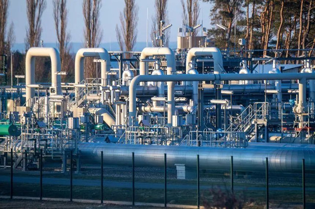

# 美欧制裁对俄去年经济影响如何？俄亿万富豪资产集体缩水

2022年2月底的俄乌冲突爆发已过去10个月有余，美欧也在此期间对俄祭出多达九轮制裁。这些制裁对俄经济影响到底如何？

据俄媒报道，1月11日，俄罗斯经济发展部给出的数据显示，2022年俄罗斯的通货膨胀率为11.9%，低于此前14%的预期。俄经济发展部预计，俄今年第一季度的通胀将会下降，第二季度预计低于4%的目标。

据央视新闻报道，俄罗斯第一副总理别洛乌索夫此前表示，俄罗斯政府各经济主管部门在2022年成功保证了俄经济可控，遏制了国内失业率上升趋势，并避免了粮食出口的下降。但是，他强调，2023年俄在财政和预算领域仍将艰难。

对于俄去年经济的总体运行情况，俄总统普京在去年12月公开进行了评估。当时，他认为2022年俄罗斯经济出现负增长已成定局，预计降幅为2.9%。

**俄富豪财富集体缩水**

除了通胀数据，最新出炉的数据显示，2022年俄财政收入约28万亿卢布，财政预算赤字为3.3万亿卢布，占国内生产总值（GDP）的2.3%。其中，财政收入比当初预计高出2.8万亿卢布。俄财长西卢安诺夫表示，这主要得益于石油和天然气收入部分的增加。

目前，俄2022年GDP具体增减变化尚未出炉。根据联合国贸易和发展会议（UNCTAD）的预测，2022年，俄罗斯GDP将下滑7%；IMF的最新预测认为，2022年俄GDP预计将下滑3.4%，好于此前预测的萎缩6%；而世界银行则预测，俄去年GDP将下降
4.5%。

除了俄宏观经济，美欧此次对俄施加的制裁还延伸至了诸多个人。据美媒报道，美欧针对俄个人的制裁，已导致俄国内富豪资产“严重”缩水。

美媒给出的数据显示，截至2022年12月，资产超过10亿美元的俄罗斯商人有68人，他们所有人的财富都在去年一年里有所减少，“制裁迫使许多亿万富豪为他们数十亿美元的资产纾困，而股市暴跌则降低了财富估值。”。

其中，财富缩水最严重的俄富豪为俄钢铁巨头北方钢铁公司董事长莫尔达绍夫（Alexey
Mordashov）。数据显示，他的财富在2022年蒸发了111亿美元，目前的身家仅为184亿美元。

紧随其后的是俄罗斯国内最大电商和快递业巨头野莓公司总经理塔巴卡尔丘克（Tatyana
Bakalchuk）。她的资产降至47亿美元，缩水一半多。已在去年10月放弃俄国籍的Tinkoff银行创始人京科夫（Oleg
Tinkov）透露，他在去年损失了59亿美元。截至去年底，他的资产为8.7亿美元。

此外，备受关注的前英国切尔西足球俱乐部老板阿布拉莫维奇也损失了约56亿美元，他目前的资产约为87亿美元。

受制裁影响的俄罗斯十大富豪还包括卢克石油公司前总裁阿列克佩罗夫（Vagit
Alekperov）等。而俄第二大天然气生产商诺瓦泰克公司CEO米赫尔松（Leonid
Mikhelson）则受影响相对较小，财富缩水33亿美元至244亿美元。

**2023年石油禁运影响将受关注**

对于今年的经济形势，别洛乌索夫表示，今年俄经济面临的挑战包括可能的资本外流、居民实际工资增长仍然缓慢、银行贷款存在问题等。但他强调，俄政府认为没有必要实施“动员经济”，政府依旧有足够的储备和杠杆手段来解决面临的问题。

在一系列影响俄经济发展的外部因素中，联合国贸发会议认为，由于欧美对俄罗斯的石油禁运于去年12月刚刚生效，且后续制裁将于今年2月初再生效，这一制裁最终导致俄预算收入削减多少将在今年具体显现。

俄2023~2025年的预算草案显示，2023年俄罗斯联邦税收预计为26.13万亿卢布，比2022年减少1.56万亿卢布；支出将增加490亿卢布，达到29.05万亿卢布。在29.05万亿卢布的支出中，约三分之一将用于与俄乌冲突相关的国家安全领域。其中，国防支出将增加到4.9万亿卢布，比2022年增加43%；安全支出将花费4.42万亿卢布，比2022年增加1.5倍。而国民经济领域的支出约为3.51万亿卢布，比2022年下降20%。从分类上看，几乎所有重要的俄经济发展项目都将受到明显的影响。

对此，兰州大学政治与国际关系学院副教授韦进深告诉第一财经，这表明俄罗斯对俄乌冲突的长期化有充分的心理预期，并在财政支出上做了充分准备，“受俄乌冲突和美西方制裁的影响，今明两年俄罗斯经济持续萎缩是大概率事件，尤其是当更多的财政收入向满足俄罗斯军队和军事装备产能的需要倾斜时，俄罗斯财政投向经济和社会领域的比例下降，其影响将是长期性的。”

