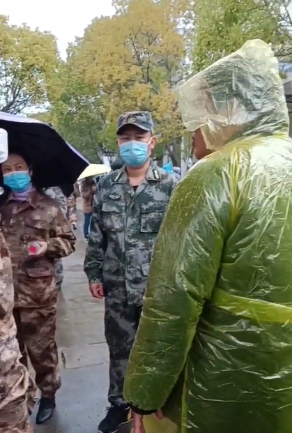

# 胡鑫宇失踪事件最新进展：每天上千人冒雨上山拉网式搜寻

江西铅山高中生胡鑫宇失踪事件一直引发社会关注。

​昨天有消息称：铅山县现在每天有数千人都在寻找失踪的胡鑫宇。

多条网上视频显示，现场搜寻队伍规模庞大，有警察、有穿迷彩服的人员，也有普通群众。天下着雨，参与搜寻的人黑压压一片集合，很多人打着雨伞，拿着镰刀、木棍和手杖。

“胡鑫宇失踪”，目前是铅山乃至上饶人交流频率最高的话题。

远在铅山县城20多公里以外的永平镇，是生养了小胡15年的家乡。2022年11月23日，橙柿互动曾经来到了小胡的家，造访了他的乡亲们。

昨天下午，胡鑫宇家属向记者证实，“这次搜寻规模蛮大的，是从前天（元月9日）开始的，主要由当地警方组织的。”

记者了解到，大规模搜寻，是从1月9日开始的，其中一个搜寻集结地，是在永平镇火车站。

永平镇政府工作人员告诉记者，“这三天我们干部都加入寻找了，还有群众。至于搜救的进展，我在办公室负责联络，具体不是很清楚。”

**1月7日，江西省、市、县公安机关联合工作专班发布通报称——**

胡某宇失踪事件引起社会关注。公安机关高度重视，成立省市县联合工作专班，在上级机关的指导和兄弟省份公安机关的支持下，全力以赴开展调查搜寻。经全面细致调查，目前未发现胡某宇被侵害的违法犯罪事实，依据《中华人民共和国刑事诉讼法》等法律规定，未立为刑事案件。公安机关将继续全力查找胡某宇。

（来源：都市快报）

