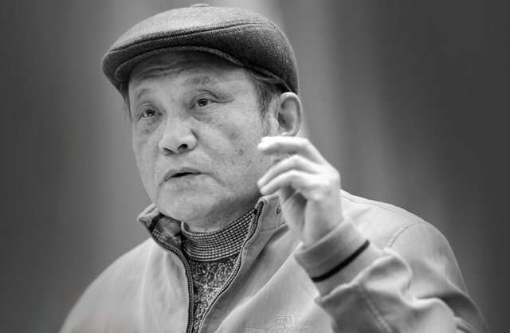
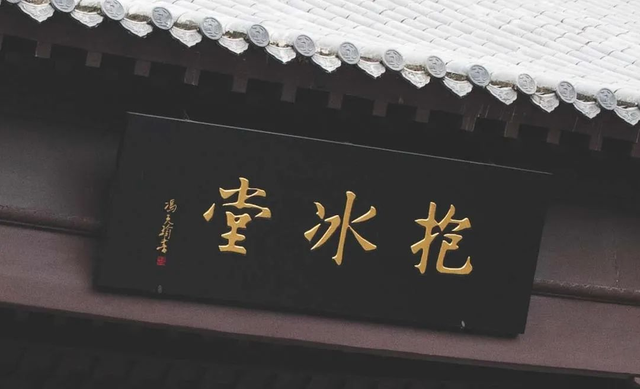
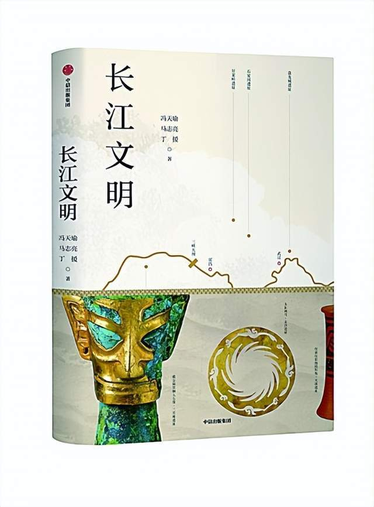
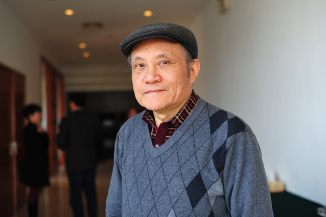
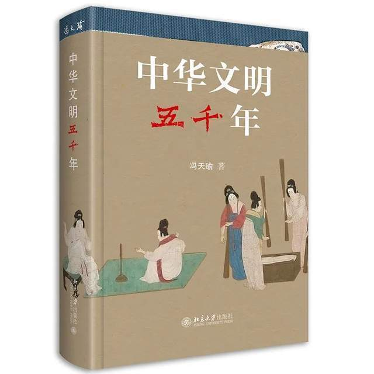

# 著名历史文化学家冯天瑜逝世，享年80岁

记者从武汉大学获悉，著名历史文化学家、武汉大学人文社科资深教授冯天瑜因病医治无效，于12日上午在武汉去世，享年80岁。

冯天瑜出生于1942年，湖北红安人。武汉大学人文社科资深教授，长期从事中国文化史及湖北地方史研究。主要著作有《中华文化史》《中华元典精神》《中国文化生成史》《明清文化史札记》《解构专制——明末清初“新民本”思想研究》《张之洞评传》《新语探源》《“封建”考论》等。荣膺“国家有突出贡献的中青年专家”“荆楚社科名家”。2021年，冯天瑜被授予“湖北省杰出人才奖”，这是湖北省最高人才荣誉奖项。

**倾注大量心血研究张之洞**

冯天瑜出身书香之家，父亲冯永轩是史学教授，早年就读武昌高师（武汉大学前身），从学著名语言文字学家黄侃，后入清华大学国学研究院第一期，师从梁启超、王国维。从小的家庭文化环境，让冯天瑜较早接触到历史文物，深受史学熏陶。

冯天瑜自幼酷爱文史。小学三年级至高中期间，他随母亲住在湖北省图书馆。省图“住读八年”，博览中外名著，是一段美好的阅读时光。高中毕业前，冯天瑜报考了生物学，在“多识鸟兽草木之名”的同时，冯天瑜依然利用业余时间勤奋写作，钻研国学。

走入文化史研究的学术人生，用冯天瑜自己的话说是“蓄之久远，发于天然”。20世纪70年代后期，他遇到一次选择专业的机会，调到湖北大学历史系。“我30多岁才初入学术门墙，即深感理论思维紧要。读了一些思想史名著，渐渐被《读通鉴论》《明夷待访录》《历史哲学》所吸引。从年轻时一直到现在还经常读。”冯天瑜说，《明夷待访录》的“新民本”观，成为他追考中国思想史的指针；他曾反复精读《历史哲学》，深受其整体史观、辩证史观的启迪。这3本书成为冯天瑜的“看家书”，既“观其大略”，获得关于文化学的理论架构；又采取“多遍读经典、每遍攻克一主题”之法，熟悉其精义。

出生于湖北红安的冯天瑜，长期从事中国文化史和湖北地方文化史的研究，挖掘其中的湖北精神。

作为湖北籍学者，冯天瑜十分注重在文化研究中彰显地域性，数十年来，他致力于辛亥武昌首义史和张之洞研究。上世纪80年代初，冯天瑜与贺觉非合著《辛亥武昌首义史》。冯天瑜对于史籍记述分歧、学界争论不休的重要史事，逐一爬梳，重新考证，提出了诸多有别习惯说法的新结论。而且，他以自己独特的视角和理解，探讨了辛亥首义发生、发展的历史必然性与或然性。

冯天瑜著有《张之洞评传》。在张之洞博物馆原馆长顾必阶的心中，冯天瑜是很好的导师，也是很好的朋友。顾必阶说，冯天瑜长期研究张之洞，写了多部著作，他一直关心张之洞博物馆的创办和建设，组织和参加了多场学习会、交流会和座谈会，也欣然接受邀请为老馆和新馆的前言作序。“为了保护好张之洞这张城市名片，保护武汉的工业遗产，延续城市文化，冯先生倾注了大量心血。”

为纪念张之洞，武昌蛇山南腰建造了抱冰堂，张之洞晚年以“抱冰老人”自号，“抱冰堂”由此而得名。目前，抱冰堂中常设“张之洞与武汉早期现代化”展览，其“抱冰堂”三字匾额，由冯天瑜先生题写。

**力主建设长江国家文化公园**

“长江流域人文兴盛，大江东去，浪淘尽，千古风流人物，当下正在创造更加壮阔的现代文明。试看今日之环球，长江正辉耀于东方。”冯天瑜在《长江礼赞》中说。

冯天瑜“以守护文化为职志”，笔耕不辍，潜心治学。他与弟子马志亮、丁援合著的新作《长江文明》，满怀家国情怀与家乡情结，历经三年多的编写，于2021年9月正式出版，是武汉大学长江文明考古研究院又一重大科研成果。

“以湖北为基地之一，建设长江国家文化公园，内容最为丰富。”冯天瑜接受长江日报记者专访时表示湖北具有自然长江优势，湖北是长江径流里程最长的省份，汉江是长江最长的支流，水量巨大，流经湖北省江汉平原，平穿“鱼米之乡”湖北纵横交错的山地、丘陵，于武汉汇入长江。

“湖北是汉文化重要发祥地之一。”冯天瑜尤其看重楚文化中的庄子散文和屈原诗歌，他们基本都是从湖北衍生。

冯天瑜介绍，近代以来，面对
“数千年未有之大变局”，长江担当起中国工业文明的先导、改革开放的先锋。张之洞三度出任湖广总督，在湖北推行“新政”，拉开了武汉近代工业建设的序幕。1911年10月，辛亥革命爆发，最终在长江中游的武汉三镇结出了革命的果实。

“湖北的发展潜力是巨大的。”冯天瑜认为，长江国家文化公园以湖北为基地之一，内容丰富——三峡工程建在湖北的西部，南水北调以汉水中上游为出发点，传输到北方，体现出湖北的重要作用。湖北的工业、科技、教育发展，自近现代以来，也是走在前列。

湖北作为长江径流里程最长的省份，在中华文明进程中，始终是“为国家、民族兴衰的一大关枢之地”，这是冯天瑜对湖北在长江文化中地位的总体评价。

谈到武汉，冯天瑜认为，在21世纪中华文化阔步走向世界舞台的进程中，今天的武汉应该有充分自信：“武汉形势之优，得滔滔万里的扬子江之赐，古人识此，今人更当举起‘长江文明’旗帜，以之聚集力量，引领潮头。以‘缔造从江汉起’的气派，做‘江汉朝宗’文章，建设活力大武汉，正逢其时，而又时不我待！”

**守望中华文化的灿烂星空**

几十年如一日的勤奋钻研，以学术为生命的执着探求。他提出的“中华元典精神”是对中国历史研究的重大贡献。他写作的《中华文化史》《中国文化生成史》以独特的视角，揭示了中华文化生成和发展的历程，构建了中国文化史整体架构，被誉为“新中国文化史研究的扛鼎之作”。

冯天瑜认为，中华文化是全球第一代原生文化里非常少见的没有中绝而且至今还充满活力的文化。“我觉得就它本身的精神而言，有两层精义最重要，一个是自强不息，永远奋力前行；一个是厚德载物，包容万象，异文化（如古之佛学，今之西学）来了之后，虽然也发生冲突，但中华文化能够接纳消化，以壮大自身，这是它能长期延续的原因。”

2022年，冯天瑜的著作《中华文明五千年》出版，在导言中，提出“文明”的定义，并阐明该著探究的文明涉及器用、制度、行为、观念诸层面，重点在观念层面；奠定了关于中华文明史的本体论基础，确立了研究中华文明宏观尺度，向读者展示了一幅从“人猿揖别”到“五四”新文化运动的恢宏画卷，其中对中华文明生成机制的论述，尤其发人深省。

来源 长江日报

编辑 赵司尧

流程编辑 严圣淼

