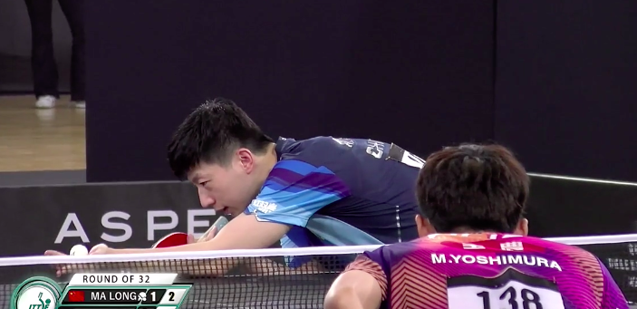
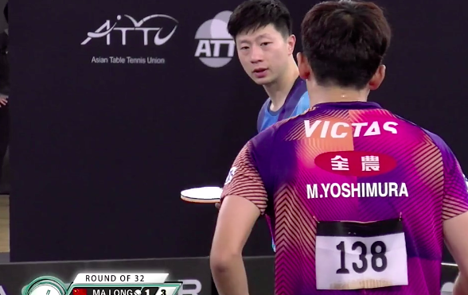
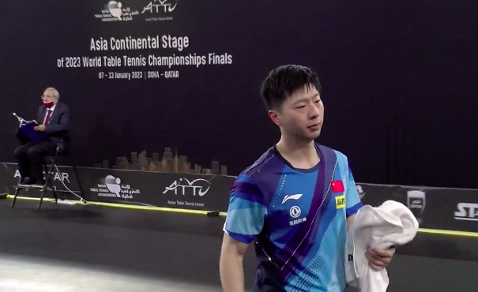
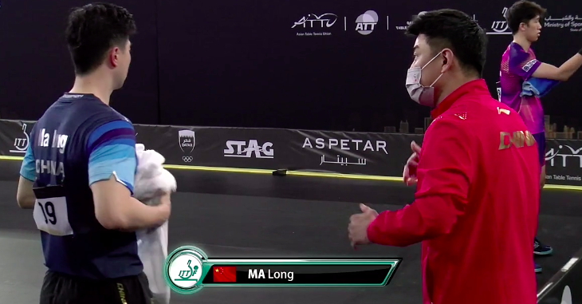
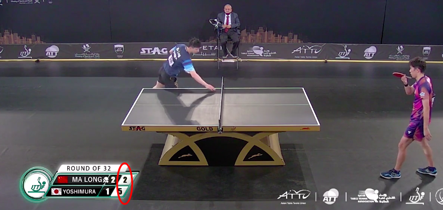
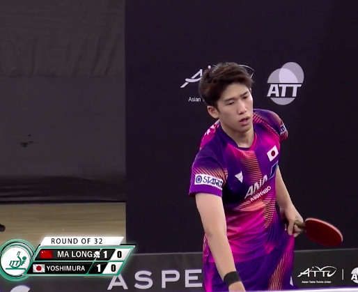

# 超级大冷！世预赛马龙3-4不敌日本世界第128 决胜局崩盘王皓束手无策

北京时间1月10日，德班世乒赛亚洲区预选赛继续进行，男单32强的比赛，马龙对决日本的吉村真晴。最终，马龙苦战7局，3-4惨遭逆转，恐无缘世乒赛。接下来，马龙要打排位赛去争夺剩下的门票。

在最新一期的世界排名中，马龙重新上升到世界第二位。吉村真晴目前排名世界第128位，不过，这并不是他真实实力的体现，事实上，现在的他大有成为日本二号男单的趋势。

一上来，吉村真晴4-2领先，之后，马龙逐渐适应了对手的发球，11-8顺利拿下了第一局。第二局，马龙在开局3-1领先的情况下，被对手10-7，率先拿到了局点。此后，吉村真晴11-8，扳回一局。

马龙场边的指导教练是新任男单主帅王皓，第三局双方又陷入苦战，打到了9平，11平之后，马龙连得2分，13-11拿下这一局。

第四局出现了尴尬一幕，转播方打错了比分，马龙和吉村真晴的比分反了，领先一方的马龙反而落后了，不过，吉村真晴追到了8平。并且，他11-9逆转拿下。

第五局，马龙开局7-3领先，吉村真晴连得2分，逼迫马龙暂停。暂停回来，双方又打到9平。好在，马龙11-9，拿下了这一局。

双方进入决胜局，一上来，吉村真晴6-2领先。此后，他11-3，完成爆冷。

