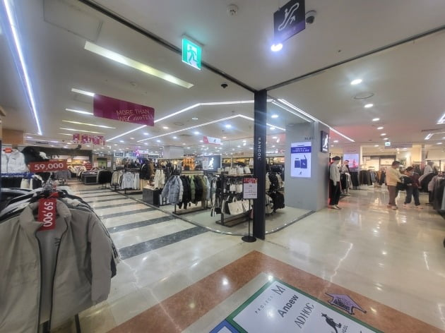
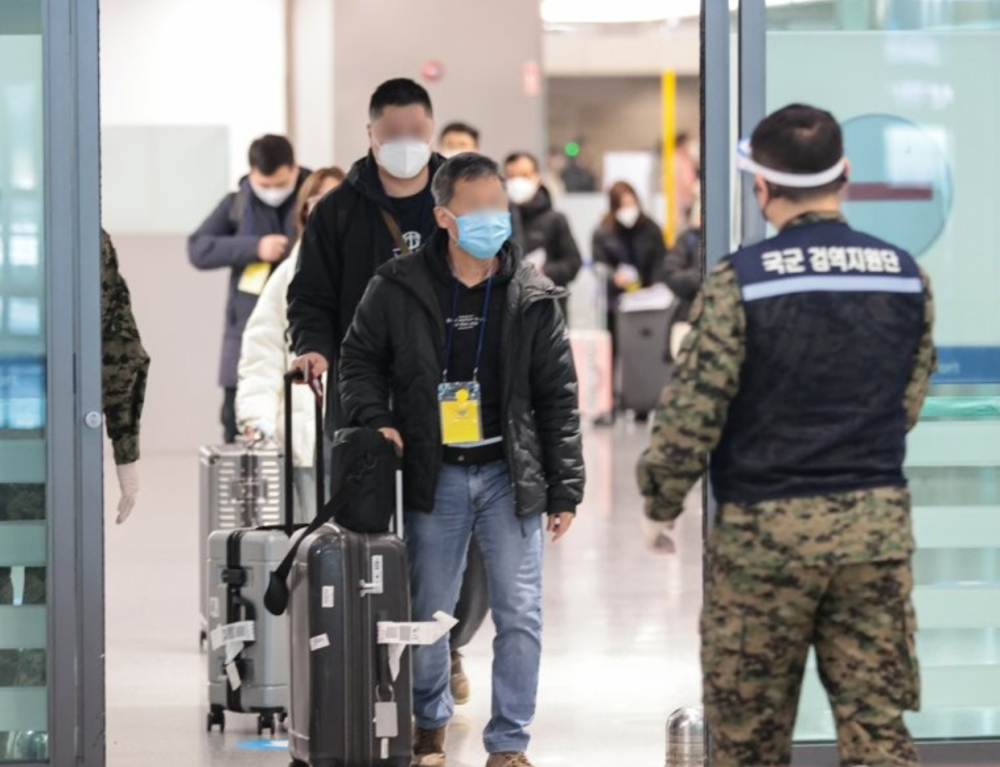

# 韩媒：“中国游客不来，韩国商家认栽”，首尔一大型奥莱将于9月停业

【环球网报道 记者
付嘉骏】“中国游客不来，韩国商家认栽。”《韩国经济》11日以此为题报道称，位于首尔市区的大型奥特莱斯商场“W购物中心”将于今年9月关门停业。该商场近两年受疫情影响，失去了作为“消费主力”的中国游客，导致经营不善，难以为继，最终宣布倒闭。

据报道，本月11日，“W购物中心”方面表示，商场将于今年9月结束营业，此前已于去年5月向房地产开发商签订出售地皮合同，出售价格达1600亿韩元。《韩国经济》介绍称，“W购物中心”是位于首尔加山洞“奥莱集散地”罗德奥街的代表性奥特莱斯商场，商场占地3.3万平方米，卖场内部为地上10层，地下4层，营业至今已有27年历史。但近几年受新冠疫情影响，商场销售业绩严重下滑，经营状况日益堪忧，其中主要原因是失去来自中国的消费者。

报道称，在经济不景气、消费停滞的大环境下，奥特莱斯商场通常是韩国流通业界实现持续增长的重要渠道。但2020年新冠疫情在全球大流行以来，韩国奥莱的销售业绩也开始逐年下滑。“W购物中心”位于首尔加山洞一带，2020年以前，中国团体观光客的住所常被安排在这一区域，同时还有很多中国“自由行”游客和“代购”前来消费。据统计，此前中国游客的消费在该地区奥莱商场销售份额中占比高达30%至40%。但疫情蔓延后，中国消费者的身影不见了，加山洞地区的奥特莱斯商场开始乱了阵脚。

一名业内人士告诉《韩国经济》，“疫情以前，无论平日还是周末，总有很多中国游客提着大包小包，甚至是拉着拉杆箱前来购物，但近几年这样的情况很难再看到”，“以前商场的VIP顾客中，有很大一部分是中国‘代购’，但现在他们在整体销售份额中的所占比重大幅下降”。

据此前报道，本月2日，韩国政府暂停发放自中国赴韩短期签证，并且暂停了从中国起飞的航班增班计划，同时要求来自中国内地的航班只能从仁川机场入境，并针对中国旅客采取歧视性入境限制。10日，中国驻韩国大使馆发布通知称，已暂停签发韩国公民赴华的部分短期签证，“上述措施将视韩国对华歧视性入境限制措施取消情况再作调整”。

随着目前中韩两国相互对对方国家公民暂停签发短期签证，韩国旅游业复苏被再次按下暂停键，预计各相关行业的企业经营活动将因此受到影响。对此，韩国国内的各大旅行社、航空公司、免税店零售业和化妆品公司等都对目前的情况感到忧心忡忡。韩国旅游业界普遍认为，若目前情况长期化，恐将影响相关行业的发展，企业和个人能做的部分十分有限，对此感到束手无策，希望韩国政府部门尽快出面解决。

