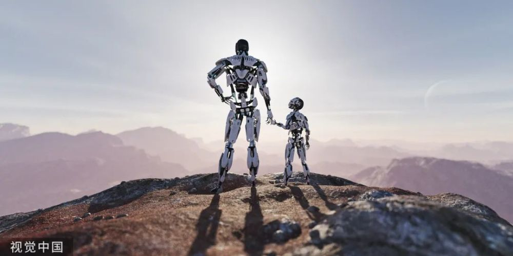

# 人形机器人有表情，会把人吓跑？科学家：还是有双足好｜创投变辩辨01期

_《创投变辩辨》是创投圈首档辩论类节目，创投大咖化身最佳辩手，在见招拆招间厘清科技圈最有争议的热门话题，带你一次看透科技前沿AB面。本期创投变辩辨由腾讯科技和昆仲资本联合出品，聚焦话题《人形机器人一定要有两条腿吗？》_

**作者丨狮刀**

**编辑丨周小燕**

**丨划重点**

  * _1_ 业内对人形机器人的侧重点分为“情感派”和“功能派”，前者认为与人产生情绪互动才是人形机器人的本质，不需要形体一定像人；后者认为具备如人类一样的劳动能力才是重点，做成双足才是真正的人形机器人。
  * _2_ 正方认为，双足人形机器人将会是机器人的终极形态，即机器人的物理构型不需要随着它要完成的任务而改变，它可以到达任何人能到达的地方，它有可能成为机器人界的iPhone；反方认为，人之所以是双足，因为人是进化的产物，用双足支撑是被迫的。两条腿能做的事，四条腿能都做，而且目前来看，四条腿都没必要，其实有轮子就能做。
  * _3_ 正方认为，机器人双足稳定行走控制确实比较难，但这两年整个领域发展速度飞快，双足稳定行走已经有较为成熟的方案，在技术上并非是无法解决的问题；反方认为，环境改造比双足机器人研发要简单得多。

**丨嘉宾介绍**

**主持人：** 昆仲资本创始管理合伙人 王钧

**正方：** 足式机器人国际知名学者，美国国家科学基金职业奖获得者，南方科技大学教授，深圳逐际动力首席科学家 张巍

**反方：** 全球科技创新产业专家、科技投资人，海银资本创始合伙人，全球企业增长咨询公司Frost & Sullivan中国区首席顾问 王煜全

**丨正文**

**【主持人王钧】**
今年可谓是人形机器人真正产业化的元年，且不说初创企业频繁融资，落地应用层出不穷，擎天柱的亮相也让人形机器人彻底出圈，连我儿子都在问我，爸爸，我可以买个机器人朋友吗？

但是产业圈也有另一个疑问： **人形机器人一定需要做成双足吗？**

实际上业内对“人形机器人”的侧重点分为“情感派”和“功能派”，前者认为与人产生情绪互动才是人形机器人的本质，不需要形体一定像人；后者认为具备如人类一样的劳动能力才是重点，做成双足才是真正的人形机器人。

那么，废话不多说，就让我们在接下来的辩论中，看看人形机器人一定需要有两条腿吗？

欢迎二位，接下来进入本期辩论。首先，请二位各用一分钟的时间进行立论。

**立论环节：人形机器人有双足，是趋势还是缺陷？**

**【正方张巍】**
我不算仿生派，我认为人形机器人可以不用长得像人，因为我们大多数人对机器人的期待并不是情感上的寄托，而是希望它能代替人来完成各种任务，所以人形机器人不一定要长得像人，但最好有类似人的运动方式，一定要有两条腿，这样才有可能最大化地完成各种复杂环境中本来需要人来完成的任务。

**我的核心观点有两点：**

**目前市面上的机器人主要在解决两类需求：**

第一类解决移动需求，让机器人能够从A到B去做一件事，包括无人车、送餐机器人等都主要是解决了移动需求；

第二类是解决操作需求，让机器人在从A到B的每个场景上进行操作，比如在移动的基础上加一个机械臂来完成更多的任务。

这两个部分概括了90%的机器人能力，因此，机器人有没有腿比它有没有表情更重要。

足式机器人能够弥补现有的轮式机器人不具备的地形适应能力，这对解决移动需求来讲是非常重要的。

人所处的环境大多数是针对人的形态建设或者改造的，双足的形态跟人最相似，跟大多数的环境的兼容性是最好的。无论是轮式机器人还是多足机器人，它们在很多地形和场景中无法高效通行，更谈不上为人类服务。

**双足人形机器人将会是机器人的终极形态，即机器人的物理构型不需要随着它要完成的任务而改变，它可以到达任何人能到达的地方，我认为它有可能成为机器人界的iPhone。**

90年代的时候很难想象我们现在已经离不开手机了。那个时候发信息有BP机，拍照有相机，打电话有座机，备忘录有纸和笔，但是你看，当iPhone4出现的时候，我们发现，它居然可以集所有功能于一体。人形机器人承载的使命也是如此，等到足够成熟和便宜以后，未来每个家庭都会有人形机器人。

**【反方王煜全】我认为人形机器人的设计本身就存在缺陷，**
人类是从四肢动物进化的产物，用双足支撑是被迫的，人的两个上肢需要被解放出来做更多的事情，只用两个下肢支撑行走给人类造成了很多困扰：运动速度不行、稳定程度一般。我们都知道，马拥有四条腿，它们可以站着睡着，但没听说过靠两条腿支撑的人类能站着睡着，因为两条腿的稳定性不够，生物进化只能如此。

**但机器人摆脱了传统的动物必须在原有基础上进化的特征，它可以凭空进化出新东西来。** MIT有一位知名教授Max
Tegmark，他曾提出一个理论叫做“生命3.0”，在未来人工智能生命形态中，没有任何运动场景只能由两足完成，很多场景用轮子即可完成。

**即便需要使用“足”，四足也比两足稳定性强，我也不认为有什么场景只有两足才能进得去、四足进不去的。**
比如我们家养了一条大型犬，它的体重和我女儿差不多大，它可以到达我们家任何地方。简而言之，如果我们把“足”定义成能够运送机器人到达所有人类能到达的地方，从而协助人类的话，没有一个地方只有两足能到、四足或六足到不了的。

我们不需要有进化以前的束缚，甚至说未来“足”可以被设计得如“万向轮”一样，关节可以自如调整方向、稳定性更高。

具体来说，我的核心观点分两部分。

**人之所以是双足，因为人是进化的产物，用双足支撑是被迫的。**

**目前从我看到的所有针对应用场景的项目来说，两条腿能做的事，四条腿能都做，而且目前来看，四条腿都没必要，其实有轮子就能做。**
双足的运动速度和稳定程度都比不上轮子或四足。

**辩论环节：做双足研发还是环境改造？**

**【主持人王钧】**
双方的观点都非常鲜明。张巍认为，人形机器人只有造出两条腿才有可能出现下一代iPhone级产品；王煜全认为，人形机器人造两条腿，不经济、成本高、也没必要。好，那我们接下来进入辩论环节。张巍，你先来说吧。

**【正方张巍】** 从刚才听下来，煜全总整体上支持人形机器人要有腿，但是反对两足，更青睐四足。我认为，双足和四足的地形适应能力差不多，主要区别在于两点：

**双足的环境适应能力更好，比如一些需要辗转腾挪、侧身的任务，双足的通过性和灵活性更强。**

**人形机器人不光要提供移动能力，它还有上身、还需要通过双臂操作代替人类完成劳动。**
而腿的结构对机器人双臂的操作非常重要，人形机器人可以通过弯曲、岔开腿等动作，动态调整身体的重心，以大大提升上身机械臂操作搬运物体的灵活度和负载能力。这样来看，双腿加双臂，是在我们生活的环境中完成移动操作任务的最佳选择。可以想象，如果用四足加双臂，或者轮式地盘加双臂完成类似操作，估计需要非常臃肿的物理结构。

针对煜全总说的“双足没有四足稳定”，双足稳定行走控制确实比较难，但这两年整个领域发展速度飞快，双足稳定行走已经有较为成熟的方案，在技术上并非是无法解决的问题。

**【反方王煜全】** 这两点我认为都值得商榷。

**据我所知双足在环境适应方面做得并不好，**
目前做的最好的双足机器人是波士顿动力的Atlas，但它距离成熟的商业化还差很远。我认为，两足机器人在展示上基本够用，但很难让它保证不摔倒或者摔倒的时候不造成伤害。比如做老年看护机器人或保护儿童的机器人，摔倒了可能会砸着他们。

张巍总提及两足机器人在有的场景需要侧着身，其实四足也能侧身，因为四足可以做成像万向轴一样，可以有多个自由度，而且可以旋转，所以四足机器人的通用性完全可以做得更高。

**有一些极少数场景，人类挤过去都很难，强制要求机器人跟着人挤过去也没有必要。**
如果一定要保证通用性像人一样好的话，现在路面上行驶的都应该是马而不是汽车，人改造环境形成了公路，大量汽车就可以在路面行驶。实际上，环境改造比双足机器人研发要简单得多，比如，亚马逊仓库的智能运输机器人已经应用得非常成熟了，我们完全可以把地面做得光滑、铺上导轨，让轮式机器人跑得飞快，而非把仓库放在一个凹凸不平的地面上。

**【正方张巍】**
我刚才说的双足机器人的稳定性控制有成熟方案，指的是在原理方面人类已经知道如何控制双足。当然，从原理和方法的成熟，到做出安全可靠的产品，确实需要时间迭代，随着特斯拉等大厂入局，这方面会快速推进。煜全总还提到，四足也可以做成万向轴，听起来像变形金刚，它的实现难度应该比双足还大。总之，我认为四足机器人要达到类似人的通过能力还是很有局限性的。

煜全总提到交通工具从马到车的演变很有启发性，我认为车和人形机器人的目的不一样：

**车是人的工具，不是为了代替人，人也不会和车比谁跑得快；**

**但人形机器人的目的就是代替人为人服务，所以人形机器人要深入融合到我们的生活中去。**

所以，相比较于为了适应机器而改造环境，我认为以人为本让机器人融入到我们的环境中来是更好的方案。

说到亚马逊，亚马逊在今年年初花1.5亿美金投了一家叫Agility
Robotics的公司，你知道这家公司是做什么的吗？它就是做双足机器人的。你知道亚马逊投资的理由是什么吗？就是因为亚马逊认可双足机器人，认为双足机器人能在人类日常生活中无缝共存。

**【反方王煜全】**
你说的这家公司我知道，但我问你，它真的被部署到亚马逊的仓储环境里了吗？在你看来，1.5亿美金是很多，但是对亚马逊来说，赚一个部署未来的好名声，那可真的很划算。但如果双足机器人真的是未来，为什么亚马逊还在改造它的仓库？而且不仅亚马逊，现在富士康、海康威视等等都在改造工厂去适应仓储机器人，因为这才是目前最经济、最实用的做法。

**【正方张巍】** 其实，仓储是一个特定的场景。如果亚马逊只是为了用在仓储，确实轮式就够了，四足都不需要。不管是Agility
Robotics还是马斯克的擎天柱，双足的重要性在于它的物理形态的通用性和与人类环境的兼容性，即，我们不需要改变机器人的构型或改变环境，就可以赋予这台机器人除了搬箱子以外的任务和功能，这会让双足机器人有极大的规模效应。马斯克不也说嘛，以后人形机器人的规模会大于电动车，所以他积极推动人形机器人的研发，并且可以快速实现量产。

**【反方王煜全】**
我觉得马斯克在这方面没有任何信誉，马斯克曾经还说到2020年，人们可以做火箭从洛杉矶到上海，全程只需要两个小时，现在我们都知道这有点扯了，马斯克说的话不能用来做凭据。

**【正方张巍】**
我还是很尊重马斯克的，我认为他非常有远见，他在很多事情上给了我们很深刻的启发，甚至在有些方面给人类带来了惊喜，所以他对人形机器人的判断还是很有参考价值的。

**【反方王煜全】**
我其实是尊重马斯克的，他的行动和管理能力、执行力绝对靠谱，但他做的很多预测不靠谱。此外，机器人的发展路径也值得商榷，你基本上找不到任何一个没有主打应用的产品，而是一堆应用组合起来形成一个产品的。所以，如果双足机器人不具备一个处处都适用的应用功能，靠一堆小的应用凑合起来形成一个足够大的市场，是不成立的。

**【正方张巍】关于这个本质上的区别是，我们只关注眼前的一步，还是关注趋势和终局。**
比如，iPhone的主打应用是打电话，还是微信、抖音或QQ音乐？在最早设计iPhone手机硬件的时候，这些都是不存在的，甚至按照当时的技术，很多功能都无法实现。

我认为，人形机器人就是机器人界的iPhone，它是一个终极的通用形态。比如，我们除了用亚马逊仓库的双足机器人搬箱子之外，还可以将较为成熟的工业视觉检测算法，直接下载到人形机器人上，让机器人做工业检测。再比如，等分拣操作的AI算法成熟后，我们也不需要额外部署机械臂做分拣了，直接由人形机器人完成。有这样的通用形态机器人之后，机器人的性价比会越来越高，等达到一个转折点的时候，就会迎来爆发性增长。

**【反方王煜全】我认为人形机器人还有一个更大的应用需求是脸，**
人脸是可以仿生的，当我和一个类似人脸的机器人脸互动的时候，效果一定比和一个冷冰冰的大盒子互动好。

**【正方张巍】**
从我目前的经验来看，我们谈及机器人，大部分时候还真不是人想和机器人做朋友，本质上人类还是希望机器人为我们服务。此外，我个人也觉得陪伴或者跟人成为朋友、交互是有巨大需求的，但我觉得这个跟机器人的属性没有强相关，它更多的是AI语音交互强关联。

**【反方王煜全】** 在人形机器人在应用上确实值得做更多讨论，我们投了Hanson
Robotics，就是著名的美女机器人Sophia，很多人以为它的作用只是陪伴，实际上它有一个特别大的市场，就是与客户互动。很多客户服务都是在线下进行的，我们认为这是一个巨大的市场，未来所有客服人员都可以被机器人替代掉。科技进入市场和社会是有一定规律的，我们基本上没有看到任何先例，说做了一个没有任何主打应用的通用型产品起来的，再通用的产品都有主打应用，帮助把产品扩散到人人都可用，然后才出现长尾，单靠长尾孵化不出一个应用来，这也是为什么我们认为，
**人脸客服机器人反倒是有市场的，因为它有一个巨大的主流应哟过——客户服务。**

**【正方张巍】** 您提到的客服应用场景我非常认可，但实现这个场景只需要有个电脑就够了，它本质上是AI.

**【反方王煜全】** 你要说让人有亲近感，光靠冷冰冰的铁肯定是不行的。有句话叫，人与人之间相处，最重要的是信任。
**如果你想要信任一个机器人，信任机器人能代替人，情感纽带很重要。**
我们做过很多实验，你会发现，你跟一堆铁是不会共情的，也不可能靠它解决什么情绪价值，有时候你会发现你对机器人更容易不耐烦和激发你的暴躁情绪。但这是因为机器没做出一样的表情来，机器做出一样表情，你觉得你跟机器可共情了，你的容忍度，你的耐心也会增加。如果你想说要让人更有亲近感，那么在我看来，这才是能真正代替人的机器人。

日本有一个学者提出来“恐怖谷”理论，你只模仿人脸但做不到表情互动，就会让别人觉得这不是个真的人脸，这个表情互动如果做不好，对方会觉得更像僵尸，还会把人吓跑，但如果跨过了恐怖谷，让人觉得和你互动的真的是个人，那这种互动需求就会大增。

（图片来源：维基百科）

**结论环节：机器人需要长成人的样子吗？**

**【主持人王钧】** 好了，刚才二位辩论的非常精彩，时间有限，我们把刚才聊的话题做个总结吧。张巍，你先来。

**【正方张巍】**
其实，总结来说，如果只是专注于某一类场景，那确实双足机器人不是最好的选择。但为什么我认为还是需要双足机器人呢？本质上是专机和通用的区别。

**专机指在固定的场景中代替人去完成相应工作的机器。**
但问题在于，很多应用情况没法对应一个场景，就设计一个具体的专机，也不可能为每一个场景都单独去改变周围的环境，这些应用都可以通过双足人形机器人来统一完成。

**整个机器人发展的趋势，本质上是从专机到逐渐通用的过程。**
比如大部分自动化生产线可以认为是机器人，但人们更多地是称其为自动化装置而不是机器人，因为单一性太强。但后来随着需求的增加，每生产一个东西就换一套设备成本太高，引进工业机器人和协作机器人就成了必然，机械臂能够满足更多柔性制造的操作需求。

但是机械臂只能在固定位置上部署，这还是满足不了某些需求，人们于是就研究在移动底盘上加机械臂，也就是现在的复合机器人，不光有操作能力，还能同时具备移动操作的能力，能够从A到B去完成一个任务。这就是逐渐提升通用性的过程。

简单来说，如果要解决某一个单一任务，这个答案大部分情况下不是足式机器人；如果要解决多个任务，并且任务足够丰富的话，那答案就是足式机器人。

通用性是足式机器人最大的优点，你不需要为任何楼梯或者任何场景专门设计一个专机去完成任务，足式机器人本身就能完成多个任务。当未来这样的任务足够多而且机器人成本又足够低时，那足式机器人就具有非常大的价值。

这种方式理论上可以以边际成本极小的方式覆盖极大数量的场景，包括很多小规模的“长尾场景”，而这些长尾场景在“专机”的框架下，就很难做到经济上的合理性。

我前面说了，iPhone不仅仅是一部手机,
更是一个通用的技术平台，这样面向任何一个场景的解决方案都可以视为这个技术平台上一个App。因此，只有通用人形机器人的形态才可以像手机一样成为“无缝融入”到我们生活场景中，达到超级渗透率。

物理能力上而言，人形双足能到任何人能到的地方，能做任何人能做的事，是通用的终极形态。对于任务，不需要改变机器人的物理形态，只需要增加软件功能（app），就可以以生态的方式完善人形机器人的能力。

当然，未来人形机器人要进入千家万户，可能要十年以上。但产业化和商业化并不需要足式机器人在实现超能之后才能开始，这个节点可能在未来两三年就可以实现，特斯拉的预测可能大家将信将疑，但我们根据自身的理解对这个方向以及它的商业化进程是非常笃定的。

大自然几百万年来告诉我们一个道理：如果技术真的能够成熟，我们发展的方向就应该是让四足站起来，让猿人直立行走。我就说到这里，谢谢！

**【反方王煜全】在我看来，未来机器人，可能就不是长成人的样子。**

这就相当于，我们是从鸟那学会了飞行，但是我们的这个飞机不是扑翼机，我们是固定翼。所以到最后你说我机器人是不是一定非得长得跟人一样，就得两条腿还得就这几个关节，我觉得并非如此。

从自由度上来讲，你看胳膊，你现在都是双臂机器人，你会发现这有一个很尴尬的事，特斯拉也好，小米也好，为了展现我的双臂机器人像人我这个双臂只能是像人手一样。但是，人手的自由度是相当有限的。机器人早就进化到6轴、8轴了，无数个自由度了，我们人手才几个自由度，我们人挠我们后背都挠不着，机器人为什么非要向前不能向后旋转，为什么不能多挠自己后背一下，为什么不能不是2关节还是3关节、4关节。

所以我的意思是，最后你说我们的腿是不是叫两足？可能它是三足行不行，或者说我是看似是足，但是我有3个关节，我有2个膝关节，行不行。

张巍总说的即使是机器人需要适应这个人的生存环境，是不是也非得要用一种人形机器人去一统天下呢？我觉得也未必，也完全可以用多种机器人去做。

机器人可以做的很贴近人的生存环境，但是适应人的生存环境会不会一定长得像人这就不一样了。张巍总的iPhone类比我也很赞同，但是iPhone并不像任何一款诺基亚手机。说不定未来有人就发明了一个新的东西，它长得不像人，但它更能适应人的生存环境。相当于说我们本来制造城市是为了人服务的，最后你发现说其实蟑螂最适应城市下水道环境。所以你这个推理的严谨性上会有问题。

所以总结来说，在相当长时间内，针对特定的、有足够大规模的应用场景来优化的专用技术方案，可能是更合理和更可行的。

**其次，针对专机的使用场景对环境做一定程度的改造是完全合理的，不一定要迁就人的形态。**

**第三，即使长远看我们要做一个通用的机型，那就满足移动的目的而言，双足是否是最合理的？**
这个需要在理论上严格的论证，应该先抽象出来我们核心的需求是什么，再去设计技术上最合理的方案，这个方案并不排除后来发现双腿是最合理的方案，但是也完全有可能是我们目前这个世界上并不存在的，我更愿意押注一个超出我想象力的形态。

**最后，人的形态的进化在我们关心的时间尺度内是可以忽略的，但是我们可以利用技术进步来摆脱生理学上的进化节奏。**
因此我们人都是可以改变自身的，所以更没有必要去迁就人本身的形态。

所以，“仿生”的路并不是技术进步的主流，直接模仿人的双腿并不符合技术发展的主流范式。谢谢

**结语**

从两位的辩论中我看出来了，
**王煜全是表情派，张巍是双足派，对于王煜全这样的投资人来说，他天然是谨慎和挑剔的，对于张巍这样的创业者来说，他天然是乐观的。**
这可能是他们立场不一样的最核心的原因。

足式机器人，尤其是双足机器人其实是一件难而伟大的一件事。难是因为相比现有成熟应用的机器人，足式机器人的软硬件不仅需要巨大的创新才能实现功能，而且还需要把成本做到尽可能低；但伟大是因为它的应用广度和对人类社会的影响具有极大的颠覆性。也许未来机器人的形态并非足式，但是研究足式的过程，也将对未来做出巨大的技术储备。

现在圈子里有句话叫，人形机器人，过去看欧美，现在看中国。我们作为投资人，愿意陪科学家走这未来的十年，我们不期待能够立刻产生价值，但是如果科幻小说真的能成为现实，我们不想错过那一天。

其实，对于任何一门新的技术形态，人们经常会产生截然不同的观点，每个观点都值得被呈现，不同的观点汇聚才能更接近事物原貌。而用辩论的形式则是达成这个目的的最有效的手段，这就是我们举办这个节目的初衷。

感谢观看本期辩论，《创投变辩辨》是创投圈首档辩论类节目，本期由腾讯科技和昆仲资本联合出品，针对科技行业有争议的热门话题，邀请业内人士用犀利的语言各抒己见，共同在辩论中获取知识，我们下期再会！

