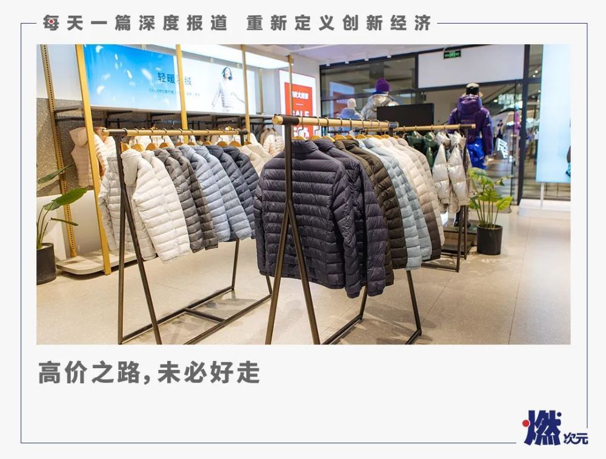
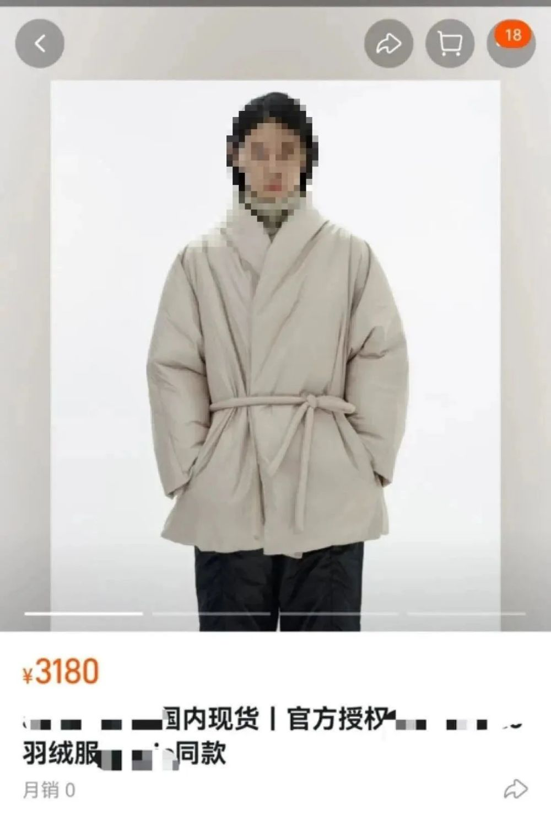
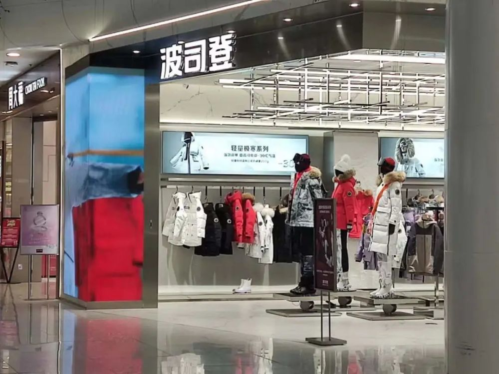
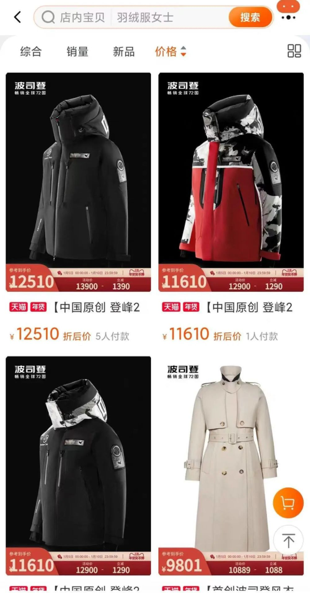

# 价格过万，年轻人失去“羽绒服自由”

燃次元（ID:chaintruth）原创

作者 | 张 琳

编辑 | 曹 杨

一个月工资，买不起一件羽绒服？

近日，国产羽绒服品牌波司登因“使用了‘航空材料技术’的高科技奢侈羽绒服，标价超过一万元”，而引发网友热议。网友纷纷表示“波司登已经不是当年的波司登了”“谁会为万元一件的波司登羽绒服买单”等。

随着网络舆论的热度持续上升，其使用的所谓的“航空材料技术”被进一步“深扒”。其中，便有相关纺织专家指出，“该技术业内使用已十分普遍，且价格低廉”，网友更是质疑其打着“黑科技”的幌子来包装产品，实则是盲目定价。

对此，波司登方面在接受媒体采访时回应，“对波司登来说，产品价格的提升不是单纯地依靠羽绒服面料以及人工成本等直接成本的上升，就定价高。而是建立在产品本身设计研发升级、科技功能升级、产品品质升级、品牌价值提升等综合因素叠加基础上的。”

事实上，这并不是波司登第一次推出万元羽绒服。

2017年，多元化转型折戟后，波司登砍掉大部分非羽绒服品类，以羽绒服业务撬开了高端化的大门。并凭借亮相时装周、找明星代言、与知名设计师合作、IP联名和多渠道布局等方式重塑了品牌形象。一举撕下了“中老年品牌”的标签，摇身一变成为了“高端时尚”的代名词。2019年，波司登推出“登峰系列”羽绒服，并成功跻身羽绒服万元级别行列。

随着价格的不断飙升，波司登的毛利率也在不断上涨。国盛证券统计，2022财年，在线上的销售中，波司登有46.9%的产品定价达到1800元以上，毛利率也顺势提高到60.1%，创历史新高。

然而，在国产羽绒服品牌中，波司登或只是走高端路线的代表品牌之一。一向走亲民路线的鸭鸭在谋求高端化布局的路上，推出了对标国际大牌的“GOOSE系列”；主打性价比的高梵推出“黑金鹅绒系列”，走轻奢精致风；羽绒服新秀、由北京看云控股投资的“天空人SKYPEOPLE”的定价也在3200-7200元之间。

也因此，“羽绒服涨价”“羽绒服越来越贵”等话题，已经连续3年在冬季登上社交平台的热搜，面对动辄上千元甚至上万元的羽绒服，消费者直言“高攀不起”。

90后女生李曦此前买了大热的“克莱因蓝”色的羽绒服，但最近她又“种草”了在社交平台大火的“黑金色”。

“以前羽绒服还只是用来保暖御寒的衣物，一件可以穿几个冬天。但如今，羽绒服逐渐成为了时尚单品，更新速度也越来越快。追逐潮流的我也想每个款式都来一件，但大几千元的价格，钱包实在承受不起。”李曦坦言，一番纠结之后，最终还是决定不再添置新的羽绒服，继续穿“克莱因蓝”。

和李曦有“库存”可以御寒不同，第一年从南方到北方城市工作的俞宁迫切地需要一件羽绒服御寒，可越来越贵的羽绒服让工作不满一年的00后俞宁女生犯了难。“直到上个月发了年终奖我才有底气去买羽绒服，在此之前，我硬生生被冻了一个月。”

与国产羽绒服价格纷纷跃至千元以上形成鲜明对比的是，年轻人千元以内购置羽绒服的预算。据第一财经行业数据中心调研数据，90/95后购买预算区间在700-1000元以内的羽绒服占比最高为39%。

对此，鞋服行业独立分析师程伟雄对燃次元表示，国内用户市场两极分化尤其严重，羽绒服企业需要平衡消费升级和消费降级博弈加剧的市场现状，不能单纯追求规模化和毛利最大化，需要遵循价格高性价比更高的商品价值体现，价格策略、产品策略需要满足大众化圈层用户价格敏感度和性价比衡量比较。

对于国产羽绒服品牌的高端化探索，艾媒咨询CEO兼首席分析师张毅则表示，未来五年我国羽绒服品牌在全球市场与国际主流品牌同台竞技，在中高端市场追赶甚至领先将成为可能。但显然，在高端领域，仍然有比较长的路需要走。

程伟雄补充道，角逐的过程中，产品品质是关键，其中包括商品的设计研发能力和对行业的了解程度，如对新材料的使用、面辅料的研发创新和渠道新科技能力等等。而随着价格的不断攀升，企业也需要满足市场分层的不同消费者需求，进行品类全覆盖发展，让企业和品牌有持续的成长价值。

**01**

**买不起的羽绒服**

为了买到一件版型、质量和价格都符合自己要求的羽绒服，近半个月来，95后女生柒柒一有时间就“泡”在小红书和B站上浏览博主的推荐，不过直到现在她都没有下单。

“感觉几年前四五百元就能买到一件质量不错的羽绒服，但现在好像没有两千元预算就没资格去买羽绒服了。”柒柒是娇小型的女生，她所关注的服饰类博主也大都和她体型相近，很快，她就被博主们推荐的韩版羽绒服“种草”了。

“时尚真的是个轮回，这两年韩版服饰又开始流行了。博主们推荐的韩版羽绒服风格简约，颜色也都是鹅黄和奶绿色一类，清新减龄。”循着种草博主分享的品牌找到店铺后，柒柒却直接被价格劝退了，“一个小众品牌的韩版羽绒服售价竟然超过3000元。”

_图/售价超过3000元的小众品牌韩版羽绒服
来源/柒柒供图_

图/售价超过3000元的小众品牌韩版羽绒服 来源/柒柒供图

无奈之下，柒柒只好退而求其次，在淘宝上找相似款式的羽绒服，结果发现价格也不便宜，且质量没有保证，“同款仿版的羽绒服也要卖到1500元以上，但从买家秀来看，颜色跟原版是有色差的。”被逼急了的柒柒最终放弃了买长款羽绒服的计划，决定挑个短款羽绒服过冬，“短款的总会便宜了吧。”

柒柒告诉燃次元，自己最终看好了一件原版售价1400元的、奶紫色的白鸭绒短款羽绒服。“我在某批发平台上找到的同款只要600元，如果降低对充绒量的要求的话，三四百元也能入手一件，但质量估计只能撑一季。”就这样，柒柒又开始纠结有没有必要花几百元买个穿不住的“样子货”。

和柒柒一样，90后女生晓晓也放弃了购买羽绒服的计划，转而买了件棉服，“我的预算是800元以内买到羽绒服，但我发现，如今这个价格已经买不到所谓的品牌与设计兼顾的羽绒服了。”

现在晓晓身上穿着的羽绒服还是三年前买的。“当时我买的是一件时尚服装品牌的羽绒服，正赶上5折活动，到手价是800元。虽然款式很好看，但保暖性却不怎么好，尤其穿了三年，现在这件衣服的御寒效果几乎和一件呢子大衣等同。”

为此，晓晓原计划再买件羽绒服，结果逛了两次街，弄明白了一个“现实”，800元的预算在应季几乎没办法买到一件像样的羽绒服，除非等到过季打折。“专业羽绒服品牌没有1500元很难买到充绒量满足自己需求的款式，就连时尚服装品牌的羽绒服均价，差不多也要1200元以上。”

于是，为了应付接下来的寒冷天气，晓晓决定先买件棉服。“只要两三百元就能买到一件好看的棉服，决策成本低，看到好看的都可以入手，搭出不同的风格。至于保暖性，我觉得只穿一季问题也不大。”

与柒柒和晓晓不同，2022年是俞宁到北方城市工作的第一年，身为南方人的她，在年初第一次见到真正的雪花有多兴奋，面对北方的寒冷时就有多无助，羽绒服也就成了她的刚需。

“作为南方人，我之前压根没买过羽绒服，所以也不太会选，只要款式和价格合适就好。所以最后花699元买了件休闲服装品牌的轻薄羽绒服。”俞宁告诉燃次元，自己还是“草率”了，每天出门都是煎熬，通勤路上冻得不行。

俞宁的同事们看不过去了，硬拉着她去逛街买羽绒服，但最终，俞宁还是以“没有特别喜欢的款式”为由没有买。“实际上我撒谎了，我选到的心仪的衣服，价格都超过了2000元。我毕竟刚工作，2000元买件衣服，对我而言也不是件小事。”

不过好在还有年终奖，拿着这笔钱，俞宁买了件2500元的羽绒服。“说来好笑，我买羽绒服的底气是年终奖给的，现在的羽绒服真的太贵了。”

穿上了2000多元的羽绒服，俞宁也有了“真香”的感受。“我之前买的羽绒服薄，所以每次出门都要穿很多层。但听北方的朋友说，冬天其实应该里面穿少一点，因为北方屋里暖气足，进屋穿脱比较方便。以前一直没体验到，但自此买了这件羽绒服之后，我才真的体验到这种感受，不臃肿、不妨碍行动，更重要的是终于不用挨冻了。”

**02**

**为什么越来越贵？**

从上述几位消费者的言论中不难看出，羽绒服越来越贵已经成了不争的事实。

据中华全国商业信息中心数据，2014-2020年，我国羽绒服平均单价已经由452.6元涨到656元；大型防寒服的成交价突破1000元，其中2000元以上的占比已经接近70%。

而燃次元近日通过线下探店发现，一些品牌羽绒服的平均价格已经超过了1500元。

据北京市某购物中心的时尚服装品牌ONLY的店员介绍，店内羽绒服均价在1500元左右，并将近两年羽绒服价格上涨的原因归结为“成本上涨”“科技感提升，羽绒服可机洗”，以及“款式更加时尚”。

位于同一家购物中心的波司登品牌的店员对燃次元亦表示，店内羽绒服的平均单价在1500元左右，部分系列的填充物也从鸭绒变为鹅绒，更加轻盈保暖。“在进口羽绒服品牌的影响下，消费者对国产中高端产品的接纳度越来越高，这也是国产羽绒服的价格上涨的原因之一。”不过该店员也承认，确实也有很多年轻消费者在试穿满意后被价格“劝退”。

_图/北京市某购物中心的波司登旗舰店
来源/燃次元拍摄_

图/北京市某购物中心的波司登旗舰店 来源/燃次元拍摄

正如上述两位销售人员所提到的，近年来，国产羽绒服越来越贵的原因，一方面与不断上涨的成本有关。羽绒原料作为羽绒服的重要组成部分，很大程度决定了羽绒服的成本与品质。近年来，受疫情等多重因素影响，导致产需失衡，这也进一步推高了羽绒的价格。

羽绒供应商柳桥集团董事长傅妙奎曾在接受媒体采访时表示，2021年羽绒平均单价由15万元/吨涨至了30万元/吨，翻了一倍。柳桥集团每年有能力产出超过10万吨羽绒，但2021年全年羽绒产量较去年下降了10％。

另一方面，随着加拿大鹅、Moncler等国外高端羽绒服品牌进入中国市场，在这些高端品牌的市场教育下，消费者对中高端品牌的接受度也有所提升，但同时也对商品的款式、面料、质量、时尚、美感等有了更加多元和优质化的要求。

当然，这也为国内羽绒服品牌的高端化之路奠定了基础，众品牌也纷纷走向高端化。燃次元不完全统计，除已经推出万元级别的波司登外，天空人SKYPEOPLE的羽绒服价格也普遍在3000元到7000元之间；鸭鸭推出的“95鹅绒服Goose系列”，价格也提升至2599元一件；原本主打性价比定位的高梵，其推出的“黑金鹅绒系列”，售价也高达2899元。

“我国羽绒服的价格，在过去很长的一段时间里，都停留在1000元以内。如今，随着国民生活水平的提高，消费水平也提升了。同时，在海外品牌进入国内市场的拉动下，我国羽绒服也开始提价，走上中高端路线。”张毅对燃次元表示，国外奢侈品牌羽绒服，催生出国内2000-5000元价位的中高端羽绒服市场。

“从产品质量本身来讲，我国的生产能力、制造能力和工艺水平与其他国家没有差别。而一些国内企业为海外品牌做代工，也为国内部分主流品牌价格上扬提供了溢价空间。”

除此以外，时尚设计、质量提升、科技创新和季节限制等因素也是不断推高羽绒服单品价格的原因。

一位服装行业从业者对燃次元表示，实际上，一件羽绒服制作成本大概在100元，服装品牌按照成本的10倍以上定价是非常普遍的现象。

“为了提升时尚感，服装品牌可能会选择IP联名，或者与知名设计师合作，之后再进行品牌营销，这些方面的花销都不少。但与其他服饰不同，羽绒服受节气和天气影响很大，一年只能卖一季，稍有不慎就压货，价格自然也会越来越高。”

**03**

**如何走好高端化之路？**

《中国羽绒服行业发展趋势及竞争策略研究报告》显示，中国是全球最大的羽绒服生产基地。根据中信证券的数据，中国羽绒行业市场规模将达到1622亿元。预计2024年我国羽绒服行业市场规模将会达到1950亿元，并继续保持高速增长。

也因此，中国羽绒服产品消费以国产品牌为主，市场占有率较高。但问题却是，国产品牌长期分布在中低端产品市场，高端市场主要被进口羽绒服品牌占有，这就导致国产羽绒服品牌毛利润低，品牌发展空间小。

为了改变这一现状，国产羽绒服品牌从研发设计到生产工艺，再到营销手法，一改过往低价促销的惯用营销策略，通过参加国际时装周，找明星代言，携手知名设计师，IP联名以及直播带货等多种营销手段提升品牌知名度，为高端化路线铺路。

与营销多样化相伴的，是营销费用高企。以波司登为例，根据其财报，2020-2022年，波司登销售分销开支分别为42.76亿元（人民币，以下未标注则同）、48.07亿元和61.71亿元，占集团总营收分别为39.4%、29.7%和38.1%，营业收入增速分别为22.7%、18.9%以及16.3%，逐年放缓。

当然，产品价格也随之水涨船高。

同样以波司登为例，据东兴证券研报，2017年波司登品牌转型前，其产品的吊牌均价在1000-1100元；2018年后价格开始持续上涨，当年提价幅度达30%-40%，而单价1000-1800元的羽绒服比例上升至63.8%，单价1800元以上的羽绒服占比则从4.8%上涨至24.1%，千元以下的羽绒服从原来的占比超一半下滑至不到二成。

从财报数据上看，波司登的高端化战略似乎取得了成功。2021-2022财年，波司登录得收入162.14亿元，从收入构成来看，品牌羽绒服业务仍是该公司最大收入来源，期内贡献132.23亿元收入，占比81.6%。

不过单从销量来看，高端产品尤其是超高端系列，显然无法代替中低端产品，成为波司登营收的主要收入来源。

波司登财报显示，截至2022年3月31日，波司登品牌羽绒服的在线销售中，1800元/件以下的产品占比达为53.1%。除此之外，燃次元在波司登某线上旗舰店的销量中看到，羽绒服品类中，销量前十的产品价格均在千元以下，月均销量达千件以上的羽绒服其价格区间在600-1500元。相较之下，其万元款羽绒服，比如登峰2.0航空科技创新羽绒服仅有5人付款。

_图/波司登某线上旗舰店万元羽绒服销量
来源/燃次元截图_

图/波司登某线上旗舰店万元羽绒服销量 来源/燃次元截图

程伟雄对燃次元表示，就目前国内羽绒服市场而言，从行业的加价倍率、生产成本来看，3000元以上的国产羽绒服，很少会有消费者买单。更多消费者在消费时，还是集中于千元及千元以下的羽绒服。

“目前，国内羽绒服行业并没有真正的高端化品牌，因为高端品牌都有着自己的品牌故事和渊源，且原创性和差异性较显著，加价倍率也更高，有着卓越的品牌形象和质量上乘的产品来和自身文化有效融合，具备高端生活场景和一定的消费基础。”程伟雄进一步表示。

程伟雄表示，以波司登来说，其品牌高端化探索虽然带来了业绩增长，但仍然处于一个略显尴尬的定位。在用户的认知里波司登还是一个大众羽绒服品牌，波司登在提价之路上不能“为高而高”，产品价格需要回归到市场需要的位置上，并不是价格提高了，品牌力就能够提升。

除此以外，需要注意的是，高端化也绝非一劳永逸，高价的背后是消费者更高的要求和市场更严格的监督。

“羽绒服行业，品牌朝向中高端化方向转型是正确且必须的，这会带动行业进步。”程伟雄认为，目前，中国羽绒服行业的品牌是处于转型中高端化的培育阶段，该阶段需要在包括研发、销售、广告等方面进行大量的投入。而中国羽绒服品牌真的要向中高端化发展，还需要在品牌力、产品力、服务力持续发力。

*题图来源于视觉中国。

*文中李曦、俞宁、柒柒、晓晓均为化名。

*免责声明：在任何情况下，本文中的信息或所表述的意见，均不构成对任何人的投资建议。

