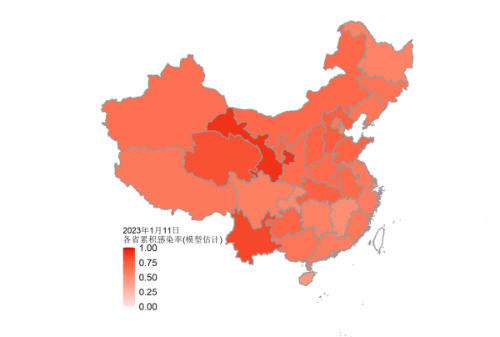
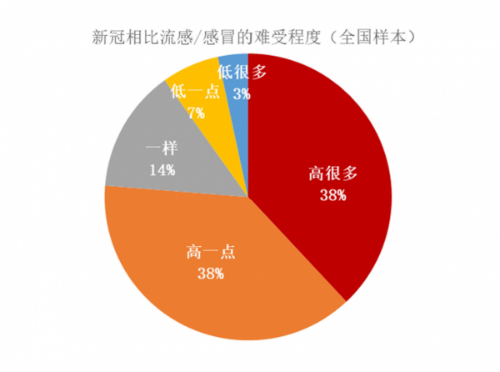
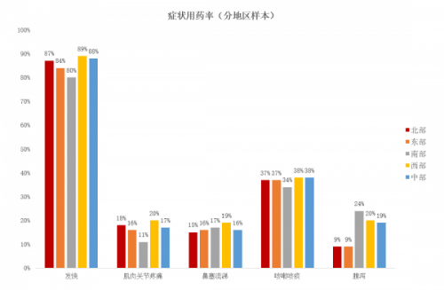

# 北大国发院报告：全国超9亿人或已感染新冠 近8成认为比流感难受

**经济观察网 记者 张英**

近日，北京大学国家发展研究院马京晶等人组成的课题组发布了一份新冠疫情感染报告，对本轮疫情的传播特征、民众感染后的症状、人群和地区间差异等进行了系统分析。

报告显示，在“新十条”出台后大概13天，即12月20日，全国多地疫情就已达峰，到12月底各地感染均已过峰。截至2023年1月11日，全国新冠感染率累积约达到64%，感染人数累积约9亿。

在区域感染差异上，报告显示本轮累积感染率最高的前三名省份均属于西部地区，第一名甘肃省约达91%，第二名云南省约84%，第三名青海省约80%。

报告课题组成员北京大学国家发展研究院副教授马京晶对经济观察网表示，在互联网上北上广疫情声量很大，但数据估计西部地区感染率可能更高。

马京晶介绍，这些感染率是模型估计数据，是根据网络平台上对感染新冠后相关症状的搜索量计算而得。简单来说，就是网上对“发烧”“咳嗽”等症状搜索上升了，也就代表感染率上升了。感染率的原始数据主要由脉策数据提供，该公司抓取了国内多家网络平台上关于新冠症状的搜索数据，在这些数据基础上，课题组成员计算了全国、各省、各城市的感染率。

马京晶说，现在很多公众都很希望了解到感染率数据，但完全准确的数据现下不可能得到，通过此类大数据方法可以快速全面的估算各地感染率，而且成本较低。虽然此类方法会受到一些影响搜索的随机因素或固有习惯影响，跟现实有一定差距，但在疫情暴发期间，快速全面了解全国各地的大致感染率，对相关部门进行医疗资源的调配可以起到重要作用。

**“大小数据相结合”可更合理配置医疗资源**

除了大数据方法外，课题组还使用了问卷调查（小数据）方法。在疫情高峰期在全国进行了问卷调查，共获取有效样本11443人。

马京晶解释，“大数据方法可快速估算出每日各地的感染率，但想要服务于医疗资源调配，还需要了解感染后各种症状出现的可能性、用药率、就医率、住院率等。这些数据可以通过问卷调查实现。”

课题组问卷调研的样本比例是依据中国第七次人口普查相关人口比例，比如各地人口占比、性别比、年龄比等，以保证抽取样本与全国人口结构一致，使其能代表全国情况。

在开展问卷调查前，课题组未表明调查主题与新冠疫情有关，而是将相关问题融入了一份消费者信心指数调研问卷。马京晶说，这样就避免了受访者都是对疫情感兴趣的人，如果都是这样的人，他们就更可能正在阳或已经阳过，样本就可能高估感染率。

她认为，大数据与问卷调查小数据相结合的方法，能非常快速、方便地估计出各地每天大概有多少人有买药、就诊、住院等需求，相关政府机构也可使用这样的方法，疫情暴发时能及时预测到发生地区、感染规模等，便于调配医疗物资和医院资源。

**76%受访者认为感染新冠比流感更难受**

报告显示，绝大部分受访的感染者都出现了发烧、咳嗽咳痰、鼻塞流涕、咽痛、味觉嗅觉改变、腹泻等一种或几种症状。感染新冠后最为常见的症状是发热，受访的感染者有82%出现了发烧症状，其中最高体温在38.5度及以上的占比高达75%，发烧持续天数在三天及以上的占比达46%，使用退烧药物的占比高达86%。

在转阴时间上，全国样本中约一半感染者在感染后5-7天症状消失并转阴，约20%的感染者需要更久。

分地区来看，北部地区更容易出现发烧症状，中部地区的咳嗽咳痰症状更严重，这两个地区的咽痛症状出现率也高于其他地区，西部地区的味觉嗅觉改变症状出现率高于其他地区，南部地区更容易出现鼻塞流涕和肌肉关节疼痛症状东部地区的无症状率略高于其他地区。

北部地区症状消失所需天数也最长，为6.9天，西部地区次之，为6.7天，南部地区最短，5.7天。

调查还发现，感染症状也存在性别差异。受访者中女性更倾向于认为新冠比流感或感冒更难受。同时，女性的咽痛、鼻塞流涕和咳嗽咳痰等症状出现率均明显高于男性，症状消失所需天数更长，鼻塞流涕和咳嗽咳痰用药率也高于男性。

在主观感受上，受访者中有76%的感染者认为感染新冠后的难受程度要高于自己以前最严重的流感或感冒。

对于感染症状调查的意义，马京晶认为，在这轮疫情之前很多人认为感染后大部分是无症状，但得了一次后发现其实很难受，课题组希望能把大家感染后的症状经历给讲出来。

**西部地区多种症状用药率高于其他地区**

调查显示，各地区的用药需求随感染症状差异也表现出明显不同。

北、中、西部地区的发烧用药率均接近90%，南部地区的腹泻用药率高于其他地区。值得注意的是西部地区，在五类症状对应的用药率排名中，除腹泻用药率位于第二外，其他症状用药率均大于等于另外四个地区。

从就医措施看，55%的感染者使用了线上平台问诊、电话问诊等一种或几种不同形式的医疗服务。值得注意的是，17%的感染者使用了医疗机构门诊/急诊服务，5.5%的感染者使用了住院服务。

从就医措施的人群差异来看，55岁及以上人群在电话问诊、医疗机构门诊急诊或住院等医疗服务使用率上均明显高于其他年龄组，对药物和医疗服务的需求也更多。

（课题组成员：马京晶、张丹丹、陈沁、张琬玥、高卓媛）

