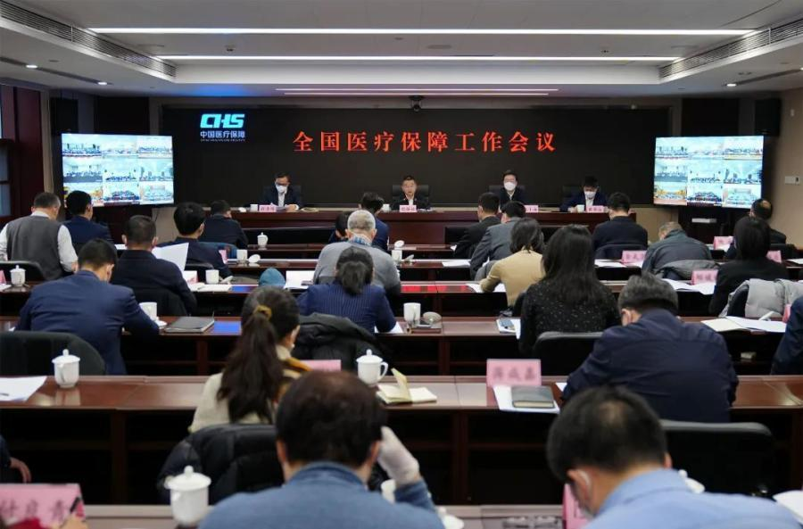

# 国家医保局：2023年要持续挤压药品耗材虚高价格水分

中新网1月13日电
据国家医保局微信公众号13日消息，全国医疗保障工作会议12日在北京召开。会议总结2022年和近五年医疗保障工作，研究部署2023年医疗保障工作。

_图自国家医保局微信公众号_

会议要求，2023年医保工作要以奋发有为的精神状态，创造性地把党中央决策部署转化为医保惠民实效。

一是进一步巩固拓展医保脱贫攻坚成果，做好农村群众医疗保障工作。

二是切实做好实施“乙类乙管”后新冠病毒感染患者治疗费用医疗保障工作，方便群众享受直接结算服务，加快费用清算结算速度，减轻救治医疗机构垫资压力。

三是加强生育医疗费用保障。统一规范生育津贴支付政策，落实探索将灵活就业人员纳入生育保险覆盖范围。

四是持续加大基金监管力度。开展基金监管安全规范年行动和医保反欺诈大数据监管试点。加大飞行检查力度，各级飞检力争实现辖区全覆盖。依托智慧医保赋能非现场监管。探索适应新型支付方式的监管机制。重点加强异地就医基金监管。

五是持续挤压药品耗材虚高价格水分。开展新批次国家组织药品和高值医用耗材集采，扩大地方集采覆盖品种，实现国家和省级集采药品数合计达到450个。引导新冠治疗药品合理形成价格。

六是落实异地就医结算。进一步扩大普通门诊和门诊慢特病费用跨省联网定点医疗机构覆盖范围，稳步提高住院费用跨省直接结算率。

七是推进扩大长期护理保险制度试点。探索建立有效的独立筹资机制和监管机制，健全失能等级评估标准体系，引导护理服务市场规范发展。

八是全面建立职工医保普通门诊统筹，谋划门诊高血压、糖尿病“两病”用药保障机制向其他病种扩容。

九是稳妥系统有序推进医保引导分级诊疗、医保省级统筹等基础性、长远性重大改革。(中新财经)

