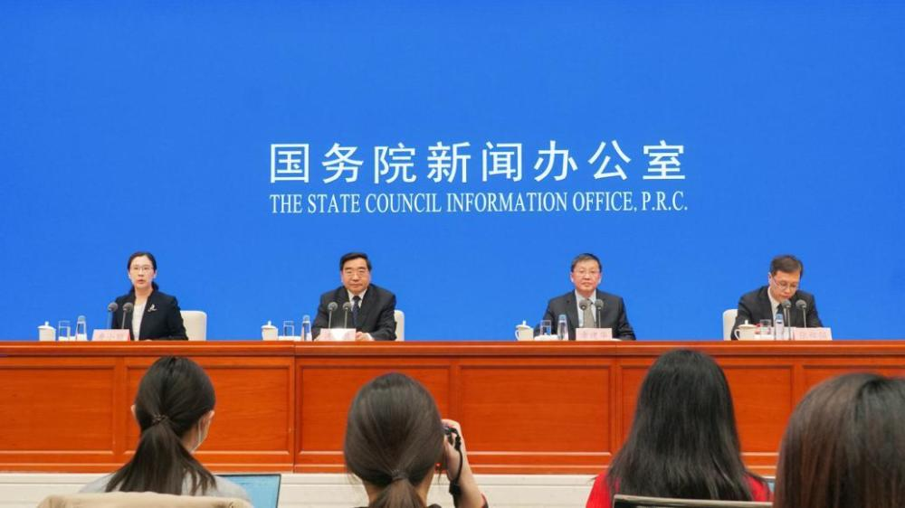

# 国家发改委：供暖企业若发生弃供停供，地方政府要无条件兜底保供

_发布会现场 澎湃新闻记者 周頔 摄_

1月13日，在国务院新闻办举行的做好能源保供确保温暖过冬新闻发布会上，澎湃新闻（www.thepaper.cn）记者提问：近期，有供热企业反映面临亏损，甚至出现了个别企业宣称将停止供暖的情况。据了解，供热企业普遍存在经营压力加大的问题，对此将采取什么措施加以解决？

对此，国家发展改革委副主任连维良称：“这个问题是个案问题，我们经过调查了解，情况属实，目前这个问题已经解决。虽然是个案问题，但是它提示我们要进一步进行供暖企业的风险隐患排查，防微杜渐，绝不放过任何影响保暖保供的个案问题，确保人民群众温暖过冬。”

连维良表示，供热企业因为燃料成本上升导致经营压力加大，这确实是一个共性问题，但是要具体问题具体分析，根据成因对症施策。从能源保供角度来讲，重点是抓好五个落实：

一是落实资源保障。民生供热企业不论规模大小，不论所有制，全部纳入煤炭中长期合同覆盖范围，并严格执行中长期合同的价格政策，以此合理控制燃料成本。

二是落实价格和补贴政策。对燃料成本上涨出现严重亏损的供热企业，地方政府要及时兑现承诺的资金补贴。供暖季结束后依法依规进行价格调整，合理疏导成本，涉及民生供热价格调整的，要严格履行法定程序。

三是落实属地兜底保供责任。 **如果发生供暖企业弃供、停供的情况，地方政府要无条件予以兜底保供。**

四是落实一企一策帮扶措施。对供暖企业严格落实政府帮扶责任制，派出的工作组要履职尽责，及时协调解决企业反映的具体困难和问题。

五是落实个案检测和快速处置机制。现在保暖保供总量有保障，关键问题是防止出现各种个案，我们将发挥能源保供个案协调机制作用，还有12398全国能源监管投诉举报热线作用，加强舆情监测和个案督办，确保所有发生的个案都有交办、有解决、有反馈。

