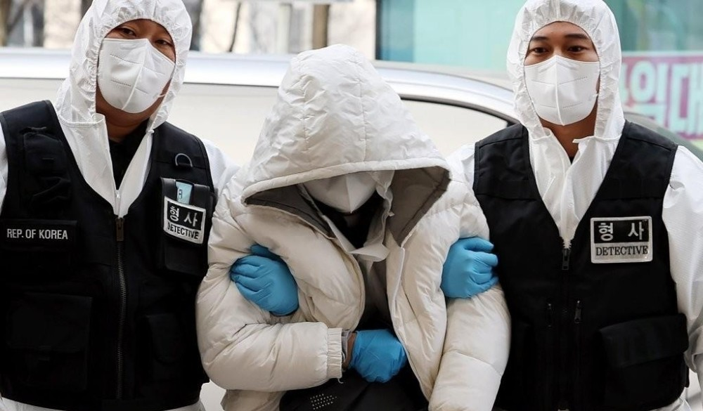

# 在韩逃离新冠隔离点的中国旅客接受警方调查：是去取药了

【文/观察者网 周弋博】

据韩联社消息，当地时间1月11日，韩国仁川中部警察厅发布消息称，此前在韩国从新冠隔离点逃离的中国旅客已于当天接受警方调查。

该旅客表示，由于其日常服用的惊恐障碍治疗药物被妻子带走，故而离开隔离点是为了去取药，并不是想逃避隔离。韩国警方则表示，该旅客已被移交至出入境管理所，并即将被送检，若其被判有罪，将被处以1年以下有期徒刑或1000万韩元（约合人民币5.4万元）以下的罚金，可能被并处驱逐出境。

_1月5日，在韩国从新冠隔离点逃离的中国旅客（中）被警方找到
图源：韩联社_

在韩联社的报道中，涉事中国游客被称为A某，现年41岁。1月3日，A某搭乘来自中国的客机飞抵仁川国际机场，因核酸检测结果呈阳性需要隔离，被安排到设在附近酒店的临时居留设施。

当日晚间，A某从仁川市中区永宗岛一家酒店附近逃脱。韩国警方调取酒店周边监控画面发现，A某在转移到隔离点的过程中潜逃，4日凌晨最后现身于距离该酒店300米处的大型超市。

韩国中央应急处置本部4日表示，A某已以现行犯身份被通缉。5日中午，韩国警方逮捕了躲在一家酒店房间里的A某，并计划于10日对其进行调查，后因A某坚持要在律师在场的情况下接受调查而被推迟至11日。

据韩国警方介绍，A某在调查中表示，由于其日常服用的惊恐障碍治疗药物被妻子带走，故而离开隔离点是为了去取药，并不是想逃避隔离。

经确认，A某从仁川市的酒店逃离后，直接打车赶到了首尔市的一家酒店与妻子见面，随后两人共同入住。

2天后，A某尝试在一家药店购买抗抑郁药，但因没有处方未能买到，接着又去别处买了一件毛衣。

报道称，A某从2018年至2019年往返韩中两国5次，在首尔江南的一整形外科接受整容手术，“这次是为了治疗脱发和购物而入境（韩国）的。”

韩国警方表示，考虑到A某的妻子没有事先帮助丈夫潜逃或在潜逃过程中取得联系，不会对其进行调查。A某已被移交至出入境管理所，并即将被送检，若其被判有罪，将被处以1年以下有期徒刑或1000万韩元（约合人民币5.4万元）以下的罚金，可能被并处驱逐出境。

据韩国入境防疫新规，自1月2日起，所有自中国内地（不含香港、澳门）入境的短期停留者须在入境后立即接受核酸检测，并在规定场所等待直至检测结果出炉。检测结果呈阳性者须在临时隔离设施进行为期7天的隔离。自中国内地赴韩的所有航班须一律降落在仁川国际机场。

另外，自中国内地入韩人员从5日起必须在乘机时提交行前48小时内核酸检测阴性证明或24小时内快速抗原检测阴性证明。韩国在华外交机构当天起至1月31日停发赴韩短期签证，有外交、公务、必要商务需求和人道主义事由等情况除外。

据中国驻韩国大使馆微信公号1月10日消息，中国驻韩国大使馆当日发布关于暂停签发韩国公民赴华短期签证的通知：根据国内指示，自即日起，中国驻韩国使领馆暂停签发韩国公民赴华访问、商务、旅游、就医、过境以及一般私人事务类短期签证。上述措施将视韩国对华歧视性入境限制措施取消情况再作调整。

据中国国家移民管理局网站1月11日消息，针对近期少数国家对中国公民实施歧视性入境限制措施，国家移民管理机构自即日起，对韩国、日本公民暂停签发口岸签证，暂停韩国、日本公民来华实行72/144小时过境免签政策。

**本文系观察者网独家稿件，未经授权，不得转载。**

