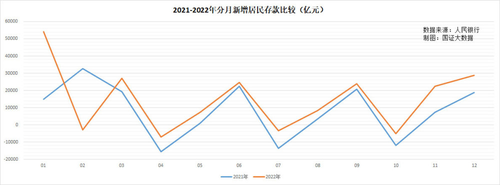
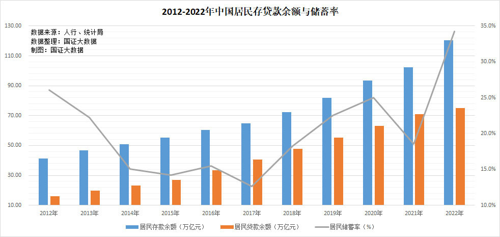
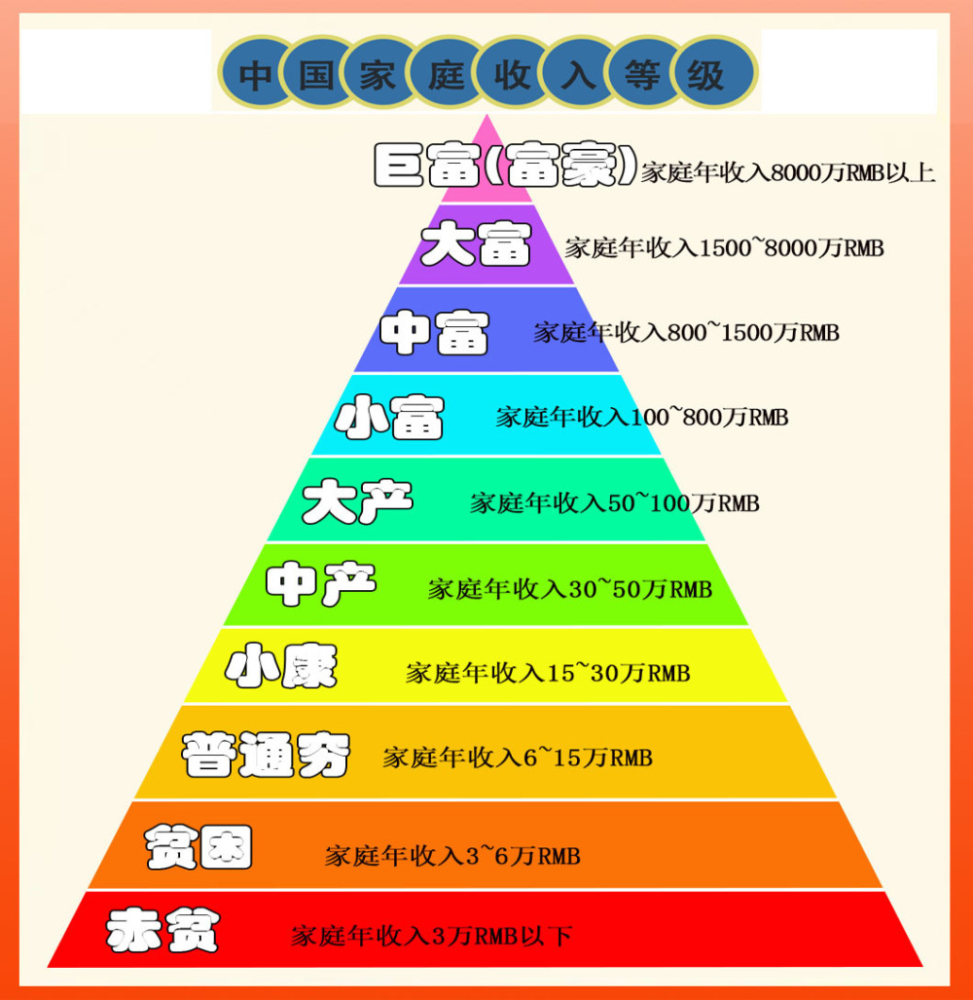

# 将少数富人的投资性储蓄误读为超额储蓄，终将误导经济决策

一、面临疫后经济修复困难，专家学者齐刷刷盯上了居民的储蓄存款

上周，人民银行党委书记、银保监会主席郭树清在接受新华社记者采访时表示，将当期总收入最大可能地转化为消费和投资，是经济快速恢复和高质量发展的关键。

曾经说什么“中国房地产将继续延续黄金时代，比如美国房地产发展了245年，我们从房改算才24年，才走了美国十分之一”的中国房地产之父孟晓苏，1月8日，又跟领导建言：“中国老百姓去年又增加存款15万亿，如果其中有1/3拿出来恢复买房、装修，那中国经济不就能够顺利恢复了吗？”

1月10日，天风证券宏观首席研究员宋雪涛在北京商报《2022年12月金融数据出炉，居民信贷需求不足，高额储蓄有待转化》一文中表示，高存款背后不容忽视的还有高额储蓄难题……等到居民收入预期好转时，超额储蓄才有可能转化为超额消费。

二、去年增加的17.84万亿居民存款，有多少超额储蓄？

什么是超额储蓄？在经济研究分析行业，通常把显著高于往年平常储蓄之外的储蓄，称之为“超额储蓄”

招商证券在研报中指出，“超额储蓄”是指居民部门存款余额减去居民部门贷款余额得到的居民净存款。这就张冠李戴了，因为这个属于“超额净储蓄”的定义。

中国人民银行1月10日发布的数据显示，2022年全年人民币存款余额为258.5万亿元，同比增长11.3%。当年新增存款26.26万亿元，同比多增6.59万亿元，增长33.5%。

其中，住户存款余额120.34万亿元，同比增长17.4%。当年新增住户存款17.84万亿元，比2021年的新增存款9.9万亿增长了80.2%。

2012-2021年这10年，中国居民的平均储蓄率为19%，2017-2021年这5年，中国居民的平均储蓄率为19.4%，2022年中国居民总收入预估为52.1万亿元，按此计算2022年中国居民储蓄率约为34.2%，超额储蓄在7.7-7.9万亿元之间。

2022年中国居民存款余额为120.34万亿元，居民贷款余额为74.93万亿元，居民超额净储蓄为45.41万亿元。居民债务收入率为144%。

三、8万亿超额储蓄，是谁的储蓄？

不少人认为，2022年居民新增17.84万亿存款，储蓄率从之前的20%左右增加到34%左右，形成了接近8万亿的天量超额储蓄，是因为疫情增加了居民对未来的不确定性，降低了居民的消费欲望所致。

所以，孟晓苏等代表性人物，都认为，2023年经济复苏靠消费，刺激居民消费，靠采取措施将居民存款或超额储蓄逼出银行，拿去买车买房、旅游消费。只要居民存款回落了，消费就起来了，经济就恢复了！

这种观点大错特错了。这是对居民储蓄和超额储蓄浮于表面的观察和理解。

因为仔细拆解分析，你就会发现，所谓的超额储蓄，压根就不是基于未来消费的储蓄，他的大部分可能是富裕阶层在市场萧条、高风险产品亏损风险加剧时的一种避险性储蓄型投资。

首先，这其中一部分应该是个体户的经营周转款，封控期间不能进货、无法营业，导致个体户的流动资产结构中存款比例急剧增加；

其次，这其中的主要成分是因为股市债市下行，中高收入阶层从高风险证券投资中撤回的资金。

做出这样的分析判断，是因为：

**第一、63%的低收入阶层没钱满足基本的消费，哪有能力来增加存款呢？**

李总理曾经用一句“6亿人月均收入1000元”，帮助我们去掉了经济高速增长的滤镜。

我在《近3亿人日均消费只有20元，我们该如何增加内需推动经济？》一文中，还利用国家统计局的居民收入分组资料，
推算出近5.8亿人月收入低于1000元，3.1亿人的月收入只有1000-2000元。中金公司发布收入比重的调查报告，月收入1000元以下有5.5亿人，月收入1000元到5000元有7.78亿人，月收入5000元到20000元有4930万人，月收入超过20000元的只有70万人。

**第二、只有37%的中高收入阶层在满足基本的消费之后，拥有储蓄的能力。**

按照以上资料推算，月收入少于2000元的，只能满足温饱生活的人多达8.9亿人，占到总人口的63%。

也就是说，这63%的同胞是鲜有存款的。存款也好，超额储蓄也罢，是属于剩下三分之一的中高收入阶层的。

**第三、2%的人占有82%的存款，超额储蓄主要属于2%的富裕阶层。**

央行和国家统计局没有做过存款分类。但招行2021年的年报数据显示：2%的人占有82%的存款，剩余98%的人只拥有银行存款中的12%。招商银行的存款总客户达到1.58亿，因此，这个数据是能客观反映社会财富分配的。

四、2%的富裕阶层的储蓄存款，能被逼进消费环节吗？

我们内需的真实情况就是收入差距越来越大，中高收入阶层的消费水平在增加，但收入增长更快，其消费率在下降；中低收入阶层收入增长缓慢，仅能维持基本的生活，无法提高生活品质。

**63%的低收入阶层，需要省吃俭用才能维持最基本的温饱生活，他们鲜有储蓄，因此，不管央行采取什么样的措施，他们也没有储蓄可以挤压到消费环节。**

**35%的4.93亿中高收入阶层，拥有18%的2022年17.84亿新增居民存款中的3.21万亿，人均新增银行存款大约6500元。**

这部分人应该都至少每户购置了1套住房，有的有2套，家里都有汽车。新增的6500元，用来买车买房，离首付都差的远。

因此，无论央行采取什么样的挤压储蓄的措施，也很难将这4.93亿人的存款逼入消费环节。

剩下的2%的高收入富裕阶层，拥有82%的银行存款，2022年他们人均新增加了51.84万亿元。这些中国的高净值人士，手中不知道有多少套房，也不知道换过多少辆车。

至关重要的是，不管经济冷暖，他们可能都不会吝啬消费。

他们新增加的储蓄，大概率都用于投资的临时性储蓄存款，或许就是临时避险的低风险储蓄型投资。他们可能会去美国、澳大利亚、加拿大买房，在国内继续买房的可能性太小了。

五、不是老百姓不愿意消费，是三分之二的老百姓没钱消费

我一直在强调，经济发展的终极目的是消费，投资只是满足消费的手段。投资减少了今天的消费，是为了增加明日的消费。

消费不仅是经济发展的目的，还决定着投资的回报。如果一个经济体的投资一直以高于消费的增速增长，形成的供给越来越多但消费能力越来越低，投资的回报率自然也就越来越低。最终，没有消费支撑的投资将难以为继。

因为这样的投资不仅无法获取收益，还将造成巨大的浪费。

观察2012至2021年间主要经济体的GDP消费占比结构，中国居民消费率只有38%，比全球平均水平低18个百分点，比发展阶段的中高收入国家也低了9个百分点。

我们长期将国民创造的财富大比例用于投资，导致用于居民收入的比例长期大大低于一般水平。这才是中国居民消费能力太低，供给严重超过需求的根本原因。

疫情期间，我们的失业率增加到5.7%的历史新高，企业盈利水平持续下降，大多数民企就业人员收入零增长甚至负增长，这应该是今年1-11月社会商品零售额下降0.1%、商品房销售额下降26.6%的主要原因。

美国则与我们形成了鲜明对比：在2020年和2021年两年中，美国政府财政支出较疫情前增加了16万亿美元，但其中的69%支付给了美国居民个人。因此在这两年，美国居民敢消费、愿消费、能消费。

六、不谈如何提高居民收入，只谈恢复扩大消费就是耍流氓

在我们的初次分配环节中，财政通过较高的宏观税负占有了较大比重的收入；在再分配环节中，又通过转移支付将部分收入转移给了自己。这是占我们三分之二人口的中低收入阶层缺乏消费能力的主要原因。

因此，需要刺激消费，不应该将目光聚焦在所谓的7-8万亿的所谓超额储蓄上，而应该将精力集中在如何提高中低收入居民的收入上，经济政策、货币措施应该围绕提高居民收入发力：

第一、改革国民收入分配制度，扩大劳动者在GDP中的收入占比。

第二、完善社会保障体系非常必要，也非常紧迫。

第三、在第一条和第二条见效之前，应将原计划用来投资的钱，拿出大部分平均发给全国人民，直接增加居民收入。

如果每人发1万元，14.1亿人，也只有14.1万亿，仅占2022年预估固定资产投资额56万亿的25%。结合其他国家、地区的经验，给每个人发1万元对经济的刺激效果，肯定比投资56万亿的效果要好得多，同时还完美地避开了降息、降准引发的种种矛盾。

【作者：徐三郎】

