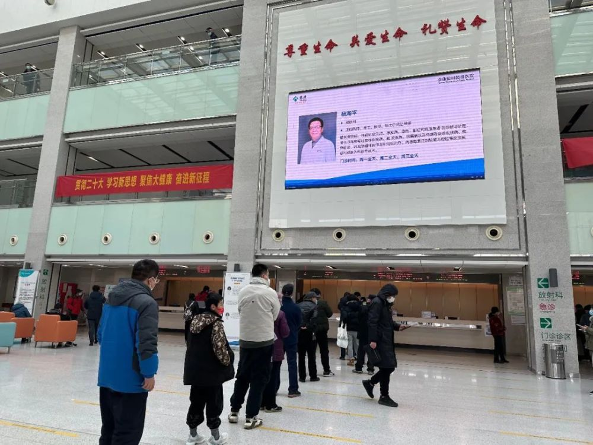
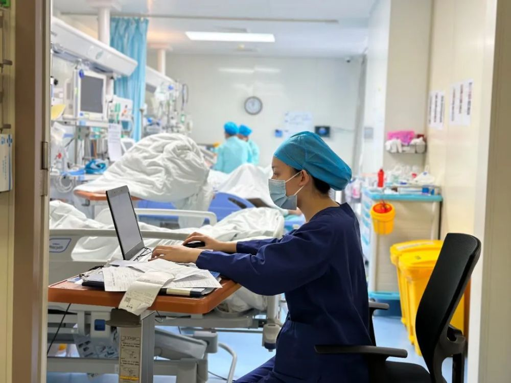
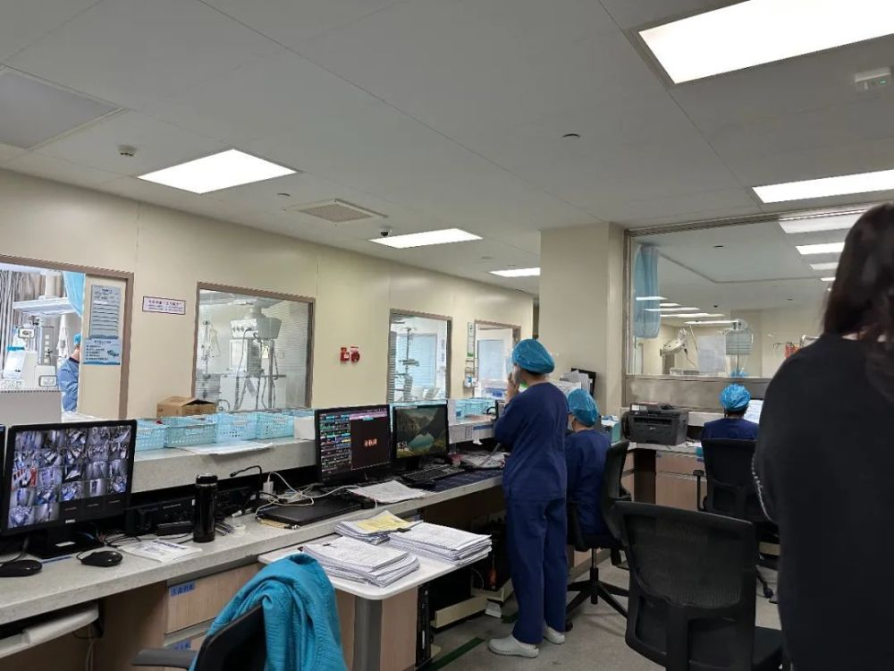
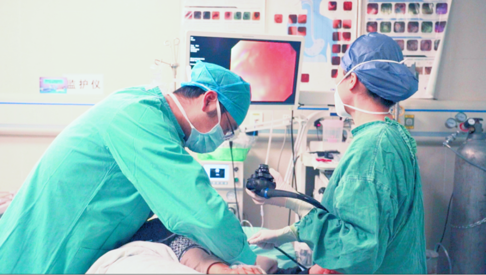

# 抢救室无处下脚，病房一床难求，新冠感染高峰下的救治实录

“我以为自己过不了这一关了，没想到还能重新好起来。”元旦后的第一个周末，泰康仙林鼓楼医院的老年病区里，即将出院的梁奶奶紧紧握着医护人员的手，感谢她们这一个月来的细心照顾。

_△泰康仙林鼓楼医院_

梁奶奶今年72岁，平时就有哮喘、糖尿病和高血压等基础疾病，是南京鼓楼医院江北院区的“老病号”。12月12日，她突发呼吸困难，因为江北院区收治新冠患者床位紧张，家人将她紧急送到了同属南京鼓楼医院集团的泰康仙林鼓楼医院。

入院当天，老太太就发起了高烧，后经核酸检测确诊为新冠阳性，这也是泰康仙林鼓楼医院接收的第一批新冠住院患者。住院期间，梁奶奶一度面临生死考验——新冠病毒感染，加上多项基础疾病，她的肺部出现大面积白肺，血氧指标掉到80，心脏、肝肾等多器官衰竭。医护人员连续抢救近5个小时，才将她从鬼门关外拉了回来。

2022年12月7日，优化落实疫情防控的“新十条”发布。此后，社会面新冠病毒感染人数激增。根据国务院联防联控机制医疗救治组“三级医院要充分发挥医疗救治兜底保障作用”的要求，各地三级医院相继迎来救治高峰。

大面积医护感染、急诊抢救压力骤升，住院床位紧缺……几乎每一家三级医院都像被拨快了两倍速的齿轮般高速运转。

位于南京的泰康鼓楼仙林医院就是其中之一。过去半个多月里，这家床位数500余张的三级医院（规划床位近1400张，一期开放524张）总共收治了1300多位患者，医院的急诊量也从平时的300多人次，直线上升到了元旦期间近1000人次的日均峰值。

_△泰康仙林鼓楼医院病房_

**无处下脚的急诊抢救室**

对于任何一家医院来说，急诊都是迎战新冠高峰的第一道关口。

泰康仙林鼓楼医院急诊科主任许宝华第一次意识到形势严峻是在12月中旬，从那时起，大量肺部感染的高龄老人被接连送到急诊抢救室，这些老人的共同特点是80岁以上，肺部有大面积病变，就是通俗所说的“白肺”，还伴随高血压、糖尿病、脑梗心梗等各种基础疾病。

“能送到抢救室来的，几乎没有轻症的。所以来了我们就要给他吸氧，建立静脉通道。还有一部分人，缺氧很厉害，就剩一口气了，当场就要做气管插管。”许宝华说，他粗略做过一个统计，这一波新冠高峰，急诊抢救的病人数量大概是平时的3倍。最多的一天，从急诊抢救室转到各个病区的危重症患者有57个。

为了应对这一波救治高峰，急诊科的抢救床位从原先的6张增加到了12张，后来又添置了5张移动床位。收治容量是提升了，但总共17张病床挤在不到80平米的空间里，床和床之间的缝隙刚够医护人员通行。当发生患者心脏骤停，需要心肺复苏时，就需要紧急挪动床位，给医生留出插空按压的空间。

_△泰康仙林鼓楼医院病房_

另一个难题是人手。病床可以临时增加，但能够处理紧急情况的急诊科医生就那么几个。从12月中下旬开始，以许宝华为代表的急诊科医生几乎阳了个遍，但大家轻伤不下火线，始终带病坚持在岗位上。为了给急诊科的医生减负，同时减少患者的等待时间，医院抽调了其它科室医生，开设了综合诊疗门诊区，即“第二急诊”，分流轻症的新冠感染患者。

“我们不怕辛苦，医护人员累一点没关系，但必须保证每一个患者得到救治的权利。”许宝华说，新冠重症患者多为高龄老人，大部分需要实施有创抢救，因此和家属沟通解释病情也会占用较多的时间。

曾经有一个89岁的患者，送来时白肺面积达到80%，血氧掉到正常值的60%以下，家属不想让老人多受罪，打算放弃。沟通中，急诊医师得知老人此前身体状况不错，基础疾病轻微，判断抢救的成功率很高。最后，他们努力说服家属，给老人做了气管插管，又联系了ICU接棒，成功把人救了回来。

眼下，尽管抢救室的17张床位依旧全满，但每天接收的重症患者数量已经有所下降。经过近一个月的鏖战，急诊科的抢救高峰已经平稳渡过，65岁的许宝华和他的弟子们终于可以获得些许的喘息。

**多腾出一张床，就能多救一个人**

在常规的诊疗流程中，新冠的重症患者在经过急诊科的抢救后，就会被收治到对应的病房。但这一次，几乎在任何一家收治新冠重症患者的三级医院里，这条路都被堵死了，因为“一床难求”。

_△泰康仙林鼓楼医院重症监护病房_

泰康仙林鼓楼医院共有524张核定床位，算是一家中型三级医院规模。院领导班子在疫情防控政策调整后，也预见到可能出现的就诊高峰，一方面成立了新冠患者救治领导小组，将疫情相关工作的重心从原来的防控调整为救治，另一方面，也部署院内做好治疗物资的储备。元旦前10天，当呼吸科等收治新冠患者的重点病区床位几乎饱和时，新冠患者救治领导小组决定向新冠患者开放所有病区床位，全院资源统筹协调，应收尽收，而此时，50张紧急加购的病床也已在运往医院的途中。

为了实现对新冠患者“应收尽收”，具体病房资源的调度工作就落到了医务部。摆在医务部负责人李京面前的是一项至关重要的工作，他和他的团队在关键时刻成为全院574张床位的统筹人，哪些患者能够收治，收到哪个病区，都需要由他与各个专科及时做好评估和沟通。

“最先去的肯定是急诊抢救室，和许宝华主任一起评估哪些患者情况比较危急，需要优先安排床位。如果肺炎比较严重，首先考虑的就是呼吸科，甚至ICU。如果主要是并发症，比如心梗、脑梗，就尽量安排去心内科和神经外科。如果只是轻症肺炎，就插空安排到其他科室，先确保能住进来。”李京告诉八点健闻，开放全院的病区收治患者后，为了保证医疗安全和质量，医院也出台了配套措施，比如给全院进行新冠救治的实战培训，呼吸科医生及时响应各病区的会诊等，这让更多的患者能及时入院得到治疗。

而真正的困难出现在元旦期间，574张床位，除了给新生儿预留的，已经满负荷运转。这个时候想要再收新病人，就只有等老病人出院。那段时间，也是急诊抢救室最忙的时候，积压了20多个重症患者，一度连抢救的地方都腾不出来。

多腾出一张病床，就可能多挽救一条生命。为了加速床位的周转，元旦假期三天，李京和他的团队不眠不休地穿梭于各个病区之间，挨个过问患者的情况。碰上康复情况比较理想的，即便是凌晨，他也会紧急协调呼吸科专家会诊，判断是否达到出院标准。“疾病进展是瞬息万变的，这个时候，我们必须把医疗资源的利用效率尽量提高。”李京表示。

**不放弃任何一个患者**

虽然不像急诊科、ICU那样直面新冠重症带来的死亡冲击，但在过去的近一个月时间里，泰康仙林鼓楼医院大多数科室的负荷都处于饱和的状态。

一方面，全院病区打开后，各个科室都在接收新冠感染的患者，大量人员、设备被抽调到新冠患者救治上；同时，新冠以外的专科诊治工作也不能耽误，各科室必须马力全开，全力以赴。

以神经外科为例，冬天原本就是脑血管疾病的高发期，几乎每天都有脑出血、脑梗的患者被送进医院，在大多数情况下，这些患者必须马上手术，否则就会有生命危险。

泰康仙林鼓楼医院神经外科行政副主任杨咏波说，神经外科总共8个医生，是根据日常诊疗量来配置的。但新冠重症高峰一来，科里既要支援急诊，又要留守病房，还要上手术台，每个人的工作量至少翻了一番。以上周三为例，从早上8点到晚上11点，“因为人手有限，我们一位医生一天连做了四台手术，没办法，都是急重症，如果拖到第二天，很可能人就没了。”

郭慧敏所在的消化内科，同样面临着人少活多的窘境。因为接收新冠患者，科室里增加了11张床位，但医护团队却被抽调走了4个人，一进一出，给专科救治工作带来了挑战。

_△泰康仙林鼓楼医院消化内科_

“消化内科的急诊患者，不管是消化道出血，还是急性胆管炎，很明显的一个症状就是剧烈腹痛，这样的病人是一刻都不能耽搁的。”郭慧敏说，过去近一个月，消化内科总共收治了近40例急诊病人。在人员最紧张的时候，同为消化科专家的院长邹晓平，在“阳性”状态下坚持上手术台，为4名患者开展了ERCP手术。

轻症不下火线，超负荷工作，这几乎是泰康仙林鼓楼医院所有医护人员过去近一个月的真实写照。也正因为如此，在保证新冠患者“应收尽收”的同时，医院其它专科的就诊渠道也全都正常开放，确保来院患者的日常诊疗需求得到满足。

采访中，杨咏波主任的一句话给我留下了深刻的印象。他说，既然选择了这份职业，就必须时刻做好准备。病人的健康永远是第一位的，即便是要牺牲我们自己的健康去换取。

