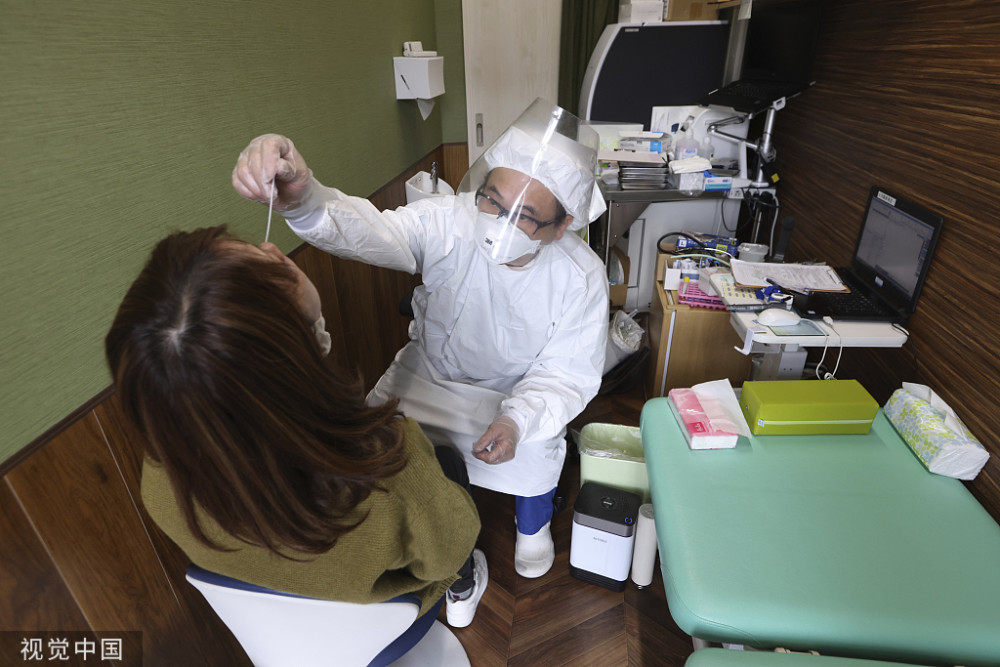

# 日本一个多月内新冠死亡病例逾万，第八波疫情为何突然凶险？

_当地时间2023年1月6日，日本东京，目黑区的一家诊所的医生正在诊断一位发烧的病人。视觉中国
图_

3年来，日本已经历了七波新冠疫情，目前第八波疫情来势汹汹，从去年12月至今年1月10日的一个多月内，日本新冠死亡病例逾万例。

日本厚生劳动省公布的数据显示，从2020年1月新冠疫情在日本暴发，直至2023年1月10日，该国新冠死亡病例累计60411例，而约1/6的患者死于去年12月和今年1月初，其中能够查明出生时间的死亡病例中，超过95%是60岁以上的老人。

值得关注的是，在日本，奥密克戎毒株的多个新变种正在取代过去流行的BA.5。尽管死亡病例激增，日本医疗机构的病床使用率并没有逼近极限。这一个多月，日本新冠死亡率上升的原因究竟是什么？

**高龄老人面临多重险境**

从去年12月至今年1月，日本新冠感染者数量较此前显著增加，重症和死亡病例多为老年人。

根据日本国立感染症研究所去年12月1日的报告，日本新冠重症患者的平均年龄为68岁，新冠病死者的平均年龄为83.1岁。除呼吸道疾病外，感染新冠病毒还有一定几率导致血栓，有专家认为新冠病毒可能还会引发心血管疾病，这将增加老年人的重症和死亡风险。

据日本广播协会（NHK）报道，在厚生劳动省的一次专家会议上，有专家提出，老人福利设施内的疫情扩散导致新冠病死者持续增加。统计数据显示，去年12月19日至27日的8天内，全国共确认1430起聚集性疫情，其中954起发生在老年人福利设施，占总数的66%。

日本东京一所特殊疗养院的工作人员对《东京新闻》表示，为防控疫情，养老院内区分了感染区和非感染区，但实际上很难完全隔离开两个区域，因为工作人员需要往返两边照顾老人，而且有一些患有阿尔茨海默症的老人也会不受控制地四处走动。

上述工作人员特别提到，当聚集性疫情发生时，很难将所有需要紧急治疗的老人都及时送入医疗机构治疗。但实际上，像东京、大阪这样的大城市，病床使用率并没有逼近极限。据NHK的全国病床使用率统计，1月4日，东京医疗机构的病床使用率为55.5%，大阪为59.6%，各都道府县中病床使用率最高的是神奈川县，约为84%。

“发热患者增加，但是却有越来越多人无法就诊。”埼玉县Fujimino急救医院院长鹿野晃在富士电视台的节目中说，从去年11月开始，每天有800至900人到该院发热门诊挂号，由于医护人手紧缺，该院很难接诊大量发热患者。

鹿野晃指出，许多高龄老人感染新冠后还没来得及入院治疗，就已在家中去世，其中的一个原因是救护车运送能力有限。日本总务省消防厅称，去年12月26日至今年1月1日的一周内，全国至少有7158起“急救运送困难事件”，即需要急救的患者难以叫到救护车，创历史最高纪录。

那么对于新冠高危人群的老年人，应该做些什么来保护他们？东邦大学感染控制学教授小林寅喆对日媒说，要创造一个可以让高危人群立即就自身病情咨询医疗机构、尽早接受治疗的环境，因为那些平时身体健康的老人在感染新冠后往往会忍耐，而年轻人却会积极就医。他提倡无基础疾病的年轻人尽量使用抗原自测的方式自我诊断，确立医疗接治优先级很重要。

**流感与新冠同时感染的“发热难民”**

根据东京都福祉保健局发布的信息，从第七波疫情开始，在日本流行的主要是奥密克戎变异株BA.5，但是目前它已逐渐被新的变异株BF.7、BQ.1.1、XBB.1.5取代，它们的免疫逃逸能力更强，传播能力变强。

小林寅喆表示，常规型新冠疫苗很难预防变异株BF.7和BQ.1.1，但是对应奥密克戎毒株的疫苗比此前的疫苗更有效，希望老年人积极地追加接种这种疫苗。

根据NHK网站的统计，截至1月11日，日本国民中80.4%接种了2剂疫苗，超九成65岁以上老人已接种2剂疫苗。而奥密克戎毒株对应疫苗的接种率为37.2%，约六成65岁以上老人追加接种了这种疫苗。

值得注意的是，日本近期还出现了所谓的“发热难民”，即指同时感染新冠和流感的患者，许多诊所和医疗机构开始实施新冠和流感同时检测的措施。东京一家医疗机构的院长对NHK表示，今年年初以来流感患者数量的增长速度高于新冠患者，同时感染两种病毒的病人也出现了。

国立感染研究所的统计数据显示，东京都、青森县、神奈川县等日本多个地区都已经进入流感流行季。大阪大学教授忽那贤志在接受日媒采访时说，同时感染流感和新冠的患者，重症化的可能性比只感染新冠时高出4倍，病死的可能性是只感染新冠时的2倍，因此接种流感疫苗和新冠疫苗对预防感染很重要。

截至1月11日，日本累计报告的新冠感染者超3000万人。日本多位医学专家认为，目前的感染规模可能无法反映实际情况，因为抗原检测试剂相比之前更容易获得，很多人未进行核酸检测，没有被登记在案，而大量死亡病例的出现意味着有更多感染者。

