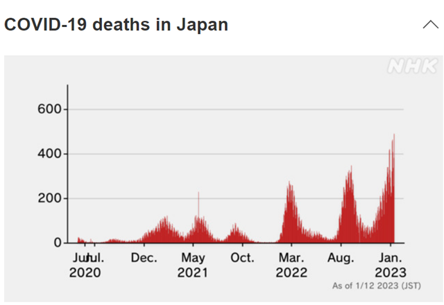

# 日本近一个月新冠死亡人数飙升，发生了什么？

日本正在直面第八波新冠疫情感染的高峰。然而，随着感染人数的增加，死亡人数也在最近一个月飙升。这是日本自2020年新冠疫情暴发以来未曾出现过的情况。

日本厚生劳动省的数据显示，自去年12月1日至今年1月10日，日本国内因感染新冠而死亡的人数超1万人。而2020年疫情暴发至今，厚生劳动省录得的因新冠感染死亡的累计总人数为61281人。也就是说，日本近一个多月来因新冠感染而死亡的人数超过新冠总死亡人数的1/6。

2023年1月以来，短短11天，日本官方录得的因新冠而死亡的人数已达3145人。这一速度也远超过去数月，去年10月整月因新冠死亡的人数为1864人，11月为2985人，12月则为7622人。

日本广播协会（NHK）汇总的最新数据显示，12日，日本单日录得的因新冠死亡人数为489人，创下2020年疫情暴发以来的最高纪录。截至12日，日本累计确诊的新冠感染者超3103万人，累计死亡61281人，重症患者697人。

日本新冠死亡人数缘何飙升？

就年龄构成而言，日本厚生劳动省的统计显示，近来因新冠感染而导致的死亡人群中老年人占据绝对多数。其中，去年12月7日至今年1月3日死亡的5825人中，
**17%为70岁左右的老年人，41.2%为80多岁的老年人，90岁及以上的老年人占比约为33.9%。**

日本政府的疫情专家分析小组认为，近来老年群体的死亡激增可能与养老院内的群聚性感染有关。厚生劳动省以及地方政府以同一机构中出现5人或者5人以上感染，且感染轨迹可溯为依据来判断是否为群聚性感染事件。

厚生劳动省11日表示，在截至9日的一周内，养老机构内的群聚性感染已达722例。这一数字与去年12月25日开始一周内养老机构录得的创纪录的954例相比，有所减少，但也逼近去年年中日本第七波疫情高峰时期养老机构7天感染的平均值，即850例。

同时，日本政府疫情顾问委员会正担忧奥密克戎亚型XBB.1.5毒株在日本传播。自去年12月1日首例XBB.1.5毒株在日本境内出现后，仅东京都一地已录得至少15例XBB.1.5毒株感染的病例。日本现阶段第八波疫情的主流病毒株仍为BA.5，但委员会担心，可能马上会被传播力更强的XBB.1.5毒株取代，这对于当前流感季中的日本老年群体、有基础疾病的患者又是一大挑战。

截至12日，日本65岁及以上老年群体三剂疫苗的接种率达91%。

当前，XBB.1.5毒株的迅速扩散正引发世卫组织密切关注。世卫组织11日发布的风险评估报告表示，目前尚未发现XBB.1.5毒株会导致更加严重的病情，但XBB.1.5毒株是免疫逃逸能力最强的亚变种之一，可能导致全球病例大量增加。

WHO的数据显示，自去年10月首次在全球发现XBB.1.5毒株以来，已在全球38个国家发现这一毒株。同时，超过80%的病例出现在美国。

至于日本是否会针对来自美国的入境人士加强边境防疫措施，日本内阁官方长官松野博一11日回复称，将针对（日本）国内外感染状况以及主要国家边境管控对策等，妥善来做判断。

日专家：现阶段不能把新冠等同于流感

自去年底以来，日本国内一直在热议是否要把新冠疫情的应对等级从当前的“二级”下调至“五级”。日本政府此前计划在今年春季有所调整。

按照日本的传染病法，根据症状分类与采取措施等不同，传染病症被分为五类。第一财经查阅相关信息显示，第一类为埃博拉等；第二类为结核、SARS、新冠等；第三类为霍乱等；第四类为狂犬病等；第五类则为季节性流感等。因此，一旦下调至“五级”，则意味着与季节性流感的应对等同。

在日本，要改变新冠病毒的传染病等级，必须在国会通过修改传染病法相关规定的议案，而要通过议案，就得先听取专家意见。

鉴于当前死亡人数的激增，以及逃逸能力更强的毒株出现，日本政府疫情顾问委员会主席日本国立传染症研究所所长胁田隆字（Takaji
Wakita）在最近阐明了对疫情风险的最新评估：“新冠病毒具有与季节性流感不同的特征，进行单纯比较是困难的。虽然新冠被预想到会变成近乎流感的传染病，但是到变成那样为止，还需要相当长的时间。”

就传染性而言，胁田隆字解释道，新冠的传染性、流行性与季节无关，而是与变异的毒株存在因果关系，“这是与季节性流感不同的一个主要原因”。

此外，胁田隆字认为，虽然奥密克戎株在日本成主流，重症率低下，但是当前数据显示，“新冠绝对死亡数大幅超过流感”。因此，他表示，在现阶段不能将新冠作为流感来进行同等评价。

对于靠中央政府拨款的日本地方政府而言，将新冠继续保持“二级传染病”应对的位置，就得继续按“公费医疗”来对待；如果能降级成与流感同等的“五级传染病”应对，患者需按正常医保来治疗，承担个人应承担的医疗费用。

