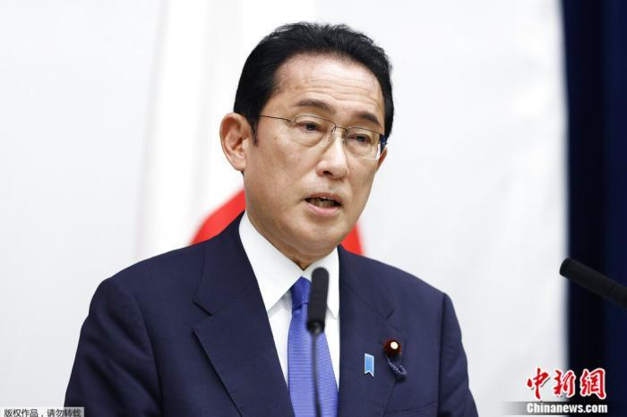
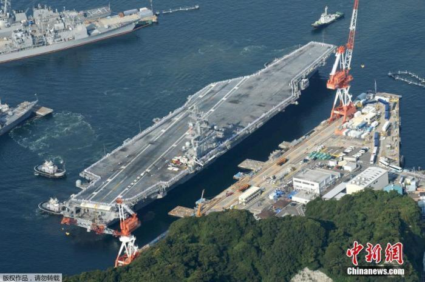
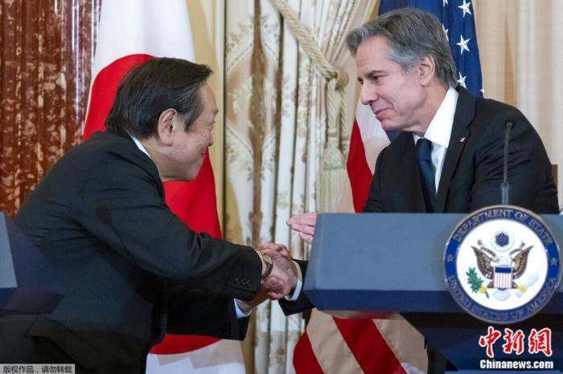

# 日本首相访美，日媒不断鼓噪“抗衡中国”，释放多重危险信号

中新网北京1月13日电(记者 甘甜) 当地时间1月13日，日本首相岸田文雄开启任上首次访美行，将与美国总统拜登在白宫会晤，以求进一步深化日美同盟关系。

但会谈还未开始，日媒却惦记上中国，字里行间不断鼓噪“抗衡中国”，谋求扩军备武。其背后所释放的“危险信号”，值得警惕。

_资料图：日本首相岸田文雄。_

**岸田访美，旨在“抗衡中国”？**

岸田文雄从9日起开始欧美五国访问。美国，无疑是最为重要的一站。

连日来，日媒频频“放风”，称拜登回应日方请求、决定与岸田举行会谈，是因为“与中国的竞争成为最优先课题”。

日美外长、防长也于11日在华盛顿开会预热。日本共同社称，日美高级官员同意中国对“印太地区构成最大的战略挑战”，宣称要加强威慑，将两国安全条约的范围扩大到太空。

在日美首脑会谈中，两国还可能聚焦哪些议题？

据多家日媒消息，拜登与岸田将讨论俄乌局势、气候变化以及经济问题。岸田还将介绍在新版《国家安全保障战略》中提出的彻底强化防卫力和大幅增加防卫费。

消息人士透露，双方拟就加强核能发电和液化天然气(LNG)等能源领域合作达成共识；为“抗衡中国”，在包括半导体、人工智能(AI)、量子等尖端技术在内的经济安保领域扩大合作。

会谈后，双方预计将发表以安全保障为中心的联合声明，强调推动“自由开放的印太地区”的重要性，并再次确认《日美安全保障条约》第五条适用于所谓的“尖阁诸岛”(即中国钓鱼岛及其附属岛屿——记者注)。

中国社会科学院日本研究所研究员吕耀东认为，日本将借首相岸田此访进一步渲染“中国威胁”。从炒作南海问题，到宣称乌克兰危机可能会在东亚发生，如何应对这些所谓的“地区威胁论”，或将是此次会谈的主要内容。

_资料图：停泊在日本横须贺美军基地的美国“里根号”核动力航母。_

**日本想要“成为矛的一部分”**

近段时间以来，日本野心外露，不满足于过去自卫队作“盾”、美军作“矛”的分工，也想“成为矛的一部分”。

2022年底，日本政府正式通过三份重磅安保政策文件。其中，新版《国家安全保障战略》宣称，日本应拥有“反击能力”，即“对敌基地攻击能力”。

日本政府2022年底还通过了2023财年政府预算草案，防卫预算达68219亿日元。其中，购买美制“战斧”巡航导弹预算为2113亿日元，获取远程攻击性导弹及相关预算高达1.4万亿日元。

吕耀东表示，值得注意的是，继美国发布“国家安全战略”后，日本也敲定了三份安保政策文件。也就是说，“过去日本的安全由美国来保护，而现在日本也要保护其盟国美国，因此其自称需要攻击性武器。”

外交学院国际关系研究所教授周永生还指出，“日本拥有‘反击能力’后，等于过去所说的‘专守防卫’政策被抛弃，和平宪法也被架空，出现了和战后自我约束的军事战略完全不同的、没有任何约束的军事战略。”

日本在军事“松绑”的路上越走越远，引发多方担忧和反对。

从东京首相官邸门前到广岛市内，日本民众发起抗议行动，高呼“不准增加军费” “反对大增军备和大增税”，抨击三份安保政策文件是违反宪法的“暴行”。

还有日本民众直言，“日本政府增加军费投入，这肯定威胁到我们的生存。这是绝对不应该做的政治行为。”

近日，韩国外交部负责人重申政府既定立场，即日本的国防国安政策要“朝着有利于地区和平稳定、坚持和平宪法精神的方向，公开透明地运行”。

中国外交部发言人汪文斌日前也强调，中方再次敦促日方恪守中日四个政治文件各项原则，切实将“互为合作伙伴、互不构成威胁”这一政治共识体现到政策上，落实到行动中，尊重亚洲邻国的安全关切，在军事安全领域谨言慎行。

_1月11日，华盛顿，日本防卫大臣滨田靖一(左)与美国国务卿布林肯(右)握手。_

**岸田为何此时对美“投怀送抱”？**

就在岸田政府向美国“投怀送抱”之际，其国内执政却危机四伏。

2022年底，日本内阁陷入“辞职多米诺”，多名成员因政治资金使用等问题相继辞职。岸田本人也被曝政治资金收支报告中有近百张“空白发票”，引发争议。自民党一些要扳倒岸田势力的反对派，还在利用他提出的“通过增税支撑防卫费”问题施压。

丑闻不断，岸田内阁支持率持续走低。自1月7日起为期3天的舆论调查结果显示，岸田内阁的支持率仅为33%。另一项日本全国最新舆论调查则显示，46%的受访者认为岸田应在2023年上半年辞职。

在此情况下岸田为何要外访，就不难判断了，周永生指出，“过去一旦内政出现问题、支持率下降，安倍就会借用外交手段，岸田也学会了这招，想寻求美国支持，减少内部压力，同时通过此次访问取得外交成果，挽回低迷的支持率。”

但如今的日本物价高涨，经济数据表现疲软，民众叫苦不迭，岸田政府若不顾民众声音，执意制造分裂对抗，其谋算或许终难如愿。

