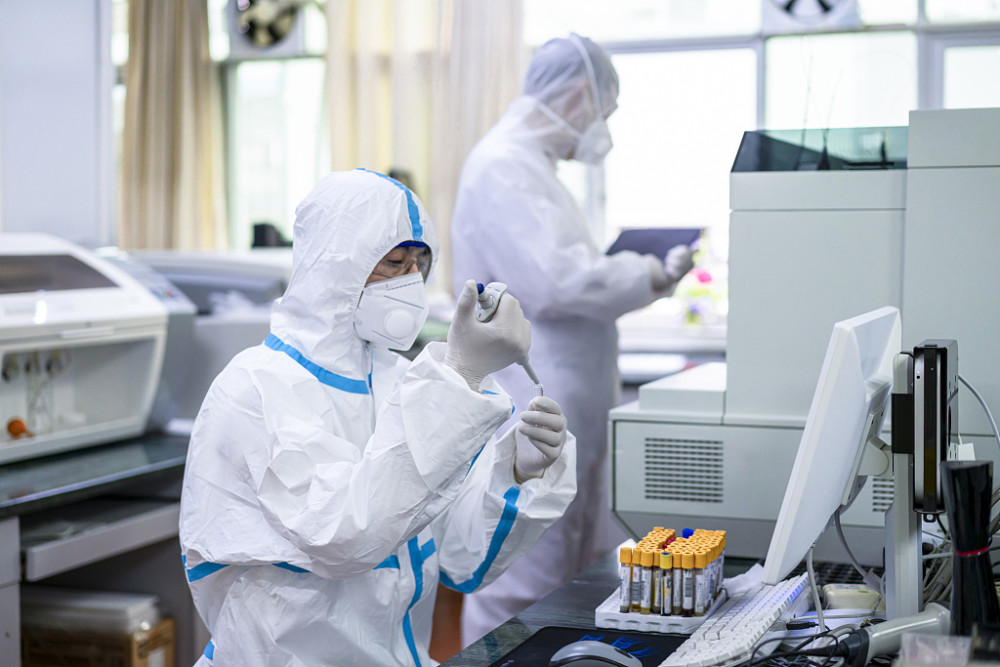

# 最高卖到5万的核酸检测亭如今“给钱就卖” 有上市公司直言：幸亏退得早

每经记者：陈星 每经编辑：梁枭

曾经售价高达数万元的核酸检测亭，如今五千元也卖不出去。

近日，《每日经济新闻》记者调查发现，在线上二手交易平台，部分第三方核酸检测机构、个人等开始甩卖使用不久和全新的核酸检测亭，多位卖家称“给钱就卖”。

火热的核酸检测亭曾“一亭难求”。东吴证券去年5月的研究报告显示，如果按照每3000人配置一个采样小屋，全国一、二线城市共计需要16.8万个采样点。以平均2.825万元一个推算，全国光是大城市核酸采样亭购置费用就要47.5亿元。

随着核酸检测成为非必需，新的核酸亭还来不及出厂，已经投放的核酸检测亭则要面对废弃或回收改造的命运。常年经营体外诊断试剂的刘羽（化名）曾有投资核酸检测亭的打算，但在考察之后选择了放弃。刘羽对《每日经济新闻》记者表示，就算防疫政策不调整，从经济利益角度来看，核酸检测亭也会消失。

“核酸检测价格下调以后，要靠检测赚钱已经很难。但更重要的是，这个行业没有长期进行下去的预期”，刘羽说，“如果不具备规模化效益和供应链整合能力，核酸检测亭其实很难赚钱。”如今，核酸检测亭的卖家既有个人，也有造亭厂家，还有大量自建或自购检测亭的第三方核酸检测机构。

而曾经高调入局的上市公司，也已经悄悄告别核酸亭产业。有上市公司表示，这个业务去年没进行几个月就停掉了，“因为我们收得早，很多做这个的都亏了，我们还没亏”。

核酸检测亭被甩卖，卖家也问现在买这个做什么？

在二手物品交易APP“闲鱼”上，一大堆的核酸检测亭、流动检测车正在排着队等待出售。

曾打算参与核酸检测亭生意的刘羽对记者说：“这些东西现在就是一堆破铜烂铁。”

但就在几个月前，这些“破铜烂铁”还是“香饽饽”。据刘羽回忆，高峰时期，带负压的核酸检测亭批发价可以卖到5万元/个，批发价最便宜的也要两三万元。

闲鱼卖家于子非出售的核酸亭中，最新的一个只使用了七天。12月26日刚上架时，亭子的标价还是12500元；到1月6日，价格降到了8000元。于子非还在商品简介里加上了一句话：“价格私聊，给钱就卖。”

在接受媒体采访时，于子非坦言：“是被朋友忽悠了，买了一些亭子做核酸，结果没多久就不行了。”这批核酸亭配备了空调、消毒机、对讲机等，当时每个进价1.5万元，如今折价了约一半，还少有人问津。

于子非这样的个人卖家手里，等待出手的存货并不多。更多二手回收或全新的核酸检测亭，还在厂家的库房里“吃灰”。

张立（化名）经营的工厂原本主要生产集装箱房、普通门岗、移动厕所，疫情开始之后没多久就开始生产核酸检测亭。“结构原理都差不多，做起来没啥难度。”张立说。

去年5月，“大城市建立步行15分钟核酸‘采样圈’”的政策公布后，张立的工厂全力投入到核酸检测亭的生产中。这些核酸检测亭主要销往四川、重庆等地，以及一些旅游景区。

但在7个月后，张立第一次在自己的个人闲鱼账号上架了曾蕴含商机的检测亭。不仅要卖掉还没来得及出库的新货，那些在疫情期间出租的检测亭也被退回来，在翻新检查后等待着再次出售。

新旧产品加在一起，超过500个检测亭在张立的仓库里堆放着。为了卖出去，价格已经一降再降。“全新未使用的岗亭之前出厂价在12000元左右，疫情期间需求量最大的时候卖到15000、17000的都有，现在9500元就卖，二手回收的检测亭价格在5000到7000之间。如果量大，价格都可以再谈”。

交谈过程中，张立极力向记者出主意：“这些亭子可以改造成流动小吃店、门岗亭、收费站，成本很低，随便找两个工人焊接一下就行了。”

据了解，在核酸检测亭大量铺设期间，第三方医学检测机构也是其中的主力军。现在，检测机构也开始着急脱手。一个开设于2018年的个人闲鱼账号从未发布过任何商品，直到今年1月3日才上架了第一个商品——核酸检测亭。

上架的31个检测亭中，大部分投放都未超过1年。相较同尺寸的同类商品，该卖家的标价便宜一半有余。

“放在原地和仓库还要出场地费，所以公司刚刚开会决定降价到5000，尽快卖掉。如果确定要，每个还可以再便宜五百”。问到能不能包运送时，卖家回答“包邮的话，相当于亭子白送了”。

根据卖家所述，他所在的实验室属于上市公司谱尼测试（SZ300887，股价33.89元，市值97.2亿元）。就在去年5月，谱尼测试还在互动平台表示，公司北京、深圳、郑州、长春、大连、上海等14个实验室已获批新冠病毒核酸检测业务，公司还拥有独立自主研发设计的核酸检测亭。

交谈中，该卖家还忍不住问现在买这个干嘛。

之前上市公司扎堆入局，如今感叹“幸亏退出得早”

核酸检测曾经是一块巨大的“蛋糕”，但当它成为历史，无论是打算大干一场的个体、工厂，还是第三方检测实验室，又争先恐后地往外跑，唯恐被困在已经关门的房间里。

被裹挟的还不乏多家上市公司，其主营业务范围横跨家电制造、家居生产、客车制造、体外诊断、第三方医学检测等等。

《每日经济新闻》记者梳理发现，上市公司宣布“进军”核酸采样亭或业务集中爆发多在去年5月，即打造步行15分钟核酸“采样圈”政策出台前后。

以海尔生物（SH688139，股价66.71元，市值212.11亿元）为例，其早在2020年6月就宣布推出了核酸采样亭产品，但前两年并未给公司业绩带来太大贡献，直到2022年市场需求大幅增加。

2022年6月，海尔生物一孙公司在成立11天后就以4.68万元/个的价格中标河南省第一批次“双人便民核酸采样屋采购项目”。即使在当时，这一采购价格也超出市场平均水平。

公开信息显示，截至目前，海尔生物的医疗核酸采样舱已落地全国31个省市，200多个城市，5000余家医院、疾控及社区服务中心等机构。公司2022年三季报显示，报告期内，包括核酸亭业务在内的抗疫专项收入3亿元。

1月9日下午，记者以投资者身份咨询海尔生物方面。海尔生物工作人员表示，随着核酸检测需求下降，目前公司核酸采样舱的订单数量的确有所下滑。

而此前中标的地方核酸检测舱采购项目虽然大多已经交付，但由于地方采购项目回款时间较长，具体回款情况仍有待确定。“等到发布年报的时候，我们会给投资者一个明确的结论。”

提到存货及产能会否出现闲置的问题时，海尔生物方面表示，公司的核酸检测舱业务采取的是以销定产模式，因此库存不会对公司业绩产生较大影响，而相关生产线也已经在试生产其他产品。

另以上文中的谱尼测试（SZ300887，股价33.67元，市值96.64亿元）为例，去年5月公司在投资平台称，已经在14家新冠检测实验室分布的城市投放核酸检测亭，6月公司表示核酸检测亭订单仍在按需进行。12月，二手网站上开始出现以公司名义出售的核酸检测亭。

1月9日和10日下午，记者多次拨打谱尼测试董秘办电话，欲了解公司是否正在出售核酸检测亭等事宜，但均无人接听。

此外，晶雪节能（SZ301010，股价17.96元，19.4亿元）、美的集团（SZ000333，股价54.5元，市值3813.2亿元）、澳柯玛（SH600336，股价5.64元，市值45亿元）、万马科技（SZ300698，股价23.67元，市值31.72亿元）、中通客车（SZ000957，股价12.3元，市值72.93亿元）等多家上市公司均宣布过与核酸检测亭相关的业务进展。截至去年6月，东方财富纳入检测亭概念股的上市公司就有15家。

风起时猛烈，风停亦突然。与去年5月的声势浩荡相比，如今核酸检测亭产业已经是一片静悄悄。记者梳理发现，前述多家上市公司已经有数月未公布过核酸检测亭业务进展或计划，反而在“撇清”与核酸检测亭业务的关系。

2022年5月，万马科技称公司生产的核酸采样工作站已量产200台，并发往杭州、宁波、温州等地。

今年1月10日，记者以投资者身份了解万马科技核酸采样业务现状，公司方面表示：“这个老早不做了，去年的第一批订单接完没多久，（客户）也不收了，所以我们很早就停掉了。”

万马科技的工作人员还表示，由于之前是接到订单再生产，所以现在库房里没有存货，之前卖出去的货款也已经全都收回来了，卖出去的也就几百台左右。“

其实之后我们还有接到订单，但是考虑到风险，很多款收不回来，所以我们就停止接单生产了。因为我们收得早，很多做这个的都亏了，我们还没亏。”该工作人员表示，核酸采样工作站的生产线上，已经在生产公司其他主营产品。

中通客车方面则简单表示，公司的医疗专业用车仍在正常生产，流动核酸检测车在公司业务占比中很小，因此没有单独统计销售金额和数量。

据第一财经报道，美的集团方面就在接受采访时也表示，美的医疗曾经谋划发展核酸亭业务，后来由于政策变化，其核酸采样亭业务也基本不太推广了。

第三方检测机构成最大“买单者”，赚钱已经很难

如今，核酸检测亭踩下急刹车，各方参与者们赚到钱了吗？

刘羽对《每日经济新闻》记者表示，参与核酸检测的几大主体可以分为点位设置方与运营方。其中，设置核酸检测点位的主要是医疗机构、街道社区；而运营方大多是第三方医疗检测机构，或与医疗检测机构联系紧密的服务公司。

检测亭的来源则包括地方卫生部门集中统一采购、上游检测亭生产企业直接提供给医疗机构、第三方医疗检测机构自建或其他供应商供应、服务公司向检测亭生产企业采购或与生产企业合作提供等。

而核酸检测亭的盈利模式，亦即核酸检测的收费主要分为几个流向——其中部分会给到设置方医疗机构或街道，部分会给到运营方即第三方检测机构或服务公司。“这些服务公司往往跟检测机构之间也有很紧密的利益联系。”刘羽说道。

而像刘羽这种直接跟上游核酸亭生产企业合作，利用个人资源帮上游核酸亭生产企业将检测亭投放到点位的个体，也能赚取一部分利润，其上游的生产企业则通过检测份数按比例提成，将亭子变现。

刘羽表示，他投放的部分核酸检测亭在高峰期时，日均混采及单检份数合计从三百个到五百个不等。以三百个样本为例，其中混采应该有200个左右，单检一般大于60人份。“以当时混检8元/人、单采28元/人计算，单个核酸检测亭单日流水在3000元以上。利润肯定是有的。”刘羽说。

但后来，刘羽并未大规模投资核酸检测亭。一是因为他所在的地区基层医疗机构核酸检测亭均由当地卫健部门统一采购，换言之，没有留给他这样的个人太多可选择的点位。其次，核酸检测价格很快就下调了。2022年4月1日，国家医保局办公室及国务院应对新型冠状病毒肺炎疫情联防联控机制医疗救治组发布《关于降低新冠病毒核酸检测价格和费用的通知》，要求核酸检测单人单检价格不高于每人份28元，多人混检价格不高于每人份8元。

方正证券研报显示，截至去年5月8日，全国已经有30多个省份发文下调政府指导价，其中北京和河北将单人单检价格下调至每人份19.7元，多人混检价格下调至每人份3.4元，是当时全国最低价。

检测价格下压让核酸检测的利润在几经分配之后，已经十分微薄。多个公开报道显示，如果不具备规模化效益和供应链整合能力，核酸检测亭其实很难赚钱。

刘羽说，其实无论防疫政策是否调整，但从经济效益来看，核酸检测亭的业务也难以长期进行下去。

除了利润微薄，刘羽没有大手笔投入核酸检测亭的主要原因还是预期不确定，“如果这个事情可以长期做，谁都愿意投入。但核酸检测没有这种预期”。

随着疫情防控政策调整，刘羽的犹豫已经成为现实。“现在脑壳最疼的还是自建或自购核酸检测亭的第三方核酸检测机构，原来多布亭子可以多拿样本，也是规模化的手段，但现在这些亭子现在都变成了成本。”

公开数据显示，我国核酸检测能力从2020年3月的126万管/天，增长到2022年5月的5700万管/天。如今，不管是百亿核酸产业还是万元核酸亭，都已成为“非必需”。启信宝显示，当前共有超2000条含“核酸检测”“核酸采样”“核酸检测实验室”招投标信息为终止状态，项目终止的原因为根据疫情防控最新要求，不再开展常态化核酸检测。

“不管从防控形势还是经济效益来看，这个东西迟早都要被淘汰。”刘羽说。

每日经济新闻

