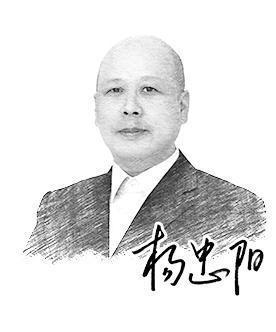

# 某网红“炮轰”宁德时代 经济日报：观点偏激 对动力电池产业理解不深刻

这两天，任泽平炮轰宁德时代：天下苦“宁王”久矣，胁迫车企、挤压上下游利润的话题引发巨大争议。该文章说，近年宁德时代四面开战，引发广泛关注，打压竞争对手，胁迫车企，挤压上下游利润，进而认为“宁德时代从早期的创新者、贡献者，到后期的行业垄断者甚至是市场公平竞争生态的破坏者”。

如此偏激观点所暴露的是对动力电池产业理解的不深刻。动力电池是一个非常需要规模效应的行业。由于电池是化学技术，新材料研发应用过程较为漫长。

在现有材料体系相对稳定的背景下，随着智能制造工艺水平的快速提升，规模效应已成为动力电池企业降低成本、提高市场竞争力的重要手段。

规模优势本就是包括动力电池在内的制造业的显著特征。对制造型企业来说，“产业链话语权”的重要性不言而喻。而“产业链话语权”主要就来自于规模、技术和管理能力。

有了技术，企业可以暂时领先，而技术的扩散性特征决定了这种领先只能持续一段时间。在进入产业成熟期之后，更加重要的是规模。有了规模，企业可以获得最低的采购成本。而毫厘之间的价格差异，可以直接决定一家企业的生死。

研究机构发布的数据显示，去年前11个月，宁德时代在全球市场的占有率为37.1%。这样的市场占有率，也让其容易招来“垄断”的非议。问题在于，垄断是指一种相对稳定的结构和状态，而动力电池是高速发展的行业。现在全球头部电池企业都在拼命扩产，以拉大与对手之间的差距。最近，韩国LG新能源就宣布，要投资4万亿韩元（约合213.2亿元）提高产能。国内比亚迪电池市场份额提升也很快，如果宁德时代“打个盹”，就会有被国内外竞争对手超越的可能。这提醒我们，分析企业行为和市场变化，要有发展的眼光，而不能刻舟求剑。

同时，作为一个技术驱动型行业，专利也是企业保护知识产权、维护自身权益的重要手段。比如，美国苹果公司曾与韩国三星展开“专利大战”；吉利控股起诉威马汽车侵犯知识产权。

因此，不能简单地认为企业就专利起诉竞争对手，便是借助行业地位打压同行。

每一个汽车强国背后都挺立着一批掌握话语权的零部件供应商。燃油车时代我们缺乏举足轻重的零部件企业。我国新能源汽车产业之所以能引领全球，除了国家产业政策前瞻性地引导外，其中很重要的因素就是在产业链上培育出了宁德时代这样的关键核心零部件企业。

2014年5月24日，习近平总书记在上海汽车集团考察时强调，“发展新能源汽车是我国从汽车大国迈向汽车强国的必由之路”。要实现这一目标，就需要在各个零部件领域涌现出更多掌握产业链话语权的世界级领军企业。

但这样的企业不是“抄”出来的，也不是“吵”出来的，而是靠埋头苦干、扎实创新得来的。只有锚定创新，才能够让我国制造业在全球产业分工中更有地位和竞争力，真正实现高质量发展。
（杨忠阳 来源：经济日报）

