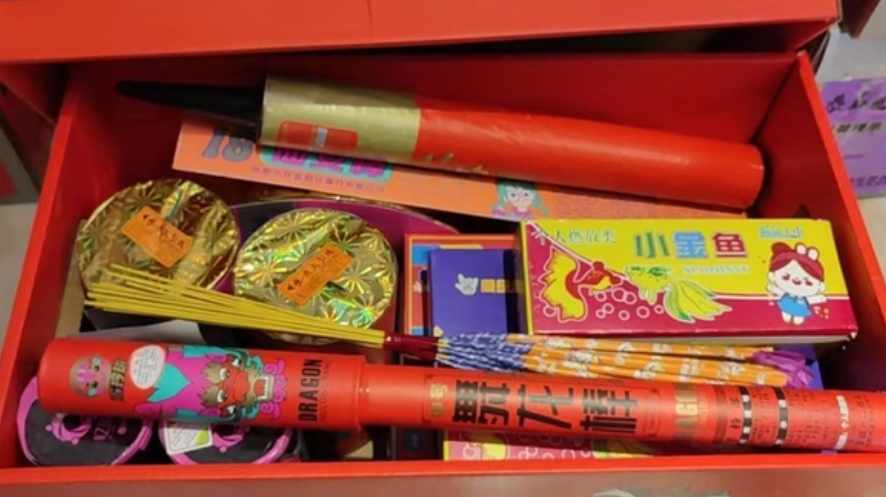

# 浙江省政协委员：烟花爆竹不能“一禁了之” 需尊重民俗

随着春节临近，“过年期间能否燃放烟花爆竹”再次成为公众普遍关注的问题。

“建议在全省范围内改‘禁燃’为‘限燃’，把年味还给春节。同时借鉴疫情以来健康码和场所码的应用，为烟花爆竹赋‘安全健康码’，做到全流程可追溯。”1月11日，浙江省政协委员、浙江传媒学院教授葛继宏告诉澎湃新闻（www.thepaper.cn），他已向当天开幕的省政协十三届一次会议提交了关于在浙江范围内有限制地燃放烟花爆竹的建议。

春节燃放烟花爆竹是中华民族的传统民俗。近年随着“禁燃令”推行不少人感觉“年味”越来越淡。澎湃新闻注意到，随着群众呼吁松绑烟花爆竹“禁燃令”之声增多，目前全国已有包括辽宁大连、山东东营、广东珠海等多地调整烟花爆竹燃放政策，即在规定时段、规定区域可以燃放烟花爆竹。

“浙江在内的很多地方，仍以‘文明’或‘安全’为由一禁了之。”葛继宏表示，烟花的“禁”与“放”应该成为各地有关部门必须正视的公共议题，在情与理中找到环保安全和尊重民俗之间的平衡，找到各方诉求的“最大公约数”。

葛继宏建议，春节期间可让市民在指定地区、有组织地燃放烟花爆竹。“限燃”主要分为时间限制和地区限制。时间以传统的春节为宜，由各地因地制宜选择其中几天在规定的时间内允许燃放烟花爆竹。地区限制方面建议
**不能进行类似“主城区禁燃”的一刀切管理，**
而应以社区为单位，在辖区内选取合适的地区，如空旷的操场、广场、运河边的空地等作为“烟花广场”，市民可在指定的时间段内、就近选择“烟花广场”进行燃放。燃放完后应主动清理、归置相关垃圾，减轻环卫工人清扫压力。

安全方面，葛继宏表示，随着科技进步相关企业已生产出一系列药量小、噪音低、安全又环保的烟花产品，以适合城市环境的燃放。有关部门可进一步对上市销售的烟花爆竹赋“安全健康码”，做到全流程可追溯。同时使用者在燃放时需通过“安全健康码”解码才能在限定区域点火，“好比给烟花爆竹设置了类似共享单车的安全锁，只有在符合燃放条件的区域才能点火”，如市中心只能燃放低药量、小规格的烟花，城郊可适当放宽规格限制，超规格燃放者应予以处罚，并列入诚信档案。

改“禁燃”为“限燃”，也是拉动消费、提升产业能级的需求，葛继宏认为，为解决有可能产生的衍生问题，可以考虑设立“烟花税”，将这部分税收收入用于研究相关的环保问题，给予消防、公安、环卫等协同成本，从而实现良性循环，促进花炮行业健康有序发展。

松绑的同时还要多措并举让大众明确知悉禁燃区，如医疗机构、学校、敬老院、车站、码头、机场、文保单位、输变电设施、山林、草原等区域及周边严禁燃放，加大安全教育。官方也可有组织的以“烟花大会”的形式集中燃放，并以此为媒介打造浙江文旅新名片。

