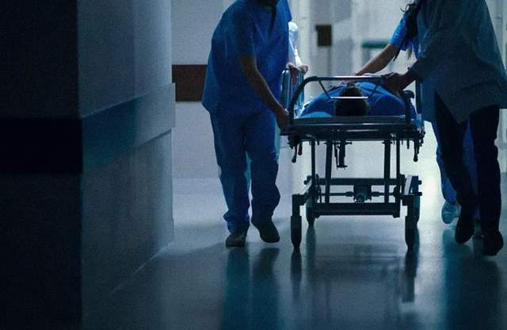
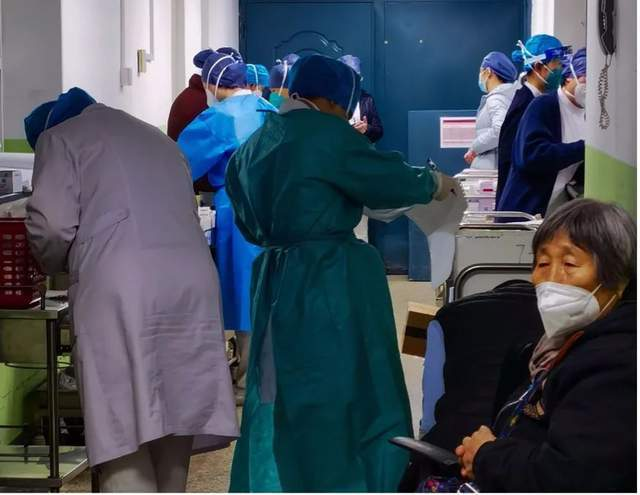
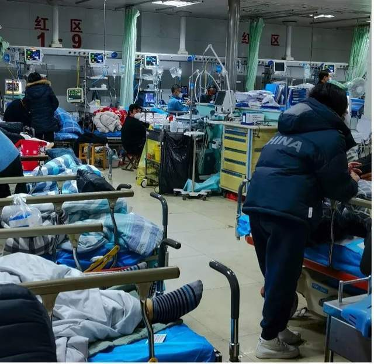
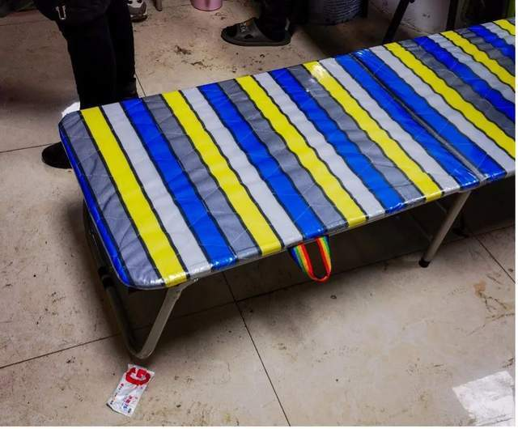
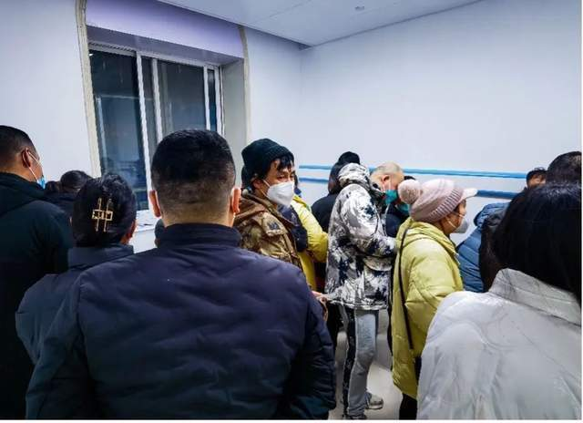
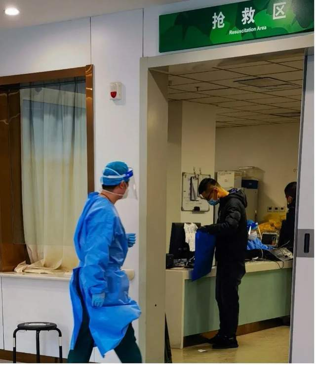

# 生死急诊室：2分钟接诊一个病人，8小时不吃不喝

一周7天，10080分钟，急诊科医生孙东辉陀螺一样转个不停。

2023年第一周，他所在的三甲医院急诊和发热门诊每天涌入1000多人，是平时的一倍多。医生们相当于不到2分钟就要接诊一个病人。孙东辉耳边除了医疗器械的“嘀嘀”声外，听到最多的就是，“医生，快来。”

**文 × 林樾**

**编辑 × 雪梨王**

刚给一位老人插上管，孙东辉耳边再次传来急救声。他是某三甲医院医生。

“快！患者高烧、晕厥，呼吸心跳骤停！”同事在一旁大喊。孙东辉冲过去，对患者实施胸外心脏按压。气管插管、使用呼吸球囊，将抢救药物通过静脉注入体内也几乎在同一时间，一气呵成。

几分钟后，患者从死亡线上回来了。孙东辉舒了口气。

这是发生在1月1日晚上8点多的一幕。这些在外人看来惊心动魄的抢救场景，对孙东辉而言早就是家常便饭。这一个多月来，他所在的急诊大厅每天熙熙攘攘，犹如春运。

孙东辉就职的这家三甲医院，在华北地区名气颇高，是当地收治患者最多的医院。疫情政策放开后，医护人员面临的压力更是前所未有。“最近急诊和发热门诊每天都来1000多人，是平时的一倍多。”孙东辉说，相当于24小时不停歇，不到2分钟就要接诊一个病人。其中近一半患者超过65岁，几乎需要抢救。

_正在忙碌的医护人员。摄影：林樾_

为了保证这段时间人手充足，医院将600多名医护人员“钉”在了急诊和发热门诊上，24小时轮班工作，大多人吃住在医院。新的一年开始了，但对他们来说并没有什么改变。

2023年第一周，仍有数不清的病人从四面八方涌入急诊大厅。

由于没有足够的床位，患者们多会自带折叠床，在急诊大厅找空隙躺下，等待医生问诊。陪同家属一脸茫然地穿梭在密密麻麻的输液架和氧气罐之间。

急诊大厅温度很高。隔着N95和面罩，孙东辉能感受到黏稠的空气吸入鼻腔：“既有病患呼出的气体，也有消毒水和药物的味道，太难受了。”

**“医生，快来”**

快一个月了，孙东辉一直没回家。虽然每天只上8小时小夜班（17点-24点），可他担心将病毒带回家，索性吃住在医院，家里大小事情都顾不上。

这意味着，只要一穿上防护服，就要在8个小时内不吃不喝，也尽量不上厕所。

孙东辉所在的急诊科，是全年、全天不间断接诊的部门。新冠疫情以来，他们既要落实防疫要求，又得保证急诊质量。防控政策放开后，大家本以为能轻松些，可随之而来的是大量阳性患者和有基础病的人。

正式进入急诊大厅前，患者要先在门口预约分诊登记、量体温、测抗原，每一步都有医护人员陪同。这部分工作多由实习生承担。完成这些前置程序后，医生会根据情况，将患者分为5个等级——危急、危重、急症、轻症、非急。前三种病症，救治时间最短不能超过半小时，后两项则至少要等一两个小时，甚至4个小时。

确定等级后，危急病人会被送入单独病房，危重患者则能分到有很多床位的红区病房，急症人员被安置在急诊大厅一侧的黄区病床上，其他人要在大厅里的绿区耐心等待。

也因此，红区、黄区、绿区的医护人员会呈现出两种工作状态——前两个区域一直在插管、上呼吸机、心肺复苏，后者多是查体、抽血、输液。

孙东辉最担心的还是那些危急患者，尤其是感染了奥密克戎的危急患者。

1月2日晚上10点多，救护车送来一位发烧且无法自主呼吸的老人。孙东辉和同事接诊后，马上对其进行紧急气管插管抢救，老人症状稍稍得以缓解。随即，这位老人又检测出新冠阳性，双肺已严重感染。由于该类老人普遍有基础病，抵抗力非常差，会给治疗带来诸多复杂性，孙东辉赶紧联系其他科室进行会诊。

_一家三甲医院的红区病房。摄影：林樾_

刚处理完老人的事，急诊又来了一位阳性的主动脉夹层病人。这位60多岁的男性不仅胸部疼痛，血压也急剧下降。并且，他的胸主动脉随时有破裂可能，必须马上手术。于是，孙东辉又赶紧联系相关医生。

处理完这名患者的情况，已经24点了。孙东辉拖着疲惫的身躯和大夜班（24点—早上8点）同事交接，按程序脱掉防护服，给自己全身消毒，开始吃饭、洗漱。

真正入睡是凌晨两点以后了。躺在宿舍的床上，他终于有时间好好看手机——几乎每次下班，他都能收到几百条微信，大多是亲戚朋友发的，内容无非是咨询病情或想让其安排住院。对于询问病情的人，孙东辉能答尽答，但对想找关系的朋友，他婉拒了。每天处理完这些事情，他才能安心入睡。

按照医院的制度，孙东辉可以休息一整天。但他白天睡不着，近段时间因为人手不足，他常被急诊拉过去帮忙。

下午5点，孙东辉又开始了小夜班。1月3日这晚，他刚接班，救护车就将一名阳性老年急性心肌梗死患者送到急诊。孙东辉马上为他插管，恢复心跳等生命体征后，又赶紧联系手术事宜。这个病患才放下，又一名抗原阳性老人过来了。老人说自己突然四肢无力、头晕恶心，脖子疼痛难忍。孙东辉和同事赶忙安排其查CT、做核磁，发现是多种脑部疾病，马上又安排手术。

事实上，这些危急病人，孙东辉后期根本不用再管，但有时他会多问几句。比如前几天，一个中年女性患者“转阴”后突发心肌炎，转入重症医学科。

这段时间来了很多“转阴”的心肌炎病人，孙东辉也想知道到底该怎么治疗。他主动问了重症医学科医生，对方说：“给她联合了IABP（主动脉球囊反搏）和ECMO（人工肺）治疗，恢复情况很好。”

了解完情况，孙东辉转过头继续忙手头的患者，给他们上呼吸机、支气管镜、气管插管、吸痰……站在红区和黄区的病床前，他耳边除了医疗器械的“嘀嘀”声外，听到最多的便是：“医生，快来。”

_一名病人在等待救治。摄影：林樾_

可有时候医生确实没法及时赶到——一是忙不过来，二是被防护服包裹的他们，听力会受到些许影响。孙东辉和同事也总因为没能及时回应患者疑惑，而被家属谩骂指责。

他委屈，但也没办法，“每个人都有手机，我要敢还嘴，人家一拍发网上，不仅毁了自己，医院名声也会受损。”他忍得了谩骂，但有一类事情总让他揪心——由于平时极少有时间关心家人，很多医护人员往往直到家人来急诊看病时，才知道他们病了。一提到这些，孙东辉就有些控制不住情绪，“作为医生，连家人都无法保护，我们肯定是失职的。”

1月4日晚，他一个同事的父亲到急诊看病，这位同事和父亲说了不到一分钟话，门外又来了辆救护车。

车上下来的是一名70多岁的老人，新冠阳性，发烧数日，胸闷气短。经过检查，老人不仅肺部有问题，血氧饱和度也在下降。孙东辉和那位同事赶紧给他气管插管，上呼吸机。

忙完手里的活，这位同事找不到自己的父亲了。她打了电话才知道，父亲已经去了另一家医院，“你们这太忙了，我也没那么严重，你快忙吧。”

挂了电话，这位同事在原地哭了起来。

**绿区与折叠床**

相比对重症患者的救治，急诊大厅的绿区显得有些“草率”——这个区域的患者病情相对较轻，更多时间里，他们在等待与忍受。

没有危急、危重病人需要抢救时，孙东辉经常在绿区待着。由于病患太多，整个区域显得慌乱嘈杂。无论从哪个角度看过去，都是黑压压一片。护士推着转运床、配送物资小车，不停在人群中穿梭。

绿区没有病床，只有些用于输液的椅子。椅子上永远坐着人，新来的病患只能自己找地方躺下或坐着。医生和护士甚至会提醒一些家属，去医院附近买张折叠床。

也因此，不断有人拎着折叠床进来。这种简易床每个售价100元，有人用完后，会低价出售给其他患者。至于床放到哪里，医院根本不管，哪里有位置，就塞在哪里。

_100元一张的折叠床，是很多人的病床。摄影：林樾_

随着大量病患涌入，急诊大厅、诊室走廊、药房前侧、厕所旁边以及任何一个犄角旮旯，都摆满了折叠床，床下放着夜壶、洗脸盆、洗漱包和各种颜色的被褥。床上躺着的多是老人，他们大多眼睛紧闭，在呻吟声中消磨生命，家属或在旁鼓励，或呆呆地坐在马扎上一言不发。

“大多都有基础病，这段时间过来的，又多是肺部感染。”孙东辉直言，轻症病人虽然比较好处理，但除了输液外，很多人也得吸氧、做心电监测。

在绿区的医护人员丝毫没有自己的时间——他们只要一出现，马上会被围得水泄不通，有人问诊，有人让看片子，有人需要换药，每个人都火急火燎。

事实上，虽然划分着绿、黄、红几个区域，但在实际工作中早就混乱了。“这里流动性太强，患者病情变化又快，每个人必须有更迅速的处置能力。”孙东辉透露，绿区也有不少危重病人，因为医院腾不出床位，只好让他们躺在这里。

这意味着，绿区的医护人员每天也要面对生命垂危的患者——意识障碍、呼吸衰竭、脑血管病、室颤……这些人不是上呼吸机，就是插着管。

1月5日上午，孙东辉起床后到急诊室帮忙。他刚换上防护服，一名老年女性患者被救护车送过来，转运车旁边是患者的儿子：“医生！我妈意识模糊了，能先救她吗？”

没有迟疑，孙东辉和同事赶紧将面色发紫、脉搏正消失的患者放到绿区。接着进行胸外按压、插管、吸氧等一套流程，总算将患者暂时救了回来。

1月6日晚上，再次有特殊病人被送到绿区。这名男性老年患者发着高烧，呼吸困难，血氧度60%。由于家属不知道老人是否感染新冠，医护人员只好一边抢救，一边做核酸。

插管后，老人转危为安，核酸结果显示为阳性。孙东辉和同事稍稍紧张了一下，赶紧叫来工作人员对所涉区域进行消杀。

“我们倒不是怕被感染，主要是感染后减员太严重了。”孙东辉说，前段时间，他超过三分之二的同事都阳了，最近大家陆续转阴后，情况才好一点。在他看来，医护人员只要感染，来急诊的患者就可能丧命。孙东辉至今未感染，但他每天仍然紧张，他不想在特殊时期倒下来。

1月6日晚上10点多，孙东辉一个同事突然低烧。没等她缓一下，救护车拉来一名70多岁的大爷。大爷意识不清、呼吸困难，血氧度只有50%。

“抢救！”孙东辉大喊了一声。那位同事马上打起精神，为患者插管、上呼吸机、心电监护……当患者有所好转时，他们开始询问其病史、检查、安排CT。一整套动作完成后，孙东辉发现那位同事一直在掉眼泪。

_急诊大厅内忙碌的医护人员。摄影：林樾_

孙东辉让她赶紧休息。“稍等会儿吧，还有好几个喊着换药呢！”同事说完，推着配送物资的小车继续穿梭在绿区人群之中。

刚换了没几瓶药，一名怀孕8个月的孕妇被救护车拉到急诊。孕妇在家烧到39.2度，抗原显示为阳性。没有选择，正发烧的护士马上加入救治队伍。

孕妇被分流到相关科室后，救护车又送来一名发着高烧的7岁女童。女孩因伴有遗传病，生命体征不稳定。孙东辉的同事马上进行救治，并迅速联系儿科大夫。所有这些忙完，又是夜里12点了。发烧的护士脱掉防护服，走进急诊大厅，让同事为自己挂上了输液瓶。

大夜班的同事接班后，急诊大厅继续忙碌着。

“医生，快一点”“血压没了，心跳没了”“赶紧插管”“又来一个”……

**为患者搏命**

在孙东辉的观察中，2023年第一周，来急诊的人少了些，但总体还是高出之前许多，“目前在急诊逗留的，多是其他病症的阴性患者，阳性人员直接引到发热门诊了。”

而发热门诊和急诊一样忙碌——因为人手不足，医院临时抽调了很多科室的人去支援，连口腔科医生都没放过。

发热门诊在急诊大厅外的角落里，经过此处的人们难免下意识加快脚步。

早期的发热门诊只有30张床，后来增加到50张。这段时间阳性重症患者激增后，医院又在其他病房楼腾出近300张床位，用于急诊、发热门诊分流过来的阳性病人。

_近日，一家三甲医院的诊室场景。摄影：林樾_

发热门诊也是24小时开诊，接待的阳性患者既有发烧、头晕、胸闷的常见症状，还有很多肿瘤、心梗、脑梗患者，以及孕妇和儿童。每天都有上百人需要呼吸机，还有少量人员得用ECOM（人工肺）。

除了发热门诊，孙东辉所在医院的重症医学科也承受着巨大压力——这个被称为“生命最后一道防线”的部门，就是公众常说的ICU。

该科室一位护士透露，“送到这里的病人大多无法自理，我们得24小时照料，稍有不慎就可能让患者丧命。”近段时间很多医护人员因此放弃了休息，每天连续工作20个小时早就是常态了。“我最怕听急诊打来的电话。”这位护士说，她只要听到“呼吸衰竭”“多器官衰竭”“心跳呼吸骤停”等词语，心里就会一激灵。

**这场“战役”中的医护人员，没有谁是轻松的。**

孙东辉透露，除了大家熟知的呼吸科外，神经内科、骨科、血液透析科、麻醉科、血库等也早都被调动起来了。比如，脑血管疾病属于神经内科，冬季本就是这类病症的高发期，加上疫情因素，这个科室变得格外忙碌。最近，一位有脑血管疾病的老人突发疾病，他不仅是阳性感染者，血氧度也在急剧下降。最终，急诊联系神经内科后，老人被抢救过来。

再比如骨科。由于阳性重症太多，该科室很多病房直接改成隔离病区。科室人员每天做的多是转运病人、交接病历、整理床位等体力工作。

_每天时刻抢救患者的医护人员。摄影：林樾_

还有后勤保障人员。孙东辉透露，这段时间，食堂的工作人员每人每天都要工作12小时以上，凌晨4点起床，早上6点多必须将数百人的饭菜做好。消杀及保洁人员则需要24小时待命，“一桶消毒液几十公斤，消杀人员几乎全天在背着。”孙东辉想想都痛苦。

随着大家普遍阳过一轮后，医院各部门的人员压力稍小了些，但他们或将面临新的压力。

自
1月8日开始，新型冠状病毒感染从“乙类甲管”调整为“乙类乙管”。实施“乙类乙管”后，官方对新冠病毒感染者不再实行隔离措施，不再判定密切接触者；不再划定高低风险区；不再对入境人员和货物等采取检疫传染病管理措施，对新冠病毒感染者也会实施分级分类收治，并适时调整医疗保障政策。

这当然是基于医学专业判断的改变。但也有病毒学专家担心，在国内疫情尚未过峰的情况下，药品、医务人员都较为紧缺，“乙类乙管”可能将对医疗资源造成巨大压力。

在孙东辉看来，压力是肯定存在的，他们能做的，就是继续精细化就诊流程。“其实，作为急诊医生，我几乎感受不到什么（变化），每天依然忙忙碌碌。”孙东辉甚至可以预见，春节前后，自己不会有私人时间。

1月7日下午5点，他刚接班，已经有6个病人在等他处置了。正要开工，门外又来了一辆外地救护车。车上下来一名40多岁的女子，孙东辉询问她的病情，她只是一直说，“喘不上气，喘不上气”。

孙东辉扫了一眼黄区和绿区，竟找不到一个能让她躺下的地方。他和急救人员抬着患病女子到处找地方，最终在离厕所几米处，看到一块2平米左右的空地，就地进行诊治。

_不少医院将病床摆到了走廊。摄影：林樾_

大厅外，两辆救护车呼啸而来，闪烁的车灯在冬日的黑夜里格外刺眼。

“一周7天，10080分钟，我们时刻都在为患者搏命。”孙东辉现在最大的期许，就是希望春天赶紧到来。

（应被访者要求，文中孙东辉为化名）

版权声明：本文所有内容著作权归属凤凰周刊冷杉故事，未经许可，不得转载、摘编或以其他形式使用。

