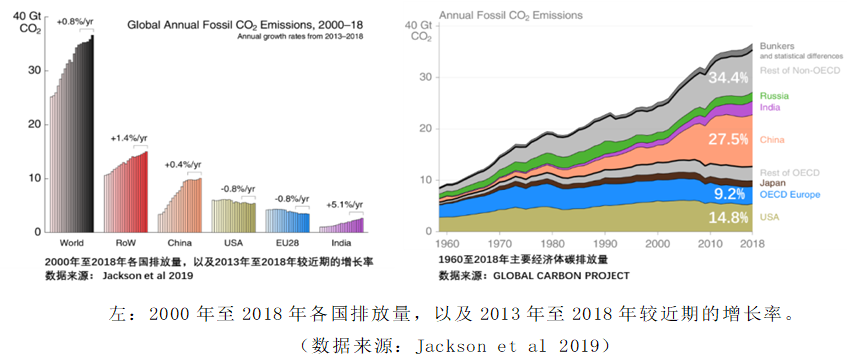
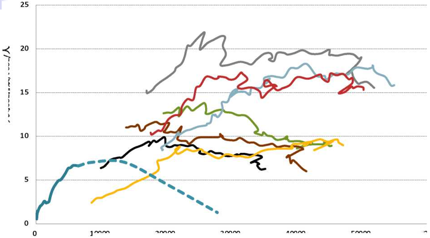
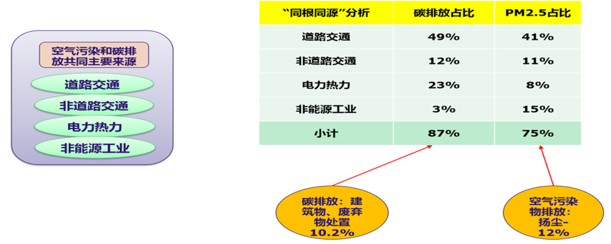

# 碳中和下的“刀锋之路”，刘世锦：如何在减排压力下保持高增速？

长安讲坛总第394期演讲专家｜刘世锦，论坛成员、全国政协经济委员会副主任刘世锦

原文标题《以创新促进减碳增长双赢与绿色转型》

在本次长安讲坛上，刘世锦还有哪些精彩观点？一起来看看：

  * _1_ 目前中国人均GDP为1万美元，2035年要达到3-4万（中等发达国家水平）美元，此后还要达到6-7万美元（前沿发达国家的水平）。既要马儿跑得快，又要马儿少吃草、少排放乃至零排放，对中国来讲确实是一个非常大的挑战。
  * _2_ 有些地方提出能耗双控的月度指标，为了完成指标就拉闸限电，减少生产甚至停产，能不能用这种做法来减碳呢？实现碳达峰碳中和目标，关键是用绿色技术替代传统技术，是要减少碳排放，而不是减少生产能力，更不是在不具备绿色技术的情况下人为打乱正常供求秩序。在这个过程中，一定要遵循绿色转型规律和市场规律，否则就会适得其反。
  * _3_ 近期有的地方在减污降碳过程中，对高耗能或高碳行业实行一刀切限制，不论是否采用绿色技术，是否达到绿色标准，全都按照一定比例限产，其结果是减少供给，助长价格上涨，同时也伤害了推动绿色转型企业的积极性。实际上是另一种形式的懒政行为。
  * _4_ 我认为应实施进取型减碳战略的三支柱体系。实施进取型减碳战略，就是要在稳住存量、保障能源供应稳定和安全的前提下，把重心转向更快地扩大增量，对能够增加产出、促进增长的低碳、零碳和负碳技术产品提供强有力的激励。这种激励并不限于少数措施，而应是相互依存的三支柱体系。
  * _5_ 四十年前，我们面临的问题是农村能不能搞联产承包责任制，深圳能不能搞特区。这些问题都得到解决，那条河已经过去了，现在我们遇到的是哪条河呢？中国要实现高质量发展，建立高标准的市场经济，实现高水平的对外开放，实现减碳增长双赢的绿色转型。这些问题没有现成答案，还得“摸着石头过河”。

编者按：

中国经济50人论坛成员刘世锦，全国政协经济委员会副主任，中国发展研究基金会副理事长，国务院发展研究中心原副主任，研究员，博士生导师。长期以来致力于经济理论和政策问题研究，主要涉及宏观经济、产业发展、经济体制改革等领域。参加中共十八届三中、十八届五中全会、十九大报告的起草工作，是中国国家十四五规划专家委员会委员、国家应对气候变化专家委员会委员等。曾多次获得全国性有较大影响力的学术奖励，包括两次获得经济研究界最高奖——孙冶方经济科学奖，中国发展研究特等奖等。

2022年10月13日的第394期长安讲坛，刘世锦以“以创新促进减碳增长双赢与绿色转型”为主题进行了一场演讲，系统阐述了中国双碳目标的提出和实施既是机遇也是挑战，提出碳中和目标将会带来一次产业结构的重大调整，一个重大的技术创新和投资机遇，一场配套的制度变革和创新，一次生活方式、生产方式、发展理念、发展方式的系统性重大变革。

**「“长安讲坛”是中国经济50人论坛创办的经济政策讲坛，2022年演讲专家包括隆国强、李扬、王一鸣、刘元春、刘尚希、黄海洲、刘伟、张晓晶、刘世锦、张宇燕、马建堂、杨伟民等顶级学者。（按演讲先后顺序排列）**

**2021年-2022年，长安讲坛独家与腾讯合作。腾讯新闻将就该系列讲坛提供独家报道，敬请关注。」**

遵守疫情防控相关规定，本期讲坛未进行视频录制。更多精彩内容，请查看刘世锦演讲实录：

**以创新促进减碳增长双赢与绿色转型**

**刘世锦**

各位老师，各位同学，大家晚上好！双碳是最近热度很高的一个话题，有一些理论难题，在实践中也遇到很多挑战。今天的主题是“以创新促进减碳增长双赢与绿色转型”，我从三个方面和大家进行探讨。

**一、双碳目标的提出和实施既是挑战更是机遇**

双碳目标的提出有一个大背景，即绿色发展已经成为全球共识和潮流。当然，关于应对气候变化是有争议的，科学家发现碳排放增加是导致全球气温上升的因素，但也有人持不同观点，甚至国际上有类似阴谋论的说法，认为这是西方国家企图延缓发展中国家的发展等等。

我们先看一下现实情况。截至2020年12月，国际上准备或已经提出碳中和目标的国家有126个，覆盖全球GDP的75%、总人口的53%、碳排放的63%。

有25个国家以纳入国家法律（或拟议立法）、政策宣示等形式，明确提出了各自的碳中和目标，包括世界前十大排放国的中国、日本、德国、加拿大、英国和韩国。还有99个国家以口头承诺的方式提出碳中和目标，除乌拉圭拟在2030年实现碳中和外，其余各国均计划于2050年达到碳中和。可以看出，不管是否存在分歧，各国都已经行动起来了。

2020年9月22日，习近平主席在第七十五届联合国大会一般性辩论中宣布：中国将采取更加有力的政策和措施，二氧化碳排放力争于2030年前达到峰值，努力争取2060年前实现碳中和。这就是中国的“30-60”目标。

目前世界上中国、美国、欧盟和印度是碳排放的主要国家，碳排放占比超过一半。中国碳排放总量占世界总量的27%（近两年略有提高），总量高于美国，中国的人均碳排放水平低于美国，但与欧盟的水平相当。

中国提出这个目标有什么重要意义？

第一， 中国作为一个负责任的大国，不可能置身于潮流之外，而应积极加入。

第二，中国是目前碳排放量最大的国家，没有中国的积极参与，全球减排目标不可能实现。

第三，中国倡导全球命运共同体，国际上要求中国在应对气候变化中发挥重要或“领导”作用的呼声较高。中国环境与发展国际合作委员会（简称国合会）是我国绿色发展对外合作的平台，目前由韩正副总理任主席，中国和加拿大的环境部长、联合国副秘书长任副主席，我是中方首席顾问。我和外方首席顾问在合作研究的过程中经常听到，国际社会对中国有很高期待，希望中国发挥重要作用。

第四，在当前动荡复杂的国际形势下，应对气候变化是中国与发达国家能够对话合作的少有且处在优先位置的领域。大家知道，中美关系现在处在一个困难的局面。2022年10月12日，美国白宫发布《2022年国家安全战略》，与以往美国国家安全战略相比，此次《战略》重点已将中国明确列为其“首要竞争对手”及“最大地缘政治挑战”。

但是美国也提出，应对气候变化是与中国有可能进行合作的一个重要领域。2021年4月15-16日，中国气候变化事务特使解振华与美国总统气候问题特使克里在上海举行会谈，讨论气候危机所涉问题。会谈结束后，双方发表联合声明。
**在当前复杂的国际大变局之下，应对气候变化至少是共识度较高的领域，也是中美合作的一个渠道。因此，中国必须站出来，而且要走到一个适合的位置上。**

中国未来要走的道路，难度相当大，有两个基本约束条件。第一，中国人均碳排放已达7吨以上，超过欧盟，尽管还有十年的达峰前时间，但这个空间并不大。因为这是碳中和目标约束下的碳达峰，达峰水平越高，下一步碳中和的难度越大。

第二，目前中国人均GDP为1万美元，2035年要达到3-4万（中等发达国家水平）美元，此后还要达到6-7万美元（前沿发达国家的水平）。既要马儿跑得快，又要马儿少吃草、少排放乃至零排放，对中国来讲确实是一个非常大的挑战。摆在我们面前有几条路：

第一条路，高碳高增长。很多发达国家都走过这条路，当工业化比重达到峰值以后，逐步转到服务业为主的发展阶段，碳排放就会达峰。因此，发达国家基本上是在没有或少有减碳压力之下，通过结构升级和技术进步实现“自然达峰”。对于中国来讲，这条路已经走不通了。

第二条路，低碳低增长。人均碳排放不再增加，同时人均收入停留在1万美元，也不再增加，这样可以吗？当然不可以，中国还要继续发展，要进入发达国家行列。所以，第二条路也不能走。

**只有走第三条路：低碳或零碳较高增长。** 在双重约束下，选择采取低碳或零碳的绿色技术和产业体系，同时实现高生产率，力争减碳和增长双赢。

一个超大型经济体，在人均GDP为1万美元，有碳中和目标、巨大减排压力下，仍要保持较高增速，不放弃进入发达国家行列目标，未有先例。

从这个角度来讲，中国在做一件前无古人的事情。中国的可选空间很窄，而且面临着很大的不确定性，可以说是“刀锋之路”。

大家可能感到有点悲观，或者信心不足。其实思维方式转换很重要，挑战蕴含机遇，思路决定出路。如果转换思路就会发现，山穷水尽无疑路，柳暗花明又一村。在挑战面前，中国也有自己的优势。

**第一，提早转型有利于降低转型重置成本、沉没成本。**
中国在人均收入1万美元水平上转型，相比发达国家在3-4万美元或更高水平转型，从转型的历史进程看，将会支付较低的传统非绿色产品的生产和运营投资成本。

中国不少产品仍未达到需求峰值，可直接由绿色产品替代，如美国、欧盟和日本交通部门排放达峰时千人乘用车保有量分别约为845、423和575辆，而中国目前仅有221辆，在汽车普及期，可直接购买新能源汽车。

发达国家要为传统汽车的生产、使用、运维等有更大投入，而这些投入存在资产搁置和减值的风险。下图反映了主要经济体人均GDP与人均排放的关系，可以看出，人均GDP达到1-2万美元以后，碳排放逐步下降。

**第二，相应地，中国经济增速较高，可为绿色产品创新和推广提供更多市场需求，有利于形成商业模式。**

过去三十年，中国年均经济增长速度将近10%；从高速增长转向高质量发展之后，近几年增长速度是6-7%，现在的潜在增长率是5-5.5%，仍相当于美国的2-3倍。

绿色产品创新之后需要推广，这在很大程度上取决于市场需求，如果市场需求空间大，成功的概率就比较高。中国有巨大的绿色需求增长空间，有利于形成新的商业模式。

**第三，中国在绿色技术、产业领域已有一定积累，并不像以前那样差距大，有的方面处在并跑、领跑位置，利用换道之际，赢得技术和市场竞争优势。**

和历次技术革命相比，过去我们是难以望其项背，而这一次差距已经缩小，特别是新能源汽车、光伏发电、风电，包括最近在储能、绿氢等领域，中国的技术水平有些已在全球领先，这方面的成功案例越来越多。

**第四，利用数字技术优势助力绿色发展。这二者是增长新动能的两翼。**
我一直讲一个观点，所谓中国经济结构性潜能，很重要的一点就是数字技术加绿色发展，它们是天生一对。

有研究指出，数字技术在能源、制造业、农业和土地利用、建筑、服务、交通等领域的解决方案，可以帮助减少15-37%的全球碳排放。中国在数字技术诸多领域，与国际前沿水平相比处在并跑或领跑位置，与绿色技术相融合，将会大量赋能于绿色发展。

**第五，制度和政策优势。**
国合会的外方专家讲到一个感受，生态保护的概念在西方国家特别是欧洲提的比较早，而且整个社会认同度比较高，也是一种社会潮流。而中国提出生态文明建设，西方从来没有提过，他们也很感兴趣，认为是更高层次的理解。

同时，中国还提出五大新发展理念，其中之一就是绿色发展。这些概念和理念提出之后，通过广泛传播，逐步形成社会共识，碳中和目标形成预期引导。还有比较重要的一点，中国是一个强政府，对绿色发展和双碳目标的实现能够发挥积极作用。

把上面五个方面结合起来看，中国的机会可能比发达国家更多。所以习总书记特别强调，提出双碳目标不是别人让我们做，而是我们自己要做。这是国家发展到特定阶段的必然选择，虽然挑战很严峻，但是如果能够利用好这些优势，对我们来说也是一个重大机会，将会提升我国技术和产业竞争优势。当然，
**用好优势需要条件，就是推动技术创新和制度创新。**

**二、起步阶段要立足长远，打好基础，有序推进**

两三年前，关于碳中和的概念没有几个人能说清楚，但是随着碳中和目标的提出，影响是全面的，社会各个方面都动起来，开始重视双碳问题。

**碳中和目标将会带来一次产业结构的重大调整，一个重大的技术创新和投资机遇，一场配套的制度变革和创新，一次生活方式、生产方式、发展理念、发展方式的系统性重大变革。**

还可以把视野拉的更长一点，自工业革命以来，开始是农业文明，后来是工业文明，现在是第三次文明——生态文明，所以这是由生活方式到生产方式，从发展理念到发展方式的全方位、系统性变革；是农业文明到工业文明转型后，由工业文明到生态文明的另一次全面转型。

回到现实，情况相当复杂，并不是想象的那么顺利。举个例子，去年7月份有些地方拉闸限电，甚至停工、停产，理由是要完成双碳目标。从近期出现的这些情况来看，需要认真探索、理解和尊重绿色转型规律，围绕双碳目标积极有序合理的推动绿色转型。

需要关注和讨论“三个不能”，三个政策目标，两个创新。

首先讲“三个不能”。 **第一，减碳不能“单打一”。** 减碳不宜单兵突进，而要推动降碳、减污、增绿、增长协调推进。

中国作为发展中国家，与发达国家的不同之处在于：人均GDP刚过1万美元，工业的比重相对较大，传统的环境污染治理虽然取得很大进展，但仍未到拐点；生态破坏、生物多样性保护问题依然突出；有必要有可能争取较快经济增长，中速增长可以保持较长时间。

而发达国家的情况是：第一，一般是服务业为主的经济，环境总体上比较好，重大污染问题已经解决；第二，整体植被也不错，生态环境比较好；第三，增长已经进入成熟期，比如欧洲增长1%，日本经常负增长，美国增长2%，很难出现中速甚至高速增长。

所以发达国家的这些特征已不明显，主要是碳减排的问题。我们不一样，这几个方面都要抓，都要硬，不可偏废，要形成协同机制，更有利于减碳。

有人会问，降碳、减污、增绿、增长协同推进，会不会忽视了减碳？不会，反而更有利于减碳。空气污染和碳排放在很多场景下具有同源性。

以深圳为例，道路交通、非道路交通、电力热力、非能源工业这几项加起来，碳排放占比和PM2.5占比非常接近，百分之七八十以上同源，什么意思呢？就是排PM2.5的时候也在排二氧化碳。碳排放和空气污染都有外部性，但这两个外部性差异很大。

碳排放是全球最大的外部性，多排碳能够增加生产，进而增加收入。但是二氧化碳排出以后，引起气候变化，这是全球性的外部性。而空气污染不同，周边居民受到的影响较大，距离远的人一般不会有直接影响。

比如某个企业排污超标，周边居民肯定反映强烈，政府治理的时候要花钱采取措施，大家是拥护的。这个企业同时也在排二氧化碳，如果花钱治理二氧化碳排放，或者减产甚至关停并转，导致很多人收入下降甚至失业，地方财政收入也下降，大家可能不愿意干。

但其实这两件事情是合在一起的，比如治理交通污染，既减少二氧化碳排放，也减少碳排放。所以，要坚持降碳、减污、增绿、增长四位一体协同推进。

**第二，减碳不能“运动式”。** 去年7月份，有些地方提出能耗双控的月度指标，为了完成指标就拉闸限电，减少生产甚至停产，能不能用这种做法来减碳呢？

实现碳达峰碳中和目标，关键是用绿色技术替代传统技术，是要减少碳排放，而不是减少生产能力，更不是在不具备绿色技术的情况下人为打乱正常供求秩序。在这个过程中，一定要遵循绿色转型规律和市场规律，否则就会适得其反。

通常我们讲破旧立新，“旧的不去，新的不来”，而在绿色转型中，应当是“新的不来，旧的不去”。今天晚上同学们都在听课，教室里灯火通明，用的可能是绿电，也可能是燃煤发电，如果认为燃煤发电增加碳排放，不用了，那就没法上课了。

所以能源供应一刻不能停，对连续性要求很高，着眼点首先要放到形成新的绿色供给能力上，有了新的，再去替换旧的。

**第三，减碳不能指标错位。**
在推动双碳目标实现过程中，我们采用了能耗双控这个指标进行考核和监管，即能耗总量（总的能源消耗）和能耗强度（每单位GDP所消耗的能源）。

节能减排是对的，但是能源节约到底怎么实现？能源消耗总量能不能精确的算出来？受到疫情以及国际能源价格上升等因素的影响，2022年四季度增长速度有很大的不确定性，如果GDP增长速度都无法准确推算，怎么知道要消耗多少能源？

从经济学角度说，用实物的数量指标，如某个行业产量、生产领域中包括能耗在内的投入品数量，作为或实际上成为宏观考核和监管指标，容易造成资源配置的扭曲，按下葫芦浮起瓢。

节能和减排不一样，减少碳排放要用行政性办法，而节能更多还是要用市场的办法，比如把煤价、电价放开，价格高了自然消费就少，通过价格调节供求，压低成本，所以节能会成为一种内在动力。

但是，一方面很多能源价格没有完全放开；另一方面，用行政性的方法来控制数量，这不仅仅是具体政策问题，更是一个重要的经济学理论问题。这也是我们为什么要由计划经济转为市场经济的深层原因之一。

接下来是三个近期政策目标。 **第一，尽快实现能耗“双控”（能耗总量和强度） 向碳排放“双控”（碳减排总量和强度） 转变。**
节能有利于减排，但不能划等号，能源供给既可以是高碳，也可以是低碳甚至零碳。

经济增长需要相应的能源供给增长，一个地区、一个行业直至一个企业，究竟需要多少能源，事先是不可能精确计算的，能耗的直接数量控制有可能影响增长。而且一般意义上的节能，主要是一个降低成本的问题，应主要通过市场机制来实现。

由能耗双控转到碳减排双控有利于促进能源结构绿色转型，同时有利于经济稳定和增长。

**第二，高碳行业不搞一刀切，实行“放开、稳住、限制”相结合的区别化政策。**

近期有的地方在减污降碳过程中，对高耗能或高碳行业实行一刀切限制，不论是否采用绿色技术，是否达到绿色标准，全都按照一定比例限产，其结果是减少供给，助长价格上涨，同时也伤害了推动绿色转型企业的积极性。实际上是另一种形式的懒政行为。

建议对高碳行业实行“放开、稳住、限制”相结合的区别化政策，具体地说，放开绿色生产、投资、技术创新和推广的空间；稳住对经济社会安全和平稳运行直接相关、短期内难以被替代的环节；有序限制其它非绿色生产、投资并加快实现绿色转型。

**第三，加快制定受冲击领域的风险防控与产业就业重整规划和政策安排。** 据测算，在碳中和的目标下，2050 年中国非石化发电量占总电量的比例将超过
90%，煤炭比例则将降至 5%以下。

山西、内蒙等以煤炭为主的传统能源地区，将面临主体性产业替换的严重冲击。钢铁、有色、化工、水泥等高耗能产业为主导的区域也面临着同样挑战。绿色转型将会引起高碳资产价值下跌和重估，成为金融风险的另一个起因，有可能影响区域性金融稳定。

有关部门和地区应抓紧制定前瞻性、针对性强的规划方案和政策措施，包括替代技术的引入、接续产业的培育、员工退出安置和再就业培训、金融风险防控、相关企业关闭重组等。

**三、进取型减碳战略的三支柱体系**

中国能源和经济绿色转型应该走一条什么道路？这是个很复杂的问题，改革开放和发展的历史经验可以借鉴。正确理解和处理增量和存量的关系，对转型成功至关重要。

比如，民营经济开始时是拾遗补缺，由于内生的活力、韧性和竞争力，逐步成长为在国民经济中发挥“五六七八九”作用的举足轻重的生力军，并且带动了国有经济的改革和发展。

对外开放也是如此，开始是“三来一补”，起步于沿海少数地区，以后带动中国成为全球性的贸易和投资大国。

中国的能源应该也必须走一条“增量优先、以新代旧、激励创新、市场驱动”的转型之路。按照有关研究，到2060年，中国的非化石能源由目前的不到20%增长到80%以上，由配角成为主角。

从成本角度看，作为存量的传统高碳能源，尽管仍有一定的减碳空间，但潜力具有累退性，越往后空间越小，难度相应加大、成本加快上升；另一方面，作为增量的低碳或零碳新能源，随着产量扩大、技术改进，成本下降加快，部分产品的绿色溢价由正变负。

新能源替代老能源的减碳成本优势增大，进而加快新老能源比例的转换进度。

在现实中可以观察到三种不同的减碳类型。第一种是衰退型减碳，通过减少生产来减少碳排放。像刚才讲的拉闸限电、减产停产都属于这种类型，虽然一般不会出现，但在去年特定情况之下还是出现了。

第二种是增效型减碳，就是通过提高碳生产率，用同样多的碳排放实现更多的产出，或者同样的产出使用了较少的碳排放。我们经常讲的节能减排，节约优先等，大体上相当于这种类型的减碳。

第三种是创新型减碳，是指通过创新形成新的技术、工艺、方法等，在达到相同产出的情况，实现了低碳、零碳甚至负碳排放，如用风、光、水、生物质等可再生能源发电。如果用这类技术去替代原有的高碳技术，就可以在实现相同产出的前提下减少碳排放。

以上三种减碳类型，衰退型减碳暂且不议，增效型减碳体现了积极导向，特别是在技术落后、管理粗放的情况下，提升能源和碳生产率还有很大空间。但局限性也很明显，随着技术和管理进步，碳生产率的提升会出现递减，持续提高的空间收缩。

更重要的是，这些变化主要局限于已有的技术和产业框架内，即便有技术创新，也属于所谓改进性创新，而不是颠覆性创新。

比如我国的超超临界发电机组，每度电使用燃煤水平已达国际先进水平，进一步减少的空间很小，成本会大幅提升。更重要的是，归根结底还是用煤发电，而煤是一种高碳能源，这个事实并没有改变。

绿色转型的核心是绿色技术创新。由传统工业化发展方式转向绿色发展方式，从根本上说要靠绿色技术驱动，大规模、系统性地“换技术”。绿色技术应该达到三个目标。第一，高技术含量和生产率；第二，少排放或零排放；第三，与传统产业相比有竞争力的低成本。

只有效率提高、排放减少、成本降低，绿色技术才能登上大雅之堂，由配角变为主角。

创新型减碳跳出已有的技术和产业圈子，具备了前两种减碳类型所没有的特点和优势。第一，创新型减碳可以实现长时间内对传统高碳技术或产业的替代。

所谓的绿色转型，从根本上来说，就是要换技术，用低碳、零碳或负碳技术去替代原有的高碳技术。

第二，创新的内在冲动性和不确定性，决定了人们不可能限定它的扩展边界。不难设想，如果可控核聚变能够成功并商业化，人类将在很大程度上改写可再生能源的认识版图。

第三，大幅度降低人类社会应对气候变化的成本。比尔盖茨在《气候变化与人类未来》这本书中提出一个重要概念——绿色溢价，即一个绿色产品和传统产品相比，它是低碳甚至零碳，但是价格更高，高出的部分称为绿色溢价。随着创新竞争加剧，价格下降，不少产品的绿色溢价已经为负。

典型案例是光伏发电。过去的十年间，光伏发电成本下降了80-90%，已经低于燃煤发电成本，还有进一步下降的潜力。应对气候变化的一个重要挑战来自成本冲击，创新带来的成本下降，可以极大增强人类应对气候变化的信心和能力。

第四，产生更多的附加效用或福利，创造更多的消费者剩余。

以新能源智能汽车为例，消费者不能说不关注碳减排，但大部分消费者直接感受到的是使用成本低，电子设备应用得手，舒适程度高，操控感觉与以往大不相同，自动驾驶能力也在逐步提升。

大部分优点是减碳之外的，意味着为社会提供了超出预期的福利。

第五，触发和加速了能源等高碳行业的数字化进程。数字经济是继农业经济、工业经济之后的另一种经济形态，整个经济社会正经历着向数字经济形态的转型。

即使没有双碳压力，能源、工业、交通、建筑等高碳领域也会进入数字化转型，创新性减碳推动这些领域成为数字化转型的领先者。

由于具备以上五个方面的优点，创新型减碳启动和引领了远超减碳预期的经济社会发展绿色化、数字化转型。衰退型减碳和增效型减碳主要体现的是一种防御型战略，而创新型减碳则是一种进取型战略。

应该承认，在较长一个时期，我们对进取型战略已有认识和展望，但想法和做法基本上还是停留在防御型战略。挑战在于，如何尽快地由防御型战略转向进取型战略？

从现实来看，尽管创新型减碳有很多优势，但目前缺少足够的市场激励。不同的战略趋向，体现在目标、政策，更实际的要看激励体系。我重点分析一下碳排放权交易市场。

对于碳排放这样具有全球外部性的物品，不可能指望市场直接发生作用，首先要有政府的介入，由政府“制造”市场。诺德豪斯、斯特恩等气候变化经济学的领军者都提出要给碳定价，具体办法有配额加交易和征收碳税，并期待碳排放权市场能够发挥重要作用。

然而，不论是最早兴起的欧洲碳市场，还是近期开始运作的中国碳排放权市场，实际运行状态似乎远不及预期。

这些市场均存在结构性缺陷。比如只有部分高排放行业和企业被纳入市场，与“应入者”范围差之甚远，这样不仅覆盖面不够，公平性问题也显而易见。配额初次分配基本上免费发放，实际付费只发生在“调节余缺”环节。

配额分配由历史法转为基准法是一个进步，但考虑到供给安全和稳定，配额发放规模难以降幅过大，在很多情况下，监管者很难区分供给安全是实际存在还是生产者的借口，如此等等。

由于这些因素的影响，碳排放权市场价格发现以及相关的调节供求、促进创新等作用就会大打折扣。

我国已经建立起全球规模最大的碳排放权市场，这是一个重要进步。但由于诸多因素制约，过去一年的交易额不到2亿吨。碳排放权市场目前对自愿核证减排即CCER类型碳汇交易尚未启动，并设立了5%的交易规模比重限制，是一个对整体市场结构难以产生大的影响的份额。

更重要的是，随着时间推移，与快速增长的新能源和绿色产业规模相比，主要依托于老能源的碳排放权市场的非对称性将愈加明显。这样，我们看到最有活力的创新性减碳难以能得到市场激励的眷顾。

针对这种情况，我认为应实施进取型减碳战略的三支柱体系。实施进取型减碳战略，就是要在稳住存量、保障能源供应稳定和安全的前提下，把重心转向更快地扩大增量，对能够增加产出、促进增长的低碳、零碳和负碳技术产品提供强有力的激励。

这种激励并不限于少数措施，而应是相互依存的三支柱体系。

**第一个支柱：建立全方位支持绿色技术创新的创新型减碳市场。**
所谓创新型减碳市场，是指运用低碳、零碳和负碳技术，在获取相同产出的情况下，与原有的高碳基准生产方式相比，所减少或抵消的碳排放量交易而形成的市场。

比如，发同样多的电，与燃煤发电这种高碳生产方式相比，通过新技术（如光伏发电）发电的排放减少并被抵消了，相对减少被抵消掉的这部分即为创新型减碳，把这部分减碳的量进行交易而形成的市场，称之为创新型减碳市场。

这个市场应有强包容性，包括绿电等绿色能源产品，也包括钢铁、有色、建材、化工等高碳行业能够产生增长型碳汇的产品，如绿氢炼钢等。还可包括森林碳汇和其它负碳技术产品。

也可包括个人消费领域的碳排放权交易。按照个人碳排放平权的原则，在个人消费领域平均发放碳排放配额，部分消费水平较高者可以购买消费不足者转让的配额，也可直接购买创新型减碳指标，以平衡个人碳账户。这样机构和个人都可成为市场参与者。

起步阶段可以选择条件较好的地方建立区域性市场，可以先形成“碳资产池”或“绿碳银行”，由地方政府提供专项资金（相当于过去对创新型减碳产品的补贴），对进入创新型减碳市场的产品按照一定价格进行初次购买，然后转入市场流通。条件成熟后，逐步形成全国性市场。

**第二个支柱：形成区域自主减排责任体系。** 增量优先的关键是扩大对技术创新产品的市场需求，而这一点又直接取决于减排责任体系的有效性。

可借鉴国际上巴黎协议的原则，鼓励各个地方的主动性，提出既合乎本地实际、又有一定挑战性的减排目标，与下一步陆续出台的落实双碳目标1+N政策相配合，形成省、市、区县和开发区等层面的区域减排计划和可追溯的减排责任要求。

区域或企业要完成减排任务有三种方法：第一，自身直接减排；第二，生产创新型减碳产品；第三，通过市场交易创新型减碳指标。这样减排责任体系就可以动员起持续的对绿色技术产品的需求，进而带动增量扩大、以新代旧的转型进程。

创新型减碳市场与减排责任体系建立后，将会形成市场导向，促进减碳、增长、降本、提效协同推进的内在机制，实现由能耗双控向碳排放双控的转变。

区域和企业可以从各自实际出发，不必搞一刀切的减碳指标。减碳将成为基于专业化分工优势的事情，能者多减，通过交易实现区域总体减排目标。各地正在建设的低碳零碳园区和企业可以获取更多的创新型减碳收益，并不会因为先减排吃亏。

高碳但有市场、高收益的企业一定时期内也不必限制生产甚至停工停产，可以拿出部分收益购买创新型减碳指标，平衡自身碳账户，给能增长的企业、产业和地区放开发展空间。

这样就可以为由能耗双控向碳排放双控过渡创造条件，在完成地区碳排放总量和强度指标的前提下，不再实行能耗双控，把节能指标调整为指导性、鼓励性指标。

率先建立这套机制的地区，对低碳零碳产业更有吸引力，将形成招商引资的新风口，尤其是西部清洁能源资源丰富的地区，可以优先发展包括绿色低碳高载能行业在内的新型绿色产业，增强产业竞争能力，为西部经济发展和全国区域协调发展提供新动能。

**第三个支柱：加快碳核算、碳账户为重点的绿色微观基础制度建设。**
不论是推进创新型减碳市场建设，还是完善减排责任体系，前提是有要一个合格的碳核算基础，而这恰恰是目前的一大短板。

在碳核算的起步阶段，可以采取的从上而下的方法，先把基本情况摸清楚。同时要普遍建立碳账户，包括企业和其他机构的碳账户，有条件的地方也可以建立个人碳账户。

在企业中推广ESG评估，率先在上市公司和大型企业中形成稳定规范的ESG评估的披露制度。把更多的融资活动纳入绿色金融轨道，借助增长型碳汇开发多种类型的金融产品，进而为绿色技术创新提供切实有效的支持。

创新型减碳市场的运作，像技术审核和认定等工作，应由市场组织者和专业化服务机构依照国家有关法律法规进行。

如同资本市场的证券公司，碳市场应由专业化服务机构提供上市服务。如出现漂绿等违规违法行动，应按照市场规则严惩，以市场规则和纪律保障碳汇产品质量。政府主管机构要由直接审批者转变为政策制定者和市场监管者，指方向、划底线，维护市场秩序，促进公平竞争。

上述三支柱体系有较高的技术要求，需要符合国内外相关规则，包含复杂的协同机制和合约关系可以利用区块链、人工智能等数字技术，将三支柱体系中的相关内容“打包”进一个完整的数据运行体系，进行实际操作运转。

这方面已有成功案例。数字技术与绿色发展的融合，将会大幅度拓展应用场景。进取型减碳的三支柱体系，既可以在全国范围试行，更具可行性的是在某些省、市、各类开发区范围开展试点。

促进绿色创新，既有技术创新，也有制度政策创新，绿色创新和转型面对大量未知和不确定因素，仍然需要“摸着石头过河”。

四十年前，我们面临的问题是农村能不能搞联产承包责任制，深圳能不能搞特区。这些问题都得到解决，那条河已经过去了，现在我们遇到的是哪条河呢？中国要实现高质量发展，建立高标准的市场经济，实现高水平的对外开放，实现减碳增长双赢的绿色转型。

这些问题没有现成答案，还得“摸着石头过河”。在国家顶层设计指方向、划底线的前提下，鼓励地方、基层、企业和个人的积极性、创造性，通过积极探索，找到有创意、可落地、能管用的政策和做法。

还是需要调动地方的积极性，可在创新意愿强的省、市层面先行先试，给出一定的试错探索空间，取得成功经验后，完善提高再推广。

