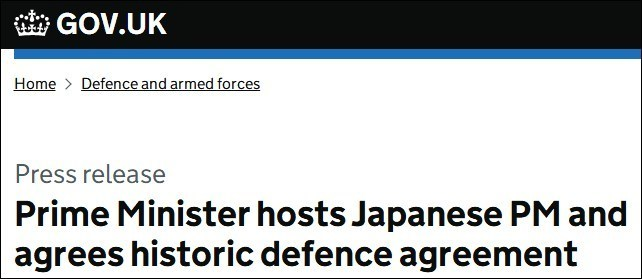

# 英国日本将签署“英日同盟”以来最重磅防务协议，两国可以相互驻军

【编译/观察者网
李焕宇】1月11日，英国政府在其网站上宣布，首相苏纳克将会在当天同日本首相签署一项具有里程碑意义的防务协议，允许两国在接下来的一个多世纪里将军队驻扎在对方国家的领土上。

英国政府将该协议称之为“1902年以来英国和日本之间最重要的防务协议”。在那一年，英国为遏制沙皇俄国的扩张，同日本签订了同盟条约，史称“英日同盟”。

_英国政府网站上的公告_

英日防务协议将在几周内提交给两国国会。英国政府在其公告中称，协议将大大加快两国的防务和安全合作，使英国和日本能够在对方国土部署部队。它还将巩固英国对印度—太平洋地区安全的承诺，使两国军队能够规划和开展更大规模、更复杂的军事演习。

英日两国近期展开高频互动。除了防务协议，两国在上月启动了一项数字伙伴项目，以加强英日在运维弹性、网络安全和半导体领域的合作；另外在几周前，两国还和意大利一道，宣布将共同研发下一代战机。

英国政府称，所有三项协定都体现并强化了了英国会确保印太平洋地区安全与稳定的坚定承诺，并体现了英国和日本之间友谊的深度。英首相苏纳克称，这一互惠准入协议对两国都具有重大意义——它巩固了两国对印度—太平洋地区的承诺，巩固了两国维护经济安全、加快国防合作、推动创新、创造高技能就业机会的共同努力。

苏纳克宣称，英日两国对世界有共同的看法，对面临的威胁和挑战有共同的理解，并有着共同的雄心。他们要利用两国在世界上的地位为全球造福，确保两国在未来几代的时间里繁荣昌盛。

他强调：“在这个竞争日益激烈的世界里，在全球都面临着前所未有的挑战时，民主社会继续肩并肩地站在一起比以往任何时候都更为重要。”

虽然被拿来同该协定做比较的《英日同盟条约》针对的是沙皇俄国，虽然俄乌冲突在两国接下来的议程中仍占据重要地位，但无论是法新社还是《金融时报》都认为，新的防务协定针对的是中国。

《金融时报》称，尽管俄乌冲突迫使英国政府重新评估其全球战略，但协定是英国寻求提升其在亚太地区的参与度以对抗中国影响的结果。

法新社也表示，该协议是英国在亚太地区日益增长的兴趣的最新迹象，也是日本努力加强其联盟以应对中国挑战的最新迹象。

伦敦国际战略研究所高级研究员格雷厄姆（Euan
Graham）认为，两国在双边防务关系方面向前迈了相当大的一步。它将使一方更容易“带着一艘驱逐舰访问你的海岸警卫队，或带着一支陆军，或一支皇家海军陆战队，同日本的两栖部队一起训练”。简单讲，协定为两国在彼此领土上部署军队进行训练和其他行动创造了法律基础，未来这种合作会更加“常态化”。

在此之前，日本已经同澳大利亚签署了类似协议。法新社表示，日本在上个月将中国列为“有史以来最大的战略挑战”；英国首相苏纳克则在去年11月就表示，中国对英国的价值观和利益构成了“系统性挑战”。

除了防务协议，英日两国接下来还要商讨两国贸易问题，包括英国加入《全面与进步跨太平洋伙伴关系协定》(CPTPP)的事宜；另外，由于日本将担任七国集团轮值主席国，英日领导人还会就两国支持、援助乌克兰的相关事项展开讨论。

1月11日，外交部发言人汪文斌主持例行记者会。有记者提问，预计今日英国和日本将签署一项防务协议，将允许英方在日本部署军力，据称这旨在应对中国所带来的挑战。中方是否会向英方和日方正式提出抗议？

汪文斌表示，亚太是和平发展的高地，不是地缘博弈的竞技场，中国是各国合作的伙伴，不是任何国家的挑战。有关国家开展防务合作，应当有利于增进各国间的相互理解、信任与合作，不应制造假想敌，更不应将集团对抗的旧思维引入到亚太地区。

**本文系观察者网独家稿件，未经授权，不得转载。**

