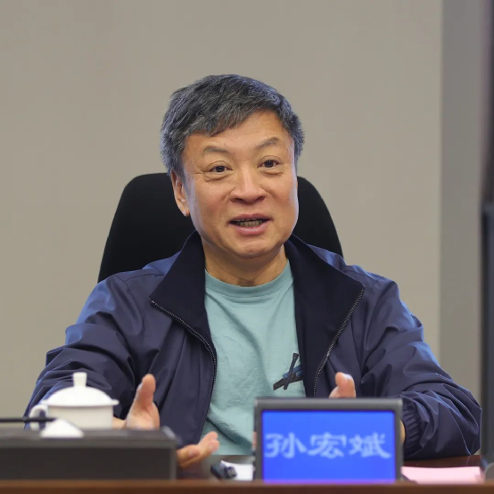

# 融创孙宏斌隐身大半年后现身，忙于自救被指消瘦，债务重组近尾声

2022年12月28日现身武汉的孙宏斌。来自融创官微。

作者 | 郭菲菲

编辑 | 杨布丁

出品 | 棱镜·腾讯小满工作室

年关将至，消失许久的孙宏斌终于露面了。

自从2022年5月，融创这家第四大开发商正式债务违约后，孙宏斌就很少现身了。曾经的“白衣骑士”开始四处奔波寻找援兵，拜会地方政府、国央企、AMC等金融机构，寻求被救的可能性。

2022年12月底，他现身武汉，与武汉城建集团签订合作协议。年近60岁的孙宏斌，依旧是一身T恤加上休闲装，但看起来比一年前消瘦许多，头发有些花白。

对于融创的自救进度，捕风捉影的消息从未断过，但利益方等了大半年仍看不到结果。如今，掌舵者重新高调现身，意味着公司债务化解的进度条被拉快：160亿的境内债务整体获得展期，境外美元债的展期也或将于近期完成，上海董家渡项目、武汉桃花源项目及深圳冰雪文旅城的处置都有了新眉目。

至少目前来看，处境不会比暴雷时更糟糕了。融创缓解了未来三年左右的流动性压力，孙宏斌可以暂时喘口气。

留待解决的问题仍旧不少。停牌超8月的融创股票何时复牌？文旅、酒店及会展等如何盘活？华北、西南区域挖的窟窿，区首调整后如何填补？超百亿的商票何以兑付等等。

当然，最为重要的还是卖房回款，这将直接决定孙宏斌能否东山再起。2022年，融创权益销售额已降至不足千亿，仅为977亿元，相比2021年的3615亿元已相去甚远。

**超800亿境内外债务展期欠缺诚意？**

2022年4月1日，一支名为“20融创01”、总额达40亿元的境内债券回售在即，孙宏斌却掏不出来钱了。

“1月份刚配完股，加上老孙借给公司的钱，融创吹风说如期兑付没问题，有各种应对方案。结果股票债券价格双双大跌，评级降低，后来说利息也没有着落了。”一位上述融创债券投资者向作者回忆称。

彼时，融创首次承认，资产处置、专项融资等多种资金方案均难以执行，“近期面临阶段性流动性困难”。

多方博弈后，包括上述债券在内的四笔债券在同年4月获得展期，融创暂时躲开了债务违约。以“20融创01”为例，除展期18个月外，还增加了孙宏斌承担无限连带责任的个人担保，以及追加青岛阿朵小镇、郑州中原文旅城两个项目的部分股权，及50亿元应收账款债权作为质押增信措施。

北京一家私募基金投资人周伟（化名）嗅到了商机，趁着价格跌破50元，抄底买入了上千万的融创债券，“当时笃定展期后的兑付没问题，后来没想到销售持续恶化”。

阶段性的困难渐成常态，暴雷声终究敲响。2022年5月12日，因为一笔美元债利息无法到期支付，融创正式宣告债务违约，境内外债务展期不可避免。

按照“20融创01”的首次展期方案，2022年5月、6月底前各支付10%本金，9月底、12月底，及2023年3月底、6月底各支付15%本金，直至9月底支付最后的20%本金。

对于兑付落地进展，周伟称，去年5月份第一笔本金支付后，6月份再次展期调整，仅兑付5%，等到9月底兑付时又没钱了，“听说找天津方面协调了一笔钱，兑付了10%，11月时听说还要展期，彻底没钱了”。

“这支债券换手率高，有很多私募和个人投资者，大家对再次展期的反对声音很高。救市背景下，其他债券（展期）更容易通过。”上述债券持有者告诉作者，听说久期投资的份额最大，持有30%，本来也要投反对票，迟迟未通过，所以投票延期了好几次，但最后关头倒戈了。

作者了解到，关于“20融创01”债券的三份展期议案，反对票均超过三成。

1月3日，融创公告称，总计160亿元的境内债券整体展期方案获得表决通过，共涉及10笔存续的公司债券及供应链ABS，包括“20融创01”在内的四支已经展期的债券，需至2025年底全额兑付；“H6融创01”等六支尚未展期债券，则至2026年底全额兑付。从展期设计来看，加权平均展期期限3.51年，且兑付金额前低后高，2025及2026年为偿债高峰期。

在增信措施方面，四支已经展期的债券，新增重庆文旅城、绍兴黄酒小镇的收益权；另外六支尚未展期债券，则新增包括广州文旅城、无锡文旅城、济南文旅城、成都文旅城、重庆江北嘴A-
ONE、温州翡翠海岸城的收益权。

所谓收益权，指不影响保交楼前提下，项目开发销售或出售产生的净剩余现金流，抑或出售自持物业产生的净剩余现金流的30%。

“收益权意义不大，项目资产的资金往来难以监督，只有老孙个人担保和应收款有价值。”周伟质疑称，展期方案并不友好，正常债权人都会投反对票，今年、明年分别只能拿到3%和15%的本金，担心拖得时间太久，经营没起色会再展期。“本身这就是信用债，这么搞等于没有信用了，带了个坏头，让你被迫接受，没什么反制措施。”

反观境外美元债务，孙宏斌递上的重组展期方案诚意并不高。

公告披露，截止到2022年6月底，融创境外有息负债规模为110亿美元，2022年底到期37亿美元。按照计划，公司对其中约91亿美元票据进行债务重组。这其中，拟将30亿至40亿美元债务转换为普通股，剩余债务将兑换为新的以美元计价公开票据，期限为自重组生效之日起的2至8年，并提供部分资产处置净收益，作为偿还新票据的额外资金来源。

《中国企业家》援引知情人士透露，融创境外债的展期方案及协议，预期也将于今年春节前后完成。

**金融纾困+资产出售双管齐下**

在资产处置方面，拯救房企的政策春风下，孙宏斌也迎来金融机构的驰援，这也给融创债务危机的解决带来些许曙光。

2022年11月底，融创全资控股的泛海建设控股有限公司发生股东变更，中信信托和华融分别持股64.678%、25%，融创股权降至10.322%。

泛海建设控股持有的资产包，包括北京泛海国际1号地块及上海董家渡两个豪宅项目。这是孙宏斌2019年花了148亿元，从泛海卢志强手中买入，堪称融创“压箱底”的核心资产。前者被开发为北京融创壹号院，但迟迟未能入市；后者位于上海外滩黄金位置，在开发一宗地块获得150亿元销售额后，项目因拆迁资金匮乏陷入停滞，剩余未售货值超过500亿元。

对于这一股权变更，融创介绍称，中国华融、以浦发银行牵头的6家银行组成的银团、中信信托等合作方，将对董家渡项目注资超120亿元。孙宏斌也现身合作意向签约仪式。

接近融创的人士透露称，此次股权转让并不是项目出售，华融以“股+债”方式介入纾困，股权设计为信托收益权方式，融创还是操盘方，华融行使监管职能，并保留使用融创品牌，融创会在未来融资偿还后回购股权。退出时，AMC和银行的融资享有优先权，融创股权劣后并在融资全部偿还后回购股权。

与董家渡纾困模式类似的案例还在增加。2022年12月，东方资产计划为融创武汉桃花源项目注资33.11亿元，用于化解原有债务以及支持项目开发，项目总货值约226亿元。此外，地方国资陕西金资也正式入股融创咸阳森屿城项目，近期首笔资金4亿已到位。前文提及的孙宏斌亲自站台与武汉城建集团的合作，目前暂未披露更多信息，后者或成为融创在武汉诸多项目的纾困方。

与此同时，孙宏斌还在为资产出售奔波。

1月3日，珠海地方国企华发股份以35.8亿元的价格，接盘融创持有的深圳冰雪文旅城项目公司51%的股权，其中包括35.7亿元的股权收购价款，以及1190万元的债权收购价款。交易完成后，华发持有冰雪文旅城股权从49%提升至100%。

这无疑给融创冰雪上市计划蒙下一层阴影，与此同时，这笔钱难以进入孙宏斌口袋。

融创公告称，此次出售预计亏损约5.1亿元，所得款项净额将用于偿还20.94亿元融资债务，后续将参与项目代建营销、冰雪及酒店项目的运营，并保留了51%的回购权，期限为2025年11月23日前。

尽管旗下优质项目获得了各类纾困支援，但由于出现债务违约，融创仅能享受到部分政策红利。

比如，此前超万亿规模的主流银行意向性授信支持名单中，暂时还未出现融创集团的身影。目前，仅有郑州融创城项目获得工商银行20亿元的意向信贷支持额度，以及融创西北区域获得秦农银行融资授信支持。

**孙宏斌“削藩收权”**

回望顺驰前车之鉴，在融创身上，孙宏斌似乎又踏入了同一条河流——超前举债扩张遭遇政策调控，致使资金链断裂。

“（我们）将深刻反思过去发展中的不足和问题，吸取经验教训，坚决调整。”在迟到大半年的2021年财报中，孙宏斌如此写道，争取在2023年回归良性、健康发展轨道。

房产自媒体《一勺言》披露称，在去年12月初的集团年会上，孙宏斌非常乐观，要求2023年6月底恢复正常经营，还在会上强调说，绝不躺平，要积极拥抱政策，抓住机遇，“融创有优质资产，团队有韧性，可以打赢翻身仗”。

内部调整已经开始。作者获悉，1月4日，融创内部发文，华北区域总裁迟迅调回集团总部，另有任用，由北京区域总裁助理兼石家庄城市总易绪兵接任。

一位融创华北区域员工告诉作者，这个变动从2021年业绩下滑开始就有迹象，去年年中内部会议上，老孙批评了大迟，大迟也积极表态了，元旦这次调整既突然也算预料之中，算石头落地了，华北这几个城市确实受疫情等宏观环境影响最大。

更早之前的2022年2月，孙宏斌将原有七大区域调整为九大区域，最引人关注的则是西南区域被拆分，区首商羽被调回总部负责投资业务。

作为追随孙宏斌打拼多年的老臣，迟迅和商羽双双被调离，与华北、西南两大区域盲目投资导致债务窟窿直接相关。前者在2021年的天津大本营成拿地冠军，逆势斥资118亿元；后者收购了邓鸿的会展文旅项目、广西章泰资产包，两笔收购合计251亿元。

以孙宏斌发家地天津为例，作者了解到，2022年初，融创在天津已经撑不住了，彼时兜售楼盘项目超过20个，当地监管层已经介入处理风险问题。此前天津国资委召集华润、保利、鲁能在内的多家央国企开会，询问收并购事项，但能令接盘者感兴趣的项目并不多，基本集中于梅江及海教园两个优质项目。

“以海教园项目为例，我们当时测算，楼面价过万就顶天了，周边竞品均价为2万-2.2万元。融创当时溢价43%，楼面价拍到1.2万，不卖到2.2万就基本赔钱，结果开盘就卖1.8万元。”一位TOP
30房企天津投拓人士感叹称，融创自己不会算错帐，激进拿地，赌的就是未来预期。他们并非按照单个项目的月度指标去汇报，而是按照整体区域分公司，只要现金流不断就能运转。

中指研究院数据统计，2021年融创在天津的合约销售额达167亿元，连续11年排名第一。但转年急速下滑，2022年前11月销售额跌至47.32亿元。

“原来区域权限很大，投资拿地集团管得很松，造成表面繁荣的假象，最近年底总部新成立三大中心，包括地产经营、投融资和资产运营，感觉老孙有点削藩收权的意味。”一位融创员工对作者感慨称。

融创公告称，2022年合约销售额为1693.3亿元，权益销售额为977.8亿元，同比均下跌超过七成，排名也掉落至第11位。

按照孙宏斌2022年底提出的未来七年计划，销售无疑被摆在第一位：“开发项目预期产生3200亿元现金流，酒店、商业、乐园等持有物业资产的账面价值约为1300亿元，部分资产变卖预计增加600亿元。”当然，这一预期建立在一系列前提上，包括未获新增项目、可售资产均可变现、诉讼可能的额外支出等。

境内外公开债务之外，来自上下游的供应商也在向融创讨债，商票追索权纠纷最为繁多。融创财报披露，截止到2021年底，应付票据同比上升42%至392.71亿元。

一位持有融创商票面额超过九位数的投资者告诉作者，融创商票此前的信誉度很高，只要有10-20%的面值利差基本都无脑收，但2021年底，手中持有的一处佛山项目商票无法兑付后，融创商票开始大面积违约。眼下最好的办法就是起诉商票对应项目公司以及前一手供应商，回款速度主要看法院执行进度，一般只有7-9折的回款比例，能从融创那要回来的钱很少，多是供应商赔付。目前已追讨回四成金额，估计最后能讨回七八成。

无论如何，债务重组接近尾声，以及核心资产盘活利好，艰难闯关的孙宏斌可以暂时喘口气。对于数万名融创员工也是如此。

一位融创成渝区域员工告诉作者，此前区域已经裁员近半，投发部门基本没了，留下的员工也普遍降薪10%-40%。除了渝西和环融公司，其余片区的工资也已拖欠了两个月，“公司没什么说法，大家都知道没钱”。

“不过，前两天开会传来好消息说，最近资金到位，拖欠的工资年前终于要发了。”上述员工称，至于年终奖，估计和去年一样都没戏。

**腾讯新闻出品内容，未经授权，不得复制和转载，否则将追究法律责任。**

