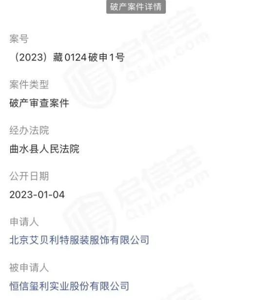
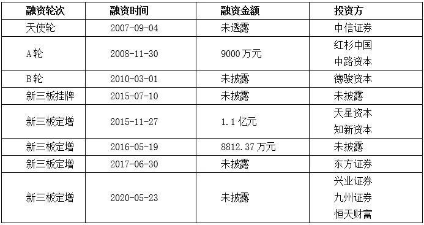
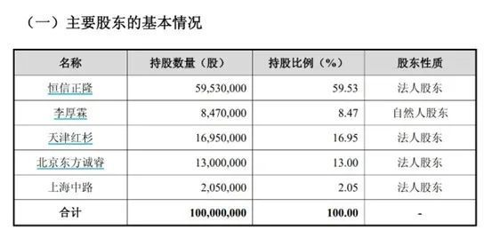
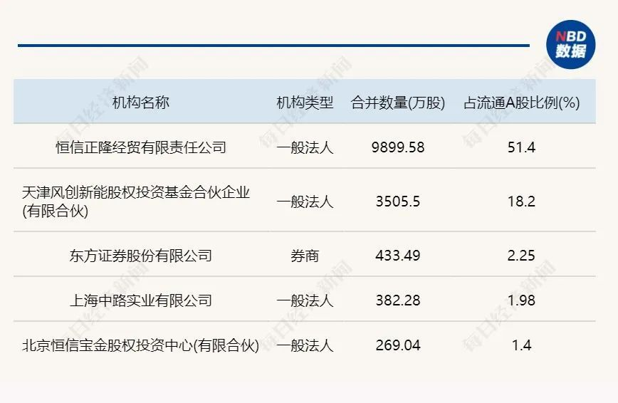

# 陈小春夫妇代言的钻戒品牌I Do，母公司被申请破产！大量员工欠薪，供应商讨债无门

每经记者：姚亚楠 每经编辑：赵云,卢祥勇,盖源源

“I Do，就是我愿意。”脍炙人口的广告语言犹在耳，曾经的珠宝跨界营销鼻祖、知名钻戒品牌“I Do”却已走到了破产边缘。

《每日经济新闻》获悉，近日，I
Do钻戒母公司恒信玺利实业股份有限公司（以下简称“恒信玺利”）新增破产审查案件，申请人为北京艾贝利特服装服饰有限公司，经办法院为曲水县人民法院。

_图片来源：启信宝_

恒信玺利成立于2007年，创始人为“钻石大亨”李厚霖。作为国内知名钻戒品牌，I
Do创立以来不仅在天猫、京东双平台钻石品类销量靠前，还曾获得中信证券、红杉中国等诸多知名投资机构青睐，不仅连续获得多轮融资，还多次冲刺IPO，但至今仍未成行。

记者注意到，去年社交媒体上就传出I Do拖欠薪资的消息，如今则曝出母公司被申请破产的消息。昔日的资本宠儿缘何跌落谷底？

**裁员欠薪，拖欠供应商货款风波不断**

李力（化名）曾是I
Do东北大区的一名员工，2022年10月，他突然接到了公司发出的解除劳动合同通知书，根据这份通知，因经营困难，东北办公室整体将被裁撤，不保留任何员工。而在此之前，他已经连续4个月没有发工资了，李力向每经记者介绍称，此前公司也出现过因为经营困难暂时不发工资，后来又补齐的情况，但没有想到这次他和同事们等来的却是解除劳动合同的通知书。

如果签署这份解除劳动合同通知书，公司承诺在2022年12月发放此前拖欠的薪水，相关经济补偿将于2023年6月30日支付，但直到今日，签署解除劳动合同通知书的员工并没有收到此前被拖欠的薪水，在他们打算申请劳动仲裁时，却发现东北大区原来所属公司西藏恒信凯鸿经贸有限责任公司哈尔滨第一分公司已经注销。

记者注意到，早在2022年初，就有多名声称是I
Do品牌的前员工在微博、小红书、知乎等社交媒体上爆料称，遭遇了变相裁员以及长达数月的欠薪，据爆料内容描述，品牌总公司及东北、华南等多个直营大区的员工在经过长达半年的讨薪后，仍然没有获得满意的结果。

近日，据媒体报道，一位I Do品牌前管理层人士曾透露，总部及大区被欠薪的员工最保守估计在三四百人，一线门店员工数量更是无法估计。据悉，I
DO中国市场分为华北、东北、华东、华南、西北、西南和上海等7个大区，这些大区为品牌直营公司，分管各个区域市场的品牌活动和加盟商。I
DO西北大区直营公司于2022年4月大规模裁员后不久解散，上海大区解散的时间是在2022年8至9月间，而东北大区则是在10月底。

除了被拖欠薪资的公司员工，I Do的供应商们近几个月来也一直在为被拖欠的货款四处奔波，张丽（化名）在哈尔滨经营一家花店，从2017年起就与I
DO品牌合作，为其在哈尔滨的直营门店和东北大区办公室定期提供鲜花展示、制作及养护服务，据张丽介绍，目前I DO共拖欠其2万余元的服务费。

“我从来没有想到这样的大公司会破产导致自己讨债无门，去年6月份左右，在我多次催促下，I
DO曾支付了一部分欠款，剩余款项此后就再也没有进展了。”张丽向记者介绍道，去年底，I DO关闭了东北大区办公室，张丽曾多次与I
DO北京公司联系处理欠款问题，“几经协调，他们曾提出过用公司货品抵欠款的方案，且要求我必须到北京取货，但很快就反悔了，当时工作人员告诉我公司已经被申请破产重整，所有资产被冻结，已经处理不了任何债务问题了。”

记者注意到，恒信玺利半年报显示，2022年上半年，受疫情等因素影响公司经营压力有所增加，终端门店数量减少，截至2022年6月，终端门店数量为630家。此外，员工数量也由2021年的1684人减少至1104人。除了门店及员工数量的减少，企业营收和净利润也在2022年上半年大幅缩水。半年报显示，2022年上半年，恒信玺利实现营业收入6.28亿元，同比下降41.99%；净利润704.44万元，同比下降88.62%。

恒信玺利在最新的公告中表示，目前该公司处于预重整阶段，若被法院宣告破产，则全国股转公司将终止其股票的挂牌。从1月9日起，恒信玺利股票停牌，预计将于1月30日前复牌。截至发稿，每经记者尚未收到恒信玺利的回复。

**曾获知名机构多轮加持**

**冲刺IPO近十次未果**

2021年12月17日，I Do品牌正式官宣陈小春、应采儿夫妇为品牌全球代言人。

此前，I
Do品牌被称为珠宝品牌跨界营销的鼻祖。不论是深度植入电影情节、邀请明星夫妇做代言人，还是“明星＋电商”的宣发模式，都收到了立竿见影的营销效果。但在这种重营销的“烧钱”模式背后，对资本的倚赖也显而易见。

从成立伊始，恒信玺利就是资本的宠儿，天使轮就拿到了中信证券的投资，后续更是连续获得了来自国内知名机构的多轮融资。根据睿兽分析和CVSource投中数据的相关信息，每经记者统计了恒信玺利的融资情况，让大家可以更一目了然地了解这家公司在一级市场的辉煌过往：

从这份投资者名单中我们可以看到，恒信玺利成立多年来获得了来自超过10家机构投资者的融资，其中不乏红杉中国这样的头部VC，足见机构对这家公司的青睐。

公开资料显示，从2011年开始，恒信玺利就向资本市场发起了冲击，当年两度递交IPO申请，但都未能如愿。在此之后，创始人李厚霖将方向转为借壳上市，但2015年4月上市公司宝光股份宣布因未能与恒信玺利有关方案达成一致，借壳重组案由此终止，IPO计划再次落空。

2015年7月，恒信玺利正式挂牌新三板。在公开转让说明书中我们看到，这家公司的主要股东情况如下：

除了控股股东、母公司恒信正隆和创始人李厚霖，机构投资者天津红杉和中路资本（上海中路）也在列。

接下来的2017年、2018年和2019年，恒信玺利又连续多次递交IPO申请，同时多次更换了辅导券商、注册地址、会计事务所等，均无疾而终。彼时曾有投资人公开表示：“公司当初能够获得投资，不排除是创办人的明星效应。新三板对于企业来说是起到规范经营管理体制的作用，推动企业信息披露和透明度建设，但是并不能保证企业业绩的良性成长。”

接连的IPO失利也产生了微妙的影响。2018年，恒信玺利彼时的第二大股东天津红杉清仓退出，接盘的是另一家珠宝品牌周大生控股的天津风创新能股权投资基金合伙企业（有限合伙），后者由此持股16.6%至今。

2022年10月底，有投资者在投资者关系平台向周大生董秘提问：“公司投资的恒信玺利公允价值持续下降，请问公司对其打算如何处理？”周大生方面的回复是：“目前恒信玺利是财务投资”。从公开资料来看，周大生投资恒信玺利数年中，双方鲜有业务合作和协同。

根据该公司最新公布的2022年半年报，目前恒信玺利的机构投资者名单如下。除了恒信正隆和李厚霖控股的有限合伙企业外，主要机构投资者目前还有周大生旗下的天津风创新能、东方证券和上海中路资本。

**曾经的资本宠儿，缘何跌落谷底？**

曾几何时，“I
Do”凭借成功的营销和密集的线上线下销售渠道，一度成为国内较为知名的钻戒品牌，也受到资本的青睐与热捧。但当喧嚣散去，业绩的下滑、多次冲刺IPO的失败都成为压垮骆驼的最后一根稻草，曾经的明星企业已经在破产的边缘徘徊。

到底是什么原因导致曾经的资本宠儿跌落谷底？

有VC人士向每经记者指出，巨额烧钱搞营销的模式不可持续，这一点已经在近年来的新消费品牌上体现得很充分。“营销烧钱驱动带来的销量与市场份额从某种程度上来说就是饮鸩止渴，没有产品创新能力等长线的内增长力，支撑不下去是迟早的事情，放在钻石珠宝行业也一样。”

艾媒咨询首席分析师张毅在接受每经记者采访时表示，从数据上来看，传统婚戒品牌普遍面临着业绩下滑的压力，而造成这一压力的原因是多方面的。

首先，疫情爆发后的几年由于大量婚礼不能如期在现场进行，对于相关行业例如婚戒等的影响非常巨大。

其次，婚介行业的主要用户群体也在发生变化，而这些“Z世代”用户对于产品本身以外的场景等综合和增值服务会看得更重，因此传统婚戒企业也应该改变和升级，对婚戒产品本身的结合以及周边提出一个整体的、升级的解决方案、

“面临这样的历史新机遇，婚戒行业有可能会形成一波小洗牌。对于企业而言既是机会，同时也是巨大的挑战。”

此外，值得注意的是，近年来，随着培育钻的走红，天然钻石开始走下神坛，这对传统婚戒企业也造成了一定冲击。培育钻石在实验室或工厂里通过一定的技术与工艺流程制造出来的，与天然钻石的外观、化学成分和晶体结构完全相同的晶体，价格约为天然钻石的三分之一，凭借更低价、原材料可持续等优势，培育钻石近一年来在消费端与资本市场颇受青睐。

此前，北京地区一消费赛道投资人即向记者分析称，相较于天然钻石的不可再生，培育钻的生产是可持续也更符合ESG投资下环保绿色的理念，并且Z世代年轻群体的猎奇、追新的消费观也更容易接受培育钻、太空金属等新材料打造的饰品，他们不容易被过去的营销思路所绑架，这就进一步打开了市场的想象空间。

**记者|** 李沛沛 姚亚楠

**编辑|** 赵云 卢祥勇 盖源源 杜恒峰

**校对|** 孙志成

｜每日经济新闻 nbdnews 原创文章｜

未经许可禁止转载、摘编、复制及镜像等使用

