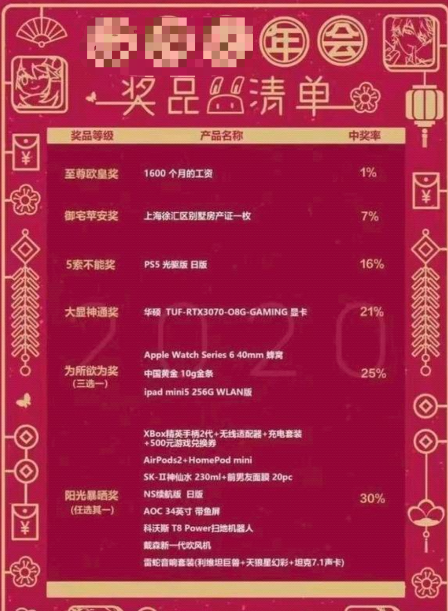

# “女孩要1888万彩礼”被当地回应是杜撰，但这事儿还是重男轻女的恶果

让我看看，多少人拖了后腿。

人外有人，天外有天，离谱外有更离谱。

这两天最火的帖子，非“1888万彩礼”莫属。

一名网友发帖自称上海“中产”，说自己在美国留学时与一名来自江西萍乡的女同学相识相恋，在即将喜结连理时，因为彩礼问题分手。

他表示，前女友的父母向他提出了1888万天价彩礼，数千万房产得过户到女方名下，女方上百个亲戚，每人给十万元红包，他对此无法接受。

要求之离谱，哥一直不敢相信真实性。

但有不少人声称已经发现了发帖者的真实身份，说的有鼻子有眼。

仅仅是几个留言，是否属实依旧有待商榷。

有认真者去天眼查搜了搜，并没有他们曝光的“严老总”和“严公子”两号人。

不过网友并不在意这些，关于江西彩礼的各种段子被玩得飞起。

1月12日，萍乡市民政局的工作人员回应，即将在江西门户官网通报此事，初步判断该文章内容系杜撰，当地彩礼上百万都很少，不符合常理和社情民情。

对于高价彩礼，哥一直觉着对男女双方都是一种压榨，男方苦不堪言，女方被物化“买卖”还帮着数钱。

还有一个观察，彩礼极高的地方，往前数几十年，都是女婴遭罪的时候。

仅仅从这个方面来说，哥多少是支持高价彩礼的，前提是彩礼能花在女孩自己身上，而现实往往相反。

还有一条发生在江西的离谱事儿。

在央视新播出的专题片《永远吹冲锋号》第二集《政治监督》中，介绍了江西省抚州原市委书记肖毅的荒唐事。

肖毅在抚州任职时，大力扶持一家叫“创世纪”的公司，表示这是为了大力发展抚州的数字经济，给盖楼给补贴给贷款给政策，还举债盖了个配套产业园，加起来花费近24亿元。

而这个创世纪公司，虽然“大数据”“云计算”喊的天花乱坠，其实主业就是挖比特币，也就是俗称的挖矿，这点肖毅一早就门儿清。

巅峰时，该公司有16万台比特币矿机和30万台以太坊矿机同时运行。

按照江西省的工业用电标准，这个公司一年光是电费高达10亿元，2017到2020的三年间用掉的电量占了抚州全市的10%。

为了掩盖耗电量，肖毅让人专门虚构了统计专报和调整用电分类。

干这些肯定不是用爱发电，据知情人透露，仅是比特币，肖毅就疑似靠创世纪公司弄了8000枚。

按照当时的价格，值22亿元。

目前，肖毅已经被提起公诉。

痛心有啥用，把浪费的钱和用掉的电还回来先。

违法了，就要接受惩罚。

1月12日，上海警方通报了一起打人案件，迅速冲上了热搜第一。

哥刚看到时百思不解，我寻思这不就是一普通的斗殴吗？

肯定有什么我漏掉的细节，再看看：几名男子因口角把受害者打成轻伤，事后又申请行政复议，暂缓了拘留的处罚。

没啥特殊的啊？

我是没想到，细节在“王某某（男，34岁）”上。

据新京报报道，权威人士表示，打人的王某某系王思聪。

挺严重的，打人被拘留，留案底，以后孩子考公都要受影响。

不晓得王公子这一出得多少钱？

上次年会哥铩羽而归，而新闻妹中了个新款手机，我也是这个感觉。

这两天，网传的一张某游戏公司“年会奖品清单”火了。

二等奖上海一套别墅。

一等奖1600个月的工资。

不过这张包浆的图我怎么瞅怎么熟悉，再看到背后印着的“2020年”，

果不其然，该游戏公司出来辟谣：纯属谣言。

幸好，不然哥嫉妒的口水都要留到渤海湾了。

话说年底了，你们公司年会送了什么？

奖品哥已经不关心了，满脑子只有怎么…还…没有…放…假…啊…

1月11日，四川省十四届人大一次会议在成都开幕。

省人大代表刘洪提出建议，希望春节提前2天放假，并且将3天春节法定假期增加至5天，加上一头一尾两个周末调休，春节假期将实际延长至9天，让路途远的市民可以早点回家团圆。并建议四川作为文化旅游大省，在全国率先试点。

你提这个建议我就不困了。

四川的朋友别愣着，快支持啊！

其实对哥来说，延长春节假期倒没那么紧急，把调休取消就行。

假期和劳动保障，一样也不能少。

近日，广州的王女士在去新公司的第一天，就因为已婚未育被辞退。

王女士称，当时她正在熟悉工作职责，随后人事找她谈话，说希望招一个稳定的不会怀孕的员工，在王女士明确表示了没有备孕计划后，依旧将她辞退。

没结婚了怕人请婚假，结了婚的怕人休产假，生了孩子的怕人平衡不了工作职场或者要二胎三胎，生了三胎的，哦，这个基本跟不上工作节奏了。

虽然很想站在道德高地指指点点，但作为混迹多年的职场人，我明白一些公司也是出于现实考量。

在保障生育率的同时解决女性的职场歧视问题，需要制度支持和实实在在的补贴。

生育真是女性的一趟大难关，无论是身体还是其他方面。

早上刷到一个很火的“正能量新闻”，33岁女子4胎得子后感恩婆婆：从不给脸色，出钱还出力。

画面其乐融融，可就是觉得哪里不对劲。

生男生女又不是自己能控制的，没人会说我抽北京车牌好多年一直没中，但是我感谢公公婆婆老丈人丈母娘一直没给我脸色。

**【网友问网友】**

​要不，在老人家里装一个可以通话的摄像头先。

新闻来源

《肖毅出镜忏悔：我是抚州人民的罪人》北京日报

《33岁女子4胎得子后感恩婆婆：从不给脸色，出钱还出力》凤凰新闻

《权威人士称上海打人者王某某系王思聪》新京报紧急呼叫

《江西萍乡民政局回应网传1888万彩礼：将发通报》澎湃新闻

《女子上班第一天因已婚被辞》中国新闻周刊

