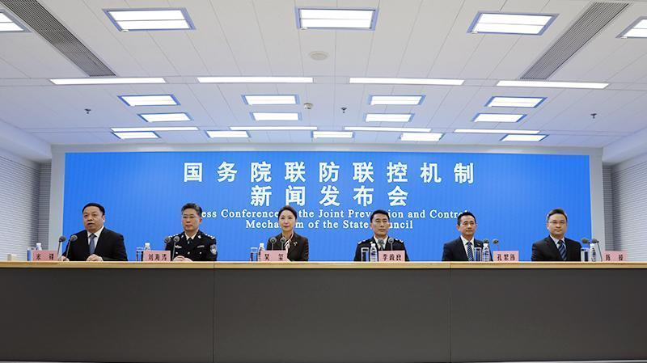

# 中国疫情信息不透明？放开后会有第二轮感染？这场发布会权威解答

_中国网 图_

1月13日下午，国务院联防联控机制召开新闻发布会，主题为“介绍优化中外人员往来管理措施有关情况”。外交部、海关总署、国家移民局、民航局相关司局负责同志及中国疾控中心专家出席。

国家卫生健康委新闻发言人、宣传司副司长米锋在会上介绍，实施“乙类乙管”措施以来，出入境人员及交通工具卫生检疫、进口货物口岸疫情防控、边境口岸恢复开通等措施进一步优化。

米锋表示，要严格按照疫情防控相关要求，从业人员加强自身防护，乘客落实个人防护措施；要密切关注国际国内变异株流行趋势，实时掌握病毒变异情况。

**“乙类乙管”后中外人员往来管理如何优化？**

外交部领事司司长吴玺表示，新的措施是我们根据“乙类乙管”总体方案和国境卫生检疫法的相关规定制定的，在起草的过程当中，我们充分考虑了疫情形势的发展、疫情防控工作的需要，以及出入境的需求，可以说暂行措施的总体精神和原则就是要推动中外人员往来逐步走向正常化。当然，我们也会采取必要的措施，防止境外疫情向国内倒灌，防止境外一些新的病毒影响国内疫情的防控。具体来说，新的防控措施出台以后有几项变化：

第一项变化，来华手续简便了，取消了向驻外使领馆申报健康码的环节，大家在登机之前48小时核酸完成以后，可以填报到海关健康申明卡当中，如果是阴性就可以来华，如果是阳性的在转阴以后才能来华。另外，在签证的便利化方面，我们也采取了新措施，我们恢复了定居、访问、过境、商务、团聚以及探亲和私人事务方面签证的审发，以便利外籍人士来华。

第二项变化，航班更多了。我们取消了对航班的数量、航线以及客座率的限制，现在国际航班正在稳步增长。在公路、水路方面，我们也在逐步有序的开放更多口岸。

第三项变化，取消了入境集中隔离。来华人员入境的时候不再需要进行集中隔离了，只要健康申报正常，海关的常规检疫没有问题，就可以直接放行进入社会面，如果申报异常或者有发热等症状，海关就会进行抗原检测，如果检测是阳性，就会要求居家或者居所隔离，或者就医。我们这么做也是为了旅客的健康，也是疫情防控需要。

自2023年1月8日新的规定实施以来，出入境人数明显上升。据我们了解，各个口岸运行是非常平稳有序的，因此我们也非常有信心随着疫情防控措施的不断优化，中外人员往来将逐步恢复正常。

**为何保留入境旅客登机前48小时核酸检测等措施？**

吴玺表示，我们始终本着科学、精准、高效的原则开展疫情防控，动态调整优化防控措施。我想“乙类乙管”并不是说乙类“不管”或者乙类“不防”，我们要防的是病毒的跨境传播，我们要便利的是人员跨境流动。

吴玺表示，奥密克戎毒株的致病力可能有所减弱，但是它的传染性正在上升。特别是在长途跨境旅行当中，大家会长时间处于密闭空间中，在这样的情况下感染风险是很高的。所以我们要求来华人员在登机前48小时进行核酸检测，我想这也是为了确定旅行者本身没有受到病毒感染，也是确保他的旅途更加安全，也是为了确保防止病毒扩散。落地以后，海关会对有症状或者申报异常的人进行抗原检测，我想这也是为了早发现、早治疗、早隔离。如果旅客本身没有什么症状或者没有被病毒感染，这些措施对他们的旅行也不会有什么影响。

**国际国内奥密克戎变异株流行最新情况如何？**

中国疾控中心病毒病所研究员陈操表示，从全球看，奥密克戎变异株从发现以来一年多的时间里，全球已经发现进化出了750多种进化分支。截至1月10号全球新冠病毒共享数据库当中各个国家上传的序列进行分析，在全球流行前两位的现在是BA.2.75和BQ.1.1，截至今年1月10号，全球已经发现了奥密克戎变异株的重组体有72种，其中主要流行的就是XBB及其亚分支，这个变异株在一些国家的新冠病毒感染人群当中占比还是比较高的。

XBB.1.5是XBB当中的一个亚分支，它的传播优势进一步增加，截至今年1月12号，已经在至少40个国家和地区当中监测发现。就我们国家而言，从去年12月1号到今年1月10号，我们国家从31个省和兵团的感染病例当中已经监测发现了19种奥密克戎进化分支，其中BA.5.2和BF.7占据绝对优势，两者加起来相当于这19种进化分支的97%。

从去年10月份一直到今年为止，我们国家累计报告了XBB本土病例16例，都是XBB.1的进化分支。到目前为止，暂没有监测发现XBB.1.5的本土病例。同期，我们国家监测到的本土BQ.1的病例是56例，这里包括BQ.1、BQ.1.1、BQ.1.2等6个进化亚分支。此外，从去年12月1日以来，全国输入病例监测数据显示，已经有79种奥密克戎进化分支输入到我国，其中比例比较高的前三位的是BA.5.2、BF.7和BQ.1.1。

**如何看待贬低中国抗疫成就、传播不实信息的报道？**

米锋表示，三年来，中国抗击新冠疫情，不仅很好地保护了中国人民的生命安全和身体健康，也为国际抗疫作出了重要贡献。

我们在刚刚遭遇疫情的时候，面对致病力较强的原始株，坚持的是“内防扩散、外防输出”策略，采取强有力的社会公共卫生干预措施，为国际社会抗击疫情争取了宝贵时间。

我们积极分享疫情信息。第一时间向世界卫生组织报告疫情，第一时间确定病原体，第一时间向世界分享病毒基因序列，第一时间公布诊疗方案和防控方案，为国际社会疫情防控、疫苗和检测试剂研发提供了科学依据。

我们积极开展抗疫国际合作，向153个国家和15个国际组织提供数千亿件抗疫物资。与全球180多个国家和地区以及10多个国际组织共同举办疫情防控、医疗救治等技术交流活动300余场，向34个国家派出37支抗疫医疗专家组，毫无保留分享中国抗疫经验。

我们最早承诺将新冠疫苗作为全球公共产品，率先支持疫苗研发知识产权豁免，最早同发展中国家开展疫苗生产合作，已向120多个国家和国际组织供应超过22亿剂新冠疫苗。

我们发挥中医药作用，举办了百余场抗疫专家视频交流和直播活动，已向150多个国家和地区介绍中医药诊疗方案，向部分有需求的国家和地区提供中医药产品。

我们愿意继续同国际社会一道，共同应对疫情挑战，更好地保护各国人民的身体健康。

**取消入境后测核酸等措施如何监测新毒株输入？**

陈操介绍，新冠病毒感染“乙类乙管”后，我国虽然已经取消了入境后“乙类乙管”和集中隔离等措施，但疾控部门也会同海关部门仍对新毒株的输入进行监测，入境人员的监测仍然是病毒变异监测的第一道关口。国家已经在全国多个口岸设立监测哨点，尤其对国际流行的重要进化分支进行监测，实时开展风险评估。如发现毒株输入出现了时空和人群聚集性，将会及时发出预警，经过风险评估后，采取一定的防控措施。

除了口岸监测以外，哨点医院的监测也是避免新毒株输入之后造成大范围传播的第二道关口。根据全国新冠病毒变异株监测方案，我们在全国31个省（直辖市、自治区）和兵团都设立了一定数量的哨点医院，每周要求哨点医院采集新冠病毒患者样本，送到当地疾控中心进行新冠病毒全基因组测序，将数据及时发送到中国疾控中心病毒病所。我们会及时对数据进行分析、及时反馈，如果发现新毒株、重要的变异株，尤其是能够引起较多重症和死亡的毒株时，我们也会及时发出预警，及时采取措施。

陈操提醒，另外，马上要到春节了，入境返乡人员逐渐增多，在这里也要提醒近期入境的人员，入境时如果出现身体不适要及时申报，配合海关人员积极开展采样，如果入境以后出现了身体不舒服，尤其是发热，一定要及时开展新冠病毒核酸检测和抗原检测，及时就诊。

**为何对部分国家采取对等入境限制措施？**

吴玺表示，疫情发生以来，我们一直是根据疫情形势的发展变化来因时因势动态调整我们的政策，我们对所有的国家都是一视同仁的。

中方宣布“乙类乙管”以后，有很多国家都表示欢迎，泰国、马尔代夫、文莱、俄罗斯、柬埔寨等国都纷纷表示希望尽快恢复更多的直航航班，热切地期盼中国游客到访。1月9日，泰国副总理率政府高官到机场来欢迎我们“乙类乙管”以后第一班到达泰国的旅客，现场还悬挂了“中泰一家亲”等这样的横幅。这样的场面是对我们中国抗疫政策表示了信心和支持，也体现了我们与这些国家的友好关系。

“但是很遗憾，有少数国家枉顾科学和事实，单独对中国采取了入境限制政策，对此我们当然是不能接受的。我想世界上也没有哪一个国家会允许其他国家对自己的国家来实施歧视性的政策，我们中方对这些国家采取的对等措施，目的是为了维护中国公民的正当权益，也是为了维护国家之间人员的正常往来。”事实上，我们对有关国家因外交、公务或者紧急商务等事由来华的也作出了妥善安排，我们希望有关国家能够尽早取消专门针对中国的歧视性措施，同中方一道确保双方的人员往来，确保两国关系的积极发展。

吴玺提到，中方是积极支持扩大中外人员往来的，并且将会继续为来华经商等人员提供便利，我们理解各个国家采取合理的防疫措施，我们反对的是采取歧视性的做法或者是把疫情政治化。

**XBB等变异株会引发新一轮感染高峰？**

陈操表示，很多人刚刚经历过新冠病毒感染，可能都出现了咽痛、发热、咳嗽，甚至出现了全身不适的情况。其实这些都是人体免疫系统对抗新冠病毒感染的一种应答反应。在短期内或者说在相当长的范围内，免疫系统对新冠病毒的感染是有免疫记忆的，这种记忆体现在我们可以产生高水平的中和抗体、免疫记忆细胞等等。所以在这样的情况下，即使出现了新的奥密克戎变异株，引起本土大规模流行的可能性极低。

对于一些脆弱人群，还有一些高风险人群，比如65岁以上的老人，有基础病的患者，没有接种疫苗的人员，可能会出现由于新的奥密克戎毒株的输入而造成感染，甚至二次感染。所以在这里我要提醒广大公众，既不要轻视也不要恐慌，我们在现阶段仍要做好个人防护，尤其是有老人同住的家庭，一定要注意好环境卫生，做好手消毒、勤通风、慎聚集。

陈操提醒，另外，一定要注意作息规律，保持良好的心态。我们在对自己负责的同时，其实也是在保护身边的人。在这里也要提醒一下，党政机关和企事业单位，也要督促员工做好个人防护，提供必要的防护条件。要做好员工缺勤和病症情况记录，给员工以足够的休息时间和治疗时间，不要让员工带病到岗。同时，对公共环境和共用设施做好消毒。

