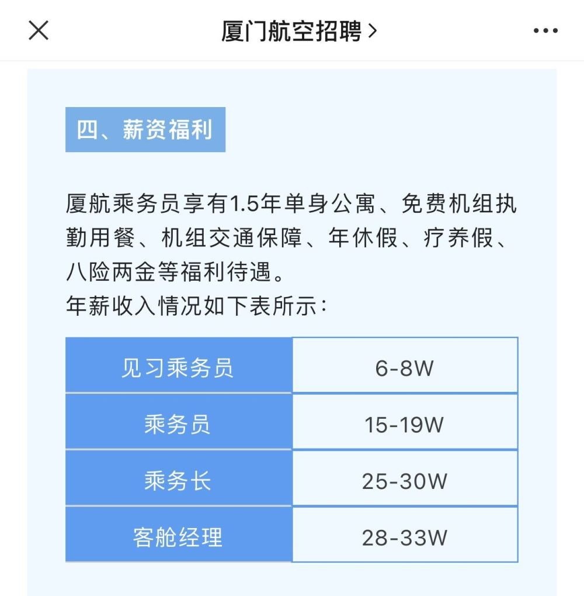

# 多家航司重启招聘：空姐空少最抢手，有公司开出33万年薪

记者 |薛冰冰

编辑 |殷宴

疫情防控进入新阶段以来，民航市场重回往日繁忙景象，目前国内客运航班量已突破日均10000架次。

在此背景下，因疫情而搁置许久的航司人员招聘，也于近期密集启动。

据界面新闻不完全统计，从2022年底至今，已有海南航空、厦门航空、春秋航空、吉祥航空、首都航空、福州航空等多家航司宣布“招兵买马”。

从各航司开放招聘的岗位来看，主要集中在乘务员、安全员、地面保障人员等一线岗位。为了吸引人才加入，有航司在招聘帖中明确提到，为空中乘务员开出最高33万元的年薪。

_图片来源：厦航招聘官方微信号_

疫情三年流失大批乘务员

乘务员和飞行员同为航司机组人员，薪资中很大一部分是飞行小时费。但是，由于职能和岗位性质不同，乘务员的底薪水平、飞行小时费水平与飞行员相去甚远。

以南方航空、吉祥航空为例，界面新闻通过业内人士了解到，吉祥航空乘务员基本工资在3000元-6000元之间，疫情前每月飞行小时费可拿到约15000元；南航乘务长和两舱乘务员飞行小时费约为100-110元/小时，明珠舱和经济舱乘务员60-80元/小时。

而飞行员的薪资水平则要高出不少。南航广州总部一名飞行员告诉界面新闻，作为副驾驶，他的底薪接近8000元。

另据业内自媒体“民航一枝花”匿名调查统计，疫情前即2019年，东航新副驾到手月薪2万-4万元；东航机长到手月薪少则4万-8万，多则8-12万。疫情爆发初期，2020年上半年，东航机长到手月薪仍在1.5万-2万元左右。

由于航班量锐减、飞行小时数少得可怜，低谷期时乘务员只能拿着3000元左右的底薪维持生计，有些撑不下去的乘务员只能被迫离职、另寻他路。

受此影响，过去几年间乘务员群体规模收缩明显。民航局信息中心数据披露，截至2019年末，我国运输航空公司的乘务员总数为108683人。

到两年后的2021年末，我国运输航空公司乘务员缩减至97197名，平均每年流失近5800人。

飞行员数量仍有小幅增长。截至2022年12月，我国运输航空公司机长和副驾驶人数相比2019年末增加了6000人左右。

补充血液、提前储备人力

航空公司对乘务员的需求量一向较高，在航空公司各类工种里，空乘人员队伍最为庞大，地服人员、机务人员等位居其后。

国有三大航财报显示，截至2021年末，三大航客舱服务人员数量都在20000名以上，在员工总数中占比达到22%至27%。

随着民航市场加速回暖，航司招聘工作率先启动的就是乘务员招聘，以弥补空中乘务员的人力缺口。

目前，有航司乘务员已经开启满负荷工作状态。据《央视财经》1月8日报道，厦航北京一名乘务长表示，随着近一个月来航班量快速增加，她的排班已经恢复到飞四休二（飞行四天、休息两天）。

“之前少的时候1个月才飞行7个小时左右，现在基本上能飞行60个小时，每周4天都有航班任务，都能飞满。”

“五个一”、入境集中隔离等国际客运航班管控政策取消后，国际航线市场也在逐渐恢复，当前已有不少航空公司宣布恢复或者增加国际及地区航班。运力回升的同时，也要求客舱服务和保障力量及时到位。

界面新闻记者注意到，海南航空乘务员招聘开辟了外语特长乘务员专场。海南航空方面称，将公开招聘外语特长乘务员180名，包括英语164名、法语5名、意大利语5名等，要求教育背景为英语及相关小语种专业。

对此，民航业内人士李瀚明向界面新闻分析称：“各航空公司开始恢复乘务员招聘，显示出他们对于市场恢复普遍感到乐观，希望储备更多的人才，应对市场对长距离国内航线和国际航线的需求。”

据了解，2022年夏季欧美民航市场迎来全面复苏，但是由于机场和航司准备不足，出现大量的飞机晚点、取消以及行李托运延误等事件。

民航专家熊维此前接受采访时表示，相较于飞机的解封使用，长期缺乏专业人员将会是民航短期内应对客流激增的巨大挑战。

“在运力允许范围内协调航班计划，加强民航运输各环节的信息沟通和协调，尽早恢复人员培训以及招聘，合理安排计划，才能将可能带来的客流冲击影响降至最小。”

