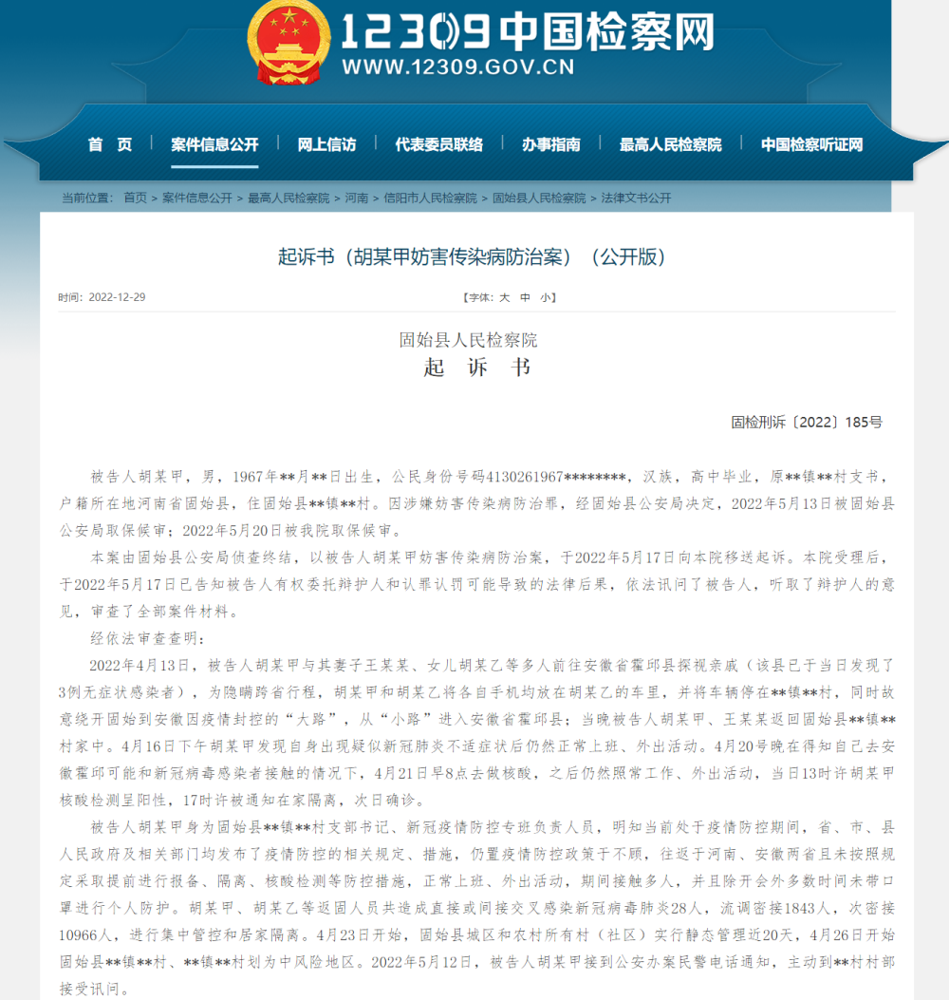
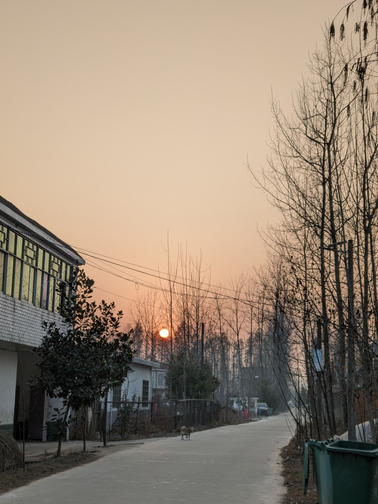
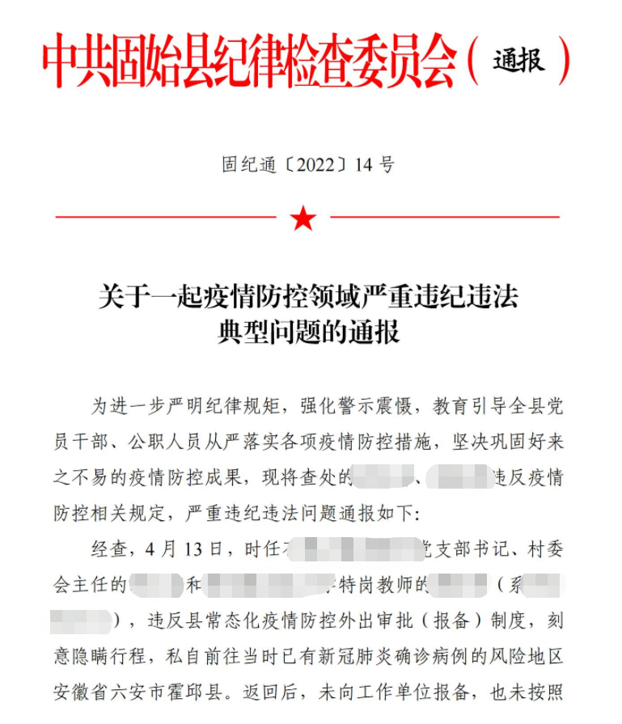

# 村支书因隐瞒跨省行程获刑两年：仅10多公里，是为见患癌亲人最后一面

【相关阅读】

罗翔：“乙类乙管”后，那些违反疫情规定被判刑的人怎么办

随着新冠病毒感染回归“乙类乙管”，此前的涉疫类案件该如何处置，最近在网络引发热议。

河南固始县某村村支书胡某甲是涉疫案件的一名当事人。去年4月，他和妻女等人跨省探望病危的亲戚，隐瞒行程回村后，他被检测出新冠阳性。最终，因妨害传染病防治罪，他被固始县法院判处有期徒刑两年。

1月12日，固始县法院新闻发言人霍精锐告诉九派新闻，由于胡某甲并未上诉，该判决已生效，其现在正在服刑。

此前，1月7日，最高人民法院等五部门联合出台《关于适应新阶段疫情防控政策调整依法妥善办理相关刑事案件的通知》（以下简称《通知》）。通知明确，自1月8日起，不再以妨害传染病防治罪、妨害国境卫生检疫罪处罚涉案者，正在办理案件中的犯罪嫌疑人、被告人应及时解除羁押状态。

霍精锐表示，《通知》下达后，对正在审理的案件（指尚未作出生效判决的案件）中的犯罪嫌疑人、被告人，肯定要解除强制措施。但《通知》对胡某甲这样处于服刑期的当事人，“没有实际影响”。

霍精锐还提到，曾与胡某甲同车出行的一名涉案人员，在另案处理时，因不服一审判决表示上诉，其所属案件一直处于审理阶段。按照《通知》规定，司法机关现已对其解除羁押状态。

“（当事人）可以申请再审”，霍精锐最后说道，“法院暂未收到当事人（胡某甲）或家属的再审申请。”

**事发：驱车跨省探望亲属，隐瞒行程回村后被测出阳性**

_胡某甲案起诉书截图。图源/中国检察网_

据中国检察网公布的起诉书，2022年4月，河南固始县检察院指控该县某村村支书胡某甲涉嫌妨害传染病防治罪，向固始县法院提起公诉。

起诉书显示，2022年4月13日，胡某甲与其妻子、女儿等多人前往安徽霍邱县探视亲戚（该县已于当日发现了3例无症状感染者），为隐瞒跨省行程，胡某甲与家人将各自手机均放在车里，同时故意绕开因疫情封控的“大路”，从“小路”进入霍邱县。当晚，胡某甲与家人返回固始县某村家中。

4月16日下午，胡某甲发现自己出现疑似新冠不适症状后，仍正常上班、外出活动。

4月20号晚，得知自己去过安徽霍邱，可能和新冠病毒感染者接触。4月21日早8时，其去做核酸，之后照常工作、外出活动。当日13时许，胡某甲核酸检测呈阳性，17时许被通知在家隔离，次日确诊。

检方指控，胡某甲身为固始县某镇村支部书记、新冠疫情防控专班负责人员，明知当前处于疫情防控期间，省、市、县人民政府及相关部门均发布了疫情防控的相关规定、措施，仍置疫情防控政策于不顾，往返于河南、安徽两省，且未按照规定采取提前报备、隔离、核酸检测等防控措施，回村后正常上班、外出活动，其间接触多人，并且除开会外多数时间未带口罩进行个人防护。

胡某甲等返固人员共造成直接或间接交叉感染新冠病毒28人，流调密接1843人，次密接10966人，进行集中管控和居家隔离。4月23日起，固始县城区和农村所有村（社区）实行静态管理近20天。

今年1月9日，胡某甲的妻子称，丈夫等人前往安徽霍邱县的村庄，实际只有10多公里，是为看望身患癌症的亲家母，并非传言中的“去喝喜酒”。“传了很多谣言，但实际上当时也没多停留，就是去见（亲家母）最后一面了。见过面后，没十天，人就去世了。”她说。

她还表示，前往霍邱7天后，即4月20日晚，他们收到消息说，给亲家母做饭的看护者被检测为新冠阳性。胡某甲第二天便去做核酸，紧接着收到确定消息。

_通往胡某甲所在村庄的路。图/九派新闻
李倩_

**现状：父女均被开除党籍并辞退，妻子称一直没能见他**

_固始县发布的情况通报。_

2022年5月11日，信阳市固始县纪委监委发布通报，胡某甲、胡某乙违反疫情防控相关规定，严重违纪违法，被开除党籍。

据固始县纪委监察委通报，经查，4月13日，时任某镇某村党支部书记、村委会主任的胡某甲，和某镇实验小学特岗教师胡某乙（系胡某甲之女），违反县常态化疫情防控外出审批（报备）制度，刻意隐瞒行程，私自前往当时已有新冠确诊病例的风险地区安徽省六安市霍邱县。

返回后，二人未向工作单位报备，也未按照规定，自觉落实居家健康监测、隔离等防控措施，分别于4月21日和4月22日测出核酸阳性，造成该县多个乡镇、多个区域实行封控、管控，直至全县全域“静态管理”，给全县疫情防控工作造成了极其严重的不良后果和极坏的社会影响。

5月11日，经固始县纪委常委会研究决定，给予胡某甲开除党籍处分，责令其辞去村委会主任职务；给予胡某乙开除党籍处分，由固始县教育体育局按照相关规定对其作出相应处理。

胡某甲妻子称，从2022年丈夫胡某甲被判刑至今，自己一直都没见到他。只在两三个月前，收到过他的一通电话。

“女儿考上特岗教师，本来在3月就满三年能转正，结果4月份出了这事儿”，她说，女儿的教师工作没有了，现在在打工。

**讨论：防疫新政后，已裁决的涉疫案件何去何从**

五部门联合发布的涉疫新政，能否影响已裁判的涉疫案件？对此，同济大学法学教授、上海市嘉定区法学会副会长金泽刚表示，在我国，若旧法认为某行为是犯罪，且已作出生效判决，即便新出台的法律认为该行为不再是犯罪，早前生效的判决也继续有效。

金泽刚在经济观察网上发文称，对于那些已经作出生效判决的行为人，他们能否要求法院撤销有罪判决，涉及到刑法“溯及力”与“既判力”孰高孰低的问题。

根据刑法第12条第2款，“本法实行以前，依照当时的法律已经作出的生效判决，继续有效”的规定，在我国，既判力高于溯及力，即便新法认为不是犯罪，旧法认为是犯罪，已经生效的判决也继续有效。

其称，在防疫政策调整的当下，对于生效案件开展复查工作还是必要的。对于进入刑罚执行程序的案件，考虑到适用的法律发生了变化，对犯罪人有必要施以救济措施，比如准许部分服刑人员假释。

**九派新闻记者 李倩 河南固始报道**

【来源：九派新闻】

