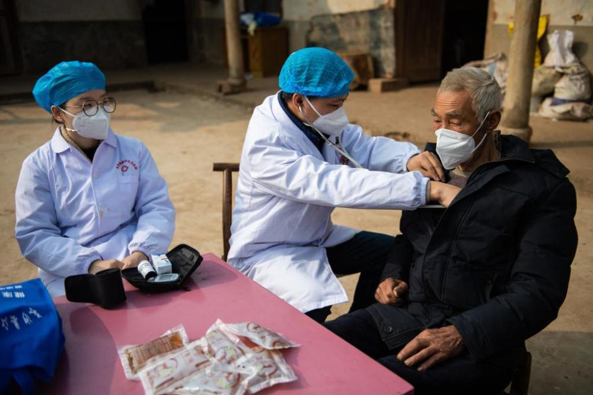
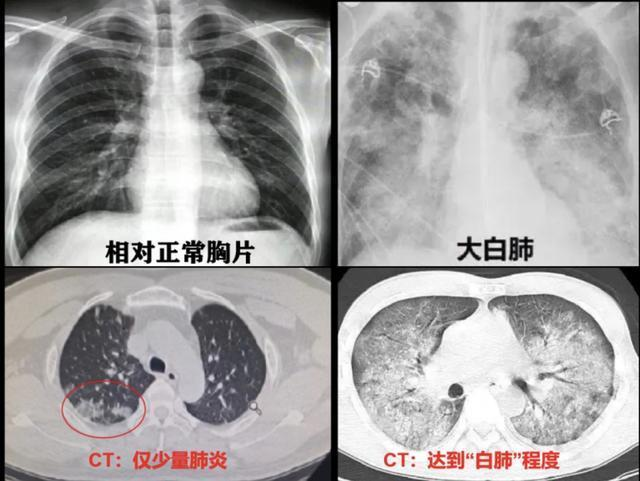

# 社区门诊医生：老人出现重症，大部分是“被耽误”

观网读者“暮雪”是山东某市下一个社区门诊的医生，在防疫政策放开后的第一波感染高峰期间，曾接受观网采访，详谈自己在门诊坐班的观察与了解。

这两日，“暮雪”继续同观网分享了其接触到的老年人感染新冠后的治疗情况。她在聊天中指出，相比往年冬季，今年老人去世的数量有所下降；而老人尤其是高龄老人之所以出现重症乃至死亡，大部分原因是——“被耽误”，也因此，子女对老人病情上心与否，十分重要。

【文/暮雪，采编/观察者网 李泠】

防疫政策放开后的第一波感染高峰期，接近二十天左右的疫情，我们社区门诊接诊的病例超过平时门诊量的四倍以上，接诊新冠病例超过7000例。因此，我们获得的信息可以说具有一定的参考意义。

此外，因为我们要负责出具逝者最后的死亡证明，所以对于周边老人的一些情况，我们比较清楚。

实际上，每年冬季，流感都会带走一部分老人。就我们周边的情况来看，2019年流感爆发，带走不少老人；2021年冬季统计前后，也走了16个；今年冬季走的人反而不多，截至目前，和新冠关联的是3个老人。

而农村的防疫情况，也比社交媒体上一些网友想象的好多了，很多村医私下反馈今年走的老人实际比往年反而少。

_村医为居家老人听诊（资料图/新华社）_

之所以出现这种情况，有个主观原因，就是对新冠的畏惧，大部分人都重视这次“流感”，一有症状就来门诊或者卫生室处理。

很多子女对父母很上心，不断找我们预约，给老人打“运德素”以避免重症、缩短病程。其中有的还是从一百多公里外的地方慕名而来，就怕老人熬不过去。

事实证明，老人感染病毒后，只要子女上心，早期及时干预积极治疗，预后都挺好的。比如我遇到一位病人家属，家里二老都是高龄老人，都“阳”了。他送二老去医院拍片，典型新冠肺炎征象。二老来我们门诊治疗，他全程陪同，一天和我打四五个电话汇报情况，老人一有风吹草动就反馈给医生。最后，老人们都恢复得特别好——这不全是医生的功劳，主要还是孩子特别孝顺。

值得再三念叨的是，子女上心，对于老年的救治真的非常重要，有的时候甚至能带来“奇迹”。

有位女性患者，91岁，重症肺炎入院治疗八天，一直不退热，医生让病人家属做好后事准备。重症肺炎，俗称“白肺”，这老人说是肺部面积被炎性细胞浸润七成以上。家属不死心，送来我们门诊就诊。我看了肺部CT片，不是双肺，实际上还有一个肺浸润面积比较小；再观察老人，思路尚可，表达清楚，求生欲很强，手还非常暖和。于是，我和家属说，可以一试，但也得做最坏的思想准备，我们一天天来，治疗一天观察一天。家属完全同意。

_资料图来源：上观新闻_

鉴于老人已经输液八天，我们不再采取输液，改成口服中成药加雾化，再加肌注“运德素”。结果“奇迹”出现了，老人第二天退热，第三天能吃饭了，精神状态越来越好。目前看来，算是基本稳住了！我们就感叹，幸亏老人免疫力强，阳气还算旺盛，关键是家属也给力，不放弃！

话说回来，农村的第一波疫情也相对平稳地度过，很大一部分原因是村医们都有丰富的治疗流感经验，且不墨守成规，敢用药，也善于用药。村民们感染后去输液，早期都会加适量的激素和抗病毒药物，后期添加抗生素，大多也都会开中成药，极大降低了轻症转重症的可能。

此处有一个常见的误解需要说明：一些人大肆批判村医在治疗新冠感染时“滥用抗生素”或者“滥用激素”。

这几年政府非常重视村医队伍的建设，多种渠道打造这支队伍，提升村医的素质。其中大部分都取得医师资格证，最不济也有“乡村医生证”，并不是“江湖郎中”。他们在常见病多发病的治疗中积累了丰富经验，几乎都是全科医生。而且，村医本就是当地村民，常年和村里人打交道，属于村民的家庭医生，他们了解父老乡亲的身体状况，知道这人是不是过敏体质、用什么药更有效。

因此，他们不需要查这查那，根据听诊和经验用药速度快，不会耽误患者病情。对于患者什么时候需要用抗生素、该用多少的量，他们心里也都有分寸——诊所输液一般持续五天左右，不存在过度治疗的情况，有的地方仅仅输液三天，之后就改成口服。

至于“感染新冠病毒后，该不该用抗生素”，从已有的救治经验来看，身体非常健康、没有任何基础病和气管炎病史的青壮年，不会用抗生素；有基础病、慢阻肺的老年人，一般会用，为了预防机体抵抗力弱的时候出现继发性细菌感染。

这里需要再次强调的是，用抗生素是为了预防并发症，而不是治疗新冠——目前抗新冠病毒压根就没特效药。

说到底，救人第一，疗效说话。

可以说，在这波防疫中，一线基层医生在分级诊疗中起了关键作用，我们承担了大部分轻症、部分中症的治疗，减少了危重症的出现，有效缓解了医院的压力。至于卫生院这一级，好多病人反映，疫情最高峰时过去，要不停诊（估计医护全“阳”了），要不就是没药，最后还是折返到村卫生室去输了几天液才康复的。

就我个人在一线门诊的接触、了解来看，老人之所以会出现重症乃至死亡，除了一些人本身有严重基础疾病，尤其是有慢阻肺、肺心病、心衰的情况外，大部分是被耽误的。

**老年人肺炎和青壮年肺炎表现不同，发热不明显，甚至有的没表现出发热和咳嗽的症状，只是单纯表现精神很差，食欲不振，**
家人这才发觉不对劲送来就医。这离全家大部分人阳康大多已经过了二三周以上的时间。

有的病人不知道听哪位“专家大神”说的，不吃药，在家硬扛，咳了一个月才来门诊，最后拖成了肺炎。

有的是老人自身执拗，其实不差钱，但节俭惯了，不愿去医院，对这病的严重性也缺乏科学的认识。有一个老人出现高危低钠血症，我反复解释、催促去住院，床位医院也腾出来了，听说她孙女都跪着求她去，她都咬牙不松口，十几个小时后被儿子强行背上车送去医院，结果可想而知，非常遗憾。

此外，也有部分原因是子女粗心不上心，耽误了老人治疗。尤其是高龄老人感染，基本上生死都寄托在子女身上——老年人行动困难，没子女帮助，怎么就医？

我们小区有三位老人去世，分别是91岁、79岁和74岁，情况也差不多。他们都有严重的基础病，比如一个癌症术后，另一个有严重慢阻肺、肺心病；三个人里，两个人都是严重营养不良，体重八九十斤。

总体来看，没有一个患者是突然出现重症的，都是十几、二十天后才转重症。很多高龄老人发展成重症后再被家属急吼吼地送去医院，有时还不一定能立马住上院。转危重症后最后能救过来的实在不多，很多家属不愿让老人继续遭罪，直接放弃插管，老人回来几小时后就走了。

因此要再次呼吁：新冠感染不可怕，早期积极干预和有效治疗，绝大部分预后良好。

患者尤其是有基础病的高龄老人，患病早期一定要去医疗机构就诊，离家最近的医疗机构就行，基层医疗机构的医生大都有治疗流感的经验，没必要一股脑地往大医院挤。

一旦病人有重症倾向，他们也会积极联系上级医院转诊，因为医联体的缘故，这个转诊路径非常畅通，甚至可能比病人自己去医院效果更好。因为在转诊过程中，我们会和上级医院清晰说明病人情况，需要马上住院急救，一般情况下，上级医院都能给予照顾，想办法留出床位。

**本文系观察者网独家稿件，文章内容纯属作者个人观点，不代表平台观点，未经授权，不得转载，否则将追究法律责任。关注观察者网微信guanchacn，每日阅读趣味文章。**

