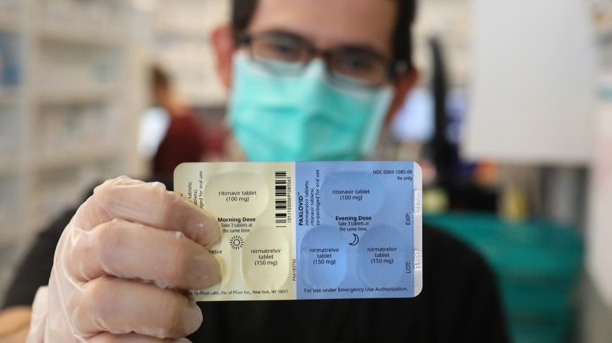
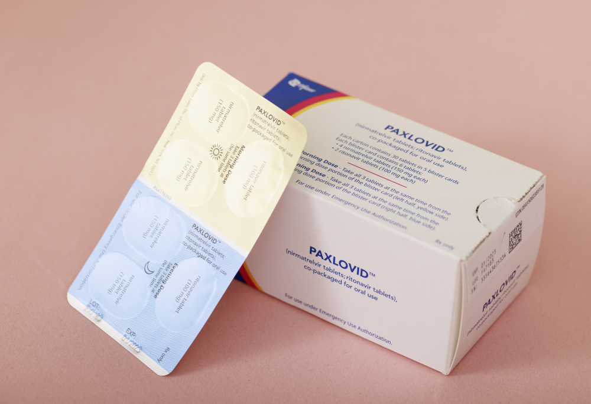
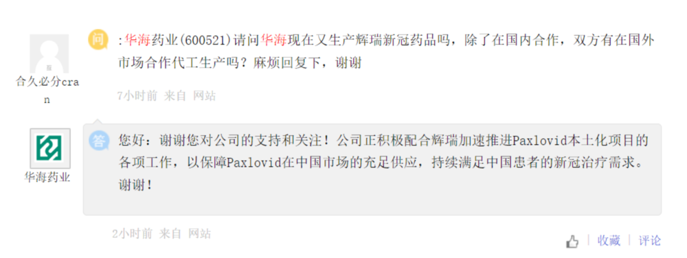
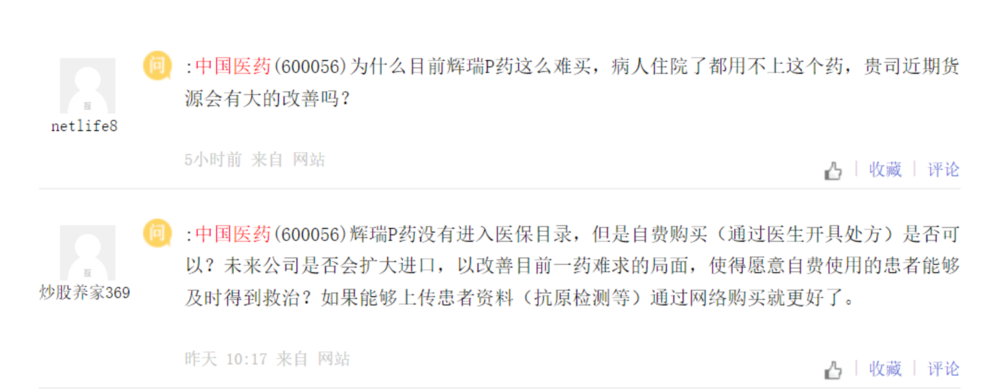

# 辉瑞发的这笔“灾难财”，里面有几分良心？

出品 | 虎嗅ESG组

作者 | 张小予 袁加息

头图 | 视觉中国

近日，全球公认的相对安全、有效的抗新冠病毒口服小分子药物奈玛特韦/利托那韦片（Paxlovid）成为大众关注的焦点。

国内疫情管控放开，短时间引发了巨大的用药需求。但是Paxlovid在国内的普及，却是困难重重。尤其是1月8日结束的国家医保药品目录谈判工作，辉瑞药未能通过价格谈判，引发了大量讨论。

**有人质疑，辉瑞作为一个跨国制药巨头，有没有在事件中发挥过积极作用？**

让更多的患者用特效药得到救治，难道不是辉瑞基本的企业社会责任吗？是什么原因，使Paxlovid在中国的普及显得如此迟缓？

Paxlovid的社会责任路线

Paxlovid最早是2021年12月在美国获批的。

而早在2020年，辉瑞位于爱尔兰的一座生产基地的工作人员就接到任务，要设法在年内把Paxlovid原料药的产量快速提升10倍。项目安排中，瑞辉内部给Paxlovid用上了新冠疫苗业务的关键词：“at
lightspeed”，用光速。这意味着Paxlovid的研发、临床实验、生产筹备、商业化是平行推进的。

到了2021年11月16日，Paxlovid上市在即，辉瑞与非营利机构“药物专利池”（简称MPP）达成许可协议。根据协议，“药物专利池”可向95个国家的合格仿制药企授权生产Paxlovid的仿制药，并免除授权使用费。这95个国家和地区，包括所有低收入和中低收入国家，以及部分中高收入国家，大约覆盖全球约53%的人口。

能看到辉瑞在提升药品“可及性”上的努力。提升产品的“可及性”，是制药行业中一个共识性的社会责任。这要看药企是否能以低廉的价格，让欠发达地区、社会弱势群体用上药。“可及性”又分为“送得到”和“买得起”两方面。
**辉瑞在Paxlovid上市前就将其授权给MPP，这是很不寻常的。**
通常制药企业会等到新药获得足够盈利之后，才考虑“行使社会责任”，将专利授权给MPP。这也印证了辉瑞ESG报告中的话：“从一开始，辉瑞应对新冠疫情的策略，就没有把它当作平常生意来做。”

辉瑞是从美国发家的跨国药企，Paxlovid的供应策略，也是先保供美国。不过Paxlovid在美国上市时还是遭遇了短缺，到2022年4月才开始缓解。

此时Paxlovid的产能正在逐步提速。在2022年4月，辉瑞宣布与联合国儿童基金会（UNICEF）合作，在2022年当中向中低收入国家提供400万个疗程的Paxlovid。

9月，公司又与全球基金（一个医药卫生领域的国际援助机构）合作，为中低收入国家提供600万个疗程的Paxlovid。

_一盒Paxlovid中有5板、30片药，够5天服用，即一个疗程。图片来源：视觉中国_

辉瑞与这些国际援助组织的合作方式，通常是辉瑞以低价提供Paxlovid，由援助组织出钱买下，捐赠并运输给各个需要的国家。

总体上，Paxlovid的可及性工作，在现有的国际制度框架下已经做得足够充分。

权威的ESG评级机构MSCI，给与辉瑞A级评分（中等偏上），并认为辉瑞在“医疗可及性”议题上做到了行业领先的水平。

可及性问题，远未解决

但是，如果我们放眼Paxlovid的全球分配，或者哪怕看看中国眼下的情况就会得出结论：Paxlovid依然既买不到，又买不起。

辉瑞在Paxlovid可及性上付出的行动，并未能解决问题。

根据CEO艾伯乐对外发布的数字，2022年公司预计生产1.2亿个疗程的Paxlovid。相比新冠疫苗数以10亿计的年生产规模，1.2亿盒Paxlovid远不够全世界分的。

结果就是发达国家出高价拿走了大部分。Paxlovid的全球不平等问题充分凸显。

新药问世不久，美国联邦政府就决定批量采购1000万个疗程，发现不够之后又追加了1000万个。剩下很多销往了欧洲和澳洲等发达地区。国际慈善组织乐施会（Oxfam）在2022年11月的一篇报告中指出，2022年生产的Paxlovid，只有约1/4流入中低收入国家。世卫组织驻索马里的代表曾透露，拥有1700万人口的索马里，共获得了约300盒Paxlovid。

此时，辉瑞作为一个跨国药企，以及特效药Paxlovid的垄断者，肩上无疑扛着Paxlovid在全世界可及的责任。然而至少在2022年，全球新冠累计确诊病例超6亿，这个责任是辉瑞扛不动的。

1月8日，中国国家医疗保障局发布消息，Paxlovid未能通过谈判纳入医保目录。

一位某跨国药企的员工告诉虎嗅，不论辉瑞最后的出价是多少，辉瑞没有把Paxlovid压低到医保局能接受的价格，应该是受到了公司内部遵循的全球定价策略的制约。出价过低，会影响到产品在世界其他地区的推广。

此前辉瑞官方披露称，Paxlovid的定价是按照国民收入水平分级的，高、中高、中、中低、低收入国家对应不同的价格。其中，高收入和中高收入国家的价格是公开的：辉瑞给高收入国家530美元/疗程，中高收入国家250美元/疗程；中等及以下收入水平国家的价格，则是“非盈利价格”。

从目前的信息看，Paxlovid在国内各个渠道的售价最低1890元，大致趋近于中高收入国家每盒250美元（约合1700人民币）的标准。不论辉瑞在保密谈判中愿意为了中国的市场规模做出多大让步（所谓“以量换价”），显然还是和医保局的预期存在距离。根据辉瑞方面1月9日透露，医保局的期望价格，属于中低收入国家水平。

总之，降价的事暂时没有指望了。然而，目前Paxlovid在国内首要的问题还不是贵，而是缺货。

一些患者即便有钱也买不到。地方医保响应上级文件，对Paxlovid临时性支付到今年3月31日，幸运的患者可以用200元左右的价格得到Paxlovid。但即便在一线城市的大医院，Paxlovid库存也十分有限，每日限量供应，只开给十分需要的患者，开药需要院领导签字。

中国目前的状况，放在各个发展中国家也是符合的：Paxlovid买不到，且买不起。辉瑞在可及性上的工作，还远没有达到全球利益相关者的期待。

为什么依然缺货

Paxlovid不可及的问题，根源在于产量限制。

对此，国际社会寄希望于Paxlovid可以在更多代工企业生产，或者仿制药尽快实现规模生产。

但由于各种客观条件所限，Paxlovid及其仿制药的产能扩张需要数月的时间。

据辉瑞官方专家的说法，生产Paxlovid就像搭建积木，每一个部件都先在世界不同的地方制造，再汇聚到一个地方完成组装，制造商涉及超10个国家的20多个地点。辉瑞高管表示，没有时间为了生产Paxlovid单独建厂，药品的化学反应需要几天才能在可控的温度和压力下发生，完成最初的构建模块就需要三个月，除此之外，药物主要成分制造、药物包装加上运输和质量检测的时间，其周期缩短后仍需要7个月。

同理，虽然辉瑞在2021年11月就授权了Paxlovid仿制药的生产，但直到一年后的2022年12月26日，才出现了首款被世卫组织认证（WHO-
PQ，这是药品加入各类国际援助计划的前提）的仿制药。受原材料、供应链等因素的影响，仿制药想大批量地在中低收入国家铺开，可能还需要更久的时间。

辉瑞也同中国企业建立了合作，但是目前还看不到成效。

根据公开出来的信息，辉瑞在中国至少有五家合作的代工企业，即华海药业、复星医药、上海迪赛诺、普洛药业、九洲药业。其中华海药业披露称，将生产Paxlovid；其他企业有资质生产仿制药。但是这些企业都还在做前期的准备工作，没有开始生产。

_Paxlovid中国生产商之一华海药业的投资者互动截图。“正在推进本土化”，意味着还没开始生产。图片来源：上证e互动_

中国医药是Paxlovid在中国的进口与商业运营代理商。目前在公司的投资者问答界面上，也充满了对于缺货问题的讯问。但中国医药并未做过多回应。

_图片来源：上证e互动_

供应会改善吗？

美国时间的1月9日，辉瑞CEO艾伯乐对此做出了回应。他提到，公司早先计划在2023年底实现Paxlovid在中国的本土生产。如今，辉瑞及中国代工企业正在加紧推进Paxlovid本地化项目的工作。乐观估计，可能在三四个月内实现Paxlovid在中国本土的扩大生产。

在Paxlovid在中国实现本土化之前，“我们正在将尽可能多的Paxlovid运往中国，我们的生产线正在加紧建设这部分的供给能力，”艾伯乐1月9日称。

为什么不愿降价

Paxlovid为什么不能更便宜些呢？

一些立场较为激进的国际组织（比如乐施会）和观察者，指责辉瑞借Paxlovid发人类的“灾难财”。辉瑞的这笔“灾难财”有多少呢？

据辉瑞2022年第三季度财报，期内新冠口服药Paxlovid的销售额达到75.14亿美元，
**2022年前三季度，辉瑞靠新冠口服药收入达171.99亿美元。对新冠口服药Paxlovid的2022年营收指引为220亿美元。**

这给辉瑞带来财务可持续性方面的改善。

在2021年之前，辉瑞的杠杆率多年维持在2倍以上，2019年一度高达2.7倍。但是，新冠疫苗和口服药带来的收益，使得公司杠杆率在2022年迅速降至1.0倍。杠杆率降了一半，是因为公司2022年的收入同比涨了一倍。杠杆率的下降，当然意味着企业财务可持续性的提升。

药企的药物研发支出占据了营收的很大一部分，往往需要高价或足够的利润来维持企业可持续的产品创新。

公司财务与研发的可持续性，构成了辉瑞追逐利润的正当理由。

但即便如此，在2022年以来的股市上，辉瑞并不是一支成长性很好的股票。其中很大一个原因在于，投资者不认为新冠相关的利润是可持续的。而近期投资者对Paxlovid进一步的市场表现充满期待，认为它是辉瑞股价持续成长性的一个主要的潜在利好。

_辉瑞近一年的股市表现，图片来源：谷歌财经_

投资者希望Paxlovid可以持续赚钱，而患者、第三世界、医疗卫生领域的国际组织，希望公司尽量放弃Paxlovid的利润，以造福全世界低收入人口。
**股东与利益相关者的立场几乎截然对立——这成为辉瑞在Paxlovid定价问题上所要面对的根本矛盾。**

目前而言，辉瑞其实处在双方都不满意的尴尬地位上。想真正解决问题，或许不能全指望辉瑞了。

可及性困境的出路，在辉瑞之外

乐观来看，辉瑞对于价格的“坚持”，反而给全球药企抗新冠药物研发很大的发展空间。

正如乐施会在报告中的观点，如今新冠口服药的价格高企、以及全球分配不均，一个重要原因在于“辉瑞的垄断”。辉瑞或许付出了一些社会责任方面的努力，但最终的解决办法，只有靠全球市场竞争来增加供给，降低价格，实现新冠口服药更充分的可及。

据Cortellis数据库显示，截至2022年第三季度，全球在研口服新冠药物294款，共有7款已上市，三期临床阶段51款，二期临床阶段75款，一期临床阶段24款，临床前阶段96款。

2022年11月22日，日本盐野义制药宣布，新冠口服药Ensitrelvir的紧急使用授权获日本药品和医疗器械局（PMDA）批准，用于12岁以上的新冠感染者，适用范围更广。

紧接着，上海医药12月发布公告称，上药控股与日本平安盐野义就抗新冠病毒口服药物Ensitrelvir的进口品签订了《进口分销协议》，上药控股将作为Ensitrelvir的进口品在中国大陆地区独家的进口商和经销商；同时，上海医药与平安盐野义就更广泛的新药和仿制药产品在更深远的合作层面签订了《战略合作框架协议》，成为又一家即将进入中国市场的新冠口服药。

还有一些国产药也在路上。

1月9日晚间，药企广生堂发布抗新冠病毒口服小分子创新药“泰中定”的一份临床研究总结报告，结果显示泰中定具有优越的抗新冠病毒疗效，新冠患者核酸转阴时间明显优于阳性对照Paxlovid及安慰剂对照，同时安全性和耐受性良好。当前，“泰中定”正在进行II/III期临床试验。

在这之前，12月29日君实生物在《新英格兰医学》杂志在线发表论文，总结了公司旗下新冠口服药VV116的III期临床研究成果。论文称，VV116有不逊于Paxlovid的疗效。

在可及性方面，《新型冠状病毒感染诊疗方案（试行第十版）》中，除Paxlovid外，莫诺拉韦胶囊、阿兹夫定片也被纳入抗新冠病毒治疗。经过谈判，阿兹夫定片已被纳入医保，之前的价格是270元/瓶，540元/疗程，入围后价格应该还会更低。据复星医药方面表示，目前阿兹夫定片已在全国
31 个省份完成医保挂网，现已覆盖全国 2000 多家医院。

市场竞争加剧，Paxlovid已经有了一些竞品，或者至少新冠治疗已经有了更多方案。各方手里的牌都不止一张。

所以，接下来会怎样？

首先，希望近期Paxlovid在国内供应紧张的情况能逐步缓解。

医保临时对Paxlovid支付到今年3月31日。届时，Paxlovid的中国本土化生产或许即将展开，以充分保证本土供应。同时，依照艾伯乐的披露，关于Paxlovid价格的谈判仍在继续。

站在中国立场上，更多品种的口服药上市，有望打破Paxlovid的高价垄断地位。这一方面给了患者更多的治疗方案选择，另一方面也可以作为筹码，在谈判中进一步压低Paxlovid价格。

