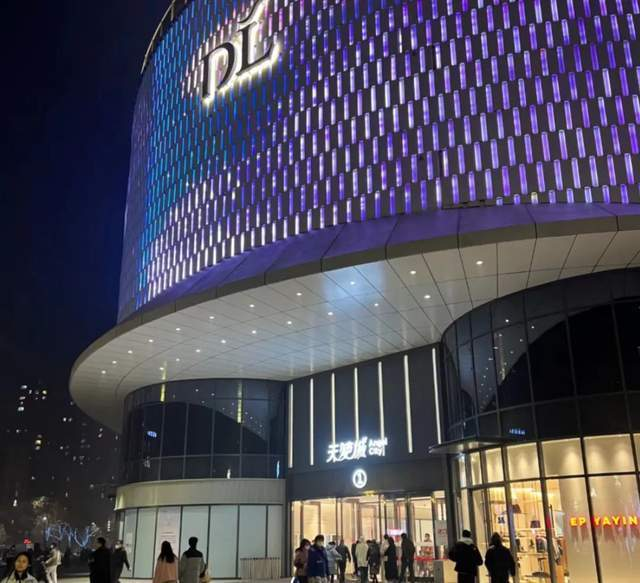
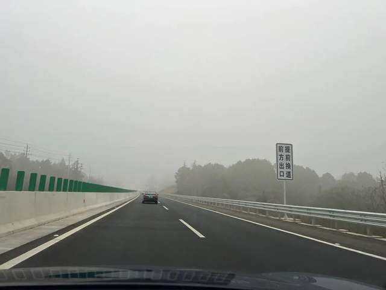
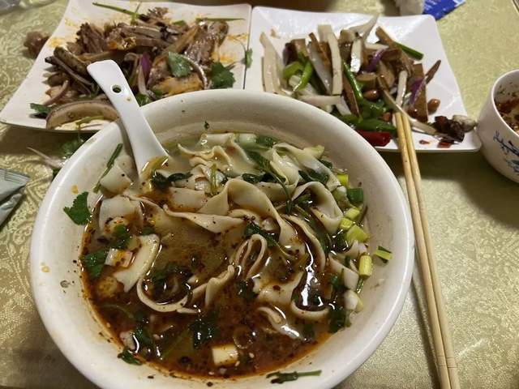
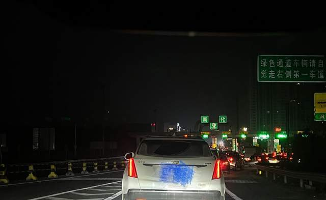

# 1700公里，一辆和寒潮赛跑的电动车的春运之旅

《烟火人间》是腾讯科技联合首席人物观推出的2023年春节特别策划，记录每一个不平凡的“网事”。

作者|小葵

编辑|江岳

微信公众号：首席人物观（ID：sxrenwuguan）

01 跟寒潮赛跑，新能源配吗？

1月10日，农历腊月十九下午，中央气象台发布了2023年首个寒潮预警。我们此前一直处于待定模式的自驾返乡，由此敲定了最终出发时间：第二天。

这是作为新能源车主的自我修养。 **让我们畏惧的，并不是沿路雨雪可能带来的安全风险，而是，寒潮会让“娇弱”的电动爹续航进一步缩水。**

先交代一下我们的装备和任务：

一辆标准续航610公里的比亚迪汉；

包括4岁儿子在内的一家三口；

从北京朝阳区到湖南省新化县，途径冀豫鄂湘四省，全程1700公里；

计划耗时两天，不开夜路。

这场有些冒险味道的行动，从1月10日晚上便开始了。这一晚的关键任务是：敲定第二天抵达城市；安排沿途充电计划。

**根据我们之前的短途经验，比亚迪汉在高速上的续航，大概在400公里左右。**
单次快充，耗时1个小时左右。结合这些条件，加上小红书上的各种攻略分享，我们的中途落脚城市，从武汉、襄阳，又一步步往北退，最后选择了河南许昌。

当时看来，这是一个相当稳妥甚至略显保守的选择。从北京到许昌，单程767公里，早上6点出发，预计途中充电一次，下午3点就能到达。临睡之前，我还兴冲冲刷了小红书里的“许昌”内容，计划好好去逛胖东来——这家号称是零售届海底捞的超市，大本营正是许昌。

结果呢，不需要寒潮加持，正常温度的北方冬天高速，已经足够“吊打”新能源车了。

实际上路之后，第一天，除了目的地许昌没变，其余都变了。
**天气寒冷，加上120迈的速度，比亚迪汉的实际续航掉到了300公里以下，高速充电只能增加到两次。**
最后，早上6点按照计划出发的我们，直到晚上6点多才到达许昌。

我们的续航变差了，但冷空气并没有。

1月12日清晨，许昌陷入大雾弥漫之中。冷空气显然已经追上来了。毕竟，新能源车需要充电，人需要休息，而寒潮是日夜兼程的。大雾影响高速行驶，当天赶到新化的目标不太可能实现了。我们紧急调整了方案：第二天宿在岳阳，第三天再回家。

图：一路与冷空气赛跑，所以沿途全是大雾

**天气之外，这一天的新挑战还有：湖北湖南沿途的服务区，充电桩明显比河北河南少多了。**
可能是两湖地带山区多，新能源车不太吃香。老家一位朋友曾经认真考虑过入手新能源车，碍于小区物业安装充电桩不便，最终作罢。

好在惊喜也是有的。

进入湖北境内，室外温度逐渐攀升，电动爹才终于在南方冬天的高速路上支棱起来。 **我们测试后发现，室外10度，时速100迈，是最省电的模式。**
当电池续航恢复到450公里以上，焦虑逐渐缓解。

在路上的第二天，我们跑了600公里，只在高速服务区充电一次。第三天路程350公里，我们在出发前充满电，一口气就开到了家。因为省下了充电时间，100迈速度跑出来的里程，居然跟120迈差不多。

“我们虽然跑得慢，但我们可以跑得比较远”——类似的心理安慰，从2022年走过来的创业者，大概都懂。

02 一道算术题

“自驾比飞机省钱吗？”“电车比油车省钱吗？”

这是腊月二十二晚上的家庭聚餐中，大家最关心的问题。表弟一家三口头一天也刚刚从北京返乡，机票总计1666元。

关于这个问题的回答，就像公司处理财报数据一样需要技巧。营业成本的不同归类方式，可能会带来完全不同的利润率数据。

如果只对比电费和油费，新能源车完胜。

虽然在衡水、安阳两站充电的费用是每度1.7元-2.1元，相当于我平时在家充电的3-4倍，有些肉疼，但即使算上出发前在家充满电的成本，这趟1700公里的行程，电费也不超过500元，相比1200元左右的自驾油费，还不到一半。

**如果要与高铁、飞机等传统的远途春运方式相比，开新能源车自驾，就算不上实惠的选项了。**
两晚住宿直接拉升了我们此行的成本，电费、高速过路费、住宿、餐费，这四项支出就接近了3000元。

但是，在路上的快乐是无价的。

作为中年社畜，我没法像老嬉皮士杰克.凯鲁亚克在《在路上》里写的那样，一路搭车或者开车，游荡在美洲大陆，去寻求某些人生的答案。但至少有些体验是类似的，比如未知世界带来的新鲜感。

在许昌和岳阳停留，被我们视为此行福利——中国有600多座这样的城市，其中的大多数，我们可能都无缘相识。

尽管只有短短的几个小时，但我们还是打卡了胖东来和岳阳楼。另外，还在清冷的北方夜色中，钻进一家不起眼的河南烩面馆，获得了意外的美食惊喜；也吹到了洞庭湖畔的风，尝到了只在湖中生长的回鱼，鲜美无刺，只需要最简单的烹饪方式。

这样的体验，在大疫三年之后，尤显珍贵。这是春节返乡之路，也是治愈之旅。就像《在路上》里的那句，“在你面前，黄金般的土地和各种未曾预料的趣事，都在那里静静地等待着你，令你大吃一惊，使你因为活着看到这一切而感到快乐。”

还有一些快乐，是路上偶遇的新能源车主们给的。

几乎所有的高速服务站，充电区都被安排在靠边的位置，很多站点甚至只有少到可怜的2个桩，但1个小时的等待时间，足够让大家交流起来了。

相同的充电命题，总是打开话匣子的最佳工具。有趣的是，至少在高速服务区，汽车品牌不是决定鄙视链的绝对因素，比如，一位续航只有200多公里的特斯拉Model Y
车主，听闻我的比亚迪高速续航450公里，毫不掩饰地表达了羡慕。

正如决定房产价值的最重要因素永远是“位置”， **在春运的高速路上，续航，是新能源鄙视链排序的绝对标准。**

而在岳阳这样的下沉市场，当我们因为充电而只能打车去吃饭，遇到的司机又是比亚迪车主时，十几分钟的车程，热闹得就像一场比亚迪车主小型见面会。这也是新能源自驾带来的VIP体验——反正我是不记得，上一次在飞机和高铁上与陌生人聊天发生在什么时候了。

03 “三大酷刑”

疫情三年上演了很多别离。有些是暂时的，有些是永久的。

疫情放开后的第一个春节，因此变得尤为珍贵。团圆重新成为最重要的事情。今年春运期间，客流总量预计超过20亿人次，恢复到疫情前的70%。

**我也选择了新能源车自驾返乡，时隔10年，再在湖南老家过年。这是我能想到的，最特别的过春节方式。**

图：看到家乡收费站，整个人都放松了

长久地生活在北京，南方春节的种种习俗，逐渐变成了回忆：农历腊月二十四才过小年、大年三十晚上才吃团圆饭、大年初一天亮时要放的鞭炮……连同甜酒煮糍粑、柴火腊肉、珍珠丸子，一起酿成乡愁。

新能源车跑久了得充电，人也一样。而家乡就是最牢靠的“充电桩”。

当然，这趟1700公里的行程中，人在囧途的故事也不少。

**比如我经历的“三大酷刑”：** 续航250公里的新能源车；“续航”150公里（去洗手间）的司机；永动机儿子。

前两者直接拖慢了我们的进度，后者极大消耗了我的精力，以至于家人与我视频通话时惊呼：你怎么变成野人了？

但最终，我们还是顺利抵达了——比寒潮早到了半天。

现在看来，开一辆纯电动的新能源车，跑1700公里，
**赶回老家过年，所需要的条件至少包括：百折不挠靠近目标的决心；处理团队协同的耐心；随时迎接变化的勇气。**

嗯，像极了创业。

最后，几个小的tips，送给同样打算新能源车自驾出行的朋友们：

（1）做好心理准备，电池续航的南北差异极大，正常情况下，北方高速打5折，南方高速打7-8折。当然，已经被寒潮覆盖的南方地区，也当北方对待吧；

（2）提前规划返程日期。得知我大年初三就要返京，我妈是崩溃的。但对于要返回一线城市的新能源车主，错开初六初七的返城高峰，非常有必要。几个小时的收费站堵车，可能打破一切充电计划；

（3）尽量选择4个充电桩以上的服务站停留。只有2个充电桩的小站点，排队时间成本极高；

（4）万一真的错过充电站，别慌。尽快驶出高速，去寻找城市里的充电桩。就当，是电动爹送给咱们的一场探险之旅吧。

