# 一路走好！陈佩斯母亲感染新冠去世，儿子陈大愚悼念透露祖母去世细节

1月13日一早，陈佩斯之子陈大愚更新动态，透露自己的祖母于13日在京离世，享年91岁。

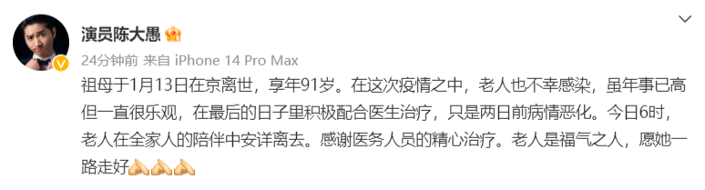

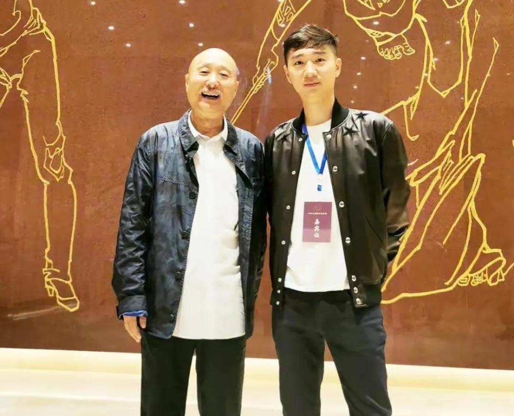

在文中，陈大愚也公开了祖母去世的细节，他透露祖母此前也不慎中招感染新冠，好在老人家在感染之后一直心态乐观，始终在医院配合医生的治疗。

或许是因为年事已高的缘故，老人家的病情还是没得到有效遏制，前两天病情突然恶化，于13日早上6点在全家人的陪伴下辞别人世，对此作为孙子的陈大愚也表示，祖母是有福之人，在如此高龄可以平和安详地离开，他也特意感谢了医护人员。

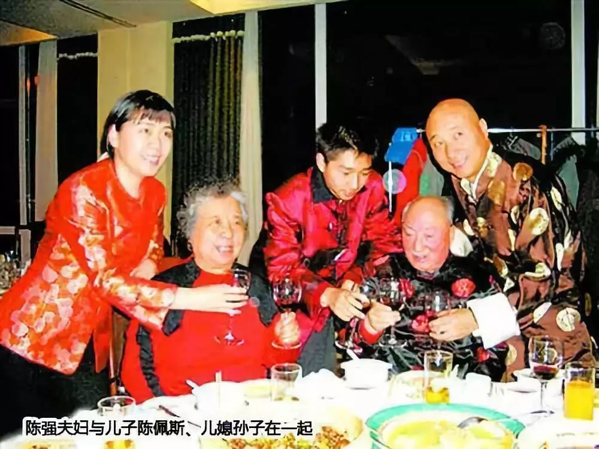

据悉，早在2012年陈佩斯的父亲陈强去世后，其母亲李玉洁的身体也是每况愈下，因为承受了丈夫离开的沉重打击，李玉洁一度出现精神萎靡，健忘厌食的症状，在意识不清的情况下还会离家出走。

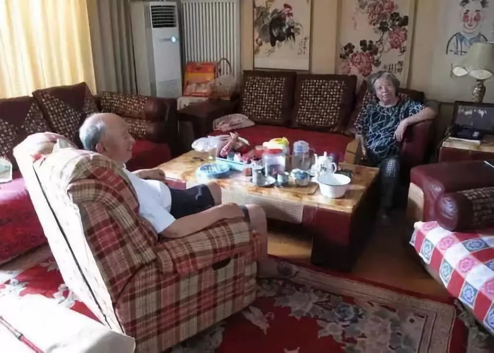

为了能更好的照顾母亲，当时的陈佩斯便暂且搁置手头的工作，将余留下的时间都用来陪伴母亲，因为病情逐步恶化，李玉洁开始出现小脑萎缩等一系列症状，智商变得与几岁孩童无异，为此陈佩斯不得不花费更多的时间与精力来用心看护母亲，那些年为了照顾母亲，陈佩斯每天只能睡四到五个小时。

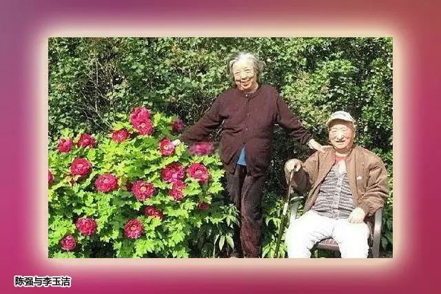

好在到了2013年，李玉洁的病情得到了有效控制，本人也恢复了以往的神志，在家人的陪伴下，老太太幸福无忧地度过了几年晚年时光，如今父母都走了，相信对于陈佩斯及家人来说，也是悲痛的打击，好在老人家没有遭受太多罪，走得很安详。

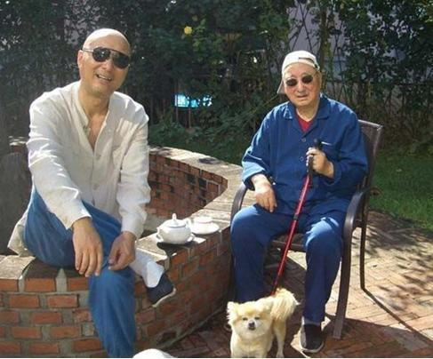

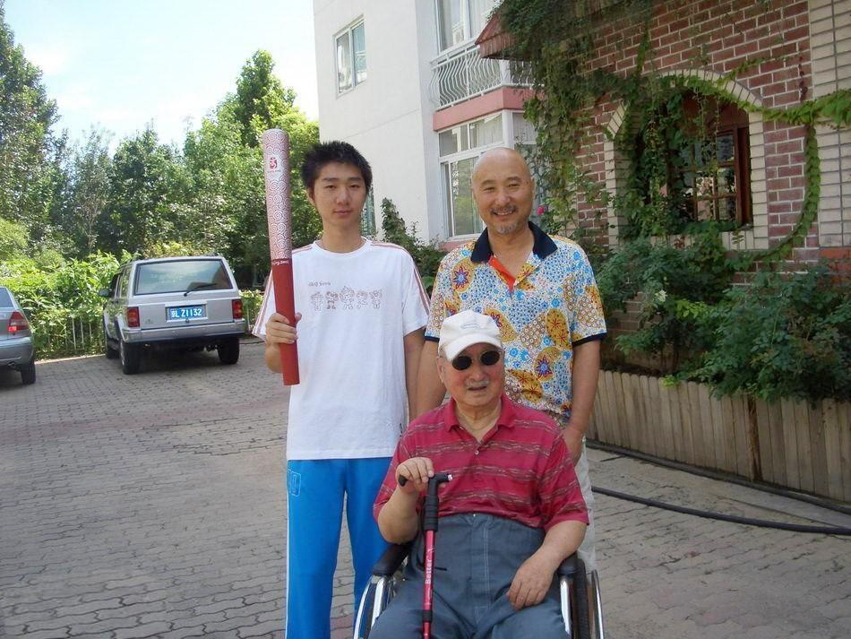

其实陈佩斯的母亲李玉洁曾经也是一名电影幕后工作者，后来嫁给陈佩斯的父亲陈强后，回归家庭照顾孩子，2001年陈佩斯的父亲瘫痪后，也一直是李玉洁在身边照顾着老伴，两人恩爱了一辈子，如今也终于可以在天堂相聚了。

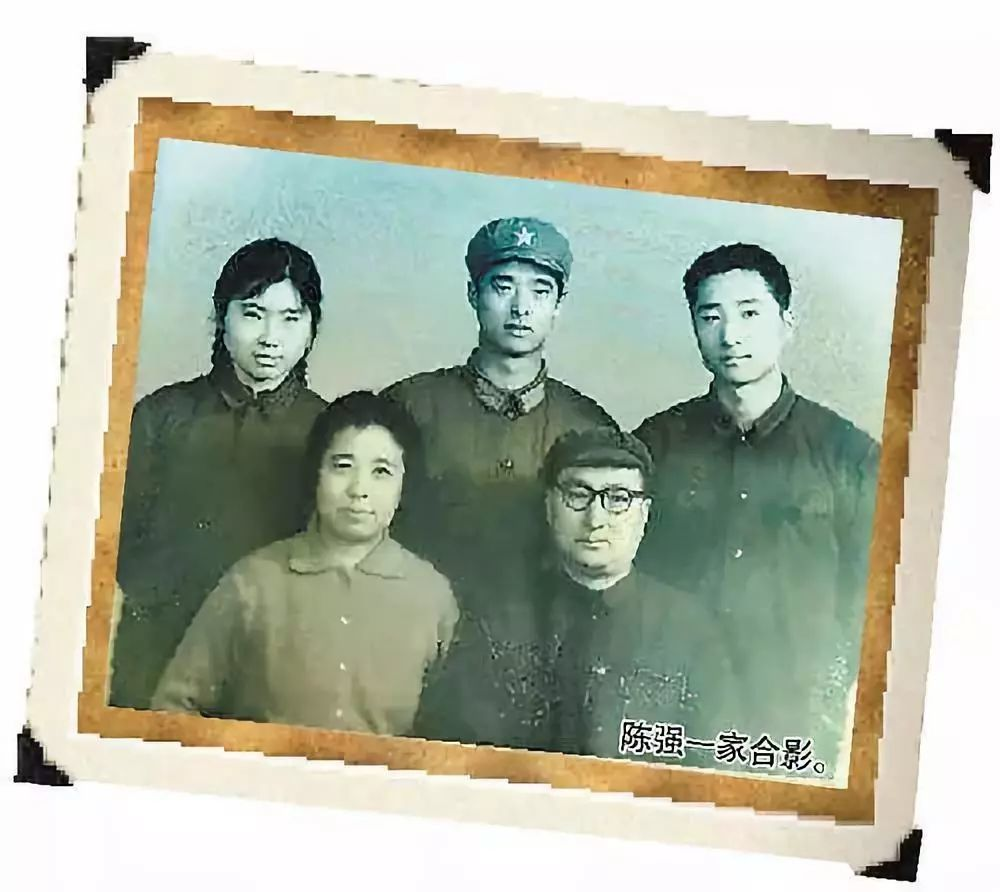

早在前一周，陈佩斯也同样确诊为阳性，儿子陈大愚则中招更早，在去年12月就遭受了病毒的侵袭，虽然父子俩前后都陆续中招，但两人的心态依旧是积极阳光，还不忘录制视频给大家增添笑料。

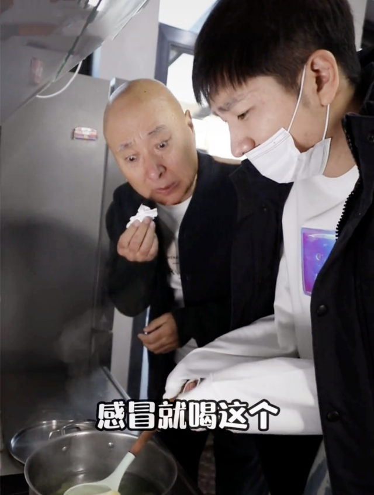

陈大愚晒出的视频中，父子俩此前为了互相照顾从而全副武装，在陈佩斯中招之后，儿子陈大愚还汲取其他网友的经验为其准备了葱白煮水，结果搞笑的陈佩斯下一步却直接拿来了火锅底料，父子俩彼此心领神会之后开始涮起了火锅。

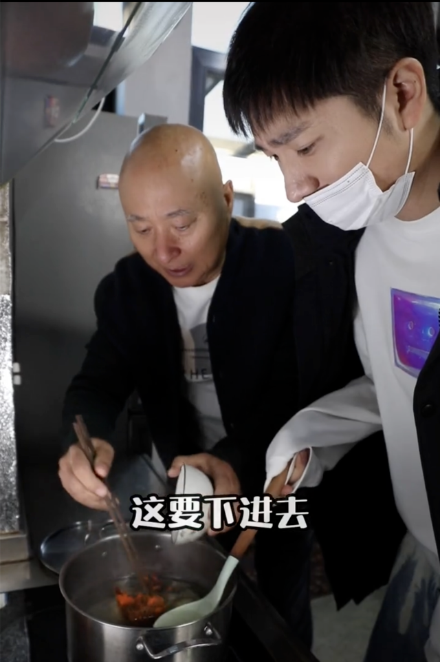

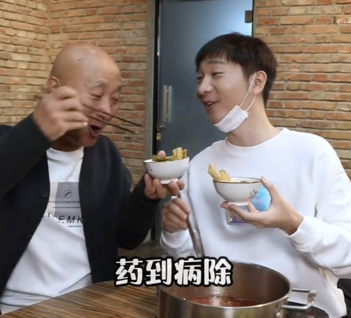

当时的视频中，已经基本痊愈的陈大愚看上去状态不错，小伙子已经恢复到原来朝气蓬勃的状态，而陈佩斯则显得略显疲惫，毕竟这个阶段其身体上的各种不适症状均已出现。

经过儿子悉心的照顾，陈佩斯仅仅用了5天便抗原转阴，而在此次家庭抗疫战中，陈大愚可谓是费心劳力，成为家中的顶梁柱，除却父亲之外，陈大愚的妻子和保姆也先后遭到感染，在此情况下，陈大愚不仅要照顾妻子，还要用心呵护几个孩子，而他自己也一度高烧到40度。

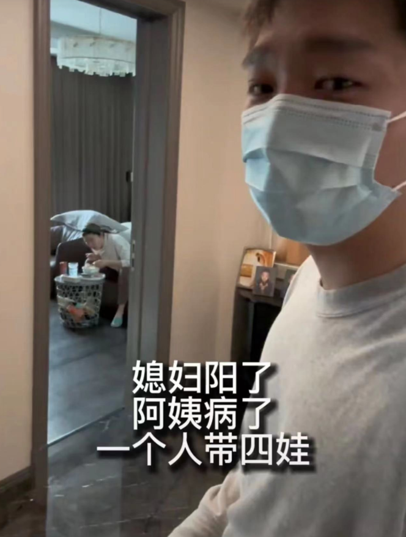

在孩子们陆续出现症状之后，陈大愚身上的担子无疑更重，好不容易等到情况平稳下来，父亲陈佩斯又感染了，身为孝子的陈大愚也是第一时间陪伴在父亲左右，给予其所需的关爱与照料。

在外界眼中，陈大愚善良温厚，懂事孝顺，完全继承了父亲身上的优良传统，毕竟陈佩斯也是娱乐圈被人称道的“大孝子”。

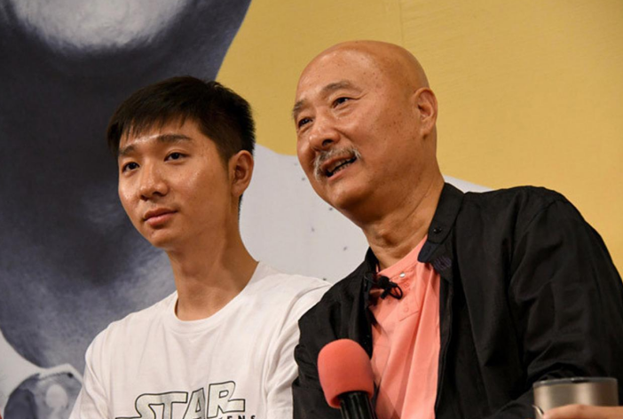

如今李玉洁已然驾鹤西去，相信其内心也已经毫无遗憾，最终祝愿她可以一路走好，在另个世界能够护佑自己所爱的家人。

