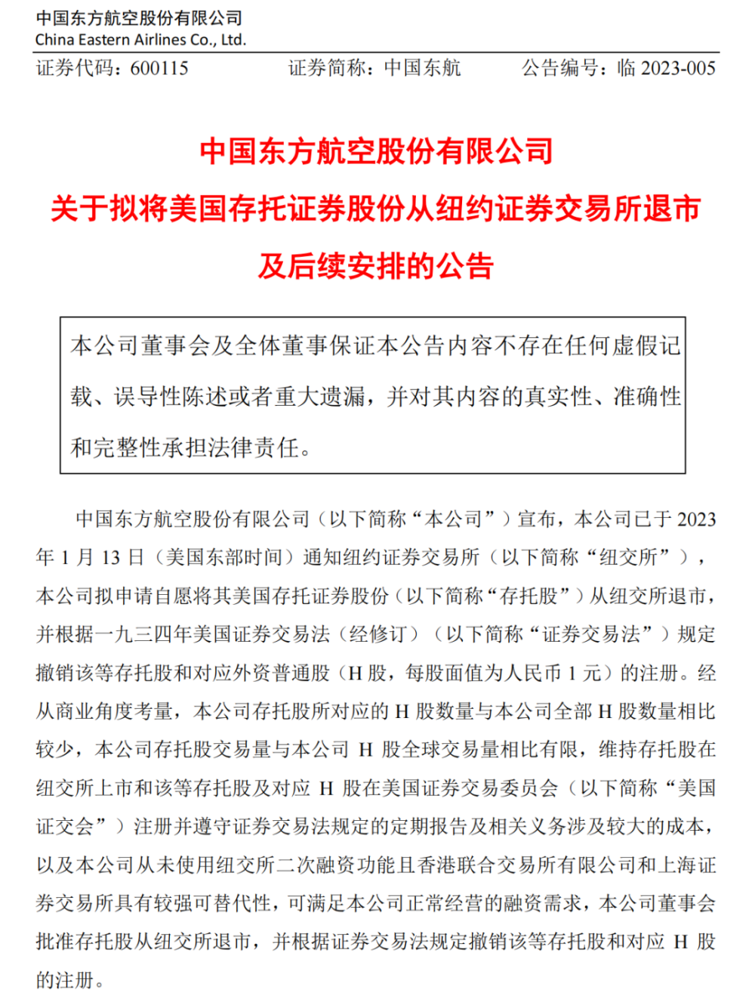
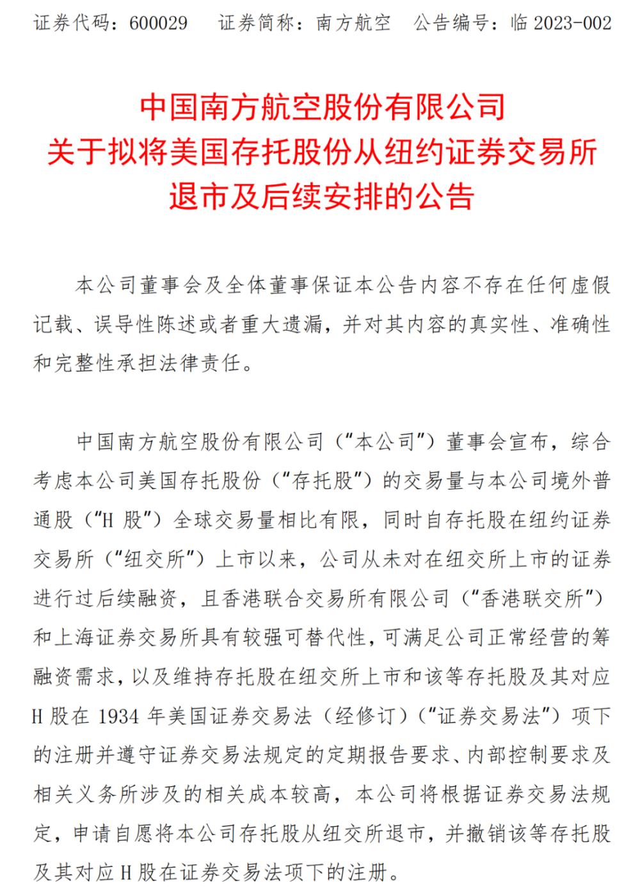

# 东航、南航拟从纽交所退市！H股继续交易，此前已有8家央企退出美股

两大航空巨头宣布从纽交所退市！

1月13日，中国东航、南方航空分别发布公告表示，申请自愿将其美国存托证券股份从纽交所退市。据悉，两家公司均是在A股、港股、美股三地同时上市的公司，有分析人士表示，两家公司主要交易均在A股和港股，预计从纽交所退市对公司影响不大。

**此前两年，已有8家央企相继从美股退市。2021年5月7日，三大运营商中国移动、中国联通、中国电信从美股退市。2022年8月12日，中国石油、中国石化、中国人寿、中国铝业、上海石化五家企业宣布，拟将公司美国存托股份从纽交所退市。**

证监会此前表示，上市和退市都属于资本市场常态。根据相关企业公告信息，这些企业在美国上市以来严格遵守美国资本市场规则和监管要求，作出退市选择是出于自身商业考虑。这些企业都在多地上市，在美上市的证券占比很小，目前的退市计划不影响企业继续利用境内外资本市场融资发展。

**中国东航、南方航空相继宣布从纽交所退市**

中国东航公告，已于1月13日（美国东部时间）通知纽交所，公司拟申请自愿将其美国存托证券股份从纽交所退市，并根据规定撤销该等存托股和对应外资普通股（H股）的注册。

当晚，南方航空也发布公告，申请自愿将公司存托股从纽交所退市，并撤销该等存托股及其对应H股在证券交易法项下的注册。

**中国东航公告表示，公司已于2023年1月13日(美国东部时间)通知纽交所，拟申请自愿将其美国存托证券股份从纽交所退市，并撤销该等存托股和对应外资普通股(H股，每股面值为人民币1元)的注册。**

中国东航称，公司存托股所对应的H股数量与公司全部H股数量相比较少，交易量与H股全球交易量相比有限，维持存托股在纽交所上市和该等存托股及对应H股在美国证交会注册并遵守证券交易法规定的定期报告及相关义务涉及较大的成本，以及公司从未使用纽交所二次融资功能且香港联交所和上交所具有较强可替代性，可满足正常经营的融资需求。

因此，中国东航拟于2023年1月23日或前后向美国证交会递交一份25表格，以将其存托股自纽交所退市，该等退市预计在25表格递交10日后生效。存托股在纽交所交易的最后日期为2023年2月2日或前后。于该日期及自该日期之后，公司存托股不再于纽交所挂牌，而此后公司美国存托股是否会在场外交易市场上交易，将取决于股东和独立第三方的行动，不涉及公司的参与。

中国东航还提到，拟在存托股自纽交所退市后，在适当时候根据存托协议规定以适当方式终止其存托股计划。公司H股将会继续在香港联交所进行交易。

南方航空在公告中称，综合考虑公司美国存托股份的交易量与境外普通股全球交易量相比有限，同时自存托股在纽交所上市以来，公司从未对在纽交所上市的证券进行过后续融资，且香港联交所和上交所具有较强可替代性，可满足正常经营的筹融资需求，以及维持存托股在纽交所上市和该等存托股及其对应H股注册并遵守证券交易法规定的定期报告要求、内部控制要求及相关义务所涉及的相关成较高，公司将申请自愿将公司存托股从纽交所退市，并撤销该等存托股及其对应H股注册。

截至公告披露日，南方航空已就上述事项向纽交所发出通知。公司拟于2023年1月23日或之后向美国证券交易委员会提交一份25表格，以将公司存托股从纽交所退市。该等退市预计在25表格提交10日后生效。存托股在纽交所交易的最后日期预计为2023年2月2日或之后。自该日期之后，公司存托股将不再于纽交所挂牌和交易。

**南方航空表示，拟在存托股自纽交所退市后，根据存托协议规定以适当方式终止公司美国存托凭证项目。公司H股将会继续在香港联交所进行交易。**

**此前已有8家央企从美股退市**

据了解，美国存托股票是指外国公司授权美国的受托人在美国发行的、以美元计价的所有权证书。根据美国法律，在美国发行普通股上市的企业注册地必须在美国，非美国注册地上市公司只能采取存托股的方式进入美国证券市场。

2021年5月7日，中国移动、中国联通、中国电信三大运营商均发布了关于美国纽交所（NYSE）维持退市决定的公告，宣布将从美国退市。根据中国联通和中国电信发布的公告，其ADR占比分别只有0.2%和0.14%，分析人士认为，美方摘牌对公司而言几乎没有什么影响，而中国移动虽未公布ADR数据，但推测来看这一数值也不高。

2022年8月12日，中国石油、中国石化、中国人寿、中国铝业、上海石化五家企业宣布，拟将公司美国存托股份从纽交所退市。

当天晚间，证监会有关部门负责人就个别中国企业宣布启动自美退市相关事项答记者问。

证监会表示，上市和退市都属于资本市场常态。根据相关企业公告信息，这些企业在美国上市以来严格遵守美国资本市场规则和监管要求，作出退市选择是出于自身商业考虑。这些企业都在多地上市，在美上市的证券占比很小，目前的退市计划不影响企业继续利用境内外资本市场融资发展。

**证监会强调，尊重企业根据自身实际情况、按照境外上市地规则作出的决定，将与境外有关监管机构保持沟通，共同维护企业和投资者合法权益。**

**航空业复苏迎来“加速”**

另外，随着防疫和出入境政策不断优化，民航业持续回暖，航空股开启反弹。

2022年12月7日，国家联防联控发布防疫“新十条”。飞常准业内版数据显示，2022年12月7日至2023年1月5日，国内客运航班量持续走高，1月5日达8303架次，恢复至疫情暴发前同期七成水平。1月8日，中国入境全面开放。

1月13日，国务院联防联控机制召开新闻发布会，介绍优化中外人员往来管理措施有关情况。会上，民航局飞行标准司副司长孔繁伟表示，随着疫情防控政策优化调整，国际航班呈现增长态势。本周国际客运航班预先飞行计划数量为563班，通航国家63个，分别恢复至疫情前的6%和87.5%。

**孔繁伟表示，未来一段时间，随着国际航空市场需求的进一步提升，预计国际航空运输生产将继续保持稳步恢复态势，民航局将科学合理安排国际航班计划。同时，把握好行业恢复发展的节奏，确保航班量的增长速度同行业的综合保障能力相匹配，严守民航行业的安全底线。**

招商证券研报认为，交运出行行业加速修复中，其中民航恢复进度领先。据交通部数据，春运第5天全国共发送旅客3788.8万人次，同比2022年增长41.4%，同比2019年下降48.9%。全民航国内客运航班量恢复至2019年88%，经济舱平均票价同比2022年增长24.6%，结合目前国内大循环的背景、今年进一步促消费的预期，我们认为国内需求将领先国际需求复苏，结合国内票价弹性，利好国内市场占比高的航司。高度重视航空板块整体性战略配置机会。

中信证券认为，疫情防控政策进一步优化后第一个春运出行或迎来明显修复，交通部初步预期春运客流量恢复至2019年同期70.3%，民航日均航班恢复至2019年同期73%，其中涉及北上广的航线加班占比33.5%，同时我们预计春运民航票价有望较2019年同期正增长。供给强约束背景下，国内线需求反弹张力催化票价弹性释放，2023年国际线航班量或将恢复至2019年50%～60%，料2023年暑期航司龙头基本面将大幅改善，或成为催化估值进一步提升的关键。继续建议关注航空周期张力以及枢纽机场的免税价值回归。

