# 传王思聪发朋友圈称已付209万与被殴打者和解，多名知情人揭实情

1月12日一则上海静安警方发布的警情通报引发网友热议，通报内容为1月11日晚上凌晨四点左右，在南京西路西路一商务楼附近发生了一起打架滋事事件。

在这起打架事件中，起因很简单，因王某某等几人误认为在路旁等人的路人陈某某对他们拍照，于是几人让对方不要拍，但陈某某则称自己并没有拍摄，之后双方便一言不合发生了斗殴。

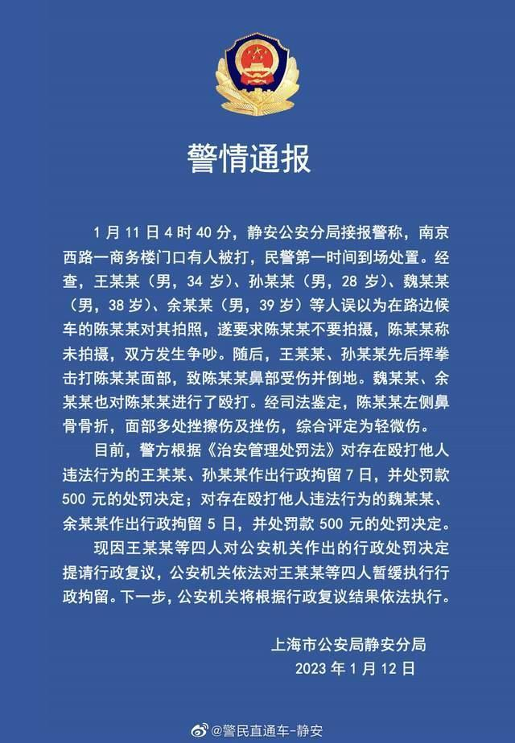

权威人士证实，事件中提到“王某某”就是“国民老公”王思聪，好在被殴打者被判定是轻微伤，而王思聪与其它几名参与打人者被分别处以7天和5天的行政拘留，及罚款500元。

事情发生后，王思聪本人并没有正面回应。

有律师分析称，如果被殴打者与王某某达成和解，那么王某某将会免于处罚。网络上有人传出，和解金额是209万元，但真假不知。

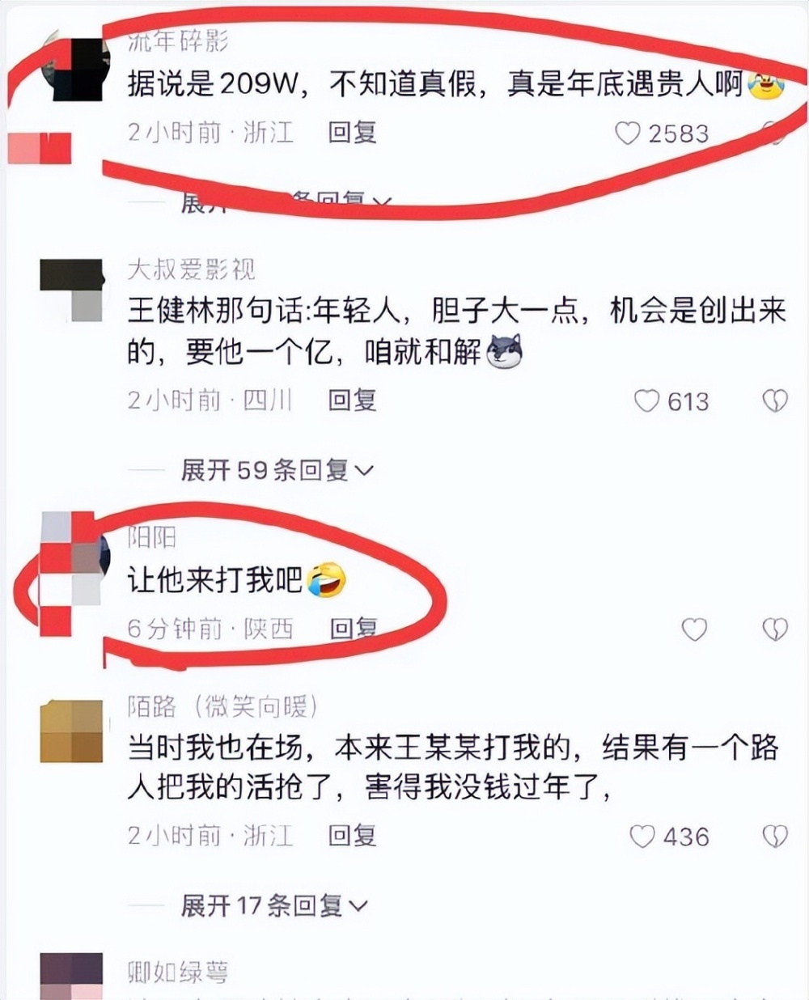

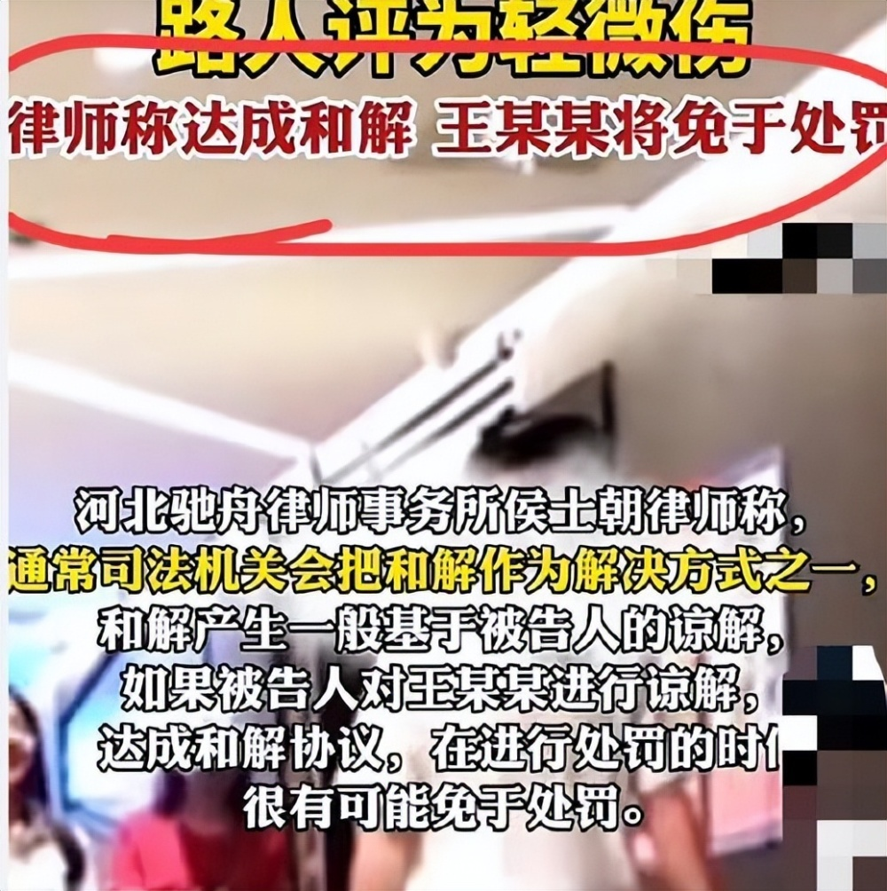

王思聪的父亲王健林对于儿子打人一事也并没有出面受访，但王思聪殴打路人态度嚣张，已经让他口碑崩塌，并且遭到了网友们的抨击与痛斥，毕竟再有钱也不能为所欲为。

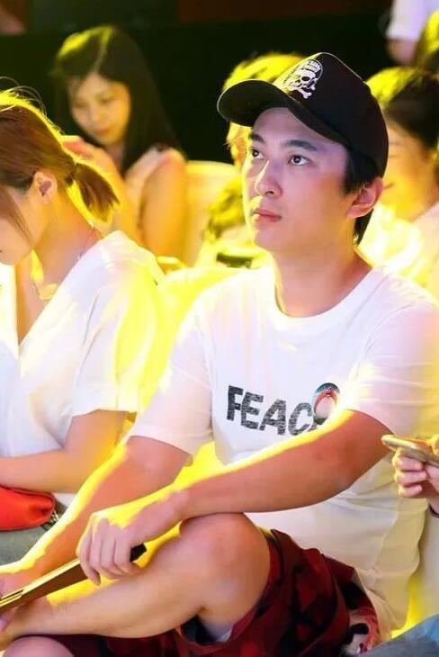

1月13日网传王思聪在朋友圈发文，称“新的一年与209W和解”！但这张朋友圈截图，并没有人证实是来自王思聪本人，真假性存疑。

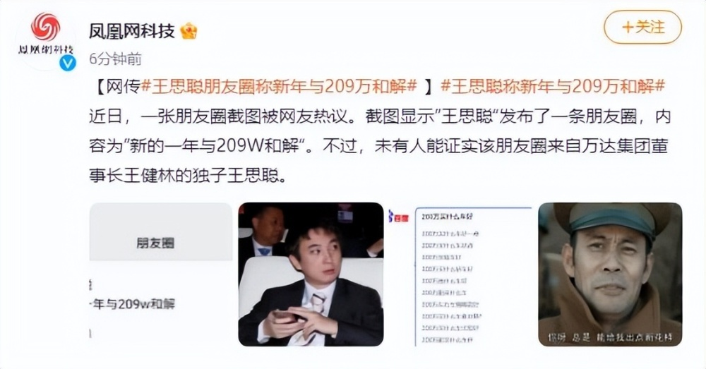

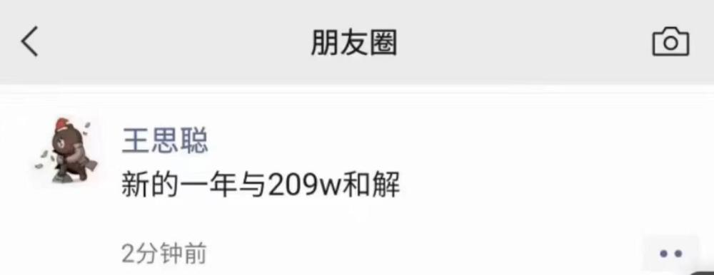

不过网友们看到后，也感到很不可思议，还有网友调侃“好家伙，每天打一次，一周就是千万富翁了。”

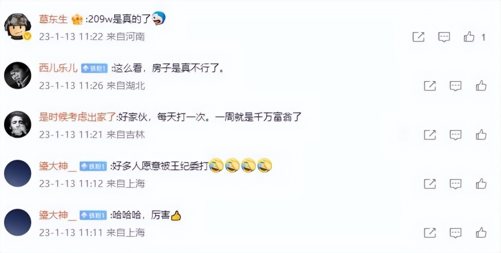

就在王思聪疑似发朋友圈透露和解金额209万被热议之时，有知名财经博主晒出了王思聪本人的朋友圈揭开实情。

该博主称，又探查了下，王思聪209万的朋友圈截图是假的，最近半年没发朋友圈，头像也早就换了。

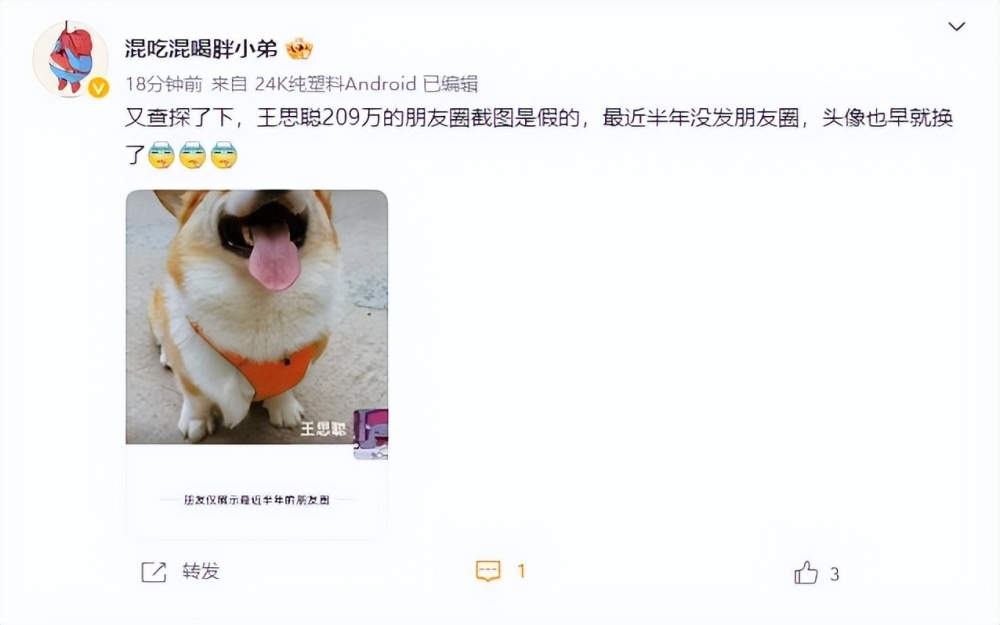

该财经博主晒出了王思聪的朋友圈截图，里面确实什么都没有发。

也不知道网上的截图是否是有人恶意造谣的，其居心可能是博眼球蹭热度，王思聪本人对此会不会回应就尚且不知了。

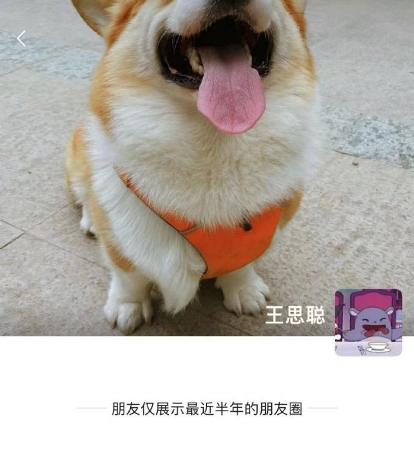

有网友看到这名博主的澄清，评论到，“不可能209万，金额要要合理区间，太高了警方不可能支持的。”

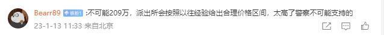

果然，随后有一名粉丝高达479万的大V账号，也发文称，网传王思聪赔偿209万的截图是假的，并且晒出了他的真实账号。

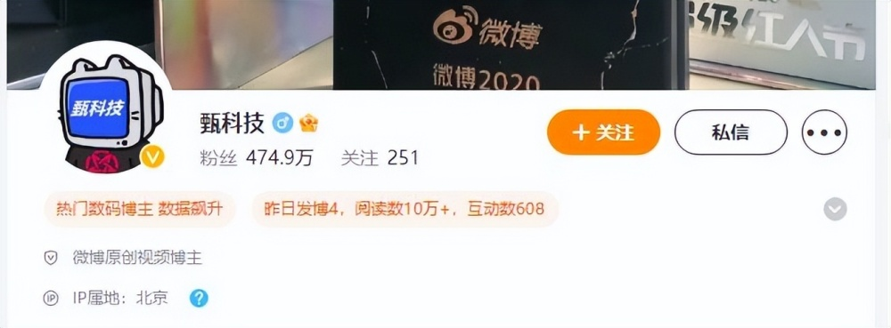

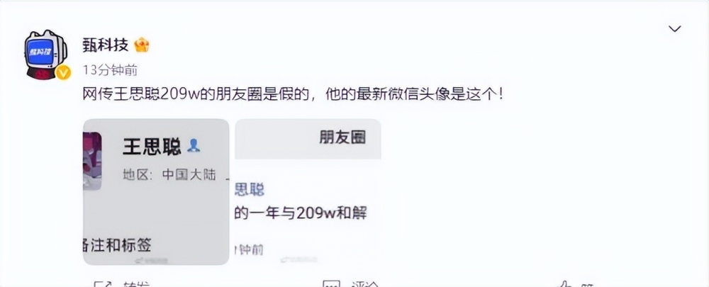

账号截图中的头上与“财经博主”所发的一致，看来，王思聪确实没有发布过这条朋友圈内容。

网友们在吃瓜时还是要谨慎，不要被有心人利用了。

至于王思聪与被殴打者会否和解，看来还是需要等待他本人与官方来说明了！

