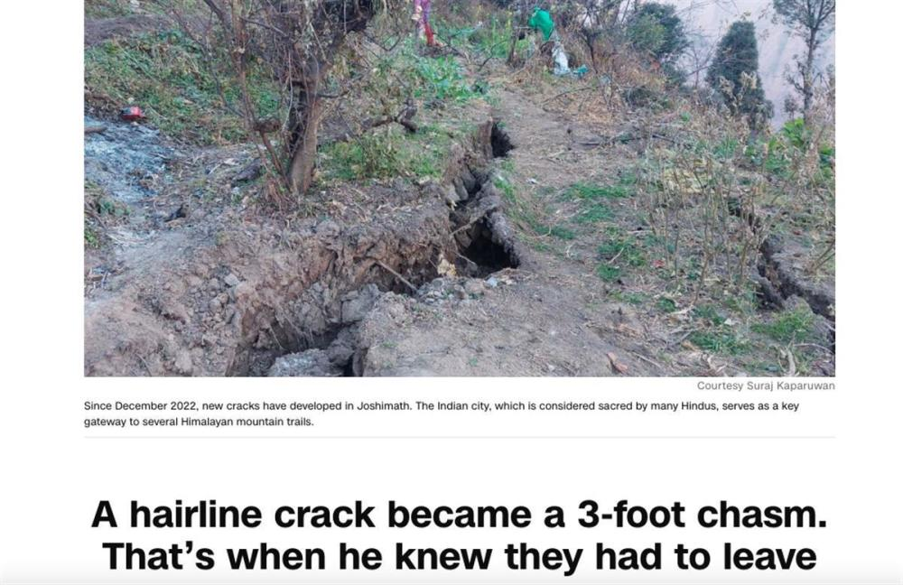
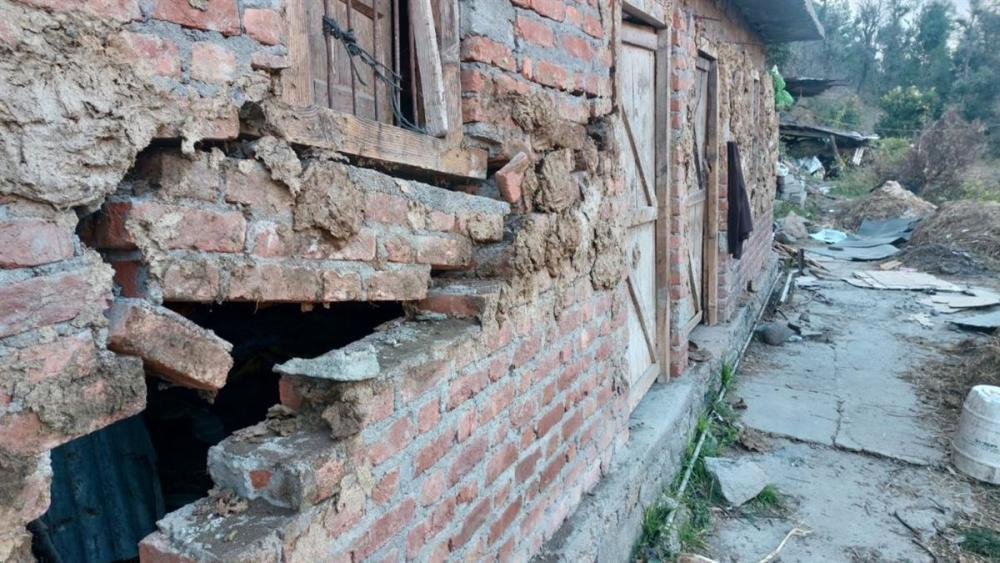

# 印度在中印边境重镇大搞基建，导致当地以每年6厘米的速度下沉

极目新闻记者 孙喆

近日，印度北阿坎德邦宣布，该邦约希马斯市所有9个城区均发生地面沉降，共造成当地数百间房屋出现裂缝，当地不少居民被迫撤离。据CNN1月13日报道，多年来，约希马斯市的居民一直向当地官员抱怨，他们的房屋正在下沉。在该市经营着一家小旅馆的38岁商人苏拉杰·卡帕鲁万告诉记者，一年前，他家的农田和房屋都开始出现裂缝，但最近几个月情况有所恶化。

_相关报道截图（图片来源：CNN）_

**小裂缝变成近1米宽的大裂缝**

“大约在一年前，田地里开始出现较细的裂缝，但随着时间的推移，这些裂缝一直在变大，尤其是在过去两个月的时间里。它们现在大概有3英尺（约0.91米）宽。”卡帕鲁万说。

上周三，卡帕鲁万的妻子带着两个孩子离开了约希马斯市，前往北阿坎德邦的另一个城市。卡帕鲁万则是选择留下来，和当地的其他居民一起，参加了在行政大楼前举行的抗议活动，要求政府停止建设相关工程，并为被迫离开家园的人们提供赔偿。

_卡帕鲁万指着房屋墙壁上出现的裂缝（图片来源：CNN）_

1月9日，当地官员告诉卡帕鲁万，他的家处于“危险地带”，他必须赶紧搬出去。卡帕鲁万在接受媒体采访时表示，他打算把家里的东西都带走，“我们希望，所有的事情都能有个新开始，但这取决于政府采取什么样的措施。”

**当地居民认为与印度大规模基建有关**

北阿坎德邦地处喜马拉雅山南麓，北接中国西藏，东连尼泊尔。据介绍，该邦约希马斯市是通往巴德里纳特等著名朝圣地的重要门户，每年吸引大量游客和朝圣者。路透社称，约希马斯是临近中印边界的印度北部重镇。

报道称，根据当地政府发布的公告，截至1月12日，该市共有760间房屋出现裂缝，已有589人被转移到更安全的地方。

另据《印度斯坦时报》报道，当地居民在接受采访时表示，在过去10年中，镇上和周边地区新建了几栋多层建筑，其中有一栋楼最近因为地面沉降而发生倾斜。

截至目前，约希马斯市出现地面沉降的确切原因暂不清楚，但有当地居民认为，这或许和新建隧道等基建项目有关。据悉，近期印度政府在约希马斯周边大搞基建。目前当局已暂时叫停有关公路、缆车和水坝建设工程。专家表示，约希马斯依山而建，城市坡地多系过往山崩堆积而成，地基并不牢固，不适合搞大型建设。

_房屋开裂导致当地居民无法居住（图片来源：CNN）_

一项为期两年的调查研究发现，约希马斯市及其周边地区以每年2.5英寸（约6.35厘米）的速度下沉。当地官员表示，目前，他们在该市看到的裂缝比以前看到的更多，也更宽。一名治安官告诉记者，尤其是去年12月15日前后，一些裂缝开始突然变宽。至于是什么原因，他说不上来，他希望专家们能尽快找到答案并提出解决方案。

（来源：极目新闻）

